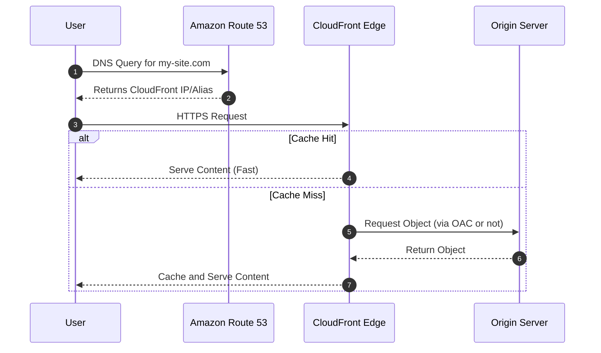
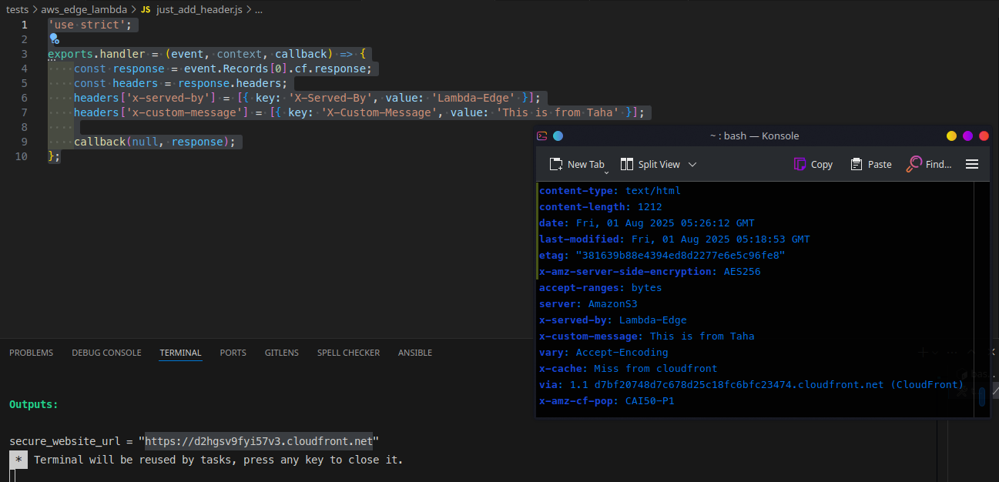
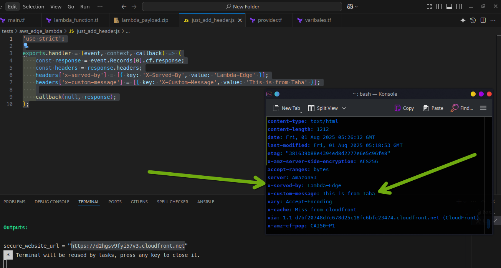
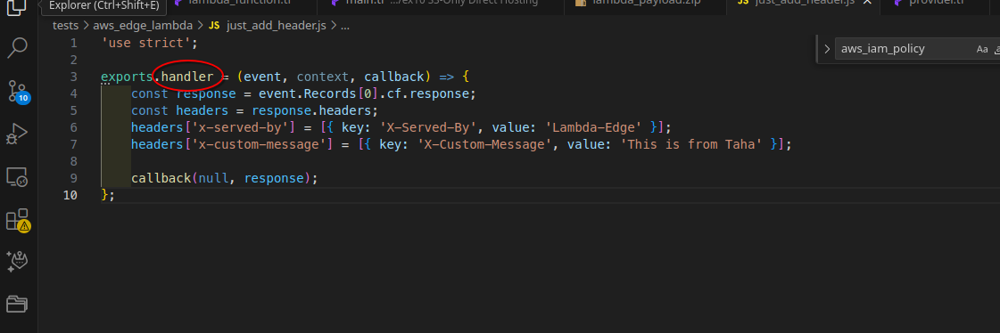

### **Amazon CloudFront **


خدمة الـ `CDN` العالمية بتاعة أمازون، اللي هي `CloudFront`، بتحل واحدة من أهم المشاكل اللي `Route 53` برضه بيحاول يحلها: وهي إن المحتوى بتاعك يوصل لليوزرز بتوعك بأسرع شكل ممكن.

الـ `CloudFront` عنده شبكة ضخمة من الـ `edge locations`  اللي بتكون محطوطة في أماكن جغرافية قريبة من اليوزرز عشان تقلل المسافة والـ `latency`. لما بتيجي تعمل `configuration` للطريقة اللي عايز المحتوى بتاعك يوصل بيها—وده جزء من الحاجة اللي `AWS` بتسميها `CloudFront distribution`—أنت بتحدد المحتوى بتاعك يتوزع إزاي جوه الشبكة دي، وإزاي يوصل بعد كده لليوزرز.


#### **إزاي الـ Traffic بيوصل للـ CloudFront؟**

طيب، اليوزرز بتوعك بيعرفوا منين إنهم يكلموا الـ `endpoint` بتاع الـ `CloudFront` بدل ما يروحوا يجيبوه مباشرة من الـ `resources` بتاعتك؟ في العادي، هما ميعرفوش. لكن لما بتستخدم
 `Route 53` عشان تظبط الـ `domain` بتاعك إنه يوجه أي طلبات `DNS` جاية له على الـ `CloudFront distribution`، اليوزرز بيتوجهوا أوتوماتيكياً للمكان الصح.

#### **آلية الـ Caching والـ Origin**

لما بيجيله طلب، الـ `CloudFront` بيقيّم مكان اليوزر وبيحسب أنهي `edge location` هيكون متاح عشان يوصله المحتوى بأقل `latency` ممكن. لو دي أول مرة المحتوى ده يتطلب من خلال الـ `edge location` ده، المحتوى بيتاخد منه نسخة من الـ `origin server` (اللي هو ممكن يكون سيرفر ويب على `EC2`، أو محتويات `S3 bucket`، أو أي `HTTP endpoint`). توصيل أي طلبات بعد كده بيكون أسرع بكتير، لأن النسخة اللي معمولها `cache` لسة متخزنة في الـ `edge location`.



#### **تطور أنواع الـ Distribution **

في الماضي، كان نوع الـ `distribution` اللي بتعمله بيعتمد على نوع الميديا اللي بتقدمها. كان فيه نوعين: `web distribution` لصفحات الويب والمحتوى العادي، و `RTMP distribution` اللي كان مخصص لمحتوى الفيديو اللي على `S3` واللي بيستخدم بروتوكول `RTMP` بتاع أدوبي.

**هنا لازم نوضح نقطة مهمة جداً: الكلام ده اتغير وبقى قديم (Deprecated).**

*   **حالياً، مفيش حاجة اسمها `RTMP distribution`**. الـ `CloudFront` مبقاش بيدعم بروتوكول `RTMP`. الطريقة الصح دلوقتي لتوزيع الفيديو هي عن طريق بروتوكولات `HTTP streaming` زي **HLS** و **DASH**.
*   نتيجة لكده، **مبقاش فيه "أنواع" للـ Distribution**. دلوقتي هي نوع واحد بس اسمه **`CloudFront Distribution`**، بتقدر تستخدمه لكل حاجة (ويب، صور، فيديوهات، `APIs`،... إلخ).

#### **الأمان والتشفير**

لما بتعمل `configuration` للـ `distribution` بتاعتك، بيكون عندك اختيار إنك تضيف شهادة تشفير `SSL/TLS` مجانية من خدمة `AWS Certificate Manager (ACM)` للـ `distribution` بتاعتك. ده بيحمي المحتوى بتاعك وهو بيتنقل بين الـ `CloudFront` وأجهزة اليوزرز من الـ `network sniffers` وهجمات الـ `man-in-the-middle`، وبيديلك الـ `HTTPS` والقفل الأخضر.

### 

**الأمان هو كلمة السر (OAC/OAI):** اغلب الناس بتركز على ربط `Route 53` بالـ `CloudFront`، وده مهم. لكن الأهم منه هو تأمين الـ `Origin` نفسه. لما يكون الـ `Origin` بتاعك هو `S3 Bucket`، الـ **Best Practice** هو إنك تخلي الـ `Bucket` ده **`Private`** تماماً، وتدي للـ `CloudFront` بس صلاحية إنه يوصله عن طريق حاجة اسمها
 **`OAC (Origin Access Control)`**. ده بيمنع أي حد إنه يعمل `bypass` للـ `CloudFront` ويوصل للملفات بتاعتك مباشرةً من `S3`. من غير الخطوة دي، الأمان بتاعك ناقص.

> [!WARNING]
>
> فى طريقة قديمة  **Origin Access Identity (OAI)** قبلOrigin Access Control ولكن معدتش مستخدمة دلوقتي بد


1.  **الـ CloudFront مش بس للسرعة، ده كمان بيوفر فلوس:**
    *   نقل الداتا من `S3` لـ `CloudFront` ببلاش. أنت بتدفع بس لما الداتا تطلع من `CloudFront` لليوزر، ودي تسعيرتها أرخص من لو طلعت من `S3` مباشرةً.
    *   الـ `caching` بيقلل عدد الـ `requests` اللي بتروح للـ `Origin` بتاعك، فده بيوفر في تكلفة تشغيل السيرفرات والـ `database` لو عندك `dynamic content`.
2.  **تعدد أنواع الـ Origin:**
    *   الـ `CloudFront` مش بيخدم بس من `S3` و `EC2`. الـ `Origin` بتاعك ممكن يكون أي سيرفر `HTTP` في أي مكان في العالم، حتى لو كان على `on-premises data center` أو عند شركة `cloud` تانية. ده بيديلك مرونة كبيرة جداً.


### **الميكانيكية الداخلية: إزاي الـ Caching بيشتغل صح؟**

الفكرة مش بس `caching` وخلاص، الموضوع عبارة عن شبكة من طبقتين عشان توصل لأعلى كفاءة:

1.  **الـ Edge Locations:** دي السيرفرات اللي في وش المدفع، منتشرة في مئات المدن وقريبة جداً من اليوزر. دي اللي بترد على الطلبات بسرعة الصاروخ.
2.  **الـ Regional Edge Caches:** دي طبقة `cache` تانية، أكبر وأضخم، موجودة في الـ `Regions` الكبيرة. لما `Edge Location` في مدينة معينة مبيلاقيش الملف، مش بيروح للمصدر الأصلي (`Origin`) على طول، لأ، ده بيكلم الـ `Regional Edge Cache` الأول. لو لقى الملف هناك، بياخده منه. الحركة دي بتقلل الضغط على الـ `Origin` بتاعك بنسبة ضخمة جداً وبتخلي الـ `cache hit ratio` أعلى.

### **الخدمات اللي بيقدمها وإزاي تستغل كل فتفوتة فيها**

#### **1. تسريع المحتوى والتحكم الدقيق في الـ Cache**

*   **المحتوى الـ Static والـ Dynamic:** دي عرفناها، بيسرّع الاتنين.
*   **الحتة الجامدة - الـ Cache Keys & Policies:** الـ `CloudFront` مش بيعمل `cache` للـ `URL` بس. أنت اللي بتحدد "مفتاح التخزين" (**Cache Key**) بتاعه. يعني تقدر تقوله:
    *   **بص على الـ Headers:** لو الـ `Header` بتاع `User-Agent` بيقول إنه موبايل، اعمل `cache` لنسخة. ولو بيقول ديسكتوب، اعمل `cache` لنسخة تانية لنفس الـ `URL`.
    *   **بص على الـ Cookies:** لو فيه `cookie` اسمها `session_type=premium`، طلّع نسخة من الـ `cache` للناس الـ `premium`.
    *   **بص على الـ Query Strings:** خلي `page?country=eg` مختلفة عن `page?country=sa` في الـ `cache`.
    كل ده بتديره عن طريق حاجة اسمها **Cache Policies**، اللي بتديلك تحكم كامل في استراتيجية الـ `caching` بتاعتك.

#### **2. الأمان على الـ Edge (خط الدفاع الأول)**

*   **HTTPS وشهادات ACM:** دي أساسية، بتاخد القفل الأخضر ببلاش.
*   **التكامل مع AWS WAF:** بتربطه بالـ `WAF` عشان يفلتر الـ `traffic` ويحميك من هجمات زي `SQL Injection` و `XSS` ويمنع الـ `bots` الضارة.
*   **تقفيل الـ Origin بـ OAC:** دي أهم حاجة في الأمان. بتقفل الـ `S3 Bucket` بتاعك وتخليه `Private`، والـ `CloudFront` بس هو اللي معاه مفتاح الدخول بالـ `OAC`.
*   **توزيع المحتوى الخاص (Signed URLs/Cookies):** لو عندك محتوى بفلوس (زي فيديوهات كورسات)، مش معقول هتسيبه `public`. هنا بتستخدم الـ `Signed URLs`. الـ `backend` بتاعك بيعمل لينك مؤقت ليه "Digital signature"، صالح لمدة 10 دقايق مثلاً ولـ `IP` بتاع اليوزر ده بس. اليوزر بيستخدم اللينك ده، والـ `CloudFront` بيتأكد من التوقيع والوقت والـ `IP` قبل ما يسلمه الفيديو. دي هي الطريقة الصح لتوزيع أي محتوى مش للعامة.

#### **3. computeing على الـ Edge**

دي أقوى ميزة في الـ `CloudFront`. بيخليك تشغل `code` على سيرفراته اللي في آخر الدنيا.

*   **Lambda@Edge:** تقدر تكتب `code` بـ `Node.js` أو `Python` وتخليه يتنفذ في أي مرحلة من مراحل الـ `request`. ممكن قبل ما الـ `cache` يترد عليه، أو بعده، أو قبل ما الـ `request` يوصل للـ `Origin`.
    *   **استخداماته:** تعمل **A/B Testing**، تغير حجم الصور ديناميكياً على حسب شاشة اليوزر، تتأكد من صلاحية الـ `token` بتاع اليوزر عند الـ `Edge` قبل ما تتعّب الـ `Origin` بتاعك.
*   **CloudFront Functions:** دي نسخة "تيك أواي" من Lambda@Edge. معمولة بـ `JavaScript` بس، وسريعة جداً (أقل من 1 ميلي ثانية) ورخيصة. مثالية للحاجات الخفيفة زي إنك تعمل `redirect` من `URL` قديم لجديد، أو تضيف `header` معين للـ `request`.

#### **4. montoring **

*   **Real-time Logs:** الـ `CloudFront` مش صندوق أسود. تقدر تفعّل الـ `Real-time Logs` اللي بتبعتلك تفاصيل كل `request` بيحصل على خدمات زي **Amazon Kinesis**. ده بيخليك تراقب الـ `traffic` بتاعك لحظة بلحظة وتكتشف أي مشاكل.
*   **توفير الفلوس:** نقل الداتا من `S3` لـ `CloudFront` ببلاش. أنت بتدفع بس لما الداتا تطلع من `CloudFront` لليوزر، ودي تسعيرتها أرخص. ده غير إنك بتقلل الحمل والطلبات على الـ `Origin` بتاعك، فبتوفر في تكلفة السيرفرات والـ `database`.

---

### **Advanced Features & Tricks**

#### **5. إدارة الـ Cache بشكل احترافي (Invalidation)**

دي نقطة مهمة جداً في الشغل اليومي. طيب، أنت عملت `cache` لملف `style.css` لمدة 24 ساعة (`TTL`). لو أنت عدلت في الملف ده ورفعته على `S3`، أي يوزر هيدخل الموقع هيشوف النسخة القديمة اللي في الـ `cache` لمدة 24 ساعة. إيه الحل؟

الحل هو **الـ Invalidation**.

*   **إيه هي الـ Invalidation؟** هي عملية إنك بتبعت أمر صريح للـ `CloudFront` وبتقوله: "لو سمحت، امسح الملف اللي اسمه `/css/style.css` من كل الـ `Edge Locations` بتاعتك في العالم فوراً".
*   **إيه اللي بيحصل؟** الـ `CloudFront` بيمسح النسخة القديمة. وأول يوزر يطلب الملف ده بعد كده، الـ `CloudFront` هيروح يجيب النسخة الجديدة من الـ `Origin` ويعملها `cache` من أول وجديد.
*   **إزاي تستغلها؟** في الـ `CI/CD pipeline` بتاعك، بعد ما ترفع الملفات الجديدة على `S3`، بتعمل خطوة زيادة بتشغل فيها أمر `aws cloudfront create-invalidation`.
*   **ملحوظة عن التكلفة:** أول 1000 `path` بتعملهم `invalidation` كل شهر ببلاش. بعد كده بتدفع مبلغ صغير جداً على كل `path` زيادة.

#### **6. Price Classes**

الـ `CloudFront` عنده شبكة عالمية، بس مش لازم تستخدمها كلها لو اليوزرز بتوعك متركزين في مناطق معينة. هنا بييجي دور الـ **Price Classes**.

*   **إيه هي الـ Price Classes؟** هي طريقة بتخليك تختار أنهي جزء من شبكة `CloudFront` العالمية عايز تستخدمه، وده بيأثر مباشرة على التكلفة والأداء. فيه 3 مستويات:
    1.  **Price Class 100:** الأرخص. بيستخدم الـ `Edge Locations` اللي في أمريكا الشمالية وأوروبا بس. مناسب لو معظم جمهورك في المناطق دي.
    2.  **Price Class 200:** السعر المتوسط. بيشمل كل اللي في `100`، وبيضيف عليهم `Edge Locations` في آسيا (زي اليابان والهند) وأمريكا الجنوبية.
    3.  **Price Class All:** الأغلى (بس الفرق مش كبير). بيستخدم كل شبكة `CloudFront` في العالم، بما فيهم أستراليا والمناطق الأغلى في آسيا. ده بيديك أفضل أداء عالمي ممكن.


*   **إزاي تستغلها؟** لو بتبني موقع لشركة في مصر والعملاء كلهم في الشرق الأوسط وأوروبا، ممكن تختار `Price Class 100` أو `200` عشان توفر في التكلفة من غير ما تأثر على أداء جمهورك الأساسي.

#### **7. Origin Shield**

إحنا عرفنا إن فيه `Regional Edge Caches` بتقلل الضغط على الـ `Origin`. طيب لو عندك محتوى حساس جداً للـ `cache hit ratio` (زي بث مباشر لفيديو)، وعايز تقلل الضغط على الـ `Origin` بتاعك لأقصى درجة ممكنة؟

هنا بتستخدم **Origin Shield**.

*   **إيه هو الـ Origin Shield؟** هو إنك بتختار `Regional Edge Cache` معينة، وبتعينها هي "الدرع" بتاع الـ `Origin` بتاعك.
*   **إيه اللي بيحصل؟** كل الـ `Edge Locations` التانية في العالم، بدل ما كل واحدة تكلم الـ `Regional Cache` بتاعتها، كلهم بيكلموا الـ `Regional Cache` اللي أنت عينتها كـ `Origin Shield`. الـ `Origin Shield` ده بيبقى هو الوحيد اللي من حقه يكلم الـ `Origin` الأصلي بتاعك.
*   **إزاي تستغله؟** ده بيخلي الـ `cache hit ratio` بتاعتك تقرب من 100%، وبيحمي الـ `Origin` بتاعك من أي ضغط مفاجئ لو فيه طلبات كتير جت من مناطق جغرافية مختلفة في نفس الوقت. ممتاز للـ `live streaming` والمواقع اللي عليها `traffic` عالي جداً.

#### **8. Field-Level Encryption**

دي خاصية أمان متقدمة جداً. تخيل إن عندك فورم اليوزر بيكتب فيه بيانات حساسة زي رقم كارت الفيزا أو رقم بطاقته.

*   **إيه هي الـ Field-Level Encryption؟** هي إنك بتقول للـ `CloudFront`: "لما يجيلك `request` فيه الفورم ده، امسك الـ `field` بتاع رقم الفيزا ده بالذات، وشفره باستخدام `public key` أنا مديهولك، قبل ما تبعت الـ `request` ده للـ `backend` بتاعي".
*   **إيه اللي بيحصل؟** الـ `request` بيوصل للـ `backend` بتاعك والبيانات الحساسة فيه متشفّرة. مفيش أي حد في النص يقدر يشوفها. الـ `backend` بتاعك هو الوحيد اللي معاه الـ `private key` المقابل عشان يفك التشفير ده ويعالج البيانات.
*   **إزاي تستغلها؟** دي بتضيف طبقة حماية قوية جداً بتضمن إن البيانات الحساسة مبتوصلش للسيرفرات بتاعتك إلا وهي متشفّرة، حتى لو الـ `application logs` بتاعتك بتسجل الـ `request body` بالكامل.

---


```terraform

locals {
  mime_types = {
    "html" = "text/html"
    "css"  = "text/css"
    "js"   = "application/javascript"
    "jpg"  = "image/jpeg"
    "jpeg" = "image/jpeg"
    "png"  = "image/png"
    "ico"  = "image/x-icon"
  }
}
resource "random_id" "bucket_suffix" {
  byte_length = 4
}

resource "aws_s3_bucket" "site_bucket" {
  bucket = "taha-secure-site-${random_id.bucket_suffix.hex}"
  force_destroy = true
  
}
resource "aws_s3_bucket_ownership_controls" "site_bucket_ownership" {
  bucket = aws_s3_bucket.site_bucket.id
  rule {
    object_ownership = "BucketOwnerPreferred"
  }
}
resource "aws_s3_bucket_public_access_block" "pab" {
  bucket = aws_s3_bucket.site_bucket.id

  block_public_acls       = true
  block_public_policy     = true
  ignore_public_acls      = true
  restrict_public_buckets = true
  depends_on = [ aws_s3_bucket_policy.s3_policy ]
}

resource "aws_s3_object" "site_files" {
  for_each = fileset("site/", "**/*")

  bucket       = aws_s3_bucket.site_bucket.id
  key          = each.value
  source       = "site/${each.value}"
  content_type   = lookup(local.mime_types, regex("\\.([^.]+)$", each.value)[0], "application/octet-stream")


}

resource "aws_cloudfront_origin_access_control" "oac" {
  name                              = "OAC for my secure site"
  description                       = "Origin Access Control for S3"
  origin_access_control_origin_type = "s3"
  signing_behavior                  = "always"
  signing_protocol                  = "sigv4"
}


resource "aws_cloudfront_distribution" "s3_distribution" {

  enabled             = true
  default_root_object = "index.html"

  origin {
    domain_name              = aws_s3_bucket.site_bucket.bucket_regional_domain_name
    origin_id                = "S3-Origin-for-my-site"
    origin_access_control_id = aws_cloudfront_origin_access_control.oac.id
  }

  default_cache_behavior {
    allowed_methods        = ["GET", "HEAD"]
    cached_methods         = ["GET", "HEAD"]
    target_origin_id       = "S3-Origin-for-my-site"
    viewer_protocol_policy = "redirect-to-https" 
    compress               = true
    
    forwarded_values {
      query_string = false
      cookies {
        forward = "none"
      }
    }
      lambda_function_association {
      event_type = "viewer-response" 
      lambda_arn = aws_lambda_function.edge_header_adder.qualified_arn
    }
  }

  custom_error_response {
    error_code         = 403
    response_code      = 404
    response_page_path = "/error.html"
  }
  custom_error_response {
    error_code         = 404
    response_code      = 404
    response_page_path = "/error.html"
  }

  restrictions {
    geo_restriction {
      restriction_type = "none"
    }
  }
  
  viewer_certificate {
    cloudfront_default_certificate = true
  }
    logging_config {
    bucket =aws_s3_bucket.site_bucket.bucket_regional_domain_name
    include_cookies = false
    prefix = "just_log/"
  }


  
  
}


data "aws_iam_policy_document" "s3_policy" {
  statement {
    actions   = ["s3:GetObject"]
    resources = ["${aws_s3_bucket.site_bucket.arn}/*"]
    principals {
      type        = "Service"
      identifiers = ["cloudfront.amazonaws.com"]
    }
    condition {
      test     = "StringEquals"
      variable = "AWS:SourceArn"
      values   = [aws_cloudfront_distribution.s3_distribution.arn]
    }
  }
    statement {
    sid = "allow_add_logs_of_cloud_front"
    actions   = ["s3:PutObject"]
    resources = ["${aws_s3_bucket.site_bucket.arn}/just_log/*"]
    principals {
      type        = "Service"
      identifiers = ["cloudfront.amazonaws.com"]
    }
    condition {
      test     = "StringEquals"
      variable = "AWS:SourceArn"
      values   = [aws_cloudfront_distribution.s3_distribution.arn]
    }
  }
  

}

resource "aws_s3_bucket_policy" "s3_policy" {
  bucket = aws_s3_bucket.site_bucket.id
  policy = data.aws_iam_policy_document.s3_policy.json
}


output "secure_website_url" {
  description = "The secure HTTPS URL for the website."
  value       = "https://${aws_cloudfront_distribution.s3_distribution.domain_name}"
}
```

اول حاجة نكلم فيه هو OAC انت فهمت دوره ولكن مفهمتش شغال ازاي

```terraform
resource "aws_cloudfront_origin_access_control" "oac" {
  name                              = "OAC for my secure site"
  description                       = "Origin Access Control for S3"
  origin_access_control_origin_type = "s3"
  signing_behavior                  = "always"
  signing_protocol                  = "sigv4"
}

```

name مفهوم و description برده مفهوم مفيهوش كلام لكن نيجي لاول الكلام 

```
origin_access_control_origin_type
```

دا بيجاوب على سؤال حلو قوي انت بتجيب data منين 

1. **s3:**
   - **معناه:** الـ Origin هو S3 Bucket.
   - **إيه اللي بيحصل؟** CloudFront هيستخدم الـ S3 REST API endpoints عشان يكلم الـ Bucket، وهيعمل authentication باستخدام  SigV4 اللي هو نوع من digital signature . ده هو الخيار اللي بنستخدمه في 99% من حالات الـ Static Website Hosting.

هنا نقطة مهمة لازم نوضحها، فيه نوعين من الـ `Origin` اللي `CloudFront` بيتعامل معاهم.

النوع الأول هو **`AWS Service Origins`**. دي خدمات من `AWS` نفسها زي `S3`، أو زي `MediaStore` و `MediaPackageV2` (ودي خدمات خاصة بالبث المباشر للفيديوهات هنتكلم عنها في آخر الكتاب خالص). `CloudFront` بيتعامل مع الخدمات دي بطريقة خاصة ومؤمنة باستخدام `OAC`.

النوع الثاني اللي هو **`Custom Origins`**، وده ممكن يكون `EC2` أو `Application Load Balancer (ALB)` أو `API Gateway`، أو حتى سيرفر على `Cloud Provider` تاني. هنا `CloudFront` بيتعامل معاهم كرابط خارجي عادي جداً. والحتة دي ممكن تعمل بيها شغل صايع فوق ما تتخيل، متستقلش بيها، وهنقول إزاي في الآخر بس المهم OAC مش بيتعامل مع **`Custom Origins`**

> [!TIP]
>
> أول حاجة، أنت ممكن تشغل **`AWS WAF (Web Application Firewall)`** على الـ `CloudFront` ودي حاجة كويسة قوي. تخيل مثلاً بيحصل عليك `DDoS Attack`. إيه اللي هيحصل؟ لو اكتشفت الهجوم وحددت الـ `IPs` بتاعته، تقدر تقفلها من الـ `WAF` في `CloudFront` في دقايق. بكده، الـ `request` الضار ده عمره ما هيوصل لشبكة الشركة أصلاً، لإن الـ `WAF` "بيموّت" الـ `request` من عند أقرب `Edge Location` للمهاجم. ومتقلقش على `CloudFront` نفسه، لأنه عنده قدرة على تحمل كميات `traffic` ضخمة جداً، فالهجوم مش هيأثر فيه.
>
> تاني حاجة، ودي الأهم، هي إنك بتخفي وتحمي السيرفر الأصلي بتاعك. أنت بتحدد في الـ `Firewall` بتاع شركتك إن الـ `traffic` الوحيد المسموح له يدخل هو اللي جاي من الـ `IP Ranges` الخاصة بالـ `Edge Locations` بتاعة `CloudFront` (ودي `AWS` بتنشرها). بكده، أنت حدّيت من خروج `IP` الشركة الحقيقي على الإنترنت، ومش أي حد هيعرفه. وحتى لو حد عرف الـ `IP` بتاع الشركة وحاول يعمل عليه `DoS Attack` مباشر، هيفشل، لأن سيرفرات الشركة عمرها ما هترد عليه لأن طلبه مش جاي من `CloudFront`.
>
> بالطريقة دي، أنت خليت `CloudFront` هو الواجهة بتاعك، والسيرفرات بتاعتك محمية ورا منه، محدش شايفها ولا عارف يوصلها إلا من خلاله.
>
> **ولزيادة الأمان وقفل اللعبة خالص،** بنضيف طبقة تحقق إضافية باستخدام **Custom Headers**. دي زي "كلمة سر" بين CloudFront وسيرفراتك. بتظبط CloudFront إنه يضيف Header سري (مثلاً: X-Origin-Verify: a1b2c3d4e5f6) على كل طلب بيبعته. والسيرفرات عندك بتكون متظبطة إنها ترفض أي طلب مش شايل الـ Header السري ده بالقيمة الصح بتاعته.
>
> بكده، أنت ضمنت 100% إن المصدر الوحيد للـ traffic اللي بيوصلك هو الـ CloudFront Distribution بتاعتك أنت وبس.
>
> **ونقطة مهمة عشان تبقى في الصورة،** الـ Header السري ده بيتحط في الـ request وهو رايح من CloudFront لسيرفرك بس. **لكن لما سيرفرك بيرد، الرد اللي بيرجع لليوزر النهائي بيكون من غير الـ Header ده،** فكلمة السر بتاعتك بتفضل في أمان ومحدش بيشوفها أبداً.
>
> ملحوظة فكرة اضافة Header دي عشان لو بيحصل عليك ddoss attack من جوه aws يعني مستخدام لـaws 

#### **2. signing_behavior**

- **وظيفته:** بيتحكم في Digital Signature بيستخدم  SigV4 نوع من digital signature اللي هو الخاص ب aws عشان يقول للـ Origin: "أنا OAC الفلاني المسموح لي بالدخول".

- **الخيار اللي لازم تستخدمه دايماً:** هو **"always"**.

  - **معناه:** "يا CloudFront، في **كل طلب** بتبعته للـ Origin، **لازم** تضيف Digital Signature بتاعك. 
    بص لما بتعمل always انت بتستخدام الصلاحيات اللي انا مديها للـOAC على bucket اللي انا حطيتها فى bucket policy او iam عشان يعمل access للـ s3
  - **النتيجة:** الـ S3 Bucket (أو أي Origin تاني) بيبقى متظبط إنه يرفض أي طلب مش عليه Digital Signature ده. ده بيقفل الباب تماماً على أي محاولة وصول غير مصرح بيها.

- الخيار الثاني انك تختار never انت هنا بتسخدام صلاحيات anynomous يعني مجهول بالنسبة للـs3  دا بيعتمد على public bucket policy شكله عمله ازاي

-  "signing_behavior = "no-override

  دي حتة اعلي شوية cloud front بيمرر الطلب زي ماهو للـ s3 الخيار ده بيخلي `CloudFront` يتصرف بذكاء ويعمل "If/Else". هو بيقول:

**"بص على الـ `request` اللي جاي من اليوزر. هل فيه `Authorization header`؟**

*   **لو الإجابة "آه" (اليوزر باعت Digital Signature بنفسه):** **سيبه زي ما هو ومتقربش منه.** مرر الـ `header` ده للـ S3 زي ما هو بالظبط. **(No Override)**.
*   **لو الإجابة "لأ" (اليوزر مش باعت أي Digital Signature):** **حط أنت Digital Signature بتاعك** كـ `CloudFront` وابعته للـ S3.

> [!IMPORTANT]
>
> ده سيناريو نادر، بس ممكن يحصل في التطبيقات اللي بتتعامل مع `S3` مباشرةً من الـ `client-side` (زي الـ `browser`) وفي نفس الوقت عايز تستفيد من `CloudFront`.
>
> **تخيل السيناريو ده:**
>
> 1.  عندك تطبيق ويب بيسمح لليوزرز إنهم يرفعوا صور مباشرةً للـ `S3 Bucket` بتاعك (مش عن طريق الـ `backend` بتاعك).
> 2.  عشان ده يحصل بشكل آمن، الـ `backend` بتاعك بيعمل حاجة اسمها
>      **`Presigned POST URL`**. ده عبارة عن `URL` مؤقت فيه توقيع خاص بيسمح لليوزر إنه يرفع ملف واحد بس، بحجم معين، واسم معين، ولفترة زمنية قصيرة.
> 3.  اليوزر بياخد الـ `URL` الموقع ده من الـ `backend` بتاعك، وبيبعت الـ `POST request` بتاعه **مباشرةً للـ `S3`** عشان يرفع الصورة. الـ `request` ده بيبقى فيه التوقيع.
>
> **لغاية هنا، `CloudFront` مش في الصورة.**
>
> **طيب، لو عايز تدخل `CloudFront` في النص عشان تستفيد من أي ميزة تانية (زي الـ `WAF` أو الـ `logging`)؟**
>
> هنا هتحتاج الـ `no-override`.
>
> *   اليوزر هيبعت الـ `POST request` بتاعه للـ **`CloudFront`** بدل الـ `S3`.
> *   الـ `request` ده جاي من اليوزر ومعاه الـ **`Authorization header`** اللي فيه التوقيع بتاع الـ `Presigned URL`.
> *   `CloudFront` هيشوف الـ `header` ده، وبما إنك مختار `no-override`، هيقول "تمام، ده طلب موقّع من اليوزر، أنا همرره زي ما هو للـ `S3` من غير ما ألمسه".
> *   `S3` هيستقبل الطلب، هيلاقي عليه التوقيع الأصلي بتاع الـ `Presigned URL`، وهيقبله.
>
> **لو كنت مختار `always` في الحالة دي، كان إيه اللي هيحصل؟**
> `CloudFront` كان هيمسح التوقيع بتاع اليوزر، ويحط التوقيع بتاعه هو. `S3` كان هيرفض الطلب، لأن `S3` كان مستني توقيع `Presigned URL` مش توقيع `CloudFront` العادي لعملية الرفع دي.
>
> *   **`always`:** `CloudFront` هو اللي بيتكلم بلسانه دايماً.
> *   **`no-override`:** `CloudFront` بيسمح لليوزر إنه يتكلم بلسانه لو معاه تصريح، ولو مش معاه، `CloudFront` هو اللي بيتكلم.
>
> ده خيار متقدم جداً بيحل مشاكل الـ `authentication pass-through` لما يكون عندك أكتر من طريقة Signature في نفس الـ `workflow`.


بالنسبة للـ `signing_protocol`، مفيش إلا نوعين: `sigv2` القديم و`sigv4` الحديث، وده هو البروتوكول الخاص بالـ `digital signature` اللي `AWS` بتستخدمه.

دلوقتي، نروح لـ `aws_cloudfront_distribution` ونركز على أهم حاجة فيه.

### **الـ `origin`**

أول وأهم حاجة في أي `CloudFront Distribution` هي بلوك الـ `origin`.

```terraform
origin {
    domain_name              = aws_s3_bucket.site_bucket.bucket_regional_domain_name
    origin_id                = "S3-Origin-for-my-site"
    origin_access_control_id = aws_cloudfront_origin_access_control.oac.id
}
```

البلوك ده وظيفته إنه **يعرّف** المصادر اللي `CloudFront` هيروح يجيب منها المحتوى. أنت عادي ممكن يكون عندك أكتر من `origin` في نفس الـ `distribution`.

**طيب، هيتم توجيه الـ `traffic` بينهم إزاي؟** دي مش شغلة بلوك الـ `origin`. عملية التوجيه دي بتتم عن طريق الـ `Cache Behaviors` اللي بتحدد كل `path` يروح لأنهي `origin`.

#### **تفصيص الـ Parameters:**

*   `domain_name`: ده أهم باراميتر. هنا بتحط الـ `DNS name` أو الـ `endpoint` بتاع المصدر اللي `CloudFront` هيروح يكلمه. لو هو `S3 Bucket`، متنساش تحط الـ `bucket_regional_domain_name` بتاعه.

*   `origin_id`: ده مجرد اسم دلع أو `ID` أنت بتخترعه. المهم يكون `unique` جوه نفس الـ `Distribution`. فايدته إنك بتستخدمه بعد كده في الـ `Cache Behaviors` عشان تقول: "وجه الطلب ده للـ `Origin` اللي الـ `ID` بتاعه كذا".

*   `origin_access_control_id`: ده الباراميتر اللي بتستخدمه لما يكون الـ `Origin` بتاعك `S3 Bucket` برايفت. هنا بتحط الـ `ID` بتاع الـ `OAC` اللي أنت عملته. ده هو اللي بيدي للـ `CloudFront` "تصريح الدخول" عشان يقدر يكلم الـ `Bucket` المقفول.

 من المهم انك تقدر تعمل custom orgin زي ده

```terraform
origin {
    domain_name = aws_lb.my_app_balancer.dns_name 
    origin_id   = "ALB-for-Main-App"
    custom_origin_config {
      

      http_port  = 80
      https_port = 443

      #origin_protocol_policy = "https-only"
      #origin_ssl_protocols = ["TLSv1.2"]

      origin_read_timeout = 5 
      

      origin_keepalive_timeout = 5
    }


    custom_header {
      name  = "X-Origin-Verify"
      value = "my-secret-password-12345"
    }
  }

```

- origin_read_timeout: ده الوقت بالثواني اللي CloudFront هيستناه عشان الـ Origin يرجعله أول byte من الـ response. لو الـ Origin بتاعك بطيء، ممكن تحتاج تزود القيمة دي.
- origin_protocol_policy: ده أهم parameter جوه البلوك ده. ليه 3 قيم:
  - http-only: "كلمه HTTP بس" هيشتغل http بس 
  - https-only: "كلمه HTTPS بس"  هيشتغل https بس
  - match-viewer: "شوف اليوزر كلمك إزاي وكلم الـ Origin بنفس الطريقة" (لو اليوزر كلمك HTTPS، كلمه HTTPS).

ودا حبيب الملايين اللي كنت بكلم فيه 

```
    custom_header {
      name  = "X-Origin-Verify"
      value = "my-secret-password-12345"
    }
```

header اللي بيربط بين CLOUD FRONT وبين ALB


بص يا هندسة، لما تيجي تظبط الـ `CloudFront Distribution` بتاعتك، قدامك طريقين أساسيين عشان تحدد إزاي الـ `traffic` هيتم توجيهه ومعالجته: إما باستخدام `default_cache_behavior` لوحده، أو باستخدام `ordered_cache_behavior` معاه.

#### **الطريق الأول: استخدام `default_cache_behavior` فقط**

*   **إيه هو؟** ده هو "السلوك الافتراضي" أو "القاعدة العامة" الوحيدة. في الحالة دي، كل الطلبات اللي بتيجي للـ `Distribution` بتاعتك، بغض النظر عن الـ `path` بتاعها (`/images`, `/api`, `/about`)، بتتعامل بنفس الطريقة بالظبط.
*   **حدوده إيه؟** زي ما أنت قلت بالظبط، **مش بتقدر توجه الطلبات لأكتر من `Origin`**. هو `Origin` واحد بس اللي الـ `default_cache_behavior` بيشاور عليه، وهو ده اللي بيستقبل كل الـ `traffic` وخلاص.
*   **إمتى تمشي حالك بيه؟** لو الـ `setup` بتاعك بسيط جداً. مثلاً، لو عندك موقع `static` كله على `S3 Bucket` واحد، أو `API` كلها بتتقدم من `Load Balancer` واحد. مادام كل حاجة جاية من مصدر واحد، يبقى `default_cache_behavior` كافي جداً.

#### **الطريق الثاني: استخدام `ordered_cache_behavior` (مع الـ `default_cache_behavior`)**

*   **إيه هو؟** هنا بقى بتبدأ القوة الحقيقية للـ `CloudFront`. الـ `ordered_cache_behavior` بيخليك تعمل "قواعد توجيه مخصصة" بناءً على   `Path Pattern`.
*   **مميزاته إيه؟** لأ، أنت هنا **بتقدر تحط `pattern` على مزاجك** وتحدد كل `pattern` يروح لأنهي `Origin`. ممكن تقول إن أي طلب على `/static/*` يروح لـ `S3 Origin`، وأي طلب على `/api/*` يروح لـ `Load Balancer Origin` تاني خالص.
*   **دور الـ `default_cache_behavior` هنا:** الفكرة كلها إن الـ `default_cache_behavior` بيفضل موجود عشان يبقى هو "الخطة الاحتياطية". لو جالك طلب مش بيطابق (`match`) أي `pattern` من اللي أنت معرفهم في الـ `ordered_cache_behavior`، بيتم إرساله للـ `default`.

**في المثال بتاعنا، إحنا بنستخدم `Origin` واحد بس،** عشان كده ممكن نمشي حالنا بالـ `default_cache_behavior` لوحده. لكن لو في المستقبل حبينا نضيف جزء تاني للموقع (زي مدونة على سيرفر منفصل)، هنحتاج نضيف `ordered_cache_behavior` عشان نوجه الـ `traffic` بتاع المدونة دي صح.

```terraform
 default_cache_behavior {
    allowed_methods        = ["GET", "HEAD"]
    cached_methods         = ["GET", "HEAD"]
    target_origin_id       = "S3-Origin-for-my-site"
    viewer_protocol_policy = "redirect-to-https" 
    compress               = true
   #    min_ttl                = 0
   # default_ttl            = 3600
   # max_ttl                = 86400
     # price_class = "PriceClass_200"

forwarded_values {
  query_string = false
  cookies {
    forward = "none"
  }
}  
  }

```

- allowed_methods: دي الـ HTTP methods المسموحة لليوزر إنه يستخدمها مع CloudFront. هل ممكن أعمل عملية تانية؟ آه، ممكن تكون PUT و DELETE. أنت هنا بتستخدم CloudFront كـ proxy عشان تنفذ عمليات، زي ما اتكلمنا على signing_behavior لو فاكر.
- cached_methods: دي بقى بتحدد أنهي طلبات من اللي فاتت دي هي اللي **بيحصلها cache**. يعني allowed_methods بتسمح للطلبات تعدي، لكن cached_methods هي اللي بتقول أنهي طلبات منهم هتتخزن.
- viewer_protocol_policy: أنت هنا حددت إنه يعمل redirect لكل الـ traffic للـ HTTPS، 
- compress: ضروري معاك لازم تعمله، دي بتضغط الملفات النصية (HTML, CSS, JS) قبل ما تبعتها لليوزر، وده بيسرع الموقع وبيوفر في استهلاك الباقة.

احنا هنا حددنا `target_origin_id       = "S3-Origin-for-my-site"`
id بتاع orgin أللي عملنا فى orgin block 

فى حتة مهمة هنا 

```
 min_ttl                = 0
default_ttl            = 3600
max_ttl                = 86400
```


### **إزاي تتحكم في عمر الـ Cache: **

الـ `TTL (Time To Live)` values دي هي "التايمرات" اللي بتظبط كل ملف هيفضل متخزن في الـ `cache` بتاع `CloudFront` لمدة قد إيه. فهم التلات عدادات دول (`min`, `max`, `default`) هو مفتاح إنك توازن بين إن اليوزر يشوف أحدث حاجة وبين إنك تستفيد من سرعة الـ `cache`.

#### **إزاي `CloudFront` بيعرف مدة الـ Cache أصلاً؟**

قبل ما نشرح التايمرات، لازم تفهم اللعبة بتمشي إزاي. لما `CloudFront` بيروح يسأل الـ `Origin` (السيرفر الأصلي بتاعك) عن ملف، هو بيبص الأول على  اللي الـ `Origin` بيرد بيها.

الروشتة دي هي عبارة عن `HTTP Headers`. الـ `Origin` هو اللي بيقول للـ `CloudFront`: "يا عم، خد الملف ده وخليه عندك في الـ `cache` لمدة ساعة"، عن طريق `header` زي:
*   **`Cache-Control: max-age=3600`** (خزنه لمدة 3600 ثانية).

**فالـ `CloudFront` بيسمع كلام الـ `Origin` الأول.** التايمرات اللي إحنا بنحطها في `CloudFront` دي بتبقى زي "خطة بديلة"  عشان لو الـ `Origin` ده أهبل أو مش تحت سيطرتنا.

---

#### **1. `default_ttl` **

ده هو "العمر الافتراضي" لأي ملف في الـ `cache` **لو الـ `Origin` بتاعك مطنّش ومبعتش**
**Cache-Control  caching فى header الحالة دي**. `CloudFront`  بيستخدم القيمة اللي أنت حاططها هنا ويقول "خلاص، هخزنه للمدة دي". ده التايمر الأساسي ولازم تحطه.

#### **2. `max_ttl` (الحد الأقصى للتايمر)**

ده هو "السقف" اللي `CloudFront` بيلتزم بيه. حتى لو الـ `Origin` بتاعك رجع وقاله: "خزن الملف ده لمدة سنة"، والـ `max_ttl` بتاعك متظبط على ساعة واحدة بس، `CloudFront` **هيطنّش كلام الـ `Origin` وهيلتزم بالساعة بتاعتك**. ده بيحميك لو الـ `backend developer` عمل غلطة ورجع `cache time` طويل يخلي الموقع قديم عند الناس.

#### **3. `min_ttl` (الحد الأدنى للتايمر)**

ده هو "الحد الأدنى" اللي `CloudFront` بيلتزم بيه. حتى لو الـ `Origin` بتاعك رجع وقاله: "أوعى تخزن الملف ده خالص" (`Cache-Control: no-cache` أو `max-age=0`)، `CloudFront` **هيطنّش كلامه برضه وهيلتزم بالـ `min_ttl`**. ده بيحمي الـ `Origin` بتاعك من إنه يقع لو جالك `traffic` عالي فجأة، لأنه بيضمن إن الرد هيتخزن على الأقل لمدة قصيرة يخدم بيها باقي الطلبات.

العلاقة بين التلاتة لازم تكون منطقية: **`min_ttl` <= `default_ttl` <= `max_ttl`**.

*   **ملفات ثابتة (Static Assets زي CSS, JS):**
    *   `default_ttl`: سنة (`31536000`).
    *   `max_ttl`: سنة.
    *   `min_ttl`: ممكن `0`.
    *   **الفكرة:** الملفات دي مش بتتغير، ولما تغيرها، هتعملها `invalidation` بنفسك.

*   **محتوى شبه ديناميكي (صفحة رئيسية بتتحدث كل فترة):**
    *   `default_ttl`: 300 (5 دقايق).
    *   `max_ttl`: 3600 (ساعة).
    *   `min_ttl`: 60 (دقيقة).
    *   **الفكرة:** بتوازن بين إن المحتوى يبقى `fresh` وبين إنك تحمي الـ `Origin`.

*   **محتوى ديناميكي خالص (API):**
    *   `default_ttl`: 0
    *   `max_ttl`: 0
    *   `min_ttl`: 0
    *   **الفكرة:** بتقول للـ `CloudFront` صراحةً: "أوعى تعمل `cache` لأي حاجة هنا".


### **الحتة المهمة قوي قوي: forwarded_values والـ Cache Key**

```terraform
forwarded_values {
  query_string = false
  cookies {
    forward = "none"
  }
} 
```


البلوك ده بالذات (forwarded_values) يعتبر **"قلب" عملية الـ Caching**، وفهمه بيعتمد على فهمك للـ HTTP بشكل رهيب.

صلي على النبي. أول حاجة، هل لو أنا بعمل request لموقع معين، وواحد تاني يعمل request لنفس الـ URL، هناخد نفس النتيجة؟ الإجابة مينفعش تقول لأ ومينفعش تقول آه. على حسب الـ request ده بيعمل إيه. يعني لو رايح أجيب بيانات المستخدم مثلاً، أكيد هتختلف من شخص لشخص. طب لو رايح أجيب CSS و JavaScript و static files عامة؟ لأ، هتكون واحدة. طب لو رايح في قايمة البحث مثلاً وببحث عن حاجة؟ هل لو زميلي بحث عن شئ تاني، مثلاً أنا بحثت عن "قطة" وهو داخل يدور على "كلب"، ياخد نفس الكاش بتاعي؟ مينفعش، هيطلعله حاجات ملهاش علاقة بالواقع أساساً.

طب بناءً على إيه الموقع بيعرف أحمد من محمد كـ user؟ بناءً على الـ **Cookies**. طب بناءً على إيه بيعرف أنت بحثت عن كلب ولا قطة؟ في الغالب عملية البحث بتستخدم **Query Parameters**، اللي هي بعد الـ URL بيحط علامة استفهام وبعدها.

بس قبل كل ده، خلينا نراجع على حتة بسيطة في عملية الـ cache. فاكر أنا قولت لما بتبعت طلب للـ CloudFront ومش عنده، بيروح يجيبه ويخزنه عنده؟ طب على أي أساس بيخزن؟ يعني أنا بحثت عن "كلب" وواحد تاني "قطة"، هل هيخزن الاتنين إنهم زي بعض ولا كل واحد في Key؟ دي نقطة مهمة. عملية حفظ الـ cache علمياً هي Key-Value. الـ **Key هو  الطلب**، والـ **Value هو الـ response**.

#### **1. query_string = false**

هنا بنقول: أي query parameter يجيلك، query_string = false، متشغلش دماغك بيه، كله يتحط على نفس الـ Key. يعني مش هيفرق مهما اختلفت الـ query parameters، كل الطلبات هتاخد نفس الـ response. وده شئ مش حلو ومش وحش، بناءً على شكل هو بيجيب إيه. لو حاجة static زي الـ files، فأنت مش هتحتاج تبص أساساً على الموضوع ده. طب لو حاجة dynamic؟ محتاج تروح تجيب الـ API documentation، أو تسأل الباشا اللي صمم (ده لو أنتم عالم على الله)، وتشوف الطلب ده هيجيب محتويات هتختلف بناءً على query parameters مختلفة ولا لأ.

#### **2. cookies { forward = "none" }**

هنا بنقول: مهما اختلفت شكل الـ cookies، سواء بتاعة محمود أو محمد، مش فارق معاك، كله ياخد نفس النسخة. بس مش شرط الـ cookie تكون access token، ممكن تبقى للغة بتاعة الموقع، فيه حاجات كتير بتتحط في الـ cookies. لازم تروح تشوف الـ API documentation بتاعك وتشوف إيه هي الـ cookies اللي بتأثر في شكل الصفحة.

**البدائل :**

- forward = "all": ودي معناها إن أي اختلاف، حتى لو بسيط، في أي cookie، هيتم اعتباره Cache Key جديد، وده مش حلو خالص لأنه بيموّت الـ caching تقريباً.

- **الحل الصح** هو إنك تحدد بالظبط إيه اللي يهمك، زي:

  ```
        cookies { forward = "whitelist", whitelisted_names = ["language", "country"] }
      
  ```

  هنا أنت بتقوله: "بص بس على الـ cookies بتاعة اللغة والبلد، وتجاهل الباقي".

restrictions لحد دلوقتي فى terraform بيدعم بس دول يعني تقدر تسمح لدول وتمنع على دول فى خطط مستقبلية انه تقدر تعمل كده مع ip بس لو عايز الحماية دي لازم تستخدام AWS WAF مع cloud front هنا none تعني ااقبل من اي بلد فى الدنيا 

```terraform
  restrictions { 
    geo_restriction { 
      restriction_type = "none" 
    }

  }

```


دوره الأساسي هو فرض قيود جغرافية (**Geo-Restriction** أو **Geo-blocking**)، ودي ليها استخدامات عملية ومهمة جداً في البيزنس:

1.  **Licensing & Distribution Rights:**

    *   **السيناريو:** أنت شركة بتعمل بث مباشر لماتشات كورة، بس أنت شاري حقوق البث في "مصر والسعودية" بس. مينفعش حد من أمريكا يتفرج على البث بتاعك.
    *   **الحل:** بتستخدم الـ `restrictions` عشان تعمل `whitelist` 
         لمصر والسعودية بس. أي `request` يجي من أي بلد تانية، `CloudFront` هيرجعله `403 Forbidden Error` من غير ما يوصل للـ `Origin` بتاعك أصلاً.

2.  **Regulatory Compliance:**

    *   **السيناريو:** عندك موقع بيقدم خدمات مالية أو محتوى معين ممنوع في دول معينة بسبب قوانينها المحلية.
    *   **الحل:** بتستخدم الـ `restrictions` عشان تعمل `blacklist`  للدول دي وتمنع وصولهم لموقعك عشان تتجنب أي مشاكل قانونية.

3.  **Content Targeting:**

    * **السيناريو:** عندك موقع أخبار، وعايز النسخة اللي بتظهر لليوزرز في أمريكا تكون مختلفة عن النسخة اللي بتظهر لليوزرز في أوروبا.

    * **الحل:** ممكن تعمل 2 `CloudFront distributions`، واحدة مسموح بيها لأمريكا بس، والتانية لأوروبا بس، وكل واحدة فيهم بتشاور على `Origin` مختلف.

      > [!CAUTION]
      >
      > رغم إن الطريقة دي مش هي الأفضل حالياً (لأن Lambda@Edge أذكى وأسهل في الإدارة)، لكن فهمها مهم عشان تعرف إزاي الأمور كانت بتمشي وإيه حدود الطريقة دي.
      >
      > هنشرح Lambda@Edge لسه انا مستخدمه
      >
      > **موقع أخبار مثلا بنسختين (أمريكية وأوروبية) باستخدام 2 Distributions**
      >
      > **الفكرة كلها بتتلخص في 3 أجزاء:**
      >
      > 1. **هنعمل الـ Infrastructure مرتين:** هنعمل CloudFront Distribution كاملة لأمريكا، وواحدة تانية كاملة لأوروبا. كل واحدة هتشاور على الـ orgin الخاص بيها.
      > 2. **تطبيق الـ Geo-Restriction:** كل distribution هنعملها whitelist للدول بتاعتها.
      > 3. **التوجيه  من Route 53:** هنعمل DNS records في Route 53 تستخدم خاصية **Geolocation Routing Policy** عشان توجه اليوزرز للـ distribution الصح بناءً على مكانهم.
      >
      > ```mermaid
      > graph TD
      >     subgraph "End Users"
      >         User_US[User from USA]
      >         User_EU[User from Germany]
      > 
      >     end
      > 
      >     subgraph "AWS Cloud"
      >         subgraph "DNS Layer"
      >             R53(Amazon Route 53<br>Geolocation Routing for 'news.mysite.com')
      >         end
      >         
      >         subgraph "CDN Layer - North America"
      >             CF_US(CloudFront Distribution US<br>Whitelist: US, CA)
      >         end
      > 
      >         subgraph "CDN Layer - Europe"
      >             CF_EU(CloudFront Distribution EU<br>Whitelist: DE, FR, GB)
      >         end
      >         
      >         subgraph "Backend Layer - Origins"
      >             Origin_US(Origin for US<br>Content: American News)
      >             Origin_EU(Origin for EU<br>Content: European News)
      >         end
      >     end
      > 
      >     %% --- Request Flow ---
      > 
      >     %% 1. All users start by querying Route 53
      >     User_US -- "1. DNS Query" --> R53
      >     User_EU -- "1. DNS Query" --> R53
      > 
      > 
      >     %% 2. Route 53 uses Geolocation to route them to the correct Distribution
      >     R53 -- "2a. Route to US Distribution" --> CF_US
      >     R53 -- "2b. Route to EU Distribution" --> CF_EU
      > 
      > 
      >     %% 3. Users make HTTPS requests to the assigned CloudFront Distribution
      >     linkStyle 0 stroke:blue,stroke-width:2px;
      >     linkStyle 3 stroke:blue,stroke-width:2px;
      >     User_US -.-> CF_US
      > 
      >     linkStyle 1 stroke:orange,stroke-width:2px;
      >     linkStyle 4 stroke:orange,stroke-width:2px;
      >     User_EU -.-> CF_EU
      >     
      >     linkStyle 2 stroke:green,stroke-width:2px;
      >     linkStyle 5 stroke:green,stroke-width:2px;
      > 
      > 
      >     %% 4. Each CloudFront distribution pulls content ONLY from its dedicated Origin
      >     CF_US -- "3. Pulls Content" --> Origin_US
      >     CF_EU -- "3. Pulls Content" --> Origin_EU
      > 
      >     %% --- Final Result ---
      >     subgraph "Final Content Delivered"
      >         Content_US[American News Content]
      >         Content_EU[European News Content]
      >     end
      >     
      >     Origin_US --> Content_US
      >     Origin_EU --> Content_EU
      > ```
      >
      > 
      >
      > ---
      >
      > **الـ Request Flow**
      >
      > الـ `Architecture` دي بتعتمد على خدمتين بيلعبوا مع بعض بذكاء:
      > *   **`Route 53`:** ده اللي بيلعب دور "routing للـ `DNS`" ، بيعرف اليوزر جاي منين وبيبعته على المسار الصح.
      > *   **`CloudFront`:** كل `distribution` بتخدم منطقة جغرافية معينة ومسؤولة عن `Origin` معين.
      >
      > **User from USA**
      >
      > 1.  **الـ DNS:** يوزر قاعد في أمريكا بيفتح الـ `browser` وبيكتب `news.mysite.com`. أول حاجة، جهازه بيبعت `DNS query` عشان يسأل "هو مين `news.mysite.com` ده؟".
      >
      > 2.  **التوجيه من `Route 53`:** الـ `query` بيوصل لـ `Amazon Route 53`. `Route 53` بيستقبل الطلب، يبص على الـ `IP` بتاع اليوزر ويعرف إنه جاي من أمريكا. وبما إننا مظبطين قاعدة الـ `Geolocation Routing`، `Route 53` بيرد عليه **بعنوان الـ `CloudFront Distribution` بتاعة أمريكا (`CF_US`)**.
      >
      > 3.  الـ `browser` بتاع اليوزر خد العنوان الصح. دلوقتي بيبعت `HTTPS request` حقيقي عشان يجيب الصفحة، بس المرة دي الطلب رايح مباشرةً لأقرب `Edge Location` تابع للـ `CF_US`.
      >
      > 4.  **المعالجة عند الـ `Edge`:**
      >     *   الـ `CloudFront` الأمريكي بيستقبل الطلب، وأول حاجة بيعملها إنه يتأكد من القاعدة بتاعته هو `restriction` اللي فيها `whitelist: US`. بيشوف اليوزر جاي من أمريكا، فبيقوله تمام، عدي.
      >     *   بعدها، `CF_US` بيروح يكلم الـ `Origin` بتاعه هو وبس، اللي هو `Origin_US`، عشان يجيب منه الأخبار بتاعة أمريكا.
      >     *   الـ `Origin_US` بيرد بالصفحة، و`CF_US` بيعملها `cache` عنده، وبعدين يبعتها لليوزر.
      >
      > اليوزر اللي في أمريكا شاف **الأخبار الأمريكية**.
      >
      > ---
      >
      > **User from Germany**
      >
      > نفس القصة بالمللي بتحصل مع اليوزر الأوروبي، بس المسار بيتغير:
      >
      > 1.  يوزر من ألمانيا بيطلب `news.mysite.com`.
      > 2.  `Route 53` بيشوفه جاي من ألمانيا، فبيرد عليه **بعنوان الـ `CloudFront Distribution` الأوروبية (`CF_EU`)**.
      > 3.  اليوزر بيبعت طلبه للـ `CF_EU`.
      > 4.  `CF_EU` بيتأكد من الـ `restriction` بتاعته (اللي بتسمح بألمانيا)، فبيروح يكلم الـ `Origin` بتاعه هو، اللي هو `Origin_EU`، ويجيب منه **الأخبار الأوروبية** ويبعتها لليوزر.
      >
      > اليوزر اللي في ألمانيا شاف **الأخبار الأوروبية**.
      >
      > ---
      >
      > طب لو حد حاول يوصل من اوربا على النسخة الامريكية حتى لو معاه ip اللي هيوقف الدنيا هنا مش route 53 هو ملوش اي سيطره اللي هيوقف الدنيا restriction
      >
      > 

4.  **Security:**

    *   **السيناريو:** لاحظت إن فيه هجمات إلكترونية بتجيلك بشكل متكرر من دول معينة، والخدمة بتاعتك أصلاً مش بتستهدف الدول دي.
    *   **الحل:** كإجراء أمان سريع، ممكن تعمل `blacklist` للدول دي كلها عشان تقلل  `attack surface` على الـ `infrastructure` بتاعتك.


`default_root_object` 

```terraform
default_root_object = "index.html"
```

الباراميتر ده شغلته إنه يحدد الصفحة الرئيسية اللي هتتفتح لما حد يكتب اسم موقعك بس. ده اختصار عشان يسهل الدنيا في الـ `Static Website Hosting`.

**بس خلي بالك:** الحتة دي مش بتشتغل إلا لما يكون الـ `Origin` بتاعك هو `S3 Bucket` وبس. لو الـ `Origin` أي حاجة تانية زي `Load Balancer`، `CloudFront` بيطنشه ولا كأنه شايفه، وساعتها لازم تظبط السيرفر بتاعك هو اللي يعمل الشغلانة دي.

#### **3. `price_class` **

```terraform
# price_class = "PriceClass_200"
```

ده اللي كنت بتكلم عليه فوق. `CloudFront` عنده سيرفرات في كل حتة، وكل حتة ليها سعر. أمريكا وأوروبا أرخص حاجة، وآسيا وأستراليا أغلى.

*   **`PriceClass_100`:** الأرخص (أمريكا وأوروبا).
*   **`PriceClass_200`:** المتوسط (بيزود آسيا).
*   **`PriceClass_All`:** بيشغل كل الشبكة (أسرع حاجة لكل الناس في العالم).

شوف زباينك فين واختار على أساسهم عشان متدفعش فلوس على سيرفرات في قارة تانية محدش من عندك بيروحلها.


** `custom_error_response` **

```terraform
custom_error_response {
  error_code         = 403
  response_code      = 404
  response_page_path = "/error.html"
}
```

فكرته إنك لو بعت طلب لأي `Origin` (زي `ALB` أو `S3`) ورجعلك `error`، بدل ما اليوزر يشوف صفحة بيضا شكلها وحش، `CloudFront` بيعرضله صفحة شيك أنت عاملها.

*   `error_code`: ده كود الخطأ اللي جاي من السيرفر (مثلاً `403 Forbidden`).
*   `response_page_path`: دي الصفحة اللي أنت عايز تعرضها (مثلاً `/error.html`).
*   `response_code`: ده كود الخطأ اللي أنت عايز اليوزر يشوفه في الـ `browser` بتاعه. في المثال ده، لو السيرفر رجع `403`، اليوزر هيشوف صفحة `error.html` والـ `browser` هيقوله إن ده خطأ `404`.

أنت ممكن تحط أكتر من واحد من البلوك ده، كل واحد بيتعامل مع `error` معين، وبيرجع صفحة وشكل مختلف لليوزر.


```
    logging_config {
    bucket =aws_s3_bucket.site_bucket.bucket_regional_domain_name
    include_cookies = false
    prefix = "just_log/"
  }
  
```

logging_config وظيفيته بتحفظ كل Logs بتاع كل request اللي بتمر من cloud front وطبيعي برده انك متحفظ فيه cookies لان بيكون فيها access token ودي نصيبة

**5. بلوك الـ `viewer_certificate`:**

ده اللي بيتحكم في certificate الـ SSL اللي اليوزر بيشوفها.

```terraform
  viewer_certificate {
    cloudfront_default_certificate = true
  }
```

*   `cloudfront_default_certificate = true`: معناها "أنا مش هديلك certificate خاصة بيا، استخدم أنت public certificate بتاعتك اللي بتأمّن أي دومين بينتهي بـ `*.cloudfront.net`". وده هو اللي بيدينا الـ HTTPS مجاناً في حالة التجربة.


اخر حاجة وارخم حاجة بس انا حطيته فى ملف لوحدها عشان هي بتلغبط Lambda@Edge

`provider`

```
provider "aws" {
  region = var.aws_region
}
provider "aws" {
  alias = "just_name_region"
  region = "us-east-1"
}
```


```javascript
'use strict';

exports.handler = (event, context, callback) => {
    const response = event.Records[0].cf.response;
    const headers = response.headers;
    headers['x-served-by'] = [{ key: 'X-Served-By', value: 'Lambda-Edge' },{"this are coming ":"from me"}];
    
    callback(null, response);
};
```


```terraform
resource "aws_lambda_function" "edge_header_adder" {
  provider = aws.just_name_region
  function_name = "edge-header-adder-${random_id.bucket_suffix.hex}"
  filename      = data.archive_file.lambda_zip.output_path
  source_code_hash = data.archive_file.lambda_zip.output_base64sha256
  
  handler = "just_add_header.handler" 
  runtime = "nodejs18.x"
  role    = aws_iam_role.lambda_edge_role.arn
  publish = true 
}
data "archive_file" "lambda_zip" {
  type        = "zip"
  source_file = "${path.module}/aws_edge_lambda/just_add_header.js"  
  output_path = "${path.module}/aws_edge_lambda/lambda_payload.zip"    
}

resource "aws_iam_role_policy_attachment" "lambda_edge_logs" {
  provider = aws.just_name_region
  role       = aws_iam_role.lambda_edge_role.name
  policy_arn = "arn:aws:iam::aws:policy/service-role/AWSLambdaBasicExecutionRole"
}

resource "aws_iam_role" "lambda_edge_role" {
  provider = aws.just_name_region
  name = "iam-role-for-lambda-edge-${random_id.bucket_suffix.hex}"

  assume_role_policy = jsonencode({
    Version = "2012-10-17"
    Statement = [
      {
        Action = "sts:AssumeRole"
        Effect = "Allow"
        Principal = {
          Service = [
            "lambda.amazonaws.com",
            "edgelambda.amazonaws.com"
          ]
        }
      }
    ]
  })
}

```

انا استخدمت Lambda@Edge كفكرة تعليمية مش اكثر لكن تقدر توسعه خلينا بس نقول كام حاجة عنه اول حاجة هي بتعم فقط 3 اصدرات Nodejs  اساسية فقط وبتدعم javascritpt فقط يعني مش زي lambda العادية 

واكيد لو هتشتغل عليه لازم قدر او شوية معرفة بعمل nodejs 
اول حاجة نبص عليها 

```terraform
      lambda_function_association {
      event_type = "viewer-response" 
      lambda_arn = aws_lambda_function.edge_header_adder.qualified_arn
    }
```

event type دي بتحدد هتشتغل فى انهي مكان من مرحلة request هل وrequest راجع من orgin وﻻ وهل وهو لسه طالع من client دا بيفرق قوي


---

1. `viewer-request`

*   **بيشتغل امتى؟**
     بعد ما الـ `request` يوصل من الـ `browser` لأقرب `Edge Location` بتاعة CloudFront، وقبل ما CloudFront يبص في الـ `Cache`.
*   **وظيفته الأساسية:**
    يفحص ويعدّل الـ `request` اللي جاي من العميل.
*   **امثلة على الاستخدمات  :**
    *   **Authentication:** تتأكد من `Cookie` أو `Token` موجود في الـ `Headers`. لو مش سليم، ترجع `response` بـ `status code 403` فورًا.
    *   **Redirects:** تعمل `redirect` للـ `user` بناءً على الـ `Headers` بتاعته. مثلاً، لو الـ `Header` بتاع `User-Agent` بيقول إنه `mobile`، تعمل `redirect` لـ `URL` تاني.
    *   **Normalization:** تعدّل في الـ `URL` نفسه، مثلاً تحوّل الـ `path` كله لـ `lowercase` عشان توحد شكل الـ `requests`. 

---

2. `origin-request`

*   **بيشتغل امتى؟**
    **فقط** في حالة `Cache Miss` (يعني الـ `response` مش موجود في الـ `Cache`). بيشتغل والـ `request` في طريقه للـ `Origin` (سواء كان S3 أو `server`) هنا ان ده request اللي هيروح يجيب data من orgin من s3 ويوديها للـ cloudfront  

*   **وظيفته الأساسية:**
    يعدّل الـ `request` اللي CloudFront هيبعته للـ `backend` بتاعك او حتى الدتا اللي هيحصلها cache عيز تعدل عليها بدل ما كل مرة هتبعت للعميل

*   ليه استخدامات كتير مثلا انا مزبط انه ياخد cookies فى الاعتبار فى cache key بحيث عامل static 

---

3. `origin-response`

*   **بيشتغل امتى؟**
    **فقط** في حالة `Cache Miss`، بعد ما CloudFront يستلم `response` من الـ `Origin`، **وقبل** ما يخزن الـ `response` ده في الـ `Cache`.

*   **وظيفته الأساسية:**
    يفحص ويعدّل الـ `response` اللي جاي من الـ `Origin` **قبل** ما يتم تخزينه.

*   **استخداماته التقنية:**
    *   **تعديل `Caching Headers`:** تغير في `Cache-Control` `Header` اللي راجع من الـ `Origin` عشان تتحكم في مدة صلاحية الـ `Cache` من ناحية CloudFront.
    *   **تعديل الـ `Response Body`:** ممكن تغير في محتوى الـ `HTML` اللي راجع. (ده استخدام متقدم).
    *   **إزالة `Headers` حساسة:** تشيل أي `Header` داخلي راجع من الـ `Origin` مش عايز العميل يشوفه، والتغيير ده بيتخزن في الـ `Cache`.

---

4. `viewer-response`

*   **بيشتغل امتى؟**
    **دايماً**. قبل ما CloudFront يبعت الـ `response` النهائي للـ `browser`، سواء الـ `response` ده كان `Cache Hit` أو `Cache Miss`.

*   **وظيفته الأساسية:**
    يعدّل الـ `response` النهائي اللي رايح للعميل. التعديلات دي **لا يتم تخزينها** في الـ `Cache`.

*   **استخداماته:**
    *   **إضافة `Security Headers`:** تحط `Headers` زي `Content-Security-Policy` أو `Strict-Transport-Security`.
    *   ** `Cookies`:** تضيف `Set-Cookie` `Header` عشان تبعت `Cookie` جديدة للـ `browser`.
    *   **إضافة `Diagnostic Headers`:** تحط `Headers` تساعدك في الـ `debugging`، زي `X-Cache-Status: Hit` أو `X-Request-ID`. (ده زي المثال بتاعنا `X-Served-By`).

مش ﻻزم تعرف استخدماتهم بزبطه لان دي اشهر الاستخدمات انت المفروض تبص طبقا للتطبيق بتاعك على قدر معرفة مكان كل واحد انا عايز اضيف header يروح للمستخدم اذا قدمي 2 

viewer-response و origin-response الصح يبقى origin-response طب دلوقتي فيه مشكلة لما انا كنت بعمل بدل ما كل طلب اشغل viewer-response بس خلي بالك دا عشان انا شغال static حالة بسيطة قوي انت لاز تبص على تطبيقك 

```javascript
'use strict';

exports.handler = (event, context, callback) => {
    const response = event.Records[0].cf.response;
    const headers = response.headers;
    headers['x-served-by'] = [{ key: 'X-Served-By', value: 'Lambda-Edge' }];
    headers['x-custom-message'] = [{ key: 'X-Custom-Message', value: 'This is from Taha' }];
    
    callback(null, response);
};
```

الفكرة هنا انا بضيف 2 header 

| value             | key              |
| ----------------- | ---------------- |
| Lambda-Edge       | x-served-by      |
| This is from Taha | x-custom-message |

كتابة للكود بيعتمد اذا كان request او  response وبيعتمد انك فاهم nodejs دا المثال اللي انا عملته تقدر اشوف header





نبيجي بقى للكود اللي بتاع terraform فى trick او حاجة رخمة 

```
provider "aws" {
  region = var.aws_region
}
provider "aws" {
  alias = "just_name_region"
  region = "us-east-1"
}
```


 ليه بنعمل 2 `provider` في الكود بتاع Terraform؟ القصة كلها بتبدأ من شرط رخم وإجباري من AWS: أي `Lambda@Edge function` لازم تتعمل في `region` واحد بس في الكوكب كله وهو **`us-east-1`** (شمال فيرجينيا). مينفعش تتعمل في أي حتة تانية.

طبعًا في الوضع الطبيعي، أنا مش هنقل الـ `infrastructure` بتاعتي كلها من أوروبا لأمريكا عشان خاطر `Lambda function` واحدة. الحل بسيط ومنطقي جدًا في Terraform: بنعمل `provider` تاني ونديله `alias`.

*   **الـ `provider` الأولاني** بيبقى هو الـ `default`، وده اللي بنبني فيه كل الـ `infrastructure` بتاعتنا العادية (زي الـ S3 Buckets والـ VPCs) في الـ `region` اللي إحنا مختارينه.
*   **الـ `provider` التاني** بنعمله مخصوص لمنطقة `us-east-1`، وبنديله `alias` (اسم مستعار) عشان نقدر نستدعيه وقت الحاجة اللي هو just_name_region

لما بنيجي نعمل أي `resource` له علاقة بالـ `Lambda@Edge`، بنقوله صراحة يستخدم الـ `provider` اللي بالـ `alias` ده، زي كده: `provider = aws.just_name_region` (على حسب الاسم اللي أنت مختاره للـ `alias`).

بس هنا فيه حتة فنية مهمة جدًا وبتوقع ناس كتير: مش بس الـ `Lambda function` هي اللي لازم تتعمل في `us-east-1`. **الـ `IAM Role` بتاعها والـ `Policy Attachment` بتاعه لازم هما كمان يتعملوا في نفس الـ `region`**. والسبب بسيط: `Lambda function` في `region` معين مينفعش تستخدم `IAM Role` موجود في `region` تاني؛ لازم الاتنين يكونوا في نفس المكان عشان تقدر تاخد الصلاحيات بتاعته.

وبجانب حتة الـ `provider` دي، فيه كام حاجة تانية عملناها عشان المنظومة تشتغل صح:

1.  **`IAM Role` و `Policy Attachment`:** عملنا `IAM Role` عشان الـ `Lambda` يبقى ليها `identity` تقدر تشتغل بيها. ولزقنا (`attach`) في الـ `Role` ده `policy` جاهزة من AWS اسمها `AWSLambdaBasicExecutionRole`. الـ `policy` دي بتدي للـ `Lambda` صلاحية إنها تكتب الـ `logs` بتاعتها في CloudWatch، ودي حاجة أساسية عشان لو حصل أي غلط نقدر ندخل نشوف الـ `logs` ونعرف المشكلة فين.

2.  **تحويل الكود لـ `zip`:** آخر حاجة هي إننا حولنا كود الـ `Lambda` (اللي مكتوب بـ Javascript) لملف `zip`. ودي حاجة معروفة وأساسية لأي `Lambda function` بتتعمل، لأن AWS بتتوقع إن الكود يوصلها في شكل `deployment package` مضغوط.

بالطريقة دي، بنبقى فصلنا الـ `setup` بتاع `Lambda@Edge` في الـ `region` الإجباري بتاعه، من غير ما نلخبط أو نغير مكان الـ `infrastructure` الأساسية بتاعتنا.

```terraform
resource "aws_iam_role_policy_attachment" "lambda_edge_logs" {
  provider = aws.just_name_region
  role       = aws_iam_role.lambda_edge_role.name
  policy_arn = "arn:aws:iam::aws:policy/service-role/AWSLambdaBasicExecutionRole"
}

resource "aws_iam_role" "lambda_edge_role" {
  provider = aws.just_name_region
  name = "iam-role-for-lambda-edge-${random_id.bucket_suffix.hex}"

  assume_role_policy = jsonencode({
    Version = "2012-10-17"
    Statement = [
      {
        Action = "sts:AssumeRole"
        Effect = "Allow"
        Principal = {
          Service = [
            "lambda.amazonaws.com",
            "edgelambda.amazonaws.com"
          ]
        }
      }
    ]
  })
}

```


اخر حاجة عشان ممكن تحط اكثر من handler عادي وتحدد كل واحد edge lamda 

```terraform
resource "aws_lambda_function" "edge_header_adder" {
    # ....
  handler = "just_add_header.handler" 
    # ....
}
```

```
just_add_header.handler
```

دا اسم just_add_header الملف الي فيه javascript و handler اللي واضح  فى الصورة 



تقريبا انا عديت على معظم cloud Front دا شوية سناريوهات على طول بتحص


---

### ** سيناريو الـ `EC2` + `ALB` (الاستفادة القصوى من الـ Caching)**

موقع التجارة الإلكترونية مش كله `dynamic`. فيه أجزاء بتتغير كل ثانية، وفيه أجزاء ثابتة لفترة، وفيه أجزاء ثابتة تماماً. الـ `CloudFront` بيخليك تتعامل مع كل جزء بطريقة مختلفة في نفس الـ `Distribution`.

هنعمل ده عن طريق تعريف أكتر من **`Cache Behavior`**:

#### **1. الـ Behavior الأول: الملفات الثابتة (Static Assets)**

*   **إيه هي؟** دي ملفات الـ `CSS`, `JavaScript`, الصور، الفيديوهات، والـ `fonts`. دي مش بتتغير إلا لما أنت تعمل `deploy` لنسخة جديدة.
*   **الـ `Path Pattern` بتاعه:** هنقول للـ `CloudFront`، أي `request` بيبدأ بـ `/static/*` أو بينتهي بـ `.jpg`, `.css`, `.js`، طبّق عليه القاعدة دي.
*   **إعدادات الـ Caching:**
    *   **`TTL`:** هنخليه **طويل جداً** (مثلاً يوم كامل، `86400` ثانية، أو حتى سنة!).
    *   **الـ `Cache Key`:** هنخليه يعتمد على الـ `URL` بس.
*   **الاستفادة:**
    *   **اليوزر هيحمّل الملفات دي مرة واحدة بس.** في كل زياراته اللي بعد كده، الـ `browser` بتاعه هياخدها من الـ `cache` بتاعه، أو الـ `CloudFront` هيرد عليه في جزء من الثانية.
    *   **الضغط على الـ `Origin` بتاعك بيقل بنسبة 90%** لأن كل الـ `traffic` بتاع الـ `assets` ده بيتشال تماماً من على كتافك.

#### **2. الـ Behavior الثاني: صفحات المنتجات (شبه ديناميكية)**

*   **إيه هي؟** صفحة المنتج زي `mysite.com/products/iphone-15`. تفاصيل المنتج ده (السعر، الوصف، الصور) مش بتتغير كل ثانية. ممكن تتغير مرة كل كام ساعة أو كل يوم.
*   **الـ `Path Pattern` بتاعه:** ` /products/*`
*   **إعدادات الـ Caching:**
    *   **`TTL`:** هنا بقى الشغل الصح. هنخليه **قصير** نسبياً، مثلاً **5 دقايق (300 ثانية)**.
*   **الاستفادة (ودي حجمها ضخم):**
    *   أول يوزر يفتح صفحة الآيفون، `CloudFront` هيروح يجيبها من الـ `backend` بتاعك.
    *   **أي يوزر تاني هيفتح نفس الصفحة خلال الـ 5 دقايق اللي جاية، `CloudFront` هو اللي هيرد عليه مباشرةً من الـ `cache`!** الـ `backend` بتاعك مش هيحس بأي حاجة.
    *   تخيل لو عامل إعلان على الفيسبوك وجالك 10,000 يوزر في 5 دقايق على نفس صفحة المنتج. الـ `backend` بتاعك هيجيله `request` **واحد بس**! والـ 9,999 التانيين هيخدمهم `CloudFront`. من غير الحركة دي، الـ `backend` بتاعك كان هيقع.

#### **3. الـ Behavior الثالث: الصفحات الديناميكية بالكامل (Default Behavior)**

*   **إيه هي؟** دي الصفحات اللي مينفعش تتعملها `cache` أبداً، زي عربة التسوق (`/cart`)، أو صفحة حسابي (`/my-account`)، أو عملية الدفع. المحتوى هنا لازم ييجي من الـ `backend` كل مرة.
*   **الـ `Path Pattern` بتاعه:** `*` (Default). ده بيطبق على أي `request` ممشيش مع القواعد اللي فاتت.
*   **إعدادات الـ Caching:**
    *   **`TTL`:** هنا ممكن تخليه `0`.
    *   **الـ `Cache Key`:** لازم تعمل `forward` للـ `headers` أو الـ `cookies` اللي بتعرف اليوزر (زي `Authorization` header أو `session-id` cookie) عشان تضمن إن كل يوزر بيشوف حاجته هو بس.
*   **الاستفادة:**
    *   حتى مع عدم وجود `caching`، أنت لسة بتستفيد من **الأمان (WAF, HTTPS)** 


### **السيناريو الثاني: `API Gateway` (سيناريو الـ `Serverless` والـ `Microservices`)**

تخيل عندك تطبيق موبايل بيعرض حالة الطقس. التطبيق ده بيكلم `API` عشان يجيب البيانات.

1.  **الـ Setup بتاعك:**
    *   عندك فانكشن `Lambda` بتجيب بيانات الطقس من مصدر معين.
    *   قدامها فيه **`API Gateway`** بيوفر `endpoint` (زي `https://abc123xyz.execute-api.eu-west-1.amazonaws.com/prod/weather`).

2.  **إزاي `CloudFront` بيشتغل هنا؟**
    *   بتعمل `CloudFront Distribution` وتخلي الـ **`Origin`** بتاعها هو الـ `endpoint` بتاع الـ `API Gateway`.
    *   ممكن تربط الـ `domain` بتاعك (زي `api.mysite.com`) بالـ `CloudFront`.

3.  **إيه اللي بيحصل لما التطبيق يطلب بيانات؟**
    *   **التطبيق يبعت `GET request` لـ:** `https://api.mysite.com/weather?city=cairo`.
    *   **Route 53:** يوجه الطلب للـ `CloudFront`.
    *   **CloudFront:** يستقبل الطلب. ممكن يكون عنده `cache` للطلب ده لو حد طلبه من القاهرة قريب. لو معندوش:
    *   **CloudFront يكلم الـ API Gateway:** بيبعت نفس الطلب للـ `endpoint` بتاع الـ `API Gateway`.
    *   **API Gateway يكلم الـ Lambda:** الـ `API Gateway` بيشغل الـ `Lambda function` وبيباصي ليها `city=cairo`.
    *   **Lambda تشتغل:** الفانكشن بتجيب بيانات الطقس للقاهرة وترجعها كـ `JSON`.
    *   **الرد يرجع:** الـ `Lambda` ترجع الـ `JSON` للـ `API Gateway`، وهو يرجعه للـ `CloudFront`.
    *   **CloudFront يعمل `cache` ويرد:** الـ `CloudFront` بيعمل `cache` للرد ده (مثلاً لمدة 10 دقايق)، وبعدين يبعته لتطبيق الموبايل.

**الفايدة هنا:** لو 1000 يوزر في القاهرة طلبوا الطقس في نفس الـ 10 دقايق، الـ `Lambda` بتاعتك هتشتغل مرة واحدة بس! الـ 999 طلب التانيين هيرد عليهم `CloudFront` من الـ `cache`، وده بيوفر عليك فلوس كتير جداً وبيخلي الـ `API` بتاعك سريع جداً.

---

### **السيناريو الثالث: سيرفر `On-Premises` (سيناريو تحديث الأنظمة القديمة)**

تخيل شركتك عندها موقع قديم شغال على سيرفر في مقر الشركة، واليوزرز بيشتكوا إنه بطيء وبيقع كتير.

1.  **الـ Setup بتاعك:**
    *   سيرفر في الداتا سنتر بتاعة الشركة، عليه موقع `ASP.NET` قديم.
    *   السيرفر ده ليه `Public IP address`.

2.  **إزاي `CloudFront` بيشتغل هنا؟**
    *   بتعمل `CloudFront Distribution` وتخلي الـ **`Origin`** بتاعها هو الـ `Public IP` بتاع السيرفر اللي في الشركة.

3.  **إيه اللي بيحصل لما يوزر يطلب الموقع؟**
    *   **اليوزر يكتب:** `https://www.oldcompany.com`
    *   **Route 53:** يوجهه للـ `CloudFront`.
    *   **CloudFront:** يستقبل الطلب. بيروح يكلم السيرفر بتاعك اللي في الشركة عن طريق الإنترنت العام.
    *   **السيرفر القديم:** بيرد على الـ `CloudFront` بالصفحة.
    *   **CloudFront:** بيعمل `cache` لكل الـ `static content` (الصور والـ CSS)، وبعدين يرجع الصفحة لليوزر.

**الفايدة هنا:**
*   **حل سريع لمشكلة الأداء:** أنت خليت الموقع أسرع بكتير للمستخدمين حول العالم من غير ما تلمس السيرفر القديم.
*   **أمان فوري:** اديت للموقع القديم `HTTPS` وحماية `WAF` ببساطة.
*   **تقليل الحمل:** قللت الضغط على السيرفر القديم جداً لأن معظم الـ `traffic` بقى بيخلص عند `CloudFront`.

ده بيعتبر حل انتقالي ممتاز لغاية ما تعمل `migration` للتطبيق ده للـ `cloud` بشكل كامل.

 
