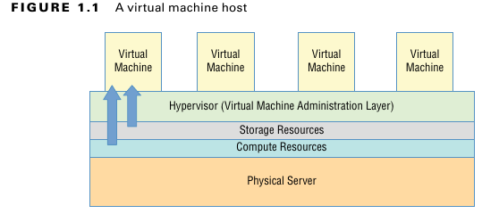
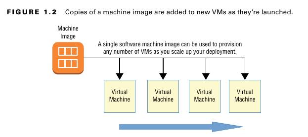
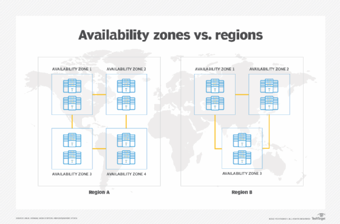
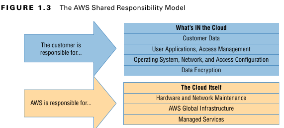
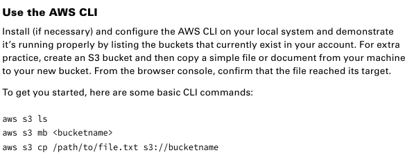
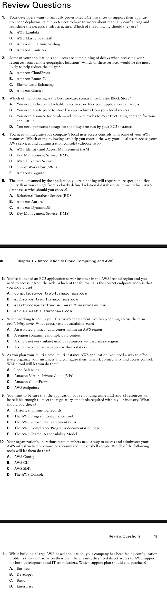

# **مقدمة عن الـ Cloud Computing و AWS**

الـ **Cloud** هو المكان اللي بيحصل فيه معظم الشغل الجامد في التكنولوجيا والتطوير اليومين دول. و **AWS** بالذات، أكتر من أي **platform** تانية، هي اللي الشركات والمؤسسات الكبيرة بتختارها عشان تشغّل عليها الـ **workloads** بتاعتها.

فلو عايز تبقى **AWS Solutions Architect** شاطر، لازم الأول تفهم يعني إيه **Cloud** بجد، وإزاي الجزء بتاع أمازون ده شغال.

---

#### **وعشان تبقى لامم الدنيا صح، الشابتر ده هيوريك الأساسيات دي:**

*   ✅ إيه اللي بيميّز الـ **Cloud Computing** عن أي **applications** تانية أو الـ **client-server models**؟

*   ✅ إزاي الـ **platform** بتاعت AWS بتوفرلك **virtual networked environments** آمنة ومرنة عشان تحط عليها الـ **resources** بتاعتك.

*   ✅ إزاي AWS بتقدم مستوى عالي أوي كده من الـ **service reliability** (يعني إزاي الخدمة بتاعتهم صعب أوي إنها تقع).

*   ✅ إزاي تعمل **access** وتتحكم في الـ **resources** بتاعتك اللي على AWS.

*   ✅ تروح فين عشان تلاقي الـ **documentation** والمساعدة اللي هتحتاجها في الـ **deployments** بتاعتك على AWS.


## **الـ Cloud Computing والـ Virtualization**

التكنولوجيا اللي هي أساس وقلب كل عمليات الـ **Cloud** هي الـ **Virtualization**.

زي ما باين في شكل 1.1، الـ **Virtualization** بتخليك تقسم الـ **hardware resources** بتاعت **physical server** واحد (يعني سيرفر حقيقي ملموس) لوحدات أصغر. وبكده، الـ **physical server** ده يقدر يشغّل كذا **virtual machine (VM)** في نفس الوقت، كل واحدة فيهم شغّال عليها الـ **operating system** الكامل بتاعها، وليها الـ **memory** والـ **storage** والـ **network access** الخاصين بيها.




المرونة بتاعة الـ **Virtualization** دي بتخليك تقدر تعمل **provision** (يعني تجهّز وتشغّل) سيرفر **virtual** في ثواني، وتشغّله بالظبط على قد الوقت اللي مشروعك محتاجه، وبعدين تقفله خالص. والـ **resources** اللي فضيت دي بتبقى متاحة فورًا لأي **workloads** تانية.

كثافة الاستخدام اللي بتوصلها دي بتخليك تعصر الـ **hardware** بتاعك وتستفيد منه لآخر نقطة، وبتسهّل عليك أوي إنك تعمل **environments** للتجارب أو **sandboxed environments** (بيئات معزولة عشان تختبر فيها براحتك).

## **الـ Architecture بتاعت الـ Cloud Computing**

الـ **providers** الكبار زي AWS عندهم server farms عملاقة، فيها ميات الآلاف من الـ **servers** والـ **disk drives** بيتعملها صيانة، ومعاهم كل كابلات الـ **network** اللي محتاجينها عشان يوصلوهم ببعض. أي **virtualized environment** معمولة صح ممكن تديلك **virtual server** بيستخدم **storage** و **memory** و **compute cycles** و **network bandwidth** متجمّعين من أكفأ توليفة يلاقيها من الـ **resources** المتاحة.

الـ **platform** بتاعت الـ **Cloud Computing** بتوفرلك وصول **on-demand** و **self-service** (يعني وقت ما تحتاج وبتخدم نفسك بنفسك) لـ **compute resources** متجمعة، واستهلاكك بيتقاس وبتتحاسب عليه على قد الكمية اللي بتستخدمها بالظبط. أنظمة الـ **Cloud Computing** بتسمح بنماذج محاسبة دقيقة جداً، لدرجة إنك أحياناً بتتحاسب بملاليم على الساعة اللي استهلكتها.

### **إزاي تستفيد من الـ Cloud Computing لأقصى درجة**

الـ **Cloud** اختيار هايل لأي **workloads** جد أو تقيلة، لأنه **scalable** و **elastic**، وفي الغالب أرخص بكتير من الحلول التقليدية. وعشان تعمل **deployment** و **provision** صح، لازم تكون فاهم كويس التلات مميزات دول.

#### **الـ Scalability**

الـ **infrastructure** الـ **scalable** بتقدر بكفاءة تواجه أي زيادة مفاجئة في الطلب على الـ **application** بتاعك، عن طريق إنها بتزوّد **resources** بشكل أوتوماتيكي. وزي ما باين في شكل 1.2، ده في الغالب معناه إنها بتزوّد بشكل ديناميكي عدد الـ **virtual machines** (أو **instances** زي ما AWS بتسميها) اللي شغالة عندك.

**شكل 1.2**

*نسخ من الـ machine image بتتحط على VMs جديدة كل ما بتشتغل.

AWS بتقدملك خدمة الـ **autoscaling** بتاعتها، واللي من خلالها أنت بتحدد **machine image** معينة، والـ **image** دي بتتعملها **replicate** (يعني بتتاخد منها نسخ) وبتشتغل في ساعتها وبشكل أوتوماتيكي على كذا **instance** عشان تسد الطلب الزيادة.

#### **الـ Elasticity (المرونة)**

فكرة الـ **elasticity** شبه الـ **scalability** في حتت، الاتنين بيتكلموا عن إزاي الـ **system** بيتعامل مع الطلب المتغير. بس الفرق بقى، إن الـ **scalability** بتخليك تزود الـ **capacity** عشان تواجه الطلب العالي، لكن الـ **infrastructure** الـ **elastic** بتقلل الـ **capacity** دي أوتوماتيك لما الطلب يقل. وده بيخليك تتحكم في التكاليف، عشان أنت بتشغل الـ **resources** بس لما تكون محتاجها.

#### **إدارة التكاليف** (Cost Management)

غير إنك بتعرف تتحكم في المصاريف عن طريق إنك بتدير الـ **resources** اللي بتستخدمها كويس، الـ **Cloud Computing** بينقل مصاريف الـ IT بتاعتك من نظام الـ **capital expenditure (capex)** لحاجة أقرب للـ **operational expenditure (opex)**.

طب ده معناه إيه عمليًا؟ معناه إنك مبقتش محتاج تدفع 10,000 دولار كاش ومقدم لكل **server** جديد هتجيبه، ده غير طبعًا مصاريف الكهربا والتبريد والأمن والمكان اللي هتحطه فيه. بدل كل ده، أنت بتتحاسب بمبالغ صغيرة متقطعة طول ما الـ **application** بتاعك شغال.

ده مش معناه بالضرورة إن مصاريف الـ **opex** بتاعتك على المدى الطويل هتبقى دايمًا أقل من اللي كنت هتدفعه على عمر **data center** مشابه. بس معناه إنك مش هتضطر تعرض نفسك لمخاطرة التخمين باحتياجاتك على المدى البعيد. ولو في المستقبل الطلب اتغير وبقيت محتاج **hardware** جديد، AWS هتوفرهولك في دقيقة ولا اتنين.

وعشان تساعدك تفهم القصة الكاملة لمصاريف الـ **Cloud**، AWS موفرة **Total Cost of Ownership (TCO) Calculator** ببلاش على اللينك ده: `aws.amazon.com/tco-calculator`.
الـ `calculator` دي بتساعدك تعمل مقارنة  صح بين تكاليف الـ `data center` بتاعك حاليًا وتكاليف نفس الشغلانة دي على AWS هتبقى كام.

## **الـ AWS Cloud**

إنك تفضل متابع سيل الخدمات الجديدة اللي بتظهر على الـ **AWS Console** ممكن يكون موضوع محبط شوية. بس أنت كـ **solutions architect**، تركيزك الأساسي المفروض يكون على فئات الخدمات الأساسية (**core service categories**). الجزء ده بيلخص كل فئة من الفئات الأساسية دي (زي ما باين في جدول 1.1) وبعدين بيعمل نفس الكلام للخدمات المهمة نفسها. أنت كده كده هتتعلم أكتر عن كل دول (وغيرهم) في باقي الكتاب، بس مهم تركز في التعريفات الصغيرة دي، عشان هي الأساس لكل حاجة هتتعلمها بعد كده.

عينيا يا باشا، أهو الجدول كله على بعضه في حتة واحدة:

### **جدول 1.1: فئات الخدمات في AWS (كله على بعضه)**

| الـ Category               | الوظيفة                                                      |
| :------------------------- | :----------------------------------------------------------- |
| **Compute**                | دي الخدمات اللي بتعمل نفس شغلانة السيرفرات العادية، بس على الـ Cloud. وبتديلك إعدادات متطورة زي الـ `autoscaling` والـ `load balancing`، وحتى الـ `serverless architectures`. |
| **Networking**             | دي المسؤولة عن توصيل الـ `applications` ببعضها، والتحكم في مين يقدر يوصل لإيه، وكمان بتديلك اتصالات عن بعد أحسن وأقوى. |
| **Storage**                | دي أنواع ومنصات تخزين مختلفة، معمولة عشان تناسب كل الاحتياجات، من أول الوصول السريع للملفات، لحد الـ `backup` اللي بيتخزن لفترة طويلة. |
| **Database**               | دي حلول `data` جاهزة AWS بتديرها بالنيابة عنك، عشان تناسب أشكال `data` مختلفة زي الـ `relational` والـ `NoSQL` أو الـ `caching`. |
| **Application management** | دي الخدمات اللي بتخليك تراقب وتراجع وتظبط إعدادات الـ `account` بتاعك والـ `resources` اللي شغالة عليه. |
| **Security and identity**  | دي الخدمات اللي بتدير بيها الـ `authentication` (مين يدخل) والـ `authorization` (يعمل إيه)، وكمان تشفير الداتا والـ `connections`. |


### **جدول 1.2: خدمات AWS الأساسية**

| الـ Category                | الـ Service                              | الوظيفة ببساطة                                               |
| :-------------------------- | :--------------------------------------- | :----------------------------------------------------------- |
| **Compute**                 | **Elastic Compute Cloud (EC2)**          | دي سيرفرات **virtual** بتعملها زي ما كنت بتعمل السيرفرات العادية عندك. بتقدر تظبطها بالـ CPU والـ Memory والـ Storage اللي على مزاجك عشان تشغل أي حاجة. |
|                             | **Lambda**                               | دي طريقة تشغل بيها الكود بتاعك من غير ما تحتاج سيرفر شغال 24 ساعة. أي `event` يحصل (زي طلب ييجي للكود) بيشغلها، ولما تخلص شغلها بتقفل لوحدها. |
|                             | **Auto Scaling**                         | بتعمل نسخ من الـ `EC2 instances` بتاعتك وتزودها أوتوماتيك (`scale up`) لما الضغط يزيد، ولما الضغط يقل، بتمسح النسخ الزيادة (`scale down`). |
|                             | **Elastic Load Balancing**               | بيوزع الـ `traffic` اللي جاي على كذا `web server` عشان مافيش سيرفر واحد يتزنق والباقي فاضي، وكمان بيشيل أي سيرفر بايظ من السكة. |
| **Networking**              | **Elastic Beanstalk**                    | دي خدمة `managed` بتسهل عليك الدنيا خالص. أنت بس بترمي عليها الكود بتاع الـ `application` بتاعك، وهي بتعمل كل حاجة في الخلفية وبتشغل كل الخدمات اللازمة. |
|                             | **Virtual Private Cloud (VPC)**          | دي بتعملك شبكة `networking` خاصة ومعزولة ليك أنت بس. بتستخدمها عشان تأمن وتتحكم في مين يدخل ومين يخرج من الـ `instances` بتاعتك. |
|                             | **Direct Connect**                       | دي بتخليك تعمل توصيلة `network` سريعة وآمنة من الـ `data center` بتاعك أو مكتبك لحد الـ `VPCs` بتاعتك على AWS، كأنهم في مكان واحد. |
|                             | **Route 53**                             | دي خدمة الـ `DNS` بتاعة AWS. بتخليك تدير أسماء الـ `domains`، وتوجه الـ `traffic`، وتعمل `health checks`، وكل ده متوصل بباقي خدمات AWS. |
|                             | **CloudFront**                           | دي خدمة `CDN` عالمية. بتخزن نسخ من محتوى موقعك في أماكن كتير حوالين العالم (`edge locations`) عشان توصله للناس بأعلى كفاءة وأقل `latency`. |
| **Storage**                 | **Simple Storage Service (S3)**          | خدمة تخزين متعددة الاستخدامات ورخيصة جداً عشان تخزن عليها أي نوع `data` وتعمل `backup`. |
|                             | **S3 Glacier**                           | اختيار ممتاز لما تكون عايز تخزن ملفات `archives` كبيرة لفترة طويلة، بس مش مستعجل عليها (ممكن تاخد ساعات عشان ترجعها). |
|                             | **Elastic Block Store (EBS)**            | دي عبارة عن `virtual hard drives` بتتركب على الـ `EC2 instances` عشان تشغل عليها الـ `operating system` والملفات اللي بتشتغل عليها. |
|                             | **Storage Gateway**                      | دي بتوصل الـ `storage` بتاع AWS عندك في الـ `data center` بتاعك كأنه جهاز عادي، وده بيسهل أوي عمليات النقل والـ `backup`. |
| **Database**                | **Relational Database Service (RDS)**    | دي خدمة `managed` بتعملك `database` مستقرة وآمنة. بتقدر تختار من محركات `database` كتير زي MySQL, Oracle، و Aurora بتاعة أمازون. |
|                             | **DynamoDB**                             | دي `database` سريعة ومرنة وبتكبر معاك براحتها، وهي من نوع `NoSQL` (يعني مش `relational`). |
| **Application management**  | **CloudWatch**                           | دي بتخليك تراقب أداء الـ `processes` واستهلاك الـ `resources`، ولما الأرقام توصل لحد معين، ممكن يبعتلك رسالة أو يشغل `action` أوتوماتيكي. |
|                             | **CloudFormation**                       | دي خدمة بتخليك تكتب كود (templates) عشان توصف وتعمل `deploy` لكل الـ `resources` بتاعتك على AWS مرة واحدة، وده بيخلي العملية أسرع وأسهل. |
|                             | **CloudTrail**                           | ده بيسجل كل الـ `API events` اللي بتحصل على الـ `account` بتاعك. مفيد أوي للمراجعة وحل المشاكل. |
|                             | **Config**                               | ده بيساعدك تتابع أي تغيير بيحصل في إعدادات الـ `resources` بتاعتك عشان تتأكد إنها ماشية على القواعد اللي أنت حاططها. |
| **Security and identity**   | **Identity and Access Management (IAM)** | دي بتستخدمها عشان تتحكم في مين يدخل (`authentication`) ويقدر يعمل إيه (`authorization`) في الـ `account` بتاعك عن طريق `users`, `groups`, `roles`, و `policies`. |
|                             | **Key Management Service (KMS)**         | دي خدمة `managed` بتخليك تعمل وتدير مفاتيح التشفير اللي بتستخدمها عشان تأمن الداتا بتاعتك في خدمات AWS. |
|                             | **Directory Service**                    | دي بتساعدك تدير الـ `identities` في البيئات اللي محتاجة كده، وبتقدر تربطها مع `identity providers` زي Cognito و Microsoft AD. |
| **Application integration** | **Simple Notification Service (SNS)**    | دي أداة `notifications` بتبعت رسايل (topics) لخدمات تانية (زي SQS أو Lambda)، أو للموبايلات، أو على الإيميل والـ SMS. |
|                             | **Simple Workflow (SWF)**                | دي بتخليك تنسق مجموعة من المهام اللي لازم تتعمل ورا بعض باستخدام خدمات AWS أو حتى حاجات مش ديجيتال (زي موافقة من بني آدم). |
|                             | **Simple Queue Service (SQS)**           | دي بتعمل "طابور" (`queue`) للرسايل عشان تفصل بين أجزاء الـ `system` بتاعك، وتضمن إن الرسايل هتوصل بشكل مضمون حتى لو في أعطال. |
|                             | **API Gateway**                          | دي بتخليك تعمل وتدير `APIs` آمنة وموثوقة للـ `applications` بتاعتك اللي على AWS. |


## **الـ Architecture بتاعت الـ AWS Platform**

AWS عندها `data centers`(availability zones) للسيرفرات الـ `physical` بتاعتها في كل حتة في العالم. وعشان الـ `data centers` دي متوزعة في كل مكان، أنت بتقدر تقلل الـ `network transfer latency` (يعني التأخير في نقل الداتا) للخدمات بتاعتك، بإنك تعمل `hosting` للـ `workloads` بتاعتك في مكان قريب جغرافيًا من اليوزرز بتوعك. وكمان ده بيساعدك تلتزم بالـ `compliance` مع القوانين اللي بتفرض عليك إنك تخلي الداتا بتاعتك جوه حدود منطقة قانونية معينة (زي إن الداتا بتاعت عملاء أوروبا لازم تفضل في أوروبا مثلاً).

الـ `Data centers` دي بتبقى موجودة جوه حاجة اسمها **AWS regions**، وعدد الـ `regions` دي حاليًا 21 (وده مش شامل الـ `AWS GovCloud regions` الخاصة بحكومة أمريكا)، وطبعًا الرقم ده بيزيد على طول.

مهم أوي دايمًا تاخد بالك من الـ `region` اللي أنت مختارها وإنت بتعمل `launch` لأي `AWS resources` جديدة؛ لأن الأسعار والخدمات المتاحة ممكن تختلف من `region` للتانية.



جدول 1.3 بيوريك لستة بالـ 21 `region` (اللي مش تبع الحكومة) ومعاهم اسم كل `region` والـ `core endpoint addresses` بتاعتها. وملحوظة مهمة: عشان تعمل `access` و `authentication` على الاتنين `regions` بتوع الصين، بتحتاج `protocols` خاصة ومختلفة.


### **جدول 1.3: لستة بالـ AWS Regions المتاحة للكل**

| اسم الـ Region                 | الكود بتاع الـ Region | الـ Endpoint (العنوان)          |
| :----------------------------- | :-------------------- | :------------------------------ |
| **US East (Ohio)**             | us-east-2             | us-east-2.amazonaws.com         |
| **US West (N. California)**    | us-west-1             | us-west-1.amazonaws.com         |
| **US West (Oregon)**           | us-west-2             | us-west-2.amazonaws.com         |
| **Asia Pacific (Hong Kong)**   | ap-east-1             | ap-east-1.amazonaws.com         |
| **Asia Pacific (Mumbai)**      | ap-south-1            | ap-south-1.amazonaws.com        |
| **Asia Pacific (Seoul)**       | ap-northeast-2        | ap-northeast-2.amazonaws.com    |
| **Asia Pacific (Osaka-Local)** | ap-northeast-3        | ap-northeast-3.amazonaws.com    |
| **Asia Pacific (Singapore)**   | ap-southeast-1        | ap-southeast-1.amazonaws.com    |
| **Asia Pacific (Sydney)**      | ap-southeast-2        | ap-southeast-2.amazonaws.com    |
| **Asia Pacific (Tokyo)**       | ap-northeast-1        | ap-northeast-1.amazonaws.com    |
| **Canada (Central)**           | ca-central-1          | ca-central-1.amazonaws.com      |
| **China (Beijing)**            | cn-north-1            | cn-north-1.amazonaws.com.cn     |
| **China (Ningxia)**            | cn-northwest-1        | cn-northwest-1.amazonaws.com.cn |
| **EU (Frankfurt)**             | eu-central-1          | eu-central-1.amazonaws.com      |
| **EU (Ireland)**               | eu-west-1             | eu-west-1.amazonaws.com         |
| **EU (London)**                | eu-west-2             | eu-west-2.amazonaws.com         |
| **EU (Paris)**                 | eu-west-3             | eu-west-3.amazonaws.com         |
| **EU (Stockholm)**             | eu-north-1            | eu-north-1.amazonaws.com        |
| **Middle East (Bahrain)**      | me-south-1            | me-south-1.amazonaws.com        |

> [!TIP]
>
> الـ **Endpoint addresses** دي بنستخدمها عشان نعمل `access` للـ `AWS resources` بتاعتنا عن بعد، من جوه كود الـ `application` أو من الـ `scripts`.
>
> كلمات زي `ec2` أو `apigateway` أو `cloudformation` بتتحط كـ **prefixes** (يعني بتيجي قبل العنوان) عشان تحدد أنت بتكلم أنهي خدمة بالظبط في AWS. فممكن العنوان يبقى شكله كده:
> `cloudformation.us-east-2.amazonaws.com`
>
> ولو عايز تشوف لستة كاملة بالـ `endpoint addresses` والـ `prefixes` بتاعتها، هتلاقيها على اللينك ده:
> `docs.aws.amazon.com/general/latest/gr/rande.html`


عشان الوصول السريع أوي (`low-latency`) ده مهم جدًا، في خدمات معينة في AWS بتتقدم من أماكن مخصصة بتكون جمب المناطق السكنية غير data center الرئيسية اللي اسمه availability zones اما دي  اسمها **edge network locations**. الخدمات دي زي Amazon CloudFront, Amazon Route 53, AWS Firewall Manager, AWS Shield, و AWS WAF. لو عايز لستة كاملة وآخر تحديث بالأماكن المتاحة، بص على اللينك ده: `aws.amazon.com/about-aws/global-infra-structure/regional-product-services`.

الـ `data centers` الـ `physical` (الحقيقية) بتاعت AWS بتظهرلك جوه الـ `account` بتاعك على شكل حاجة اسمها **availability zones**. ممكن تلاقي في الـ `region` الواحدة حوالي نص دستة `availability zones`، زي مثلاً `us-east-1a` و `us-east-1b`، كل واحدة فيهم بتتكون من `data center` واحد أو أكتر.

أنت بتنظم الـ `resources` بتاعتك اللي في الـ `region` جوه واحدة أو أكتر من الـ **virtual private clouds (VPCs)**. الـ `VPC` دي عبارة عن شبكة خاصة بيك، تقدر تعمل جواها شبكات أصغر اسمها `subnets`، وتربط كل `subnet` بـ `availability zone` معينة. ولما تظبط الـ `architecture` دي صح، بتديلك عزل فعال للـ `resources` و `replication`  .

## **الـ Reliability والـ Compliance في AWS**

AWS مخلصة جزء كبير من شغل القوانين والـ `security` الأساسي من قبل ما أنت حتى تشغل أول خدمة.

AWS صارفة ومخططة جامد واستثمرت فلوس وخبرات في إدارة الـ `infrastructure` بتاعتها.
 الـ `data centers` بتاعتهم متأمّنة على أعلى مستوى وفي سرية تامة، وعندهم طبقات فوق طبقات من الـ `redundancy` (يعني كل حاجة ليها بديل وبديل البديل)، وبروتوكولات شغل معمولة بعناية شديدة صعب أو حتى مستحيل على أي شركة عادية إنها تقلده.

في الأماكن اللي بتحتاج، الـ `resources` على `platform` AWS بتبقى متوافقة مع عشرات المعايير والشهادات الدولية، زي `ISO 9001`, `FedRAMP`, `NIST`, و `GDPR`. (لو عايز معلومات أكتر بص على `aws.amazon.com/compliance/programs`).

### **نموذج المسؤولية المشتركة (The AWS Shared Responsibility Model)**

بس طبعًا، الضمانات دي كلها بتغطي الـ `platform` بتاعت AWS نفسها بس. طريقة استخدامك أنت للـ `resources` دي شغلتك أنت، وبالتالي **مسؤوليتك أنت**. عشان كده مهم أوي تبقى عارف الـ **AWS Shared Responsibility Model**.

**مسؤولية AWS:**
AWS بتضمن أمان واستمرارية "cloud" بتاعتها. وده معناه: الـ `physical servers` والـ `storage devices` والـ `networking infrastructure` والخدمات الـ `managed` اللي هي بتديرها.

**مسؤولية العميل (أنت):**
زي ما باين في شكل 1.3، العملاء مسؤولين عن أي حاجة بتحصل **"جوه"** الـ `Cloud` ده. وده بيشمل أمان وتشغيل الـ `operating systems` اللي أنت بتثبتها، والـ `data` اللي ناحية العميل، وحركة الداتا عبر الشبكات، والـ `authentication` والـ `access` بتاع اليوزرز بتوعك، والداتا بتاعتك أنت.

**شكل 1.3**



*نموذج المسؤولية المشتركة في AWS*


### **الـ AWS Service Level Agreement (SLA)**

لما AWS بتقولك "ضمان" أو `guarantee`، هي مش قصدها إن الخدمة عمرها ما هتقع أو مش هيحصل أي اختراق أمني. الهاردات ممكن تبوظ، الكهربا ممكن تقطع، وممكن تحصل كوارث طبيعية. بس لما حاجة تحصل غلط، AWS هتديلك `service credits` (يعني رصيد تعويض) عشان تعوضك عن خسارتك المباشرة لو الـ `uptime` (نسبة الوقت اللي الخدمة شغالة فيه) قل عن حد معين. بس طبعًا التعويض ده مش هيرجعلك ثقة العملاء أو الشغل اللي خسرته.

نسبة الضمان دي بتختلف من خدمة للتانية. الـ `SLA` لخدمة زي الـ **EC2** مثلاً هي **99.99%** — وده معناه إنك ممكن تتوقع إن الـ `instances` بتاعتك هتقع حوالي 4 دقايق بس كل شهر.

الحاجة المهمة اللي لازم تفتكرها هي إن السؤال مش ***لو*** الحاجات هتبوظ، السؤال هو ***امتى*** هتبوظ. ابني الـ `applications` بتاعتك بحيث إنها تكون متوزعة جغرافياً و `fault tolerant` (يعني بتستحمل الأعطال)، عشان لما حاجة تبوظ، اليوزرز بتوعك تقريبًا مش هيحسوا بحاجة.

## **إزاي تتعامل مع AWS**

مهما كانت الخدمات اللي هتختارها، هتحتاج طريقة تديرها بيها كلها. الـ **management console** اللي بتفتحها من الـ `browser` طريقة ممتازة عشان تتعرف على أي خدمة وتشوف هتشتغل إزاي على أرض الواقع. تقريبًا مافيش حاجة متقدرش تعملها من الـ `console`. بس كل ما بتفهم أكتر والدنيا بتكبر معاك، هتلاقي نفسك بتعمل الشغل التقيل بجد بعيد عن الـ `console`.

> [!CAUTION]
>
> كل الامثلة فى الكتاب و exercise انا هعملها بـ terrafrom


#### **الـ AWS CLI**

الـ **AWS Command Line Interface (CLI)** بيخليك تتحكم فى  عمليات AWS المعقدة من الـ `command line` عندك على الجهاز. لما تتعود عليه، هتكتشف إنه بيخلي الدنيا أسهل وأسرع بكتير.

مثلاً، لو محتاج تشغل 6 `EC2 instances` عشان تعمل بيئة `microservices`، وكل واحدة ليها دور مختلف. إنك تقعد تدوس كليك ورا كليك عشان تشغلهم من الـ `console` موضوع ممل وبياخد وقت، خصوصًا لو بتكرره كل شوية. لكن العملية دي كلها ممكن تتحط في `script` بسيط تشغله من الـ `terminal` عندك باستخدام الـ `CLI`.

تركيب وتظبيط الـ `CLI` على أي نظام تشغيل مش صعب خالص. عشان تشوف أحدث التعليمات، بص على: `docs.aws.amazon.com/cli/latest/userguide/installing.html`.

#### **الـ AWS SDKs**

لو عايز تعمل `access` للـ `resources` بتاعتك على AWS من جوه الكود بتاع الـ `application` بتاعك، هتحتاج تستخدم **AWS software development kit (SDK)** للغة اللي أنت شغال بيها. AWS حاليًا موفرة SDKs لتسع لغات، زي Java و .NET و Python، وكمان SDKs للموبايل زي Android و iOS.

لو عايز تشوف كل الـ `developer tools` اللي AWS بتقدمها، بص على: `aws.amazon.com/tools`.

### **الدعم الفني والمصادر الأونلاين**

الدنيا مش دايمًا هتمشي معاك زي الفل، وفي وقت من الأوقات هتحتاج نوع من الدعم الفني. في أنواع دعم مختلفة، والمفروض تفهم إيه المتاح ليك.

من أول الحاجات اللي هتتسألها وإنت بتعمل `account` جديد هي أنهي **support plan** أنت عايزها. احتياجات شغلك وميزانيتك هي اللي هتحدد إجابتك.

#### **خطط الدعم (Support Plans)**

*   **الـ Basic plan:** دي ببلاش مع أي `account`. بتديلك `access` لخدمة العملاء، والـ `documentation`، والمنتديات. خدمة العملاء دي بتغطي مشاكل الفواتير والـ `account` بس.
*   **الـ Developer plan:** بتبدأ من **29 دولار في الشهر**. بتضيف على اللي فات إن شخص واحد من عندك يقدر يكلم موظف دعم فني وياخد توجيهات عامة ومساعدة لو الـ `system` فيه مشكلة بسيطة.
*   **الـ Business plan:** بتبدأ من **100 دولار في الشهر (وطالع)**. بتديلك استجابة أسرع مضمونة لعدد مستخدمين مفتوح، ومساعدة شخصية في حل المشاكل، و `support API`.
*   **الـ Enterprise plan:** دي بتغطي كل اللي فات، وبتزود عليهم `access` مباشر لـ AWS `solutions architects` عشان يراجعوا معاك التصميم والشغل، وبيبقى ليك `technical account manager` خاص بيك، وحاجة اسمها `support concierge`. للشغل التقيل أوي والمهم، المميزات دي بتفرق جامد. بس هتكلفك **15,000 دولار كل شهر على الأقل**.

لو عايز تقرأ أكتر عن خطط الدعم، بص على: `aws.amazon.com/premiumsupport/compare-plans`.


## **مصادر دعم تانية (Other Support Resources)**

في دعم كتير تقدر تخدم بيه نفسك بعيدًا عن خطط الدعم الرسمية:

*   ✅ **المنتديات بتاعة مجتمع AWS:** دي مفتوحة لأي حد عنده `AWS account` شغال.
    (اللينك: `forums.aws.amazon.com`)

*   ✅ **الـ documentation بتاعة AWS:** واسعة جدًا ومتظبطة على طول، وفيها كل حاجة تقريبًا.
    (اللينك: `aws.amazon.com/documentation`)

*   ✅ **صفحة AWS Well-Architected:** دي زي مركز بيجمعلك `white papers` و `documentation` مهمة جدًا بتتكلم عن أحسن الطرق (`best practices`) عشان تصمم الـ `deployments` بتاعتك على الـ `Cloud` صح.
    (اللينك: `aws.amazon.com/architecture/well-architected`)

*   ✅ **شركات تانية:** في كمان شركات كتير تانية (`third-party`) بتقدم دعم فني تجاري (`commercial support`) للـ `deployments` بتاعتك على AWS لو احتجت.


طبعًا يا باشا، أهي "الزتونة" بتاعة الامتحان دي بأسلوبنا الرايق.

---

### **خلاصة الامتحان (Exam Essentials)**

*   **افهم الـ Architecture بتاعت الـ AWS platform:**
    AWS بتقسم السيرفرات والـ `storage` بتاعها لـ `regions` متوزعة في كل حتة في العالم، وجوه كل `region` بتقسمها لـ `availability zones`. التقسيمة دي بتسمحلك تعمل `replication` (نسخ) عشان تزود الـ `availability` (الخدمة تفضل شغالة)، وفي نفس الوقت بتسمحلك تعزل الـ `processes` والـ `resources` بتاعتك عشان الـ `security` والـ `compliance`. لازم لما تيجي تصمم الـ `deployments` بتاعتك، تستغل المميزات دي صح.

*   **اعرف إزاي تستخدم أدوات الإدارة بتاعة AWS:**
    صحيح أنت هتستخدم الـ `browser` عشان تدخل على الـ `AWS administration console` من وقت للتاني، بس معظم شغلك التقيل بجد غالبًا هيتعمل عن طريق الـ **`AWS CLI`**، ومن جوه الكود بتاع الـ `application` بتاعك، عن طريق **`AWS SDK`**.

*   **افهم إزاي تختار الـ support plan الصح:**
    إنك تعرف أنهي مستوى `support plan` مناسب لعميل معين ده جزء مهم أوي عشان تعمل `deployment` ناجح. لازم تبقى عارف كل الاختيارات المتاحة كويس.
    

---



### **تمرين 1.1: استخدم الـ AWS CLI**

ثبّت (لو مش متثبت) وظبّط الـ **AWS CLI** على جهازك، وعشان تتأكد إنه شغال صح، اعرض لستة بالـ `buckets` اللي موجودة حاليًا في الـ `account` بتاعك. وعشان تتمرن زيادة، اعمل `S3 bucket` جديد وبعدين انسخ ملف بسيط من جهازك للـ `bucket` الجديد ده. من الـ `browser console`، اتأكد إن الملف وصل مكانه صح.

عشان أساعدك تبدأ، دي شوية أوامر `CLI` أساسية:

| الأمر                                         | الوظيفة                                     |
| :-------------------------------------------- | :------------------------------------------ |
| `aws s3 ls`                                   | بيعرضلك كل الـ `S3 buckets` اللي عندك.      |
| `aws s3 mb s3://<bucketname>`                 | بيعمل `bucket` جديد بالاسم اللي هتكتبه.     |
| `aws s3 cp /path/to/file.txt s3://bucketname` | بينسخ ملف من جهازك للـ `bucket` اللي حددته. |

طب لو terrafrom 

هقسم الكود على كذا جزء عشان تبقى واخد باللك ايه اللي حصل 
عارف انه ملوش دعوة لسه موصلناش ليه فى الشرح بس عشان تشوف الدنيا ماشي ازاي 

حدد region اللي انت فيه

```terraform
provider "aws" {
  region = "us-west-2"
}
```

كده انت انشاءت s3 ولكن خد بالك الاسم بيكون unique على مستوى aws كامل ومش حسابك خد بالك من النقطة دي لان ممكن يطلعلك اخطاء

```terraform
resource "aws_s3_bucket" "my_bucket" {
  bucket = "my-unique-bucket-name-12345"
}

```

دلوقتي هرفع عليها الملف
```terraform
resource "aws_s3_object" "my_file" {
  bucket = aws_s3_bucket.my_bucket.id
  key    = "test"
  source = "test.txt"
  etag   = filemd5("test.txt")
}
```

التخزين فى s3 شبيه جدا او هو مفهوم key  وvalue و key هو عبارة عن اسم انت بتحطه وهنا source عبارة عن path بتاع الملف 

بالنسبة لي etag دي مهمة فى الشغل ولكن فمثلنا هنا ملهاش لازمة لكن نقدر هي عبارة عم علمية hash للـملف عشان لو شغلته ثاني ولقى الملف اتغير hash عن اللي كان موجود يرفعه ثاني 

```terraform
output "file_uploaded_path" {
  value = "s3://${aws_s3_bucket.my_bucket.bucket}/${aws_s3_object.my_file.key}"
}
```

اخر حاجة هتطبع url الخاصة عشان تعرف تعمل acess

 عارف ان الموضوع غريب ونقله غيربة شوية بس لو عندك خلفية بسيطة اعتقد ممكن يكون الموضوع تافه 

### **أسئلة **



**1. المطورين عندك عايزين يشغلوا `EC2 instances` متظبطة بالكامل عشان يعملوا `deploy` للكود بتاعهم، بس مش عايزين يوجعوا دماغهم بتظبيط وعمل `launch` للـ `infrastructure` دي يدويًا. أنهي خدمة المفروض يستخدموها؟**

*   **الإجابة الصح:** B. AWS Elastic Beanstalk
*   **ليه؟** عشان Beanstalk هو اللي بيعمل كل حاجة أوتوماتيك، أنت بس بترميلة الكود.

**2. بعض اليوزرز بتوع الـ `application` بتاعك بيشتكوا من تأخير لما بيوصلوا للـ `resources` من أماكن جغرافية بعيدة. أنهي خدمة من دول هي الأنسب عشان تقلل التأخير ده؟**
*   **الإجابة الصح:** A. Amazon CloudFront
*   **ليه؟** عشان CloudFront هو الـ CDN اللي بيحط نسخ من المحتوى بتاعك قريب من اليوزرز.

**3. إيه هو أحسن سيناريو لاستخدام الـ Elastic Block Store (EBS)؟**
*   **الإجابة الصح:** D. أنت محتاج `persistent storage` (تخزين دائم) للـ `filesystem` اللي شغال على الـ `EC2 instance` بتاعتك.
*   **ليه؟** عشان EBS هو الهارد ديسك بتاع الـ EC2.

**4. أنت محتاج تعمل `integrate` بين صلاحيات اليوزرز  في شركتك وبعض الـ `resources` على AWS. أنهي من دول يقدر يساعدك تتحكم في إزاي اليوزرز المحليين بيعملوا `access` لخدمات AWS؟ (اختار اتنين)**

*   **الإجابة الصح:** A. AWS Identity and Access Management (IAM) و C. AWS Directory Service
*   **ليه؟** IAM هو الأساس لإدارة الصلاحيات، و Directory Service بيساعدك تربط ده بالـ `directories` اللي عندك زي Active Directory.

**5. الداتا اللي بيستخدمها الـ `application` بتاعك محتاجة سرعة ومرونة أكتر من اللي بتاخدها من هيكل `relational database` محكوم أوي. أنهي خدمة `database` من AWS تختارها؟**
*   **الإجابة الصح:** C. Amazon DynamoDB
*   **ليه؟** عشان DynamoDB هو الـ NoSQL database اللي بيدي مرونة وسرعة عالية.

**6. أنت شغلت `EC2 instance` في `region` Ireland وأنت محتاج توصله من النت. إيه هو الـ `endpoint address` الصح اللي المفروض تستخدمه؟**
*   **الإجابة الصح:** D. ec2.eu-west-1.amazonaws.com
*   **ليه؟** `ec2` هو الـ `prefix` للخدمة، و `eu-west-1` هو الكود بتاع `region` Ireland.

**7. وإنت بتظبط أول `deployment` ليك على AWS، عمال تقابل مصطلح `availability zone`. إيه هي الـ `availability zone` دي بالظبط؟**
*   **الإجابة الصح:** A. `data center` حقيقي ومعزول جوه `AWS region`.
*   **ليه؟** الـ `Region` هي المدينة، والـ `AZ` هي زي حي أو مبنى مستقل جوه المدينة دي.

**8. وإنت بتخطط للـ `application` بتاعك اللي فيه كذا `instance` وكذا `tier`، أنت محتاج طريقة تنظم بيها الـ `instances` دي وتظبط الـ `networking` والـ `access` بتاعها. أنهي أداة هتخليك تعمل كده؟**
*   **الإجابة الصح:** B. Amazon Virtual Private Cloud (VPC)

**9. أنت عايز تتأكد إن الـ `application` اللي بتبنيه باستخدام EC2 و S3 هيبقى `reliable` (موثوق) كفاية عشان يوفي بالمعايير القانونية في مجالك. إيه اللي المفروض تبص عليه؟**
*   **الإجابة الصح:** C. The AWS service level agreement (SLA) و D. The AWS Compliance Programs documentation page
*   **ليه؟** الـ SLA بيقولك نسبة الضمان، والـ Compliance Programs بيقولك AWS متوافقة مع أنهي شهادات ومعايير.

**10. فريق الـ `operations` في شركتك محتاج طريقة يعمل بيها `access` ويدير الـ `infrastructure` بتاعتكم على AWS عن طريق الـ `command line` أو `shell scripts`. أنهي أداة هتخليهم يعملوا كده؟**
*   **الإجابة الصح:** B. AWS CLI
*   **ليه؟** الـ CLI هو الأداة المخصصة للـ `command line`.

**11. وإنتوا بتبنوا `application` كبير على AWS، شركتك قابلتها مشاكل في الـ `configuration` مش عارفين يحلوها لوحدهم. ونتيجة لكده، هما محتاجين `access` مباشر لدعم AWS لمديرين التطوير والـ IT. أنهي `support plan` المفروض تشتريها؟**
*   **الإجابة الصح:** A. Business
*   **ليه؟** خطة الـ Business هي اللي بتبدأ تدي `access` مباشر ودعم أسرع لعدد مستخدمين مفتوح. الـ Enterprise أغلى بكتير وبتكون للحالات الحرجة أوي.