# **الفصل التاني:  الـ `Compute`**

في الفصل ده، هنركز على أهم النقط اللي بتغطيها شهادة `AWS Certified Solutions Architect Associate` واللي ليها علاقة بخدمات الـ `Compute`. ودي الأهداف اللي هنتكلم عنها:

🛡️ **(`Domain 1`): Design Secure Architectures**

🧱 **(`Domain 2`): Design Resilient Architectures**

🚀 **(`Domain 3`): Design High-Performing Architectures**

💰 **(`Domain 4`): Design Cost-Optimized Architectures**


## **مقدمة**

قلب أي `data center` أو أوضة سيرفرات عادية هو السيرفرات الغالية اللي جواها. بس عشان تخلي السيرفرات دي مفيدة، أنت هتحتاج تزود عليها `racks`، و `power supplies`، وكابلات، و `switches`، و `firewalls`، وتبريد.

الخدمة بتاعت AWS اللي اسمها **Elastic Compute Cloud (EC2)** معمولة عشان تعملك نفس تجربة الـ `data center` أو أوضة السيرفرات دي بأقرب شكل ممكن. الأساس في كل ده هو السيرفر الـ `virtual` بتاع EC2، واللي بنسميه **`instance`**. بس زي أوضة السيرفرات العادية اللي لسه وصفناها، EC2 بتقدملك مجموعة أدوات معمولة عشان تدعم وتحسّن شغل الـ `instance` بتاعتك.

الشابتر ده هيوريك الأدوات والطرق اللي بتستخدمها عشان تستفيد من قوة المنظومة بتاعت EC2 لأقصى درجة، زي الحاجات دي:

*   ✅ إزاي تجهّز (`provision`) `EC2 instance` بالـ `hardware resources` الصح لمشروعك.

*   ✅ إزاي تظبط الـ `operating system` الأساسي الصح اللي الـ `application` بتاعك محتاجه.

*   ✅ إزاي تبني بيئة `network` آمنة وفعالة للـ `instance` بتاعتك.

*   ✅ إزاي تضيف `scripts` تشتغل أول ما الـ `instance` تقوم عشان تساعد (أو تبدأ) الـ `application` بتاعك.

*   ✅ إزاي تختار أحسن`pricing model` لـ EC2 على حسب احتياجاتك.

*   ✅ إزاي تفهم وتستفيد  الـ `instance` (`EC2 instance lifecycle`).

*   ✅ إزاي تختار نوع الـ `storage drive` الصح لاحتياجاتك.

*   ✅ إزاي تأمّن الـ `EC2 resources` بتاعتك باستخدام `key pairs`، و `security groups`، و `network access lists`، والـ `IAM roles`.

*   ✅ إزاي تزود وتقلل عدد الـ `instances` عشان تواكب الطلب المتغير باستخدام الـ `Auto Scaling`.

*   ✅ إزاي تعمل `access` على الـ `instance` بتاعتك كـ `administrator` أو كـ `end-user`.


## **الـ EC2 Instances**

الـ **EC2 instance** ممكن تكون مجرد حتة متاخدة بشكل `virtual` من `physical server` حقيقي، بس هي بتتصرف كأنها حاجة حقيقية بالظبط. هيبقى ليها `access` على `storage` و `memory` و `network interface`، والـ `hard drive` الأساسي بتاعها هييجي وعليه `operating system` نضيف وجاهز.

أنت اللي بتقرر نوع الـ `hardware resources` اللي عايز الـ `instance` بتاعتك تاخدها، وإيه الـ `operating system` والـ `software` اللي عايزها تشغله، وفي الآخر، هتدفع عليها كام. تعال نشوف بقى كل ده بيشتغل إزاي.

### Provisioning Your Instance

أنت بتظبط الـ `operating system` والـ `software`، ومواصفات الـ `hardware` ( الـ CPU، الـ memory، الـ storage الأساسي، وأداء الـ network)، والبيئة بتاعت الـ `instance` قبل ما تعملها `launch` . الـ OS بيتحدد بالـ **Amazon Machine Image (AMI)** اللي بتختاره، والـ `hardware` بيمشي تبع الـ **instance type**.

#### **الـ Amazon Machine Images (AMIs) بتاعة EC2**

الـ **AMI** ده في الحقيقة مجرد **template** فيه معلومات بتقول لـ EC2 إيه هو الـ OS والـ `software` اللي يحطه على الـ `root data volume` بتاع الـ `instance` اللي هيشغلها. في أربع أنواع من الـ AMIs:

*   **Amazon Quick Start AMIs:**
    الـ `images` دي بتظهر في وشك أول القايمة في الـ `console` لما تبدأ تعمل `launch` لـ `instance` جديدة. هي الاختيارات المشهورة وبتشمل إصدارات مختلفة من Linux أو Windows Server، وشوية `images` متخصصة عشان تعمل عمليات معينة (زي الـ `deep learning` أو الـ `database`). الـ AMIs دي متحدثة ومدعومة رسميًا 

*   **AWS Marketplace AMIs:**
    الـ AMIs اللي من الـ `AWS Marketplace` دي `images` رسمية وجاهزة للإنتاج (`production-ready`)، ومقدمة ومدعومة من شركات كبيرة في المجال زي SAP و Cisco.

*   **Community AMIs:**
    في أكتر من 100 ألف `image` متاحة كـ `community AMIs`. كتير من الـ `images` دي معمولة ومتصانة من مطورين مستقلين وغالبًا بتبقى معمولة عشان تسد احتياج معين. ده كتالوج كويس تدور فيه لو أنت بتخطط تعمل `application` مبني على توليفة `software` معينة.

*   **Private AMIs:**
    أنت كمان تقدر تحفظ الـ `images` اللي بتعملها من الـ `instance` بتاعتك كـ `private AMIs`. طب ليه ممكن تعمل كده؟ مثلاً، ممكن تكون عايز تزود عدد الـ `instances` اللي شغالة عشان تواجه الطلب الزيادة. لما يكون عندك `instance image` موثوقة ومتجربة ومتحدثة كـ AMI، موضوع الـ `autoscaling` بيبقى سهل. تقدر كمان تشارك الـ `images` دي أو تعمل `import` لـ `VMs` من الـ `infrastructure` اللي عندك على الأرض (عن طريق S3) باستخدام أداة `AWS VM Import/Export`.

> [!IMPORTANT]
> أي AMI بتبقى متاحة في **`region` واحدة بس** — مع إنك غالبًا هتلاقي `images` بتعمل نفس الشغلانة في كل الـ `regions`. خلي بالك من الحتة دي وإنت بتخطط للـ `deployments` بتاعتك: لو ناديت على الـ ID بتاع AMI في `region` معينة وإنت شغال في `region` تانية، العملية هتفشل.


> [!WARNING]
>
> غير المصاريف العادية عشان تشغل `EC2 instance`، الـ `account` بتاعك على AWS ممكن يتحاسب كمان بمبالغ بالساعة أو مصاريف ترخيص (`license fees`) عشان تستخدم الـ `software` اللي جوه الـ AMI نفسه.
>
> مع إن الشركات اللي بتقدم الـ AMIs دي بتحاول بكل الطرق توضح المصاريف بتاعتها، بس في الآخر دي **مسؤوليتك أنت** إنك توافق على المصاريف دي وتدفعها.


#### Instance Types

AWS بتخصص الـ `hardware resources` للـ `instances` بتاعتك على حسب الـ **`instance type`** — أو زي ما بنقول الـ `hardware profile` — اللي أنت بتختاره. الـ `workload` اللي أنت بتخططله هو اللي بيحدد النوع اللي هتختاره.

الفكرة كلها إنك تعمل **توازن بين التكلفة واحتياجك** لقوة الـ `compute` والـ `memory` ومساحة الـ `storage`. المفروض إنك تلاقي نوع بيديلك بالظبط الكمية اللي أنت محتاجها من كل حاجة عشان ترضي الـ `application` بتاعك والميزانية بتاعتك في نفس الوقت.

ولو احتياجاتك اتغيرت مع الوقت، تقدر بسهولة تنقل لـ `instance type` مختلف. كل اللي هتعمله إنك توقف الـ `instance` بتاعتك، وتعدل الـ `instance type` بتاعها، وتشغلها تاني.

زي ما باين في جدول 2.1، حاليًا في أكتر من 75 `instance type` متقسمين على خمس عائلات `instances` (instance families)، مع إن AWS بتحدّث الاختيارات دي على طول. تقدر تشوف أحدث تشكيلة على اللينك ده: `aws.amazon.com/ec2/instance-types`.

**جدول 2.1: instance families الـ EC2 instance types والأنواع اللي تحتها**

| الـ Instance type family (عائلة الـ instance) | الأنواع (Types)                         |                                                              |
| :-------------------------------------------- | :-------------------------------------- | :----------------------------------------------------------- |
| **General purpose (للأغراض العامة)**          | A1, T3, T3a, T2, M6g, M5, M5a, M5n, M4  | دي بتدي توازن كويس بين الـ CPU والـ Memory. مناسبة لمعظم الشغل العادي زي الـ web servers الصغيرة والتطبيقات البسيطة. |
| **Compute optimized (مخصصة للـ Compute)**     | C5, C5n, C4                             | دي بتديلك CPU قوي جدًا مقارنة بالـ Memory. ممتازة للحاجات اللي محتاجة معالجة  تقيلة زي الـ `batch processing` والـ `media transcoding`. |
| **Memory optimized (مخصصة للـ Memory)**       | R5, R5a, R5n, X1e, X1, High Memory, z1d | دي بتديلك Memory كتير أوي مقارنة بالـ CPU. ممتازة للحاجات اللي بتستهلك memory جامد زي الـ `databases` الكبيرة والـ `caching`. |
| **Accelerated computing **                    | P3, P2, Inf1, G4, G3, F1                | دي فيها `hardware accelerators` زي كروت الشاشة (GPUs). بتستخدم في حاجات زي الـ `machine learning` والـ `graphics rendering`. |
| **Storage optimized (مخصصة للـ Storage)**     | I3, I3en, D2, H1                        | دي بتديلك `storage` سريع جدًا على الـ `instance` نفسها. ممتازة للـ `databases` اللي محتاجة سرعة قراءة وكتابة عالية أوي وللـ `data warehousing`. |


##### **General Purpose (للأغراض العامة)**

عائلة الـ `General Purpose` فيها أنواع زي T3, T2, M5, M4، ودي كلها هدفها تديلك توازن حلو بين الـ `compute` والـ `memory` والـ `network`.
*   أنواع الـ **T2** مثلاً، بتبدأ من الـ `t2.nano` اللي فيه واحد `vCPU` ونص جيجا `memory`، لحد الـ `t2.2xlarge` اللي فيه 8 `vCPUs` و 32 جيجا `memory`. وعشان الـ `t2.micro` داخل في الـ `Free Tier` (الخطة المجانية)، فهو دايمًا اختيار كويس لو لسه بتجرب. بس عادي جدًا تستخدمه لمواقع خفيفة أو شغلانات تطوير بسيطة.
*   الـ `instances` اللي من نوع **M5 و M4** كويسين أوي للشغلانات المتوسطة اللي بتعتمد على الداتا. وعكس الـ T2 اللي لازمها `storage` من نوع `EBS` ، في أنواع من الـ M بتيجي ومعاها
     `instance storage drives` بتاعتها، ودي بتبقى متوصلة فعليًا بالـ `host server` نفسه(ebs مش متوصلة فعليا فى host). أنواع الـ M5 بتبدأ من `m5.large` (2 vCPUs و 8 GB memory) لحد الوحش `m5d.metal` (96 vCPUs و 384 GB memory).

##### **Compute Optimized (مخصصة للـ Compute)**

للـ `web servers` اللي عليها ضغط جامد والـ `workloads` التقيلة بتاعت الـ `machine learning`، هتختار من عيلة الـ **`Compute Optimized`** اللي فيها أنواع زي C5 و C4. الأجهزة الـ C5 — اللي بتبدأ من `c5.large` لحد `c5d.24xlarge` — بتديلك سرعة `processor` بتوصل لـ 3.5 GHz و `network bandwidth` قوي جدًا.

##### **Memory Optimized (مخصصة للـ Memory)**

الـ `instances` الـ **`Memory Optimized`** دي بتشتغل زي الفل مع الـ `databases` التقيلة، وعمليات تحليل الداتا، والـ `caching`. أنواع زي X1e, X1, و R4 ممكن تلاقي فيها `memory` توصل لـ 3.9 تيرابايت، ومعاها `storage` بيكون instance volume من نوع `SSD` سريع أوي.

##### **Accelerated Computing **

تقدر تاخد أداء `GPU` عالي جدًا من أنواع زي P3, P2, G3, و F1 اللي في مجموعة الـ **`Accelerated Computing`**. الـ `instances` دي بتستخدم أجيال مختلفة من كروت شاشة NVIDIA القوية، أو في حالة الـ F1، حاجة اسمها `FPGA` (ولو أنت متعرفش إيه دي، يبقى غالبًا مش محتاجها FPGA دي قصة كفاح بالنسبة ليه). الـ `instances` دي ممتازة للـ `workloads` التقيلة زي الـ `3D visualizations` والـ `rendering`، والتحليل المالي، وحسابات ديناميكا الموائع.

##### **Storage Optimized **

عيلة الـ **`Storage Optimized`** اللي فيها حاليًا أنواع زي H1, I3, و D2، بيبقى معاها `instance storage` كبير وسريع جدًا (وفي حالة الـ I3en، ممكن توصل لـ 60 تيرابايت من `storage` نوعه `HDD` الأبطأ شوية). الـ `instances` دي بتشتغل كويس أوي مع الـ `distributed filesystems` والـ `applications` اللي بتعمل معالجة داتا تقيلة.

التفاصيل وأسماء الأنواع دي هتتغير على طول عشان AWS بتفضل تستخدم تكنولوجيا جديدة عشان تسد احتياجات العملاء اللي بتكبر. بس مهم على الأقل تبقى عارف العائلات دي وطريقة التسمية اللي AWS بتستخدمها.

> [!TIP]
>
> 
>
> الـ `T2 instances` معمولة عشان تشتغل على مستوى أداء أساسي وواطي للـ `CPU` (اسمه **Baseline Performance**). المستوى ده بيبقى نسبة قليلة من قوة الـ `CPU` كلها (مثلاً 20%).
>
> *   **تحويش الرصيد:**
>     لما الـ `instance` تكون شغالة بس استهلاكها للـ `CPU` أقل من المستوى الأساسي ده (يعني قاعدة فاضية)، هي بتقعد "تحوّش" رصيد اسمه **`CPU Credits`**. الرصيد ده بيتحوش بمعدل ثابت كل ساعة.
>
> *   **صرف الرصيد:**
>     لما الـ `application` بتاعك يحتاج فجأة أداء أعلى من المستوى الأساسي (عشان جاله ضغط شغل مفاجئ)، الـ `instance` بتبدأ "تصرف" من الـ `CPU Credits` اللي حوشتها دي. الصرف ده بيخلي الـ `CPU` يشتغل بكامل قوته (ممكن يوصل 100%) لفترة مؤقتة. العملية دي اسمها **`burst`**.
>
> *   **الرصيد يخلص:**
>     لو الضغط العالي ده فضل مكمل فترة طويلة والرصيد اللي متحوش خلص، أداء الـ `CPU` هينزل تاني للمستوى الأساسي الواطي بتاعه، وهيفضل كده لحد ما الـ `instance` ترجع تحوش رصيد من أول وجديد.
>


## Configuring Instance Behavior

إنك تقرر الـ **EC2 instance** بتاعتك هتعيش فين، ده مهم بالظبط زي ما بتختار مواصفات الأداء بتاعتها. في الحتة دي، في تلات تفاصيل أساسية لازم تظبطهم صح: الـ **geographic region**، والـ **virtual private cloud (VPC)**، والـ **tenancy model**.

### **الـ AWS Regions**

زي ما عرفنا قبل كده، السيرفرات بتاعت AWS موجودة في `data centers` في كل حتة في العالم، ومتنظمة على أساس الـ **geographical region**. في الغالب، أنت هتبقى عايز تشغل الـ `EC2 instance` بتاعتك في الـ `region` الأقرب في المكان لغالبية العملاء بتوعك. أو، لو شغال على داتا عليها قيود قانونية، يبقى تشغلها في منطقة قانونية تمشي مع الـ `compliance` اللي أنت محتاجه.

الـ `EC2 resources` مش هتعرف تديرها إلا وإنت "موجود جوه" الـ `region` بتاعتها. أنت بتحدد الـ `region` اللي أنت شغال فيها دلوقتي من الـ `console` عن طريق القايمة اللي بتنزل من فوق في الصفحة، أو عن طريق قيم إعدادات افتراضية في الـ `AWS CLI` أو الـ `SDK` بتاعك. ولو عايز تحدث الإعدادات بتاعت الـ CLI، بتشغل أمر `aws configure`.

**خلي بالك** إن التكاليف وحتى وظايف الخدمات والمميزات ممكن تختلف من `region` للتانية. دايمًا فكرة كويسة إنك ترجع للـ `documentation` الرسمي آخر تحديث.

### **الـ VPCs**

الـ **Virtual private clouds (VPCs)** دي أدوات  بتنظم بيها الشبكة بتاعتك على AWS، وهايلة عشان تنظم الـ `infrastructure` بتاعتك.

ولأن سهل أوي إنك تعزل الـ `instances` اللي في `VPC` معينة عن أي حاجة تانية شغالة عندك، ممكن تبقى عايز تعمل `VPC` جديدة لكل مشروع من مشاريعك، أو لكل مرحلة في المشروع. كمثال، ممكن تعمل `VPC` لمرحلة التطوير الأولية، وواحدة تانية للـ `beta testing`، وواحدة تالتة للـ `production` (بص على شكل 2.1).

(لسه هنخش فى network stack فى الفصل الرابع متقلقش لو مفمتهاش اعرف بس انه network component اللي بيدار فيه معظم resources بتاعك فى aws )

**شكل 2.1**

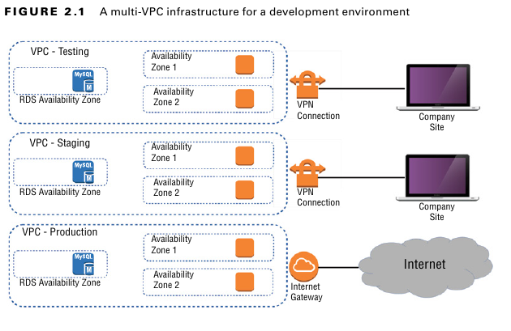*Infrastructure فيها كذا VPC عشان بيئة التطوير.*

إنك تزود `VPC` بسيطة مفهاش **NAT gateway** (ودي  بتخلي الـ instances اللي في شبكة خاصة توصل للنت) أو **VPN access** (عشان توصل شبكتك اللي على الأرض بشبكتك على AWS)، ده **مش هيكلفك أي حاجة**. هتتعلم أكتر بكتير عن كل ده في شابتر 4، "Amazon Virtual Private Cloud".

### **الـ Tenancy **

وإنت بتعمل `launch` لـ `EC2 instance`، هيبقى عندك فرصة تختار الـ **`tenancy model`**.

*   **Shared Tenancy :**
    ده الإعداد الـ `default`. في الحالة دي، الـ `instance` بتاعتك هتشتغل كـ `virtual machine` على `physical server` بيشغّل في نفس الوقت `instances` تانية. الـ `instances` التانية دي ممكن جدًا تكون ملك لعملاء AWS تانيين وبيشغلوها. طبعًا، احتمالية إن يحصل أي نوع من التفاعل الغير آمن بين الـ `instances` دي بعيدة جدًا.

*   **Dedicated Instance :**
    عشان توفي بمتطلبات قانونية معينة، ممكن الـ `instances` بتاعت شركتك تحتاج مستوى عزل زيادة. اختيار الـ `Dedicated Instance` بيضمن إن الـ `instance` بتاعتك هتشتغل على `physical server` مخصص ليك أنت بس. ده معناه إنها مش هتشارك السيرفر ده مع `resources` ملك لـ `account` بتاع عميل تاني.

*   **Dedicated Host (Host مخصوص):**
    الاختيار ده بيخليك فعلًا تحدد وتتحكم في الـ `physical server` نفسه اللي اتخصص ليك، عشان توفي بمتطلبات تراخيص أو قوانين صارمة أكتر.

| نقطة المقارنة          | Dedicated Instance                              | Dedicated Host                          |
| :--------------------- | :---------------------------------------------- | :-------------------------------------- |
| **إيه اللي بتاخده؟**   | `instance` شغالة على السيرفر  محدش بيشاركك فيه. | `physical server` كامل ليك أنت بس.      |
| **التحكم؟**            | AWS بتختارلك الجهاز، وممكن يتغير.               | أنت بتختار وتتحكم في الجهاز، وهو ثابت.  |
| **الاستخدام الأساسي؟** | عشان الـ `compliance` والأمان بس.               | عشان الـ `compliance` **وإدارة  BYOL**. |
| **الفلوس؟**            | أغلى من الـ Shared.                             | أغلى من الـ Dedicated Instance.         |

طبعًا، الـ `dedicated instances` والـ `dedicated hosts` هيكلفوك أكتر من الـ `instances` اللي بتستخدم `shared tenancy`.

تمرين 2.1 هيوريك خطوة بخطوة إزاي تعمل `launch` لـ `EC2 Linux instance` بسيطة.

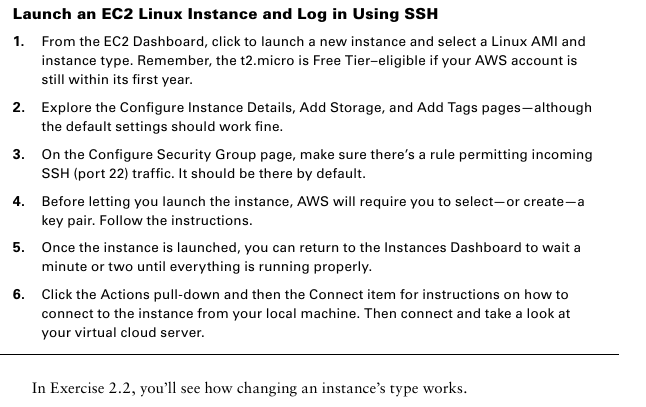

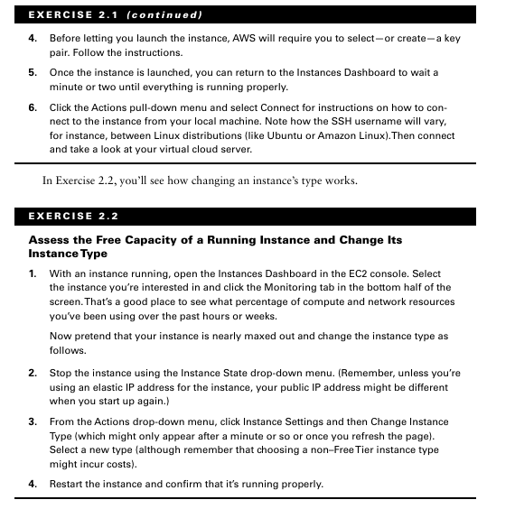

## **تظبيط سلوك الـ Instance (Configuring Instance Behavior)**

أنت تقدر تقول لـ EC2 ينفذ أوامر على الـ `instance` بتاعتك وهي بتقوم، وده عن طريق إنك تحدد حاجة اسمها **`user data`** في إعدادات الـ `instance` بتاعتك (والعملية دي أحيانًا بنسميها **bootstrapping**).

سواء بتحدد الداتا دي وإنت بتعمل الـ `instance` من الـ `console` أو بتستخدم قيمة `--user-data` في الـ AWS CLI، أنت تقدر تخلي `script` معين يشتغل ويجهز الـ `instance` بتاعتك لأي حالة أنت عايزها.

الـ `user data` ده ممكن يكون كام أمر بسيط عشان تثبت `web server` وتجهز الموقع بتاعه، أو ممكن يكون `script` معقد بيظبط الـ `instance` عشان تبقى جزء من منصة كبيرة زي Puppet Enterprise.


> [!NOTE]
>
> **طرق كتابة الـ `User Data`: الفرق بين الـ `Shell Script` والـ `Cloud-Init`**
>
> لما بتبعت `user data` لـ `EC2 instance`، فيه خدمة شغالة على الـ `instance` نفسها اسمها **`cloud-init`**. الخدمة دي هي اللي بتستقبل الداتا بتاعتك وتنفذها. `cloud-init` ذكية كفاية إنها تفهم كذا `format` مختلف، وأشهر اتنين هما:
>
> ---
>
> **الطريقة الأولى: الـ `Shell Script` العادي (The Simple Way)**
>
> دي الطريقة الأسهل والأكثر شيوعًا للمهام البسيطة.
>
> *   **شكله إيه؟** مجرد `script` عادي زي اللي بتكتبه في أي `terminal`.
>
> **مثال:**
> ```bash
> #!/bin/bash
> # Update all packages
> yum update -y
> # Install Apache web server
> yum install -y httpd
> # Start and enable the web server
> systemctl start httpd
> systemctl enable httpd
> # Create a simple index.html file
> echo "<h1>Hello from a simple Shell Script!</h1>" > /var/www/html/index.html
> ```
> **إمتى تستخدمه؟** ممتاز للمهام السريعة والمباشرة. لو كل اللي عايزه هو إنك تسطب كام `package` وتشغل كام `service`، دي أسرع طريقة.
>
> ---
>
> **الطريقة التانية: `Cloud-Init` (The Advanced & Structured Way)**
>
> دي الطريقة الاحترافية والأكثر تنظيمًا. هنا أنت مش بتكتب `script`، أنت بتكتب **ملف `configuration`** لخدمة الـ `cloud-init` نفسها، وهي اللي بتتولى التنفيذ.
>
> *   **إزاي `cloud-init` بتعرفه؟** أي `user data` بتبدأ بـ **`#cloud-config`**، `cloud-init` بيعرف إن ده ملف إعدادات ليه هو، وبيستخدم `syntax` معين (اسمه `Cloud Config Syntax` وهو شبه `YAML`).
> *   **شكله إيه؟** ملف منظم ومتقسم لأقسام، كل قسم بيعمل حاجة معينة.
>
> **مثال (بيعمل نفس اللي عمله الـ `script` اللي فوق):**
> ```yaml
> #cloud-config
> # Install packages
> packages:
>   - httpd
> 
> # Create a file
> write_files:
>   - path: /var/www/html/index.html
>     owner: root:root
>     permissions: '0644'
>     content: <h1>Hello from Cloud-Init Config!</h1>
> 
> # Run commands (e.g., to start services)
> runcmd:
>   - [ systemctl, start, httpd ]
>   - [ systemctl, enable, httpd ]
> ```
> **إمتى تستخدمه؟** ده الحل الأمثل لما تكون بتعمل `Golden Images` أو محتاج تعمل `setup` معقد. هو بيديلك تحكم أكبر بكتير في حاجات زي ..وعلى فكرة بتكون idempotent يعني لو لقى package مطلوب تثبيته ولقاها مش هيرجع يسطبه ثاني 
>
> 

> [!NOTE]
>
> الـ **`Golden Image`** هي عبارة عن `Amazon Machine Image (AMI)` أنت جهزتها بنفسك وحطيت عليها كل حاجة محتاجها عشان السيرفرات بتاعتك تشتغل.
>
> **بدل ما كل مرة تقوم `EC2 instance` جديدة:**
> 1.  تبدأ بـ `Ubuntu` أو `Amazon Linux` فاضي.
> 2.  تشغل `user data script` طويل يقعد 10 دقايق عشان:
>     *   يعمل `update` للسيستم.
>     *   يسطب الـ `web server` (زي `Apache` أو `Nginx`).
>     *   يسطب `agent` بتاع الـ `monitoring` (زي `DataDog` أو `New Relic`).
>     *   يسطب `agent` بتاع الـ `security`.
>     *   يظبط إعدادات الـ `firewall`.
>     *   ينزل كود الـ `application` بتاعك.
>
> **الحل الأفضل هو إنك تعمل `Golden Image`:**
>
> 1.  **مرة واحدة بس،** بتقوم `EC2 instance` فاضية.
> 2.  بتدخل عليها وتعمل كل الخطوات اللي فوق دي **بإيدك أو بـ `script`**.
> 3.  بعد ما تخلص وتتأكد إن كل حاجة تمام، بتروح لـ `AWS` وتقولها: **"خدي `snapshot`  من الهارد ديسك بتاع الـ `instance` دي، واعمليلي منها `AMI` جديدة خاصة بيا"**.
> 4.  الـ `AMI` الجديدة دي هي الـ **`Golden Image`** بتاعتك.
>
> **إيه الفايدة؟**
> بعد كده، لما الـ `Auto Scaling Group` بتاعك يحب يقوم سيرفر جديد، بدل ما يبدأ بـ `AMI` فاضي ويقعد 10 دقايق يجهز نفسه، هيبدأ بالـ `Golden Image` بتاعتك. السيرفر هيقوم في دقيقة واحدة وهو عليه **كل حاجة متسطبة وجاهزة**، ويمكن كل اللي محتاجه `user data script` بسيط جدًا عشان ياخد آخر `version` من الكود بتاعك من `Git` ويشغله.
>
> عشان تعمل الـ `Golden Images` دي بشكل أوتوماتيكي، الناس بتستخدم أدوات زي **`Packer`** (من شركة `HashiCorp` برضه).
> 


### **الـ Placement Groups**

بشكل افتراضي، AWS بتحاول توزع الـ `instances` بتاعتك على الـ `infrastructure` بتاعتها عشان تديك أحسن أداء لمعظم حالات الاستخدام. بس ممكن الشغل بتاعك يبقى محتاج ترتيب مختلف. الـ **`Placement Groups`** بتديلك القوة إنك تحدد ترتيبات غير عادية عشان تناسب احتياجاتك. حاليًا، في تلات أنواع منهم:

*   **Cluster groups:**
    دي زي ما تكون بتقول لـ AWS: **"حطلي كل الـ instances دي جنب بعض في نفس الأوضة ولزقهم في بعض"**. كل `instance` في المجموعة دي بتشتغل في نفس الـ `availability zone` وقريبة جدًا من التانية في المكان. ده بيديلك `low-latency network` (يعني سرعة اتصال عالية جدًا بينهم) ومفيد في حاجات زي الـ `high-performance computing (HPC)`.
*   مثال :  بناء بيئة `High-Performance Computing (HPC)` سريعة جدًا، كل السيرفرات فيها بتكلم بعض بأقل `latency` ممكن فلازم تخليم جمب بعض فى نفس `availability zone`

```terraform
resource "aws_vpc" "hpc_vpc" {
  cidr_block = "10.10.0.0/16"

}

resource "aws_subnet" "hpc_subnet" {
  vpc_id            = aws_vpc.hpc_vpc.id
  cidr_block        = "10.10.1.0/24"
  availability_zone = "us-west-2a"

}

resource "aws_security_group" "hpc_sg" {
  name   = "hpc-sg"
  vpc_id = aws_vpc.hpc_vpc.id

  ingress {
    from_port = 0
    to_port   = 0
    protocol  = "-1"
    self      = true
  }

  egress {
    from_port   = 0
    to_port     = 0
    protocol    = "-1"
    cidr_blocks = ["0.0.0.0/0"]
  }
}
# بكده هنخليهم جمب بعض قدر الامكان
resource "aws_placement_group" "hpc_cluster_pg" {
  name     = "my-hpc-cluster"
  strategy = "cluster"
}

resource "aws_instance" "hpc_node_1" {
  ami                    = "ami-0c55b159cbfafe1f0"
  instance_type          = "c5n.large"
  subnet_id              = aws_subnet.hpc_subnet.id
  vpc_security_group_ids = [aws_security_group.hpc_sg.id]
  placement_group        = aws_placement_group.hpc_cluster_pg.id # <==

}

resource "aws_instance" "hpc_node_2" {
  ami                    = "ami-0c55b159cbfafe1f0"
  instance_type          = "c5n.large"
  subnet_id              = aws_subnet.hpc_subnet.id
  vpc_security_group_ids = [aws_security_group.hpc_sg.id]
  placement_group        = aws_placement_group.hpc_cluster_pg.id
}
```

*   **Spread groups:**
    دي العكس تمامًا. بتقول لـ AWS: **"ابعدلي الـ instances دي عن بعض على قد ما تقدر. حط كل واحدة على جهاز (`rack`) مختلف تمامًا"**. ده بيقلل خطر إن عطل واحد في جهاز يوقع كذا `instance` في نفس الوقت. ده مهم أوي لما تكون مشغل حاجات حساسة مش بتستحمل إن كذا حاجة تقع مع بعض. (لو ليك في VMware، دي شبه الـ DRS).
*   مثال: بناء `web application` عنده `high availability`. لو جهاز (`rack`) وقع، `instance` واحدة بس هي اللي تتأثر، مش الاتنين.

```terraform


# 1. تعريف الـ Provider
provider "aws" {
  region = "us-west-2"
}


resource "aws_vpc" "spread_vpc" {
  cidr_block = "10.20.0.0/16"
  tags       = { Name = "spread-vpc" }
}


resource "aws_subnet" "spread_subnet_a" {
  vpc_id            = aws_vpc.spread_vpc.id
  cidr_block        = "10.20.1.0/24"
  availability_zone = "us-west-2a" 
  tags              = { Name = "spread-subnet-a" }
}


resource "aws_security_group" "spread_sg" {
  name   = "spread-sg"
  vpc_id = aws_vpc.spread_vpc.id
  ingress {
    from_port   = 80
    to_port     = 80
    protocol    = "tcp"
    cidr_blocks = ["0.0.0.0/0"]
  }
  egress {
    from_port   = 0
    to_port     = 0
    protocol    = "-1"
    cidr_blocks = ["0.0.0.0/0"]
  }
}

resource "aws_placement_group" "app_spread_pg" {
  name     = "my-critical-app-spread"
  strategy = "spread"
}


data "aws_ami" "amazon_linux_2" {
  most_recent = true
  owners      = ["amazon"]
  filter {
    name   = "name"
    values = ["amzn2-ami-hvm-*-x86_64-gp2"]
  }
}


resource "aws_instance" "web_server_1" {
  ami           = data.aws_ami.amazon_linux_2.id
  instance_type = "t3.medium"

  subnet_id     = aws_subnet.spread_subnet_a.id
  
  vpc_security_group_ids = [aws_security_group.spread_sg.id]

  placement_group        = aws_placement_group.app_spread_pg.id
  
  tags = { Name = "web-server-1 (in spread group)" }
}


resource "aws_instance" "web_server_2" {
  ami           = data.aws_ami.amazon_linux_2.id
  instance_type = "t3.medium"

  subnet_id     = aws_subnet.spread_subnet_a.id

  vpc_security_group_ids = [aws_security_group.spread_sg.id]

  placement_group        = aws_placement_group.app_spread_pg.id
  
  tags = { Name = "web-server-2 (in spread group)" }
}
```


*   **Partition groups:**
    دي حل وسط بين الاتنين اللي فاتوا. تخيلها زي ما تكون بتقول لـ AWS: **"أنا عندي مجموعات (partitions). كل مجموعة حطها على جهاز لوحدها، بس الـ instances اللي جوه نفس المجموعة ممكن يبقوا جنب بعض"**. يعني الـ `instances` اللي في `partition` واحدة بيبقوا معزولين عن الـ `instances` اللي في أي `partition` تانية. ده مختلف عن الـ `spread groups` اللي فيها مفيش أي اتنين `instances` ممكن يبقوا على نفس الجهاز أبدًا.
    
    

```terraform
resource "aws_vpc" "partition_vpc" {
  cidr_block = "10.30.0.0/16"
  tags = { Name = "partition-vpc" }
}

resource "aws_subnet" "partition_subnet" {
  vpc_id     = aws_vpc.partition_vpc.id
  cidr_block = "10.30.1.0/24"
  tags = { Name = "partition-subnet" }
}

resource "aws_security_group" "partition_sg" {
  name   = "partition-sg"
  vpc_id = aws_vpc.partition_vpc.id
  ingress {
    from_port = 0
    to_port   = 0
    protocol  = "-1"
    self      = true
  }
  egress {
    from_port   = 0
    to_port     = 0
    protocol    = "-1"
    cidr_blocks = ["0.0.0.0/0"]
  }
}


resource "aws_placement_group" "kafka_partition_pg" {
  name             = "my-kafka-partitions"
  strategy         = "partition"
  partition_count  = 3 
}


resource "aws_instance" "kafka_node_1" {
  ami           = "ami-0c55b159cbfafe1f0"
  instance_type = "i3.large"  

  subnet_id              = aws_subnet.partition_subnet.id
  vpc_security_group_ids = [aws_security_group.partition_sg.id]
  placement_group        = aws_placement_group.kafka_partition_pg.id

  # partition                = 1 
# تقدر تحدد بنفسك او هو هيوزع بنفسه 
# 1,2,3,1,2,3,1,2,3
# هيفضل ماشي كده
  tags = { Name = "kafka-node-1" }
}

resource "aws_instance" "kafka_node_2" {
  ami           = "ami-0c55b159cbfafe1f0"
  instance_type = "i3.large"
  subnet_id     = aws_subnet.partition_subnet.id
  vpc_security_group_ids = [aws_security_group.partition_sg.id]
  placement_group        = aws_placement_group.kafka_partition_pg.id
  tags = { Name = "kafka-node-2" }
}

resource "aws_instance" "kafka_node_3" {
  ami           = "ami-0c55b159cbfafe1f0"
  instance_type = "i3.large"
  subnet_id     = aws_subnet.partition_subnet.id
  vpc_security_group_ids = [aws_security_group.partition_sg.id]
  placement_group        = aws_placement_group.kafka_partition_pg.id
  tags = { Name = "kafka-node-3" }
}
```

## **تسعير الـ Instances**

أنت ممكن تشتري استخدام الـ `EC2 instances` بواحدة من تلات طرق.

### **1. الـ On-Demand Model**

للشغل اللي هيفضل شغال على طول بس متوقع يشتغل أقل من 12 شهر، أنت في العادي بتدفع لكل ساعة الـ `instance` بتاعتك شغالة فيها. الـ `On-demand` ده أكتر طريقة مرنة، لأنك بتقدر تتحكم كويس أوي في اللي بتدفعه بإنك توقف وتشغل الـ `instances` حسب احتياجك. بس في المقابل، سعر الساعة فيه هو الأغلى.

### **2. الـ Reserve Instance**

لو مخطط إنك تسيب السيرفرات شغالة 24 ساعة في اليوم لمدة أكتر من سنة، هتاخد خصم كبير أوي لو اشتريت **reserve instance** — وده بيبقى التزام منك لمدة سنة أو تلات سنين. ممكن تدفع تمن المدة كلها مقدم، أو تدفع جزء مقدم والباقي أقساط شهرية، أو تدفع كله أقساط شهرية (والسعر بيزيد شوية كل ما بتقلل المقدم). جدول 2.2 بيديلك فكرة عن إزاي الأسعار بتتغير بين الطريقتين.

**جدول 2.2: مقارنة تقديرية بين أسعار الـ On-demand والـ Reserve**
*(الأسعار دي مجرد مثال)*

| نوع الـ Instance | طريقة التسعير         | التكلفة/ساعة | التكلفة/سنة       |
| :--------------- | :-------------------- | :----------- | :---------------- |
| t2.micro         | On-demand             | 0.0116 دولار | 102.00 دولار      |
| t2.micro         | Reserve (لمدة 3 سنين) |              | **38.33 دولار**   |
| g3.4xlarge       | On-demand             | 1.14 دولار   | 9986.40 دولار     |
| g3.4xlarge       | Reserve (لمدة 3 سنين) |              | **4429.66 دولار** |


### **الـ Spot Market؟**

أمازون عندها عدد مهول من السيرفرات. في أي وقت، في جزء من السيرفرات دي بيبقى فاضي ومحدش بيستخدمه. بدل ما تسيبها مركونة، أمازون بتعرض السيرفرات الفاضية دي في سوق اسمه **Spot Market** بخصم كبير جدًا، ممكن يوصل لـ 90% من سعرها الأصلي (`On-Demand`).

### **إزاي بيشتغل؟**

1.  **أنت بتحدد سعرك:** بتدخل على AWS وتقول: "أنا عايز `instance` نوعها كذا، وأقصى سعر ممكن أدفعه في الساعة هو "1" دولار مثلا يعني". السعر ده هو الحد الأقصى بتاعك.

2.  **AWS بتقارن الأسعار:**
    *   بتبص على السعر الحالي للـ `Spot instance` دي في السوق (وده سعر بيتغير كل شوية حسب العرض والطلب).
    *   لو سعر السوق **أقل من** سعرك الأقصى، AWS بتشغلك الـ `instance` فورًا. وهتحاسبك على سعر السوق الرخيص، مش على سعرك الأقصى.
    *   لو سعر السوق **أعلى من** سعرك الأقصى، مش هيشتغل حاجة وهتفضل مستني.

3.  **إيه اللي بيحصل والـ `Instance` شغالة؟**
    *   الـ `instance` بتاعتك هتفضل شغالة طول ما سعر السوق أقل من الحد الأقصى اللي أنت حاطه.
    *   **اللحظة الحاسمة:** لو الطلب على النوع ده من السيرفرات زاد فجأة، وسعر السوق علي وبقى **أعلى من** الحد الأقصى بتاعك، أمازون هتاخد منك الـ `instance`. هتبعتلك تحذير قبلها بدقيقتين، وبعدها الـ `instance` هتتقفل وتتشال.

### **مين بيستخدمه؟**

الـ `Spot instances` دي مش لأي شغل. هي مناسبة جدًا للـ `workloads` اللي مش هيحصلها كارثة لو وقفت فجأة. زي مثلاً:

*   تحليل كميات كبيرة من big data.
*   شغل الـ `rendering` بتاع الجرافيكس والفيديوهات.
*   الأبحاث العلمية اللي محتاجة قوة معالجة  كبيرة.
*   أي شغل ممكن يتقسم على كذا سيرفر، ولو واحد وقع الباقي يكمل عادي.

في الغالب بيبقى منطقي إنك تخلط بين أكتر من طريقة تسعير في نفس الـ `infrastructure`. مثلاً، محل أونلاين ممكن يشتري واحدة أو اتنين `reserve instances` عشان يغطي الطلب العادي بتاع العملاء، بس في نفس الوقت يسمح للـ `autoscaling` إنه يشغل `on-demand instances` أوتوماتيك في فترات الضغط العالي غير المتوقع.

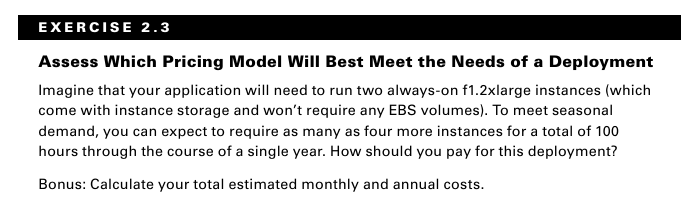

## **دورة حياة الـ Instance (Instance Lifecycle)**

، الـ `EC2 instance` اللي شغالة دي ممكن تتعامل معاها بكذا طريقة. لو عملتلها **Terminate**، فانت كدة بتمسحها خالص وبترجع الـ `resources` بتاعتها لـ AWS عشان أي حد تاني يستخدمها.

لكن لو انت مش محتاجها دلوقتي بس مش عايز تمسحها، ممكن توفّر فلوس بأنك تعملها **Stop** بس. ولما تحتاجها تاني ترجع تعملها **Start**. في الحالة دي، الداتا اللي على الـ `EBS volume` بتاعها مش بتتمسح، بس خلي بالك ده مش بيحصل مع الـ `instance store volume` عشان ده تخزين مؤقت.

لازم تبقى عارف إن الـ `instance` اللي بتعملها `Stop` دي، لو كانت واخدة `public IP` عادي، غالبًا هتاخد IP جديد لما تعملها `Start` تاني. لو عايز IP ثابت ميتغيرش، لازم تحجزلها `Elastic IP` وتربطه بيها.

الـ `Security Group` بتاعت الـ `instance` تقدر تعدل فيها وتغير الصلاحيات في أي وقت حتى والـ `instance` شغالة. وتقدر كمان تغير نوعها (`Instance Type`) عشان تزود أو تقلل الـ `resources` بتاعتها (زي البروسيسور والرامات)، بس عشان تعمل كدة لازم الأول توقف الـ `instance`، وبعدين تغير نوعها، وبعدين تشغلها تاني.

> [!WARNING]
>
> لما بتعمل `terminate` للـ `instance`، في معظم الحالات ده بيمسح كل الداتا اللي على الـ `primary storage` (الهارد الأساسي) بتاعها.
>
> **إلا في حالة واحدة بس:** لو كان الهارد ده من نوع `Elastic Block Store (EBS)` وأنت كنت ظابطه إنه **يفضل موجود** حتى بعد ما الـ `instance` بتاعته تتمسح.
>
> بمعنى تاني، وإنت بتعمل الـ `instance`، في `option` اسمه `Delete on Termination`. لو شلت علامة الصح من عليه، الـ `EBS volume` ده هيفضل موجود وتقدر توصله بـ `instance` تانية بعدين.
>
> خلي باللك instance volume لو عملت stop كل حاجة بتطير  واساسا Instance volume بيكون طبقا لنوع ec2 وتغير حجمه مش بيحصل منك دا يعتمد على نوع ec2 و لسه هنكلم عنه
> Instance volume لو كان هو root block متقدرش تعمل منه snap shot للـ ami 
>
> 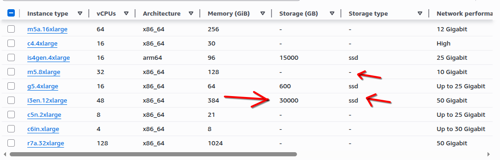

عشان تمنع انك لما تمسح ec2 تمسح root block والمقصود بيه انه هو storage المسؤال عن تخزين os وينفع يبقى نوعين بس EBS او Instance storage هنتكلم فى الفصل ده عن ebs بأنواع ولكن مش هنخش بتفصيل تخص storage  زي التشفير بس خلي بللك الانواع اللي مفيهاش storage type زي اللي فوق كده هيتنشاء ليه ebs بشكل تلقائي انما لم يكون فى instance volume هيكون هو root وخلي بالك instnace volume هي اسرع storage ممكن تتوصل بيه ec2 مفيش اسرع من كده بس لم بتقف ec2 بتخسر كل اللي يه هنتكلم لسه عنه بالتفصيل

```terraform
resource "aws_instance" "ssh_server" {
 # ....
  root_block_device {

    delete_on_termination = false


    volume_size = 20      
    volume_type = "gp3"   
    encrypted   = true  
  }

# ....
}
```

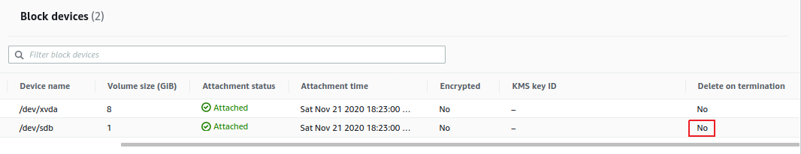


---

## **الـ Resource Tags **

لما بتبدأ تشتغل على AWS، وكل شوية بتعمل **`deploy`** للـ **`resources`**  أكتر وأكتر على الـ **`account`** بتاعك، الدنيا ممكن تبدأ تتلخبط منك. تخيل كده إنك عندك عدد كبير من الـ **`EC2 instances`** ، ومع كل سيرفر ليه الـ **`storage volumes`**  بتاعته، والـ **`security groups`**  والـ **`elastic IPs`** . كل ده بقى متوزع على أكتر من **`VPC`** . لو مفيش نظام، هتتوه وتنسى كل حاجة تبع إيه.

عشان تسيطر على الفوضى دي، لازم تلاقي طريقة سهلة ومترتبة تعرف بيها كل **`resource`** عندك. يعني تعرف ده بتاع إيه، وبيعمل إيه، وتبع أي مشروع، وإيه علاقته بالـ **`resources`** التانية.

**أحسن وأذكى طريقة تعمل بيها كده هي إنك تعمل "نظام تسمية ثابت" وتطبقه على كل حاجة عندك، النظام ده بنسميه الـ "Tags".**

الـ **`AWS resource tags`** دي تقدر تستخدمها عشان تحط "label"  على أي حاجة هتلمسها في الـ **`account`** بتاعك. مش بس للـ EC2، لأ، لأي خدمة تقريباً في AWS. الـ **`Tag`** ده بيكون ليه جزئين أساسيين:

1.  **`Key` :** ده زي "اسم التصنيف". بيكون كلمة عامة بتوصف الفئة.
2.  **`Value` :** دي بقى "القيمة المحددة" للتصنيف ده. يعني بتديله تفصيلة أكتر.

**مثال عشان نفهم أكتر:**

تخيل إنك عندك سيرفرات، وعايز تعلم على السيرفرات بتاعت Production لوحدها، والسيرفرات بتاعت Test لوحدها.

*   ممكن تعمل **`tag`** الـ **`key`** بتاعه اسمه مثلاً: **`Environment`**.
    *   وكل الـ **`resources`** اللي ليها علاقة ببيئة الـ **`production`** بتاعتك، هتديها الـ **`Value`** دي: **`Production`**.
    *   وكل الـ **`resources`** اللي ليها علاقة ببيئة الـ **`testing`**، هتديها الـ **`Value`** دي: **`Test`**.

يبقى كده الـ **`Tag`** هيكون شكله: **`Environment: Production`** أو **`Environment: Test`**.

**مثال تاني:**

الكتاب استخدم الـ `Key` اللي اسمه **`production-server`** عشان يعلم على كل حاجة ليها علاقة بـ "سيرفرات production". وده استخدام وارد.

*   الـ **`instances`** نفسها ممكن تاخد الـ `Key` ده **`production-server`**، والـ **`Value`** بتاعها يكون اسم السيرفر جوه Environment دي، زي **`server1`** و **`server2`** وهكذا.
    *   يبقى شكل الـ Tag: **`production-server: server1`**
    *   أو: **`production-server: server2`**

*   الـ **`security group`** بتاعت السيرفرات دي، ممكن تاخد نفس الـ **`Key`** اللي هو **`production-server`**، بس الـ **`Value`** بتاعها يكون بيوصفها هي، زي **`security-group1`**.
    *   يبقى شكل الـ Tag: **`production-server: security-group1`**

**الجدول اللي في الكتاب بيوضح إزاي نظام التسمية ده ممكن يشتغل على `deployment` أكبر شوية وفيه أكتر من بيئة (Production, Staging, Test):**

| الـ `Key`               | الـ `Value`       |                                                   |
| :---------------------- | :---------------- | :------------------------------------------------ |
| **`production-server`** | `server1`         | ده سيرفر رقم 1 في بيئة الـ Production.            |
| **`production-server`** | `server2`         | ده سيرفر رقم 2 في بيئة الـ Production.            |
| **`production-server`** | `security-group1` | دي الـ Security Group رقم 1 لبيئة الـ Production. |
| **`staging-server`**    | `server1`         | ده سيرفر رقم 1 في بيئة الـ Staging .              |
| **`staging-server`**    | `server2`         | ده سيرفر رقم 2 في بيئة الـ Staging.               |
| **`staging-server`**    | `security-group1` | دي الـ Security Group رقم 1 لبيئة الـ Staging.    |
| **`test-server`**       | `server1`         | ده سيرفر رقم 1 في بيئة الـ Test                   |
| **`test-server`**       | `security-group1` | دي الـ Security Group رقم 1 لبيئة الـ Test.       |

**ملاحظة على الأمثلة دي:** المثال اللي في الكتاب استخدم "production-server" كـ Key، وده ممكن يكون دقيق لبعض الناس. لكن كـ Best Practice، يفضل إن الـ Keys تكون "عامة" أكتر زي `Environment`، `Project`، `Application`، وهكذا. وتبقى الـ Values هي اللي محددة (مثلاً: `Environment: Production`, `Project: Alpha`, `Application: WebApp`). ده بيخلي الـ Tags قابلة إنها تتفلتر وتتجمع بطرق أكتر.

****

لما بتطبق الـ **`Tags`** صح على الـ **`resources`** بتاعتك، ده بيعمل كذا حاجة مهمة:

*   تبقى شايف بوضوح كل resources تبع إيه بالظبط، وده بيقلل حيرة "السيرفر ده بتاع مين؟" أو "الـ Security Group دي تبع أي مشروع؟".
*   **بEasier Management:** لما تحتاج تعمل أي عملية على مجموعة موارد معينة (زي مثلاً توقف كل سيرفرات الـ `test`)، تقدر تدور عليها بالـ **`Tags`** بتاعتها وتطبق الأمر مرة واحدة.
*   **Cost Control & Billing:** دي نقطة جوهرية جداً. AWS بتسمحلك تعمل **Cost Allocation Tags** (Tags لتوزيع التكاليف). يعني ممكن تخلي فاتورتك تفصلك التكاليف بناءً على الـ Tags. مثلاً، تشوف مشروع `X` كلفك كام الشهر ده، أو بيئة الـ `production` كلفت كام، ده بيساعدك تتحكم في الميزانية وتعرف مين بيصرف إيه بالظبط.
*   **Avoid Expensive Mistakes:** لما تكون فاهم كل `resource` بتاع إيه، بتقلل فرصة إنك تمسح حاجة بالغلط تبع مشروع مهم، أو إنك تسيب حاجة شغالة من غير ما تكون عارفها وتصرف عليها فلوس زيادة.

**إزاي الـ `Tags` بتتحط في Terraform؟ **

في Terraform، لما بتيجي تعمل `resource` زي الـ `aws_instance`، بتضيف بلوك اسمه `tags` جواه:

```terraform
resource "aws_instance" "my_server" {
  tags = {
    Name   = "Server-With-Persistent-Disk"
    "production-server" = "server1"                
  }
}
```

في المثال ده:
*   **`Name = "Server-With-Persistent-Disk"`:** ده `Tag` الـ `Key` بتاعه اسمه `Name` والـ `Value` بتاعته `Server-With-Persistent-Disk`. ده بيظهر في كونسول AWS كـ "الاسم" بتاع الـ Instance، وده مفيد جداً.
*   **`"production-server" = "server1"`:** ده الـ `Tag` اللي شفناه في الجدول. الـ `Key` هو `"production-server"` والـ `Value` هي `"server1"`.


## **Service Limits**

بشكل افتراضي، كل `AWS account` بيبقى ليه حدود على عدد الـ `instances` اللي تقدر تشغلها من خدمة معينة. أحيانًا الحدود دي بتبقى على مستوى **`region` واحدة** جوه الـ `account`، وأحيانًا تانية بتبقى حدود **عالمية** (`global`) على الـ `account` كله.

**كمثال:**

*   مسموحلك تعمل **5 VPCs بس لكل `region`**.
*   ومسموحلك تعمل **5,000 SSH key pair بس على مستوى الـ `account` كله**.

لو احتجت، ممكن تطلب من AWS إنها ترفعلك الحد الأقصى ده لخدمة معينة.

لو عايز تعرف تفاصيل محدّثة عن حدود كل خدمات AWS، هتلاقيها على اللينك ده:
`docs.aws.amazon.com/general/latest/gr/aws_service_limits.html`


## **الـ Storage Volumes بتاعة الـ EC2**

الـ `Storage drives` (أو `volumes` زي ما AWS بتسميها) دي في الغالب بتبقى مساحات `virtual` متقطعة من `physical drives` أكبر. بس بالنسبة للـ `OS` اللي شغال على الـ `instance` بتاعتك، كل الـ `volumes` دي بتظهرله كأنها بالظبط `physical drives` عادية. بس في الحقيقة في أكتر من نوع `volume` في AWS، ومهم أوي تفهم كل نوع شغال إزاي.

### **الـ Elastic Block Store (EBS) Volumes**

أنت ممكن mount أي عدد من الـ `EBS volumes` على الـ `instance` بتاعتك زي ما أنت عايز (بس خلي بالك، الـ `volume` الواحد مينفعش يتعمله mount على أكتر من `instance` واحدة في نفس الوقت) وتستخدمهم بالظبط زي ما بتستخدم أي هارد ديسك عادي. وزي الهاردات العادية، النوع اللي هتختاره هيأثر على الأداء والتكلفة.

AWS بتضمنلك الـ `reliability` بتاعت الداتا اللي بتخزنها على الـ `EBS` (بتوعدك بـ 99.99% `availability` على الأقل)، فمتشلش هم إن الداتا تضيع. لما `EBS drive` بيعطل، الداتا بتاعته بتبقى متاخد منها نسخة أصلاً وغالبًا بترجع تشتغل تاني قبل ما حد ياخد باله من المشكلة. فعمليًا، الحاجة الوحيدة اللي المفروض تقلقك هي إزاي هتوصل للداتا بتاعتك بسرعة وكفاءة.

حالياً في أربع أنواع `EBS`، اتنين بيستخدموا تكنولوجيا الـ **SSD** السريعة، واتنين بيستخدموا الـ **HDD** القديمة الأبطأ. أداء كل نوع بيتقاس بأقصى **IOPS/volume** (والـ IOPS دي معناها عدد عمليات القراءة والكتابة في الثانية).

#### **1. EBS-Provisioned IOPS SSD**
لو الـ `applications` بتاعتك محتاجة معدل `I/O` (عمليات قراءة وكتابة) عنيف جدًا، يبقى لازم تفكر في النوع ده. ده بيديلك أعلى أداء ممكن يوصل لـ **64,000 IOPS**. بس طبعًا ده أغلى نوع.

- بتستخدم gp2 (الجيل القديم) أو gp3 (الجيل الأحدث والأفضل).

  

#### **2. EBS General-Purpose SSD**
لمعظم شغل السيرفرات العادي اللي محتاج أداء سريع وتأخير قليل (`low-latency`)، النوع ده هيبقى تمام وزي الفل. بيديلك لحد **16,000 IOPS**. ده الاختيار اللي معظم الناس بتستخدمه.

- بتستخدم io1 أو io2.
- بس هنا تحديد لازم تحجز `iops = --`

#### **3. Throughput-Optimized HDD**
النوع ده بيوفرلك في التكلفة وبيديلك أداء مقبول لو شغلك بيعتمد على نقل كميات داتا كبيرة مرة واحدة (`throughput-intensive`)، زي تحليل الـ `logs` أو عمليات الـ `big data`. هو مش سريع في العمليات الصغيرة الكتير (آخره **500 IOPS**)، بس شاطر في نقل الملفات الكبيرة.

- بتستخدم **st1**.

#### **4. Cold HDD**
لما تكون بتتعامل مع كميات داتا كبيرة بس نادرًا لما بتحتاج توصلها، النوع ده ممكن يكون مناسب ليك. أداؤه قليل (**250 IOPS**)، بس في المقابل هو أرخص نوع فيهم خالص.

- **sc1**


**جدول 2.4: مقارنة بين أنواع الـ EBS الأربعة الجدول دا مش ثابت دا مجرد مثال بيوضح**

| النوع                        | حجم الـ Volume | IOPS   | Throughput (MB/s) | السعر (شهريًا)  *كمثال*  |
| :--------------------------- | :------------- | :----- | :---------------- | :---------------------- |
| **Provisioned IOPS SSD**     | 4 GB 16 TB     | 64,000 | 1,000             | $0.125/GB + $0.065/IOPS |
| **General-Purpose SSD**      | 1 GB  16 TB    | 16,000 | 250               | $0.10/GB                |
| **Throughput-Optimized HDD** | 500 GB 16 TB   | 500    | 500               | $0.045/GB               |
| **Cold HDD**                 | 500 GB 16 TB   | 250    | 250               | $0.025/GB               |

---

**مميزات الـ EBS Volume**

*   **الـ Snapshots (الباك أب):** كل أنواع الـ `EBS` ممكن تاخد منها نسخة عن طريق إنك تعمل `snapshot`. والـ `snapshots` دي ممكن تستخدمها عشان تعمل `volumes` تانية جديدة، أو تشاركها مع ناس تانية، أو تحولها لـ `images` عشان تعمل منها `AMI` متقلقش هتشوفه ازاي بيحصل قدام عندنا شابتر كامل عن storage متقدرش تعمل ده مع instance volume بشكل مباشر

دا مثال طبقت فيه كل انواع ebs على فكرة الاحجام ليه minimum  لازم تلتزم بيه 
/aws/assets/image-20250725223153633.png)

* **التشفير (Encryption):** الـ `EEBS volumes` ممكن تتشفر عشان تحمي الداتا بتاعتك وهي متخزنة أو وهي بتتنقل. AWS ممكن تدير مفاتيح التشفير دي بنفسها، أو تستخدم مفاتيح أنت اللي بتديها لها عن طريق خدمة **AWS Key Management Service (KMS)**.
* > [!IMPORTANT]
  >
  > انا عملت مثال ازاي تعمل ami 
  >
  > اللي أنا عملته في المثال ده هو إني جبت `AMI` عادية من أمازون وعملت بيها `EC2 instance`، وبعدين دخلت على الـ `instance` دي وظبطتها ونزلت عليها `web server`.
  >
  > أخدت `AMI` كاملة من الـ `instance` دي وهي متظبطة، وبقت هي دي الـ "Golden AMI" بتاعتي
  >
  > في الآخر، عملت `EC2 instance` تانية جديدة، بس المرة دي استخدمت الـ `Golden AMI` اللي أنا لسة عاملها، فالـ `instance` الجديدة قامت وهي عليها الويب سيرفر وكل حاجة جاهزة من أول ثانية.
  >
  > خد بالك إن دي مش أحسن طريقة للشغل الحقيقي، هي بس مثال عشان نفهم الفكرة. وكمان، الطريقة دي مينفعش تتعمل لو كانت الـ `instance` معمولة بـ `instance volume`، كان لازم الهارد بتاعها يكون `EBS` عشان أعرف أعمل منها `AMI` 
  >
  > معظم او كل ec2 أللي موجودة فيه instance volume بيكون بره free tier 

  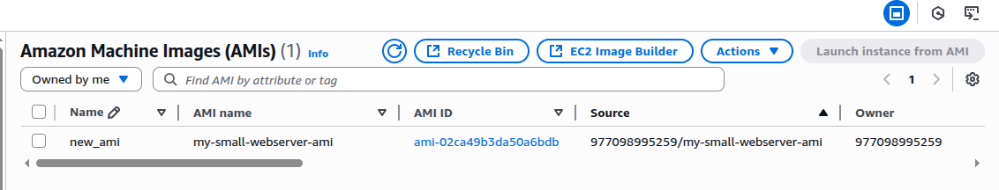

---

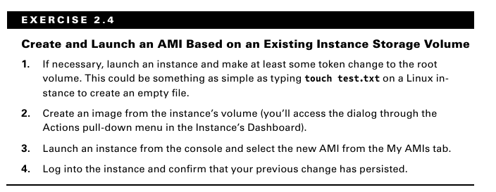


### **الـ Instance Store Volumes **

على عكس الـ `EBS volumes`، الـ `instance store volumes` دي **مؤقتة (`ephemeral`)**. وده معناه إن لما الـ `instance` اللي هي متركبة عليها بتتقفل، الداتا بتاعتها **بتضيع للأبد**.

**طب ليه ممكن حد يستخدمها أصلاً بدل الـ EBS؟**

*   **السرعة:**
    الـ `Instance store volumes` دي عبارة عن هاردات `SSD` متركبة **جوه السيرفر الـ `physical` نفسه** اللي الـ `instance` بتاعتك شغالة عليه، ومتوصلة عن طريق واجهة `NVMe` سريعة جدًا.

*   **ببلاش:**
    استخدام الـ `instance store volumes` بيبقى داخل في تمن الـ `instance` نفسها، مش بتدفع عليه فلوس زيادة.

*   **مناسبة للشغل المؤقت:**
    الـ `Instance store` بتبقى ممتازة في الموديلات اللي الـ `instances` فيها بتشتغل عشان تعمل مهمة قصيرة وتروح لحالها (زي في الـ `autoscaling groups` مثلاً). بتجيب الداتا بتاعتها من بره، تعمل شغلها، وفي الآخر بتترمى ومحدش بيزعل عليها.

حجم instance volume  بيعتمد على **نوع الـ `instance`** اللي بتختاره. ودي نقطة مهمة لازم تاخدها في اعتبارك وإنت بتخطط للشغل بتاعك.

وحتى مع كل مميزات الـ `EBS` والـ `Instance Store`، مهم تبقى عارف إن في حالات بيبقى أحسنلك بكتير إنك تخلي الداتا الكبيرة **بره الـ EC2 خالص**. في حالات استخدام كتير، خدمة **Amazon S3** ممكن تبقى طريقة أرخص بكتير جدًا عشان تخزن ملفات أو حتى `databases`، وفي نفس الوقت بتبقى متاحة فورًا لعمليات ال-`compute`. (هنتعلم أكتر عن ده في شابتر 3).

**الزتونة:**

*   **الـ EBS Volumes:** هي غالبًا الاختيار الصح للـ `instances` اللي الداتا بتاعتها **لازم تفضل موجودة** بعد الـ `reboot`.
*   **الـ Instance Store Volumes:** بتبقى مفيدة (لو متاحة) للعمليات اللي محتاجة وصول سريع جدًا (`low-latency`) لكميات داتا كبيرة **مش مهم إنها تفضل موجودة** لو حصل عطل أو `reboot`.
*   **التخزين بره الـ EC2 (زي S3):** بيبقى حل كويس لما تكون مش محتاج سرعات قراءة وكتابة خرافية، بس عايز تستمتع بالمرونة والتوفير بتاع S3.

## **إزاي توصل للـ EC2 Instance بتاعتك**

زي أي جهاز على شبكة، الـ `EC2 instances` بتتعرف بـ `IP addresses` مميزة. كل `instance` بتاخد على الأقل **`private IPv4 address`** واحد، واللي بشكل افتراضي بيبقى من ضمن النطاقات اللي في جدول 2.5.

**جدول 2.5: نطاقات الـ IP المستخدمة في الشبكات الخاصة (Private Networks)**

| من          | إلى             |
| :---------- | :-------------- |
| 10.0.0.0    | 10.255.255.255  |
| 172.16.0.0  | 172.31.255.255  |
| 192.168.0.0 | 192.168.255.255 |

لما بتعمل `EC2 instance` جديد على AWS، هو في الأول بيبقى زي جهاز كمبيوتر مقفول عليه جوه شبكة داخلية خاصة بيك، وبيبقى معاه `private IP address` بس عشان الأجهزة اللي معاه في نفس الشبكة دي تعرف تكلمه. في الوضع ده، السيرفر بيبقى معزول تمامًا، يعني لا هو بيعرف يوصل للإنترنت ولا الإنترنت بيعرف يوصله، وده طبعًا عشان الأمان.

بس في الغالب أنت بتبقى محتاج السيرفر ده يتصل بالإنترنت عشان تنزل عليه برامج مثلاً، أو عشان الناس من بره توصله لو هو `web server`. عشان تعمل كده، بتخليه ياخد `public IP address`. بس لازم تبقى عارف إن الـ `public IP` العادي ده مؤقت، يعني لو عملت `stop` للسيرفر وبعدين شغلته تاني، غالبًا هياخد `IP` جديد، وده طبعًا مش هينفع لو عندك شغل محتاج عنوان ثابت.

عشان تحل المشكلة دي، أمازون بتديلك حاجة اسمها `elastic IP`، وده عبارة عن `public IP` ثابت بتحجزه لنفسك ومبيتغيرش أبدًا، وتقدر تفكه من سيرفر وتركبه في سيرفر تاني، وطول ما هو متركب على سيرفر شغال، مش بتدفع عليه فلوس.

ولو احتجت إن السيرفر بتاعك يتصل بأكتر من شبكة داخلية في نفس الوقت، ممكن تركب عليه أكتر من كارت شبكة، اللي بنسميها `elastic network interfaces`، وكل كارت منهم بيبقى متوصل بـ `subnet` و`security group` مختلفين.


وحاجة أخيرة، لو أنت جوه السيرفر نفسه وعايز تعرف أي معلومات عنه زي الـ `IP` بتاعه أو الـ `instance ID`، مش محتاج تفتح الـ Console. أمازون موفرة نظام اسمه `instance metadata`، وده عنوان داخلي ثابت (`http://169.254.169.254`) تقدر تكلمه من الـ `command line` جوه السيرفر عشان تسأله عن أي معلومة تخص السيرفر نفسه وهو هيرد عليك.

هنتكلم عن إزاي تدخل على الـ `instance` كـ `administrator` بعدين في الجزء بتاع الـ `security`. بس في حاجات كتير ممكن تعرفها عن أي `EC2 instance` شغالة — بما فيهم الـ `IP addresses` اللي هتحتاجها عشان تعمل `connect` — عن طريق حاجة اسمها **instance metadata system**.

> [!TIP]
>
> هتستخدم الـ IP ده **169.254.169.254** عشان تشغل الأمر ده، **بغض النظر عن الـ Public IP أو الـ Private IP بتوع الـ instance بتاعتك**.
>
> بمعنى تاني، الرقم ده **ثابت وموحد لكل الـ EC2 instances في العالم**. هو مش IP عادي على شبكتك، هو مجرد "عنوان سحري" أمازون بتفهمه جوه الـ infrastructure بتاعتها عشان توصلك بخدمة الـ metadata الخاصة بالسيرفر اللي أنت جواه.
>
> 

لو شغلت أمر `curl` ده من الـ `command line` وإنت جوه الـ `instance`، هيرجعلك لستة بأنواع الداتا اللي ممكن تعرفها:

```bash
$ curl http://169.254.169.254/latest/meta-data/
```

**النتيجة هتبقى حاجة زي كده:**

```
ami-id
ami-launch-index
...
hostname
instance-id
instance-type
local-ipv4
public-ipv4
...
security-groups
```

أي حاجة آخرها علامة `/` بيبقى جواها معلومات تانية ممكن تعرضها. ولو ضفت نوع الداتا اللي عايزه على أمر `curl`، هيرجعلك المعلومة اللي أنت بتدور عليها. المثال ده بيعرض اسم الـ `security groups` اللي الـ `instance` بتستخدمها:

```bash
$ curl http://169.254.169.254/latest/meta-data/security-groups
```
## **تأمين الـ EC2 Instance بتاعتك**

أنت مسؤول عن إنك تظبط وسائل تحكم فعالة ومناسبة عشان تحمي الـ `EC2 instances` بتاعتك من أي استخدام مش مصرح بيه. وبشكل عام، AWS بتديلك أربع أدوات عشان تساعدك في المهمة دي: **Security Groups**، و **Identity and Access Management (IAM) roles**، و **network address translation (NAT) instances**، و **Key Pairs**.

### **الـ Security Groups **

الـ **EC2 security group** بيلعب دور الـ `firewall`

في الوضع الافتراضي، الـ `security group` **بيمنع كل الـ `traffic` اللي داخل**، وفي نفس الوقت **بيسمح لكل الـ `traffic` اللي خارج**. أنت بتحدد سلوك الـ `group` ده بإنك تحط قواعد (`policy rules`) يا إما تمنع يا إما تسمح بأنواع `traffic` معينة. ومن اللحظة دي، أي `data packet` (حزمة بيانات) داخلة أو خارجة من حدود السيرفر، هتتقاس على القواعد دي ويتعمل معاها اللازم.

الـ `Traffic` بيتقيّم عن طريق فحص المصدر بتاعه والوجهة بتاعته، والـ `network port` اللي هو رايحله، والبروتوكول اللي هو بيستخدمه.

**مثال:**
ممكن تسمح لـ `TCP packet` رايحة لـ `port 22` بتاع الـ `SSH` إنها توصل لـ `instance` معينة، **بس بشرط** إن الـ `IP address` بتاع المصدر يكون هو نفس الـ `public IP` بتاع أجهزة الكمبيوتر اللي في مكتبك. وده بيخليك تفتح الـ `SSH` على الـ `instance` بتاعتك من غير ما تقلق إن أي حد من بره شركتك يقدر يدخل.

باستخدام الـ `security groups`، أنت بتقدر بسهولة تعمل مجموعات قواعد معقدة عشان تتحكم بدقة في مين يوصل للخدمات بتاعتك. ممكن مثلاً تفتح ويب سايت للعالم كله، وفي نفس الوقت تمنع الوصول للـ `backend servers` بتاعتك عن أي حد ما عدا أعضاء فريقك.

ولو احتجت، ممكن تحدث قواعد الـ `security group` بتاعتك أو تطبقها على كذا `instance` في أي وقت.

**قبل ما نبدأ: الكود الأساسي (اللي هنغير فيه)**

كل الأمثلة اللي جاية هتعدل على الجزء بتاع `ingress` (اللي داخل) و `egress` (اللي طالع) جوه الـ `resource` ده.

*   **`protocol`:** بتكتب `tcp`, `udp`, `icmp` أو `-1` (للـ كل).
*   **`from_port` / `to_port`:** بتحدد البورت أو الرينج. لو عايز كل البورتات، بتكتب `0`.
*   **`cidr_blocks`:** بتحدد الـ IPs المسموح بيها. `0.0.0.0/0` يعني أي حد.
*   **`security_groups`:** بتحدد الـ Security Groups التانية المسموح بيها

---

**مثال  السماح ببروتوكول واحد بس (زي الـ SSH)**

مش شرط تكتب بلوك واحد ingress او egress اي عدد  وفي الطرق الاحسن يفضل تكتبهم speseparated block مش inline block

```terraform
resource "aws_security_group" "allow_tcp" {
  vpc_id      = aws_vpc.virtual_private_cloud.id
   name- 
  ingress {
    description = "Allow SSH from my IP only"
    from_port   = 22      
    to_port     = 22      
    protocol    = "tcp"   
    cidr_blocks = ["YOUR_IP_ADDRESS/32"]
  }

  egress {
    from_port   = 0       # من أول بورت
    to_port     = 0       # لآخر بورت
    protocol    = "-1"    # -1 معناها "كل البروتوكولات"
    cidr_blocks = ["0.0.0.0/0"] # لأي مكان في العالم
  }
    
    }
```

*   **`ingress`:** فتحنا بورت 22 TCP بس، ومن الـ IP بتاعك بس.
*   **`egress`:** فتحنا كل حاجة طالعة، عشان السيرفر يقدر يعمل `updates` أو يكلم أي `API`.


> [!IMPORTANT]
>
> 
>
> الـ **Security groups** بتتحكم في الـ `traffic` على مستوى الـ `instance`. بس AWS كمان بتديلك **network access control lists (NACLs)** ودي بتتربط بـ `subnets` كاملة مش بـ `instances` فردية.
>
> شابتر 4، "Amazon Virtual Private Cloud"، هيناقش الـ `security groups` والـ `NACLs` هما الاتنين احنا لسه بنسخن.


### **الـ IAM Roles**

أنت ممكن كمان تتحكم في الوصول للـ `AWS resources` — بما فيها الـ `EC2 instances` — عن طريق استخدام الـ **IAM roles**. أنت بتعرّف الـ `IAM role` بإنك تديله صلاحيات إنه يعمل `actions` معينة على خدمات أو `resources` محددة جوه الـ `AWS account` بتاعك. ولما الـ `role` ده بيتعين لـ `user` أو `resource` معين، بياخدوا صلاحية الوصول لأي `resources` كانت محطوطة في الـ `policies` بتاعة الـ `role` ده.

باستخدام الـ `roles`، أنت ممكن تدي عدد محدود من  `entities` — زي `resources` تانية أو `users` — وصول حصري لـ `resources` زي الـ `EC2 instances` بتاعتك. بس أنت ممكن كمان تعين `IAM role` لـ `EC2 instance` نفسها، عشان الـ `processes` اللي شغالة جواها تقدر توصل للأدوات الخارجية اللي هي محتاجاها عشان تعمل شغلها — زي مثلاً `RDS database instance`.

(هنتعلم أكتر عن الـ IAM في شابتر 6).

### **أجهزة الـ NAT**

أحيانًا هتحتاج تعمل `EC2 instance` من غير `public IP address` عشان تقلل تعرضها للشبكة. وطبعًا، ده معناه إنها مش هيبقى عندها أي اتصال بالإنترنت. بس ده ممكن يعمل مشكلة، لأنك غالبًا هتبقى لسه محتاج تديها وصول للإنترنت عشان تقدر تستقبل تحديثات الأمان (`security patches`) وتحديثات البرامج.

حل من الحلول هو إنك تستخدم **network address translation (NAT)** عشان تدي الـ `instance` الـ `private` بتاعتك وصول للإنترنت **من غير ما تسمح** بوصول ليها **من** الإنترنت.

AWS بتديلك طريقتين عشان تعمل كده: **NAT instance** و **NAT gateway** (زي ما باين في شكل 2.2). هما الاتنين بيعملوا نفس الشغلانة، بس بما إن الـ `NAT gateway` خدمة `managed` (أمازون بتديرها)، هي مش محتاجة إنك تعمل `launch` وتصين `instance` بنفسك. الطريقتين بيكلفوا مصاريف شهرية.

(هنتعلم أكتر عن الـ NAT في شابتر 4).

**شكل 2.2**

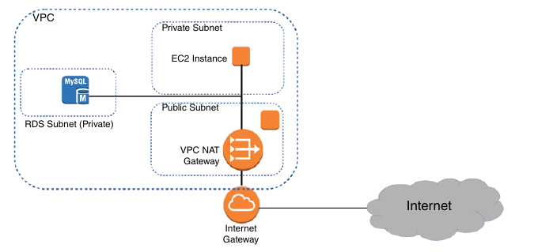


### **الـ Key Pairs **

زي ما أي `administrator` محترف عارف، sessions الدخول عن بعد (`remote login`) على الـ `instances` الشغالة بتاعتك مينفعش أبدًا تتعمل عن طريق اتصالات `plain-text` مش متشفرة. عشان تضمن إن sessions دي متأمّنة صح، هتحتاج تعمل **key pair**، وتحفظ الـ **public key**  على سيرفر الـ EC2 بتاعك، وتحفظ نصه التاني الـ **private** على جهازك أنت.

*   **لو شغال على Windows AMI:** هتستخدم ملف الـ `private key` عشان تجيب الباسوورد اللي هتحتاجه عشان تعمل `authenticate` وتدخل على الـ `instance` بتاعتك.
*   **لو شغال على Linux AMI:** الـ `private key` هيسمحلك تفتح `SSH session`.

كل `key pair` أمازون بتعملهولك هيفضل متثبت جوه الـ `region` الأصلية بتاعته ومتاح للاستخدام مع أي `instances` جديدة بتشغلها، لحد ما أنت تمسحه. المفروض تمسح النسخة اللي على AWS في حالة إن الـ `private key` بتاعك ضاع أو اتكشف. بس خد بالك كويس قبل ما تلعب في المفاتيح بتاعتك — وصولك للـ `instance` ممكن يكون معتمد عليه.


## **الـ EC2 Auto Scaling**

خدمة الـ **EC2 Auto Scaling** بتديلك طريقة عشان تتجنب فشل الـ `application` بتاعك، وكمان عشان تتعافى منه لما يحصل. الـ `Auto Scaling` بيشتغل عن طريق إنه بيجهز ويشغل بالنيابة عنك عدد معين من الـ `EC2 instances`. وبيقدر يزود `instances` أكتر بشكل ديناميكي عشان يواكب الزيادة في الطلب. ولما `instance` بتقع أو بتتمسح، الـ `Auto Scaling` بيستبدلها بواحدة جديدة أوتوماتيك.

الـ `EC2 Auto Scaling` بيستخدم يا إما **launch configuration** أو **launch template** عشان يظبط إعدادات الـ `instances` اللي بيشغلها. هما الاتنين بيعملوا نفس الوظيفة الأساسية وهي إنهم بيحددوا إعدادات الـ `instance` الأساسية، وكمان إيه الـ `scripts` (لو فيه) اللي هتشتغل عليها أول ما تقوم.

*   **Launch Configurations:** دي موجودة من زمان، وهتبقى مألوفة ليك لو بتستخدم AWS من فترة. وغالبًا هتقابلها لو داخل على بيئة AWS موجودة بالفعل (اتشال عنه الدعم اخر مرة جربته طلع مات )
*   **Launch Templates:** دي الأحدث، وهي اللي AWS بتنصح بيها حاليًا.

هنتعلم عن الاتنين، بس أنهي واحدة تستخدمها ده قرارك أنت.

### **الـ Launch Configurations والـ Launch Templates**

عشان الـ `Auto Scaling` يعرف إزاي يبني السيرفرات الجديدة بتاعتك، لازم تديله "كتالوج" أو "وصفة" فيها كل مواصفات السيرفر اللي أنت عايزه. الوصفة دي ممكن تكون واحدة من اتنين: `Launch Configuration` أو `Launch Template`.

#### **الـ Launch Configurations **

*   **إيه هي؟** دي كانت الطريقة الأصلية والقديمة. هي عبارة عن ملف إعدادات ثابت بتسجل فيه كل حاجة عن السيرفر اللي عايزه: نوعه إيه، الـ `AMI` بتاعته، الـ `Security Group`، وهكذا.

*   **مميزاتها وعيوبها:**
    *   **عيبها الأكبر (عدم المرونة):** أول ما بتعمل `Launch Configuration` وتدوس `save`، **مبتقدرش تعدل فيه تاني أبدًا**. لو حبيت تغير أي حاجة، حتى لو حاجة بسيطة زي حجم السيرفر، لازم تمسحه وتعمل واحد جديد خالص من الصفر. ده بيخلي التغيير والتطوير صعب وممل.
    *   **عيب تاني (الاستخدام المحدود):** الـ `Launch Configurations` معمولة عشان تشتغل مع الـ `Auto Scaling` **وبس**. متقدرش تستخدمها عشان تشغل سيرفر واحد بنفسك لو حبيت.

#### **الـ Launch Templates**

*   **إيه هي؟** دي الطريقة الأحدث واللي أمازون بتنصح بيها حاليًا. هي برضه ملف إعدادات بتحط فيه مواصفات السيرفر، لكن معمولة عشان تكون مرنة وقوية أكتر بكتير.
*   **مميزاتها وعيوبها:**
    *   **ميزتها الكبيرة (المرونة والتعديل):** الـ `Launch Template` بيشتغل بنظام **Versions**. لو عملت `template` وحبيت تغير حاجة فيه، مش بتمسحه. أنت بتعمل **`version` جديد** منه بالتعديلات الجديدة. أمازون بتحتفظ بكل الإصدارات القديمة والجديدة، وتقدر تبدل بينهم بسهولة. ده بيخليك تتابع التغييرات وتجرب حاجات جديدة وترجع للإصدار القديم لو حبيت.

> [!NOTE]
>
> يعني انت بتبدأ بـversion رقم 1 وبعدها بيزيد رقم مع كل تعديل تعمل بعده  apply  فى مثال انا عمله تقدر تعدل template ومع كل تغير هتشوف انه زاد واحد فى العادي او الاكثر شيوعا الناس بتحط 
>
> ```terraform
>   launch_template {
>     id      = aws_launch_template.ec2_launch_template.id
>     version = "$Latest"
>   }
> ```
>
> لكن عادي تقدر تحط رقم طبيعي جدا
> 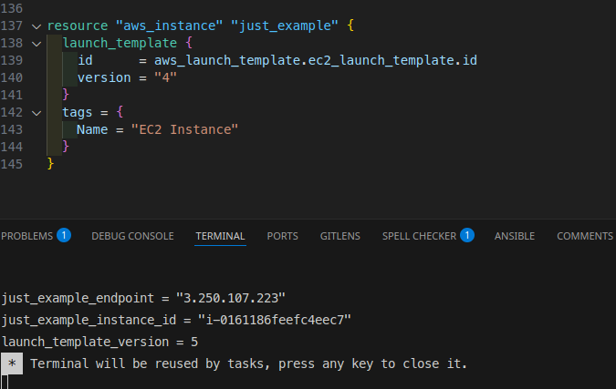
> دا مثال انا عمله تقدر تشوف رقم version طالع فى output دا ميزة جميلة ااقدر اجرب التعديل على ec2 تكون هي test واشوف ولو اشتغل ازود واحد على producation او ec2 أللي عليه الشغل او على autoscale 
> فى مثل بالاسم ده فى repo تقدر تجربه وتشوف `ex3 instance with launch template`
>
> 


*   **ميزة تانية :** الـ `Launch Template` مش محصور على الـ `Auto Scaling` بس. تقدر تستخدم نفس الـ `template` عشان تشغل سيرفر واحد بنفسك، أو تشغل
     `Spot Instances`، أو `Spot Fleets`، أو تستخدمه مع الـ `Auto Scaling`. 

> [!NOTE]
>
> 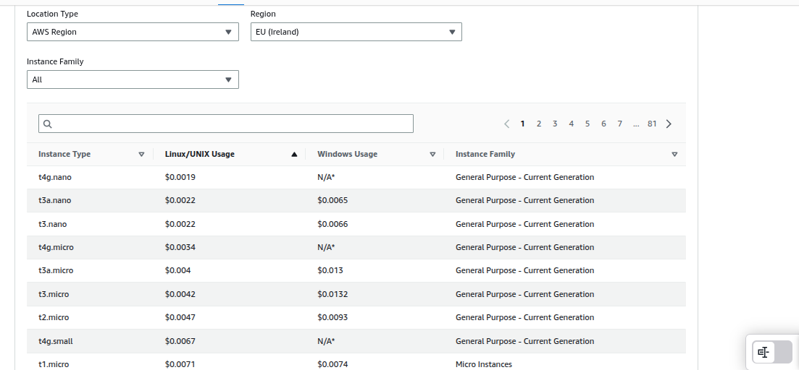
> الـ **Spot Instances** دي يا برنس هي باختصار **أرخص نوع سيرفر ممكن تجيبه في AWS كلها**. أرخص حتى من الـ **Reserved Instances** اللي بتقعد تشتريها بعقد سنة أو تلاتة. بتتكلم في توفير ممكن يوصل لـ 70%، 80%، وممكن 90% من سعر السيرفر العادي اللي هو الـ **On-Demand**. السعر ده بيبقى قليل جداً، بس خلي بالك، أسعاره بتختلف من **Region** لتانية جوه AWS. وأهم نقطة بقى، أوعى تشغل عليها شغل= أو "حساس" أبداً، يعني لو عندك عملية مهمة جداً، لو الـ **down time** فيها مصيبة، **أوعى تيجي ناحية الـ Spot دي**. العيب الوحيد في الـ Spot Instance ده إنها ممكن تتاخد منك في أي وقت، يعني ممكن الـ **Instance** بتاعتك تتفصل فجأة! ودي ممكن تبقى مشكلة لو كنت بتعمل حاجة حساسة. لكن بقى... لو أنت "بتعرف تلعبها صح"، هتعمل منها شغل جامد وتوفر بالهبل! AWS دي بنت حلال، بتديك **termination notice** قبل ما تاخد الـ **Instance** بدقيقتين، يعني بيجيلك "إشعار" يقولك "يا باشا، الـ **Instance** دي هتتفصل كمان دقيقتين، اتصرف!". هنا بقى بيجي دور الـ **orchestration platforms** زي **Kubernetes (K8s)**، أو أنظمة إدارة الـ **Batch processing** التانية. لو أنت مشغل الشغل بتاعك عليها، لما التحذير يجيلك، platforms دي بتبقى ذكية. بتعرف إن الـ **Node** دي هتتفصل، فبتعمل حاجة اسمها **migration**. يعني بتاخد الشغل اللي على الـ **Pods** دي أو المهام اللي شغالة، وتنقله بسرعة الصاروخ على **Node** تانية "لسه موجودة ومامورة" قبل ما الـ **Spot Instance** تتفصل منك. كده شغلك ما بيقفش لحظة، وانت بتستفيد بأرخص سيرفر ممكن. ممكن تراجع الـ **Pricing History** بتاعت أسعار الـ **Spot** في الـ **AWS Console** عشان تفهم متوسط الأسعار، بس خلي بالك، دي مش بتكون "محدثة لحظة بلحظة" زي سعر الـ **Spot Market** الحقيقي لاحظ هنا الفرق في اليوم 
> 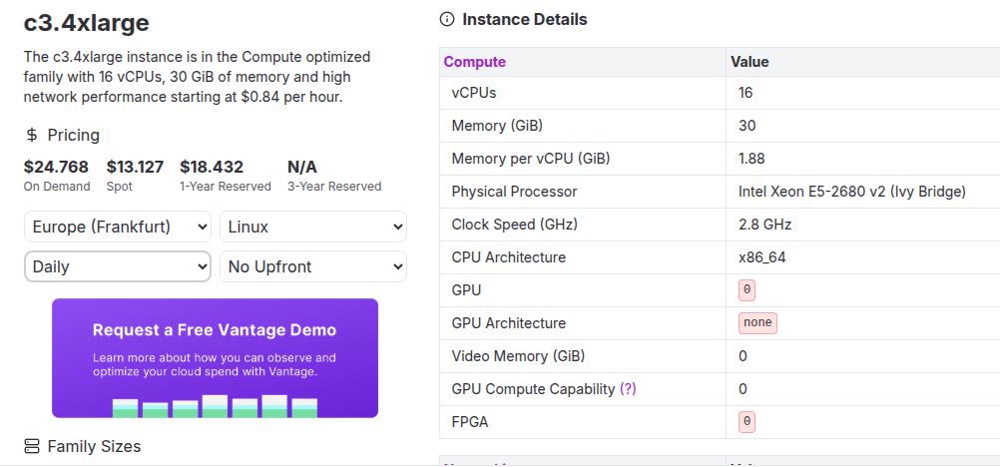
>
> دا مثال spot instance
>
> ```terraform
> resource "aws_spot_instance_request" "dev_web_server_spot" {
> spot_price = "0.05"
> instance_type = "t3.micro"
> 
> instance_interruption_behavior = "terminate" 
> 
> spot_price_type = "one-time" 
> 
> # زي اي
> # ec2 
> }
> 
> ```
>
> 
>
> لما بتيجي تعمل **Spot Instance Request**، أنت بتحدد بالظبط الـ **Instance** اللي أنت عايزها وسلوكها لما تتفصل. فمثلاً، بتحدد **نوع الـ Instance** اللي انت عايزه، زي `instance_type = "t3.micro"`. هنا ممكن تحدد سعر أقصى أنت مستعد تدفعه في الساعة للسيرفر ده عن طريق `spot_price = "0.05"`. لو ماحددتش سعر خالص، الـ **Spot Instance** بتاعتك هتتشغل عادي، بس هتتحاسب على سعر الـ **Spot Market** الحالي، لحد أقصى سعر الـ **On-Demand** لنفس النوع، وده غالباً بيكون أفضل عشان الـ **Instance** تقوم بسرعة وماتتفصلش كتير.
>
> أما بالنسبة لـ `instance_interruption_behavior`، دي بتحدد إيه اللي يحصل للـ **Instance** لو AWS سحبتها منك أو سعر الـ **Spot** علي عن السعر اللي أنت محدده. فيه سلوكين رئيسيين:
> 1.  **`terminate`**: لو اخترت ده، الـ **Instance** بتاعتك هيتم **مسحها** بالكامل من عندك في AWS، بما فيها الهارد بتاعها (الـ EBS Volume). ده بيضمنلك إنك مابتتحاسبش على أي تكاليف تخزين بعد ما الـ **Instance** تتفصل. وده الأنسب لمعظم استخدامات الـ **Spot** اللي فيها الشغل مش بيحتفظ ببيانات مهمة على الـ **Instance** نفسها.
> 2.  **`stop`**: لو اخترت ده، الـ **Instance** مش بتتمسح، لكن بتدخل في حالة `stopped`. الهارد بتاعها بيفضل موجود بكل بياناته، بس هتفضل تتحاسب على تكلفة تخزين الهارد ده حتى لو الـ **Instance** مطفية. ممكن ترجع تشغل الـ **Instance** دي يدوي تاني لو سعر الـ **Spot** نزل، بس مفيش ضمان إن ده يحصل، وده استخدام نادر مع الـ **Spot Instances** الفردية.
>
> تعالى نكلم عن حته متقدمة يمكن تكون متقدمة بزيادة ولكن هتديك فهم كبير عن عمل ec2 fleet
> الـ **EC2 Fleet** (أو ممكن نقول عليها الـ **Spot Fleet**) دي هي الأداة اللي AWS عاملها عشان لو عندك شغل كبير أوي، وعايز تشغله بأقل تكلفة ممكنة. ومش فارق معاك بالظبط إيه أنواع  **Instances**) اللي هتطلعلك، المهم إنك تحقق قدرة معينة على الشغل (اللي هي الـ **Target Capacity**) بأوفر طريقة.
>
> `target_capacity_specification` انت هنا بتحدد ايه اللي انت محتاجه سواء `on_demand` او `spot` هنا انت حددت 1 يكون `on_demand` و `spot` يكون 1 ولكن العدد الكلي total_target_capacity هيكون 3 طب الباقي اللي هو 1 هيجي منين ...هيجي من `default_target_capacity_type` طب 1 و 3 دول ايه خلي بالك دول مش شرط يكونوا instance دول `weighted_capacity` انت بتحدده فى كل `launch_template_config` طب بتحدده بناءا على ايه دا السؤال الحلو دا بناءا `target_capacity_unit_type` هنا انت بتحدد units اللي هيتقاس عليها عندك اثنين يأمة vcpu او memory سعته بيدي weighted_capacity بشكل تلقائي بيساوي vcpu او  memory الخاص بـinstance type طب لو انا عايز اخليها manual ساعته بخلي `target_capacity_unit_type` تساوي "units" فى الحالة دي انت اللي بتحط weighted_capacity ولو محططتهاش بتساوي 1 طب ايه الفايدة من ده كله تعالى ناخد مثل 
>
> تعالى ناخد مثل على target_capacity_unit_type تساوي `units`  هي مش مجرد عدد وخلاص، لأ، دي بتدي **"weight"**  لكل نوع **Instance** انت بتسمح للـ **Fleet** تستخدمه.
>
> يعني مثلاً، لو انت طالب **Total Target Capacity** ولتكن 100 "**compute unit**" (يعني عايز قدرة شغل تساوي 100 وحدة، مش 100 سيرفر بالظبط)، ممكن يكون عندك أنواع **Instances** مختلفة جوه الـ **Fleet** بتاعتك:
>
> - نوع **Instance** صغير (زي `t3.micro`) ممكن تعتبره بيوفر "**unit**" واحدة من  الـ **compute unit**. فبتديله `weighted_capacity` بيساوي 1.
> - ونوع **Instance** أكبر (زي `t3.small`) ممكن يعتبر بيوفر "**units**" أو أكتر من الـ **compute power**. فبتديله `weighted_capacity` بيساوي 2.
>
> فأنت هنا بتحدد الـ `weighted_capacity` لكل نوع بناءً على الـ **compute power** اللي النوع ده بيوفرها. الـ **Fleet** بقى لما بتيجي تختار الـ **Instances** بتاعتها بناءً على الـ `allocation_strategy`، مش بتبص على سعر الـ **Instance** نفسها وبس. لأ، هي بتحسب تكلفة الـ "**compute unit**" الواحدة لكل نوع **Instance**. الـ **Fleet** بتختار الأنواع اللي بتوفرلك الـ "**compute unit**" بأرخص سعر ممكن، عشان تحققلك الـ **Total Target Capacity** اللي انت طالبها بأقل تكلفة إجمالية.
>
> مثال يوضح الفكرة دي بالتحديد: لو انت عامل `total_target_capacity = 2` و `target_capacity_unit_type = "instances"` (يعني عايز 2 سيرفر بالظبط)، وعندك نوعين **Instance**:
>
> - `t1.micro` مع `weighted_capacity = 1`، وسعرها مثلاً 0.03 دولار في الساعة.
> - `t2.micro` مع `weighted_capacity = 1`، وسعرها مثلاً 0.04 دولار في الساعة. في الحالة دي، الـ **Fleet** هتختارلك 2 من `t1.micro` عشان تحقق الـ 2 **Instances** دول بأقل سعر (إجمالي 0.06 دولار).
>
> لكن لو غيرنا الـ `target_capacity_unit_type` لـ `vCPU` وحطينا `total_target_capacity = 2` (يعني عايز 2 vCPU إجمالاً)، والـ `weighted_capacity` لكل نوع بيساوي عدد الـ vCPU اللي فيه:
>
> - `t1.micro` (لو عندها 1 vCPU) مع `weighted_capacity = 1`.
> - `t2.micro` (لو عندها 2 vCPU) مع `weighted_capacity = 2`. وكان سعر `t1.micro` هو 0.03 دولار / ساعة (يعني 0.03 دولار لكل vCPU)، وسعر `t2.micro` هو 0.04 دولار / ساعة (يعني 0.02 دولار لكل vCPU). هنا الـ **Fleet** هتختار **Instance** واحدة من نوع `t2.micro` عشان تحققلك الـ 2 vCPU دول بأقل سعر (إجمالي 0.04 دولار)، لأن الـ `t2.micro` أرخص لكل vCPU. في الحالة دي، انت اللي بتحدد الـ `weighted_capacity` عشان تقول لـ AWS كل **Instance** بتوفر كام **compute unit**، وده مش بيعتمد على عدد الـ vCPU اللي في الـ **Instance** دي بشكل مباشر إلا لو انت عايز كده.
>
> الـ **EC2 Fleet** بتحدد `allocation_strategy` فى spot option، ودي بقى زي ما تكون بتدي AWS "خطة توزيع" للـ **Instances** بتاعتك عشان تحققلك الـ **Capacity** اللي أنت طالبها. دي بتختلف في طريقة اختيار الـ **Instances** من القايمة اللي أنت مديها لها. فيه كذا `strategy` ممكن تختار منها:
>
> 1. **`lowestprice`:** دي زي ما تكون أنت بتدور على **أرخص حاجة بالمللي**. بتقول لـ AWS: "أنا مديالك كذا نوع **Instance** وكذا **Availability Zone**، شوفلي **أرخص واحدة فيهم بالظبط دلوقتي**، وشغلّي منها كل الـ **Instances** اللي أنا عايزها." بنختارها لو هدفنا الأساسي هو **أقصى توفير في الفاتورة**. بس ممكن كل الـ **Instances** تتفصل لو سعر النوع ده علي أو حصلت مشكلة في الـ **Availability Zone** دي. دي بتبقى كويسة للشغل اللي ممكن يتعافى بسهولة من الانقطاعات، زي **Batch processing** اللي بتكمل شغلها من مكان ما وقف.
> 2. **`diversified`:** دي زي ما تكون أنت عايز "تأمن نفسك" شوية. بتقول لـ AWS: "أنا عايز الـ **Capacity** دي، بس بدل ما تروح لأرخص حاجة وبس، حاول **توزع الـ Instances اللي هتجيبها لي على كل أنواع الـ Instances والـ Availability Zones** اللي أنا حددتها لك." بنختارها لما نكون عايزين **ثبات أعلى وتقليل خطر الانقطاع الكلي**. لأنك بتوزع الـ **Instances** على أماكن وأنواع مختلفة، فده بيديها "مناعة" ضد المشاكل اللي ممكن تحصل في مكان واحد. بتبقى مفيدة للشغل اللي محتاج استمرارية كويسة بس لسه عايز يستفيد من توفير الـ **Spot**.
> 3. **`capacity-optimized`:** هنا AWS بتشوف عندها داتا إيه، وبتتوقع إيه أنواع الـ **Instances** والـ **Availability Zones** اللي عندها **سعة Spot فاضية كتيرة ومستقرة دلوقتي**، يعني مش هتتفصل منك بسهولة. بنختارها لو **تقليل الانقطاعات هو أولويتنا القصوى**، حتى لو هندفع أكتر شوية من سعر `lowest-price` (بس لسه أقل من الـ **On-Demand**). دي بتدي ثبات عالي جداً لـ **Spot Instances**، وبتخليها مناسبة لشغل ممكن يكون حساس للانقطاع نسبيًا، بس لسه عايز توفير الـ **Spot**.
> 4. **`capacity-optimized-prioritized`:** دي زي `capacity-optimized` بالظبط، بس معاها "أولوية". انت بتقول لـ AWS: "يا AWS، شوفلي الأنواع اللي عندها سعة **Spot** مستقرة، بس لو لقيت النوع ده (وبتحدد نوع معين في الـ `launch_template_config` بتاعه) عنده سعة كويسة ومستقرة، **أديله أولوية أعلى**." بنختارها لو عندنا أنواع **Instances** معينة بنفضلها لشغلنا (عشان الأداء أو تراخيص معينة)، وفي نفس الوقت عايزين نستفيد من استراتيجية `capacity-optimized` عشان نقلل الانقطاعات.
>
> انما في on_demand_options لا انت عندك 2 بس `lowestprice` و `prioritized` طب  lowestprice عرفين هتشتغل ازاي طب prioritized فى option اسمه priority بيتحط فى override تقدر تحدد priority زي ما انت عايز  
>
> أما بالنسبة لـ `instance_interruption_behavior`، دي بتحدد إيه اللي يحصل للـ **Instance** لو AWS سحبتها منك أو سعر الـ **Spot** علي. لو اخترت `terminate`، الـ **Instance** هتتمسح بالكامل لو اتفصلت، وده الأوفر والأكثر استخداماً. لو اخترت `stop`، الـ **Instance** بتقف بس الهارد بتاعها بيفضل موجود، وهتتحاسب عليه.
>
> ممكن كمان تحط `spot_max_total_price` في الـ **EC2 Fleet**. ده **Option** ليك عشان تحط حد أقصى للسعر اللي انت مستعد تدفعه للـ **Fleet** كلها في الساعة. لو حطيت السعر ده، الـ **Fleet** مش هتشغل أي **Instance** تتعدى السعر الإجمالي اللي انت حاطه، وده بيديك تحكم صارم جداً في التكلفة. أما لو شلت السطر ده خالص، الـ **Fleet** هتحاول تلاقي أرخص سعر، لكن ممكن تدفع لحد سعر الـ **On-Demand** عشان تضمن إن الـ **Instances** تقوم وتفضل شغالة وتحافظ على الـ **Capacity** المطلوبة، وده بيكون أفضل في معظم الحالات لتقليل فرص فصل الـ **Instances**.
>
> لو **Instance** من اللي قامت في الـ **Fleet** اتفصلت، الـ **Fleet** أوتوماتيك بتكتشف النقص ده وبتشغل **Instance** تانية مكانها، وبتختار أرخص **Instance** متاحة من القايمة اللي انت مديها لها. ده بيخلي الـ **Spot Fleet** مثالية جداً لـ **Batch processing**، وأي **Elastic Workloads** بتحتاج **compute power** كتير ومش عايز تدفع فيها كتير، لأنها بتضمنلك الـ **Capacity** المطلوبة بأقل تكلفة ممكنة مع قدرة عالية على التعافي من الانقطاعات.
>
> الـ `terminate_instances = true` ده `argument` مهم جداً بيتحط مباشرةً جوه الـ `aws_ec2_fleet`. هو بيقول لـ AWS: "لو أنا مسحت الـ **EC2 Fleet** دي (مثلاً عن طريق `terraform destroy`)، عايزك **تمسحي معاها كل الـ Instances اللي كانت مشغلاها بشكل تلقائي**." ده بيحل مشكلة الـ `DependencyViolation` وبيخلي عملية مسح الـ Resources نظيفة.
>
> **ملحوظة مهمة جداً:** الـ **EC2 Fleet** دي بتطلع عدد ثابت من الـ **Instances** وتحافظ عليها بناءً على الـ `total_target_capacity` اللي انت محدده. هي **مش Auto Scaling Group**. الـ **Auto Scaling Group** هي اللي بتقدر تزود وتنقص عدد الـ **Instances** بناءً على workloads (زي استخدام الـ CPU). الـ **Fleet** بتديك عدد ثابت من الـ **Instances** اللي بتختارها بأفضل سعر وبتعيد تشغيلها لو فصلت، لكن مش بتعمل **Scale Up/Down** أوتوماتيكي بناءً على الـ **Utilization** بتاع الـ **Instances**.
>
> 
>
> فى كتير features فى ec2_fleet بس دي المهمة  هتلاقي المثال كامل فى repo 
>
> ```terraform
> resource "aws_ec2_fleet" "my_fleet" {
> 
>   target_capacity_specification {
>     total_target_capacity        = 3
>     on_demand_target_capacity    = 1
>     spot_target_capacity         = 1
>     default_target_capacity_type = "spot" 
>   }
> 
> 
>   spot_options {
>     allocation_strategy            = "lowestPrice" 
>     instance_interruption_behavior = "terminate" 
>   }
>   on_demand_options 
>     {
>         allocation_strategy            = "lowestPrice"  
>         }
>   
>   dynamic "launch_template_config" {
>     for_each = aws_launch_template.fleet_lt
>     content {
>       launch_template_specification {
>         launch_template_id = launch_template_config.value.id
>         version            = "$Latest"
>       }
>       override { 
>         instance_type     = launch_template_config.value.instance_type
>         # priority          = 0
>         weighted_capacity = var.instance_types[launch_template_config.key].weight
>       }
>     }
>   }
> 
>   tags = {
>     Name = "MyEC2Fleet"
>     Environment = "Dev"
>     ManagedBy = "Terraform"
>   }
>   terminate_instances= true
> }
> 
> 
> ```
>
> 


لو عندك شغل قديم، ممكن تلاقي فيه `Launch Configurations`. لو بتبدأ حاجة جديدة، **دايمًا استخدم الـ Launch Templates**.

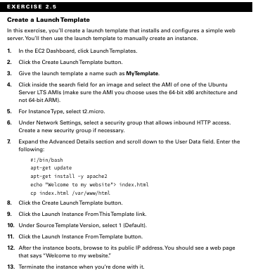


### **`Auto Scaling Groups`**

الـ `Auto Scaling group` هو مجموعة من الـ `EC2 instances` بتديرها خدمة `Auto Scaling`. لما بتيجي تعمل `Auto Scaling group`، لازم الأول تحدد يا إما الـ `launch configuration` أو الـ `launch template` اللي أنت عملته. بعد كده هتحتاج تضيف تفاصيل `configuration` تانية.

#### **تحديد `Load Balancer`**

لو عايز تستخدم `load balancer` عشان توزع الـ `traffic` على الـ `instances` اللي في الـ `Auto Scaling group` بتاعك، كل اللي عليك تعمله هو إنك تحط اسم الـ `load balancer` وأنت بتعمل الـ `Auto Scaling group`.

#### **(`Health Checks`) على الـ `Application Instances`**

لما بتعمل `Auto Scaling group`، خدمة `Auto Scaling` هتسعى جاهدة إنها تحافظ على الحد الأدنى من عدد الـ `instances`، أو العدد المطلوب (`desired`) لو كنت حددته. لو `instance` بقت `unhealthy` (غير سليمة)، `Auto Scaling` هيمسحها (`terminate`) ويجيب واحدة بدالها (`replace it`).

بشكل افتراضي، `Auto Scaling` بيحدد صحة الـ `instance` بناءً على الـ `EC2 health checks`. **الفصل السابع، "CloudTrail, CloudWatch, and AWS Config," بيغطي إزاي `EC2` أوتوماتيكيًا بيعمل فحوصات حالة للنظام وللـ`instance` (system and instance status checks).** الفحوصات دي بتراقب مشاكل في الـ `instance` زي استهلاك الـ `memory` بالكامل، أو تلف في نظام الملفات، أو `configuration` غلط في الشبكة أو التشغيل، وكمان بتراقب مشاكل في النظام نفسه بتحتاج تدخل من `AWS` عشان تتصلح. ورغم إن الفحوصات دي بتقدر تكتشف أنواع مشاكل كتير ليها علاقة بالـ `instance` والـ `host`، هي مش بالضرورة هتكتشف المشاكل الخاصة بالـ `application` نفسه.لو `instance` فشلت في الـ `health check`، الـ `load balancer` هيوجه الـ `traffic` بعيد عن الـ `instance` اللي فشلت، وده بيضمن إن المستخدمين ميوصلولهاش. في نفس الوقت، `Auto Scaling` هيمسح الـ `instance` دي، ويعمل واحدة بدالها، ويوجه الـ `traffic` للـ `instance` الجديدة.

> [!IMPORTANT]
>
> 
>
> الـ Target Group دي حاجة كده أساسية جداً pivotal concept في الـ architecture بتاع الـ Load Balancing في AWS. بالذات مع الـ Application Load Balancers (ALB) والـ Network Load Balancers (NLB)، وممكن نقول كمان مع الـ Classic Load Balancers (CLB) بس بشكل أبسط شوية. ممكن نوصفها إنها abstraction أو virtual endpoint، بتخليك تقدر توجه الـ Traffic لـ "Service معينة" شغالة على Target Group، ومش فارق معانا عدد الـ Targets دول كام ولا تفاصيلهم الـ individual إيه بالظبط.
>
> **إيه الـ function بتاعة الـ Target Group؟**
>
> الـ primary function للـ Target Group إنها تمثل Service نقدر consumable. لما بتعمل Target Group، بتحدد الـ core characteristics بتاعت الـ Service دي:
>
> 1.  **Protocol and Port:** دي بتوضح للـ Load Balancer على أي Protocol (زي HTTP، HTTPS، TCP، TLS، UDP) وعلى أي Port (زي 80، 443، 8080) المفروض يبعت الـ Traffic للـ Registered Targets.
> 2.  **Health Check Settings:** هنا بقى بنحط الـ criteria اللي الـ Load Balancer هيستخدمها عشان يقيم صحة الـ Registered Targets. بتحدد هنا:
>     *   **Protocol and Path:** إزاي الـ Target هيتراجع عليه (مثلاً: HTTP على الـ Path `/`).
>     *   **Healthy and Unhealthy Thresholds:** عدد الـ Checks اللي لازم تنجح ورا بعض أو تفشل ورا بعض عشان حالة الـ Target تتغير.
>     *   **Interval and Timeout:** المدة اللي بين كل Check والتاني، والوقت الأقصى للـ Check.
>     *   **Success Codes:** الـ Response Code اللي المفروض يجي مظبوط (مثلاً: 200).
>
> **مين اللي بيعمل الـ Health Check؟**
>
> النقطة الـ crucial هنا: **الـ Target Group نفسها مبتعملش Health Checks**. هي مجرد حاجة شيلة او حاملة للإعدادات بتاعة الـ Health Check. اللي بيعمل الـ Health Checks ده هو الـ **Load Balancer** (ALB، NLB، أو CLB) اللي مرتبط بـ Target Group معينة. هو اللي بيبقى active وبيعمل الـ Checks دي regularly على كل الـ Registered Targets اللي جوه الـ Target Group دي. Based on نتايج الـ Checks دي، الـ Load Balancer بيقرر إذا كان الـ Target (مثلاً EC2 instance) "Healthy" يبقى ready إنه يستقبل الـ Traffic، ولا "Unhealthy" 
>
> **الـ Target Groups والـ Auto Scaling Groups (ASG):**
>
> الـ partnership بين الـ Target Groups والـ Auto Scaling Groups (ASG) دي واحدة من أقوى الـ Architectural Patterns اللي موجودة في AWS.  **الـ Auto Scaling Group الواحدة ممكن تشاور على Multiple Target Groups**. ودي ميزة flexible جداً بتفتح use cases قوية:
>
> *   **Multiple Services on the Same Instance:** تخيل كده لو عندك EC2 Instances جوه ASG، وكل instance فيهم مشغل كذا Service (مثلاً: Web Server على Port 80، وAPI على Port 8080، وAdmin Console على Port 9000). في الحالة دي، هتعمل تلاتة Target Groups separate (واحدة لكل Service/Port).
> *   **Instance Registration:** الـ Auto Scaling Group بتعمل register لكل الـ Instances اللي بتعملها launch في **كل** الـ Target Groups اللي انت محددها في الـ configuration بتاعها (`target_group_arns`). ده معناه إن الـ EC2 Instance الواحد ممكن يبقى member في Multiple Target Groups في نفس الوقت (simultaneously).
> *   **Traffic Distribution:** الـ primary role بتاع الـ ASG هو إدارة **العدد والـ lifecycle** بتاع الـ Instances؛ هي بتضمن إن فيه الـ desired number من الـ Healthy Instances اللي ready للعمل. لكن الـ **Load Balancer هو المسؤول عن الـ actual Distribution بتاع الـ Incoming Traffic** للـ Target Groups ومنها للـ Healthy Instances اللي جواها. يبقى لو فيه Traffic على Port 80، الـ ALB هيوجهه للـ Target Group المخصصة لـ Port 80، وبعدين هيوزعه على الـ Healthy Instances اللي متسجلة هناك.
>
> **الـ Target Groups والـ Load Balancers: علاقة لا غنى عنها**
>
> الـ Target Group لوحدها كده malfunctional؛ لازم يبقى مرتبط بيها **Listener** من Load Balancer (ALB/NLB). الـ Listener ده هو اللي بيستقبل الـ Incoming Traffic على Port وProtocol معين على الـ Load Balancer، وبعدين بيعمل apply للـ Rules عشان يوجه الـ Traffic ده للـ appropriate Target Group(s). عشان كده بتلاقي الـ Targets ظاهرة كـ "Unused" في الـ AWS Console لو هي متسجلة في Target Group بس مفيش Listener في Load Balancer بيوجه Traffic للـ Group دي. الـ Load Balancer ميعرفش يعمل Health Checks أو Traffic Distribution غير لما يبقى فيه Listener بيشاور على الـ Target Group.
>
> ومش شرط الـ Target Groups تبقى مربوطة بالـ Auto Scaling Groups بس. ممكن تعمل register لـ EC2 Instances يدوياً في الـ Target Groups**
>
> الـ Target Group دي essential component في الـ engineering بتاع الـ Web applications الحديثة اللي على AWS. هي اللي بتعرف الـ Services (الـ Protocol والـ Port) والـ configurations بتاعة الـ Health Checks. شغالة بـ seamless integration مع الـ Load Balancers (اللي بتعمل الـ Checks وتوزع الـ Traffic) ومع الـ Auto Scaling Groups (اللي بتدير عدد الـ Registered Instances). فهم العلاقة الـ tripartite دي (Target Group - Load Balancer - Auto Scaling Group) حاجة crucial جداً عشان تعمل design لأنظمة scalable و high availability. 
> فى مثل انا عمله فى repo بس مستخدم listener بسيط 


> [!IMPORTANT]
>
> 
>
> `AWS` عندها نوعين أساسيين من الفحوصات الأوتوماتيكية اللي بتعملهم على أي `EC2 instance`، بالإضافة لنوع تالت أنت اللي بتظبطه بنفسك وهو الأذكى.
>
> ### **النوع الأول: `System Status Checks`**
>
> *   **ده بيبص على إيه؟**
>     ده فحص بيعمله `AWS` على **الـ `Hardware` الفيزيائي** اللي السيرفر بتاعك قايم عليه. هو ملوش دعوة بالـ `Windows` أو `Linux` بتاعك، هو بيبص على الحاجات اللي تحت سيطرة `AWS` نفسها.
> *   **إزاي بيشتغل؟**
>     `AWS` عندها أنظمة مراقبة داخلية بتتأكد إن الـ `hardware` اللي بيستضيف الـ `VM` بتاعتك سليم.
> *   **أمثلة على المشاكل اللي بيكتشفها:**
>     *   فقدان في كهرباء السيرفر الفيزيائي.
>     *   مشكلة في كارت الشبكة بتاع الـ `Host Machine`.
>     *   تلف في الهارد ديسك  اللي عليه الـ `VM` بتاعتك.
>     *   أي مشكلة في الـ `Hypervisor` (البرنامج اللي بيشغل الـ `VMs`).
> *   **لما بيفشل إيه اللي بيحصل؟**
>     لو الفحص ده فشل، يبقى المشكلة عند `AWS`. الـ `instance` بتاعتك غالبًا مش هتبقى قابلة للوصول. الحل عادةً بيكون إنك تعمل `Stop` وبعدين `Start` للـ `instance` من الـ `Console`. الحركة دي بتخلي `AWS` تنقل الـ `VM` بتاعتك لـ `hardware` فيزيائي سليم. في بعض الحالات، `AWS` ممكن تبعتلك إشعار إنها هتعمل `maintenance` أو `reboot` للسيرفر ده.
>
> ```terraform
> 
> resource "aws_autoscaling_group" "simple_asg" {
>   # ... launch_template, min_size, max_size, vpc_zone_identifier ...
>  
>   health_check_type = "EC2"
>   
> }
> ```
>
> 
>
> ---
>
> ### **النوع الثاني: `Instance Status Checks` **
>
> *   **ده بيبص على إيه؟**
>     ده فحص بيعمله `AWS` على **السيرفر بتاعك أنت**، بس من بره. هو بيحاول يتأكد إن نظام التشغيل (`OS`) بتاعك لسه عايش وقادر يستجيب على الشبكة.
> *   **إزاي بيشتغل؟**
>     `AWS` بيبعت `ARP requests` (نوع من رسائل الشبكة الأساسية جدًا) لكارت الشبكة الافتراضي بتاعك. لو الـ `instance` ردت على الرسائل دي، يبقى هي لسه "حية" من ناحية الشبكة. لو مردتش، يبقى فيه مشكلة.
> *   **أمثلة على المشاكل اللي بيكتشفها:**
>     *   نظام التشغيل بتاعك "هنّج" أو عمل `kernel panic`.
>     *   إعدادات الشبكة جوه السيرفر نفسه باظت (مثلًا حد لعب في الـ `IP configuration` غلط).
>     *   الـ `CPU` بتاع السيرفر وصل 100% لفترة طويلة لدرجة إنه مبقاش قادر يرد على أي حاجة.
>     *   الـ `Boot` بتاع السيرفر فشل ومكملش للآخر.
> *   **لما بيفشل إيه اللي بيحصل؟**
>     لو الفحص ده فشل، يبقى المشكلة **عندك أنت** جوه السيرفر. `AWS` مش هتعمل حاجة من نفسها. أنت اللي لازم تدخل تصلح المشكلة، ممكن تعمل `reboot` للسيرفر، أو تدخل على الـ `logs` عشان تعرف هو فشل ليه. الـ `Auto Scaling Group` لو متظبط إنه يعتمد على الـ `EC2 health checks` (وده الوضع الافتراضي)، أول ما يشوف إن الفحص ده فشل، هيمسح السيرفر ويعمل واحد جديد.
>
> ```terraform
> 
> resource "aws_autoscaling_group" "simple_asg" {
>   # ... launch_template, min_size, max_size, vpc_zone_identifier ...
>  
>   health_check_type = "EC2"
>   
> }
> ```
>
> انا عارف انك شايف ان مفيش اختلاف بس فى الحقيقة فى الاختلاف مين اللي عليه يصلح انت ولا aws هو ده 
> ممكن ما يكونش واضح دلوقي بس هنشوف ده فى CloudWatch قدام لما تيجي تشوف نوع healthy check
>
> ---
>
> ### **النوع الثالث: `ELB Health Checks` **
>
> *   **ده بيبص على إيه؟**
>     الفحصين اللي فاتوا كويسين، بس عندهم مشكلة كبيرة: **هما ميعرفوش إذا كان البرنامج بتاعك (الـ `Web Server` مثلًا) شغال ولا لأ!** ممكن السيرفر يكون صحته 10/10 من ناحية `AWS`، بس الـ `Nginx` أو الـ `Apache` بتاعك واقع.
>     الـ `ELB Health Check` بقى بيبص على **التطبيق بتاعك نفسه**.
> *   **إزاي بيشتغل؟**
>     أنت اللي بتظبطه بنفسك. بتقول للـ `Load Balancer` (`ELB`): "كل 30 ثانية، روح على السيرفر ده وافتح الـ `URL` ده (مثلًا `http://<server_ip>/health_check.html`)، لو رجعلك برد `200 OK`، يبقى السيرفر ده تمام. لو رجعلك أي `error` (زي `404` أو `500`) أو مردش خالص، اعتبره بايظ."
> *   **أمثلة على المشاكل اللي بيكتشفها:**
>     *   الـ `Web server process` بتاعك وقع أو اتقفل.
>     *   الـ `Application` بتاعك بيرمي `error 500` لأنه مش عارف يوصل للداتابيز.
>     *   حد عمل `deploy` لكود بايظ خلى الصفحة الرئيسية بترجع `error`.
> *   **لما بيفشل إيه اللي بيحصل؟ (هنا السحر كله)**
>     1.  الـ `Load Balancer` بيفهم إن السيرفر ده بايظ، فبيشيله **فورًا** من لستة السيرفرات اللي بيبعتلها `traffic`. كده المستخدمين بتوعك مش هيوصلهم أي `errors`.
>     2.  لو أنت رابط الـ `Load Balancer` ده بـ `Auto Scaling Group` ومظبط الـ `Health Check Type` على `ELB`، الـ `ASG` هيشوف إن الـ `ELB` اشتكى من السيرفر ده، فهيروح **ماسك السيرفر ده ماسحه**، **وعامل واحد جديد نضيف** مكانه.
>
> ```terraform
> 
> resource "aws_lb_target_group" "app_tg" { # load blancer
>   name_prefix = "my-webapp-tg-"
>   port        = 8080   
>   protocol    = "HTTP"
>   vpc_id      = var.vpc_id
> 
> 
>   health_check {
> 
>     enabled             = true
>     
> 
>     path                = "/health" 
>     
> 
>     port                = "traffic-port" 
>     
> 
>     unhealthy_threshold = 2
>     
> 
>     healthy_threshold   = 2
>     
> 
>     timeout             = 4
>     
> 
>     interval            = 10
>     
> 
>     matcher             = "200"
>   }
> }
> 
> 
> resource "aws_autoscaling_group" "app_asg" {
> 
> 
> 
>   target_group_arns = [aws_lb_target_group.app_tg.arn]
> 
> 
>   health_check_type = "ELB"
> 
> 
>   health_check_grace_period = 300
> }
> ```
>
> 
>
> 
>
> | نوع الفحص             | بيبص على إيه؟               | مين اللي بيعمله؟             | مثال على المشكلة           | الحل إيه؟                                       |
> | :-------------------- | :-------------------------- | :--------------------------- | :------------------------- | :---------------------------------------------- |
> | **`System Status`**   | الـ `Hardware` الفيزيائي    | `AWS`                        | كهربا قطعت في الداتا سنتر  | `AWS` بتصلحه، أو تعمل `Stop/Start`              |
> | **`Instance Status`** | نظام التشغيل والشبكة من بره | `AWS`                        | الويندوز/لينكس "هنّج"       | أنت اللي بتصلحه، أو الـ `ASG` بيبدله            |
> | **`ELB Status`**      | التطبيق بتاعك نفسه من جوه   | أنت بتظبطه والـ `ELB` بينفذه | الـ `Web Server` بتاعك وقع | الـ `ELB` بيوقف الـ `traffic` والـ `ASG` بيبدله |


> [!IMPORTANT]
>
> دلوقتي مثال على autoscaling مع spot market هتلاقي المثال فى repo كامل 
>
> > ```terraform
> > resource "aws_autoscaling_group" "just_example" {
> >   name_prefix = "example-asg-"
> >   min_size            = 1
> >   max_size            = 10
> >   desired_capacity    = 7
> >   health_check_type   = "EC2"
> >   
> >   mixed_instances_policy {
> >   instances_distribution {
> >       on_demand_allocation_strategy = "lowest-price"
> >       on_demand_base_capacity       = 0
> >       on_demand_percentage_above_base_capacity = 0
> >       spot_allocation_strategy      = "lowest-price"
> >       }
> >     launch_template {
> >       launch_template_specification {
> >         launch_template_id = aws_launch_template.fleet_lt.id
> >         version            = "$Latest"
> >       }
> >       dynamic "override" {
> >         for_each = var.instance_types
> >         content {
> >           instance_type = override.value.type
> >           weighted_capacity = override.value.weight
> >         }
> >       }
> >     }
> >   }
> > }
> > 
> > ```
>
> معظم الفكرة كلها انت بتدي launch_template واحد بس وبالنسبة للـweighted_capacity و instance_type انت بديه عن طريق `override` فى اكثر من block معظم options
>   on_demand_base_capacity       = 0 بتدي عدد معين يكون on_demand من العدد الكلي
> on_demand_percentage_above_base_capacity = 0 ودي بتدي نسبة فى حالة انت عندك عدد كبير مثلا زي 100 instance فى الحالة دي بيحصل ايه بتحط 20% مثلا طب ايه on_demand_base_capacity دا لو عيز على الاقل مثلا 1 طب هينفع فى ايه لو scale max بتاعك قليك زي 3 و 5 فى الحالة دي 20 % ملهاش  لازمه  طبعا الباقي انت عرفه 
> اخر حاجة دي مجرد امثلة فى كمية feature فى autoscale l مع mixed_instances_policy كتير قوي وفيه تفاصيل كتير جدا بس اخر حاجة لو حدد مثلا subnet  فى launch_template ورجعت حددته ثاني فى autoscale هنا هيحصل overwrite من autoscale والكلام برده يسري على aws_ec2_fleet
> برده ممكن تحط سعر اعلى شوية من spot market لكل instance عشان تضمن انها تبقى معاك فترة اطول


#### **`Configuring Scaling Policies`**

بعد كده هتحتاج تحدد كام `running instance` أنت عايز `Auto Scaling` يعملها ويحافظ عليها باستخدام الـ `launch configuration` أو الـ `template` اللي أنت عملته. لازم تحدد الحد الأدنى (`minimum`) والحد الأقصى (`maximum`) لحجم الـ `Auto Scaling group`. ممكن كمان بشكل اختياري تظبط العدد المطلوب (`desired`) من الـ `instances` اللي عايز `Auto Scaling` يعملها ويحافظ عليها.

*   **`Minimum`:**
    `Auto Scaling` هيضمن إن عدد الـ `instances` السليمة عمره ما يقل عن الحد الأدنى. لو ظبطت ده على `0`، `Auto Scaling` مش هيعمل أي `instances` وهيمسح أي `instances` شغالة في المجموعة.
*   **`Maximum` :**
    `Auto Scaling` هيتأكد إن عدد الـ `instances` السليمة عمره ما يزيد عن الرقم ده. ده ممكن يبان غريب، بس خد بالك إنك ممكن يكون عندك حدود في الميزانية ومحتاج تحمي نفسك من أي طلبات استخدام مفاجئة (ومش هتقدر على تكلفتها).
*   **`Desired Capacity` (السعة المطلوبة):**
    الـ `desired capacity` هو إعداد اختياري لازم يكون قيمته بين الحد الأدنى والحد الأقصى. لو محددتش `desired capacity`، `Auto Scaling` هيشغل عدد `instances` بيساوي قيمة الحد الأدنى. لو حددت `desired capacity`، `Auto Scaling` هيزود أو يمسح `instances` عشان يفضل عند الـ `desired capacity` دي. على سبيل المثال، لو ظبطت الحد الأدنى على `1`، والحد الأقصى على `10`، والـ `desired capacity` على `4`، ساعتها `Auto Scaling` هيعمل أربع `instances`. لو واحدة من الـ `instances` دي اتمسحت—مثلًا بسبب تدخل بشري أو `crash` في الـ `host`—`Auto Scaling` هيجيب واحدة بدالها عشان يحافظ على إعداد الـ `desired capacity` اللي هو `4`. في الـ `web console`، الـ `desired capacity` بيتسمى كمان `group size`.

### **`Auto Scaling options`**

بمجرد ما تعمل `Auto Scaling group`، ممكن تسيبه في حاله وهو هيفضل محافظ على الحد الأدنى (`minimum`) أو العدد desired من الـ `instances` إلى ما لا نهاية. بس، المحافظة على العدد الحالي من الـ `instances` ده مجرد اختيار واحد. `Auto Scaling` بيقدم كذا اختيار تاني عشان يعمل `scale out` (توسيع) لعدد الـ `instances` عشان تلبي الطلب.

#### **`Manual Scaling` **

لو غيرت قيم الـ `minimum`، أو الـ `desired`، أو الـ `maximum` في أي وقت بعد ما عملت المجموعة، `Auto Scaling` هيعدل الوضع فورًا. على سبيل المثال، لو عندك قيمة الـ `desired capacity` متظبطة على `2` وغيرتها لـ `4`، `Auto Scaling` هيعمل `launch` لاثنين `instances` زيادة. لو عندك أربع `instances` وظبطت قيمة الـ `desired capacity` على `2`، `Auto Scaling` هـ(`terminate`) اثنين `instances`. 

#### **`Dynamic Scaling Policies`**

معظم الـ `resources` اللي بتديرها `AWS` بتكون `elastic`—يعني، هي بتعمل `scale` أوتوماتيكيًا عشان تستوعب الضغط الزيادة. بعض الأمثلة تشمل `S3`، و `load balancers`، و `Internet gateways`، و `NAT gateways`. بغض النظر عن حجم الـ `traffic` اللي بترميه عليهم، `AWS` هي المسؤولة عن إنها تضمن إنهم يفضلوا متاحين وفي نفس الوقت أداؤهم يفضل كويس. بس لما الموضوع بييجي للـ `EC2 instances` بتاعتك، أنت المسؤول عن إنك تضمن إنهم أقوياء وكافيين في العدد عشان يلبوا الطلب.

نفاد موارد الـ `instance`—سواء كانت استهلاك `CPU`، أو `memory`، أو مساحة `disk`—تقريبًا دايمًا هيؤدي لفشل أي حاجة أنت مشغلها عليها. عشان تضمن إن الـ `instances` بتاعتك عمرها ما تبقى محمّلة فوق طاقتها، الـ `dynamic scaling policies` أوتوماتيكيًا بتعمل `provision` لـ `instances` زيادة قبل ما يوصلوا للنقطة دي. `Auto Scaling` بيولد الـ `metrics`  المجمعة دي لكل الـ `instances` اللي جوه المجموعة:

*   متوسط استهلاك الـ `CPU` (`Average CPU utilization`)
*   متوسط عدد الطلبات لكل `target` (`Average request count per target`)
*   متوسط بايتات الشبكة الداخلة (`Average network bytes in`)
*   متوسط بايتات الشبكة الخارجة (`Average network bytes out`)

أنت مش محصور في استخدام الـ `metrics` الأساسية دي بس. ممكن كمان تستخدم `metric filters` عشان تستخلص `metrics` من `CloudWatch logs` وتستخدمها. كمثال، الـ `application` بتاعك ممكن يكون بيطلع `logs` بتوضح الوقت اللي بياخده عشان يخلص `process` معينة. لو الـ `process` دي بتاخد وقت طويل جدًا، ممكن تخلي `Auto Scaling` يعمل `spin up`لـ `instances` جديدة.

الـ `Dynamic scaling policies` بتشتغل عن طريق إنها بتراقب `CloudWatch alarm` وتعمل `scale out`—عن طريق زيادة الـ `desired capacity`—لما الـ `alarm` ده يكون في حالة `breaching` (انتهاك للحد). ممكن تختار من ثلاث أنواع من الـ `dynamic scaling policies`: `simple`، و `step`، و `target tracking`.

#### **`Simple Scaling Policies`**

مع `simple scaling policy`، كل مرة الـ `metric` بيعلى فوق الحد (`threshold`)، `Auto Scaling` ببساطة بيزود الـ `desired capacity`. حجم الزيادة دي بقى بيعتمد على أنهي نوع من أنواع التعديل (`adjustment types`) دي أنت بتختاره:

*   **`ChangeInCapacity`:** بيزود الـ `capacity` بكمية محددة. على سبيل المثال، ممكن تبدأ بـ `desired capacity` قيمتها `4` وبعدين تخلي `Auto Scaling` يزود القيمة دي بـ `2` لما الضغط يزيد.
*   **`ExactCapacity`:** بيظبط الـ `capacity` على قيمة محددة، بغض النظر عن القيمة الحالية. على سبيل المثال، افترض إن قيمة الـ `desired capacity` هي `4`. أنت بتعمل `policy` عشان تغير القيمة دي لـ `6` لما الضغط يزيد ملوحظة النوع السابق والنوع اللي بعده موجودين فى step policy اللي لسه هتتشرح بعد دي ولكن ExactCapacity موجوده فقط فى Simple Scaling Policies
*   **`PercentChangeInCapacity`:** بيزود الـ `capacity` بنسبة مئوية من الكمية الحالية. لو الـ `desired capacity` الحالية هي `4` وأنت حددت نسبة التغيير في الـ `capacity` كـ `50` في المية، ساعتها `Auto Scaling` هيرفع قيمة الـ `desired capacity` لـ `6`.

على سبيل المثال، افترض إنك عندك أربع `instances` وعملت `simple scaling policy` بتحدد `PercentChangeInCapacity adjustment` قيمته `50` في المية. لما الـ `alarm` اللي بتراقبه يعمل `trigger`، `Auto Scaling` هيزود الـ `desired capacity` بـ `2`، وده بدوره هيضيف اثنين `instances` للـ `Auto Scaling group`، ويبقى المجموع ستة.

بعد ما `Auto Scaling` يخلص التعديل، هو بيستنى فترة `cooldown` (فترة تهدئة) قبل ما ينفذ الـ `policy` تاني، حتى لو الـ `alarm` لسه في حالة `breaching`. فترة الـ `cooldown` الافتراضية هي `300` ثانية، بس أنت ممكن تظبطها زي ما أنت عايز، سواء أعلى أو أقل لحد `0`—وده فعليًا بيعطلها. خد بالك إنه لو `instance` بقت `unhealthy`، `Auto Scaling` مش هيستنى فترة الـ `cooldown` قبل ما يبدل الـ `unhealthy instance`.

بالرجوع للمثال اللي فات، افترض إنه بعد ما تعديل الـ `scaling` خلص وفترة الـ `cooldown` انتهت، الـ `alarm` المراقب نزل تحت الحد. في النقطة دي، قيمة الـ `desired capacity` هي `6`. لو الـ `alarm` عمل `trigger` تاني، الـ `simple scaling action` هيتنفذ تاني ويضيف ثلاث `instances` كمان. خد في اعتبارك إن `Auto Scaling` عمره ما هيزود الـ `desired capacity` أكتر من إعداد الـ `maximum` بتاع auto scaling group.

كده لازم تاخد باللك انت بتعدل بس فى `desired capacity` يعني مستحيل تزيد عن `maximum` على المثال اللي فات زي ما عملت `Scale up policy` لازم تعمل `Scale Down Policy` بحيث لو ضغط لو رجع طبيعي ترجع `desired capacity` لحالتها الطبيعي

> [!TIP]
>
> الـ cooldown time ، هي فترة زمنية  نظام Auto Scaling بعد تنفيذ أي عملية scaling (مثل إضافة instances).
>
> الهدف منها هو بتدي  وقت للنظام عشان يستقر وللـ instances الجديدة أن تبدأ بشغل وتدي تأثير  على metrics ، وبكده بيتم منع تنفيذ عمليات scaling متتالية وسريعة بشكل غير ضروري.
>
> 


```terraform

resource "aws_autoscaling_policy" "add_one" {
  
  name                   = "example-autoscaling-policy"
  scaling_adjustment      = 1 # add 1
  adjustment_type        = "ChangeInCapacity"
  cooldown               = 300
  autoscaling_group_name = aws_autoscaling_group.just_example.name

}

resource "aws_autoscaling_policy" "substract_one" {
  
  name                   = "example-autoscaling-policy"
  scaling_adjustment      = -1 # substract 1
  adjustment_type        = "ChangeInCapacity"
  cooldown               = 300
  autoscaling_group_name = aws_autoscaling_group.just_example.name

}
resource "aws_cloudwatch_metric_alarm" "test-cpu-add_one" {
  alarm_name          = "HighCPUUtilization"
  comparison_operator = "GreaterThanThreshold"
  evaluation_periods  = 2
  metric_name         = "CPUUtilization"
  namespace           = "AWS/EC2"
  period              = 60
  statistic           = "Average"
  threshold           = 80
  alarm_description   = "This metric monitors ec2 cpu utilization"

  dimensions = {
    AutoScalingGroupName = aws_autoscaling_group.just_example.name
    target_group_arn = aws_lb_target_group.https_tg["service-one"].arn
    target_group_arn = aws_lb_target_group.https_tg["service-two"].arn
    target_group_arn = aws_lb_target_group.https_tg["service-three"].arn
  }

  alarm_actions = [aws_autoscaling_policy.add_one.arn]
  
}

resource "aws_cloudwatch_metric_alarm" "test-cpu-substract_one" {
  alarm_name          = "LowerCPUUtilization"
  comparison_operator = "LessThanThreshold"
  evaluation_periods  = 2
  metric_name         = "CPUUtilization"
  namespace           = "AWS/EC2"
  period              = 60
  statistic           = "Average"
  threshold           = 80
  alarm_description   = "This metric monitors ec2 cpu utilization"

  dimensions = {
    AutoScalingGroupName = aws_autoscaling_group.just_example.name
    target_group_arn = aws_lb_target_group.https_tg["service-one"].arn
    target_group_arn = aws_lb_target_group.https_tg["service-two"].arn
    target_group_arn = aws_lb_target_group.https_tg["service-three"].arn
  }

  alarm_actions = [aws_autoscaling_policy.substract_one.arn]
  
}
```

`aws_autoscaling_policy` دي هي القاعدة اللي بتوصف **إزاي** عملية الزيادة هتم. بنقوله إن النوع بتاعها `SimpleScaling`، وإن طريقة الزيادة هتكون  `PercentChangeInCapacity` قيمتها `50` في المية من عدد السيرفرات الحالية. كمان بنحدد فترة  `cooldown` عشان النظام ياخد نفسه بعد كل عملية زيادة.

`aws_cloudwatch_metric_alarm` ده هو "الحساس"  اللي بيجاوب على سؤال **إمتى** هنزود السيرفرات. وظيفته إنه يراقب متوسط استهلاك الـ CPU للمجموعة كلها. لو لقى إن الاستهلاك ده عدى `threshold` الـ 75% لمدة معينة، "هيضرب" وينادي على  Scale-Up Policy  اللي عملناها فوق عشان تنفذ الشغل بتاعها

> [!WARNING]
>
> خليك فاكر لازم اعمل انا `aws_autoscaling_policy` عشان تعمل `scale in` دا بهدف ان `desired` ترجع حالتها الطبيعي لان اللي انا عملته بيعمل `scale out` فقط مفيش اي حاجة ترجع desired لحالتها الطبيعية ثاني فكده المفروض يكون في 2 `aws_autoscaling_policy` واحدة `scale up` وواحدة `scale in`

مش شرط `alarm_actions` يكون action واحد ممكن يكون سلسلة من الاجراءات aws بيسمح ليك انك تبعت ايميل او حتى  sms دي مواضيع متقدمة شوية بس خليها فى بالك وكمان مش شرط يكون `CPUUtilization` ممكن يكون `NetworkIn / NetworkOut` اللي هو حجم traffic وبتعبر عن حجمه ب bytes او ممكن يكون وفيه برده `StatusCheckFailed` ودي يأمه 0 او 1 لو انت فاكر `system status check` هو ده فى حالة انه كان صفر معناها ان instance شغال وتمام في حالة انه 1 ,واهم حاجة `dimensions` دا انت بتحدد هيراقب انهي instance ممكن يراقب Instace واحد عن طريق انك تديه id او يراقب `AutoScalingGroupName` االموضوع ده ليه فصل كامل وفي حجات ليه متقدمة اكثر في فصل بيتكلم عنه ولكن كان لازم تاخد فكرة عنهم تكون كويسه حتى لو احتجت

> [!IMPORTANT]
>
> ايه قصة  namespace و dimensions 
> تمام namespace انت بتحدد نوع resource اللي انت عيز تقراء منه اذا كان `AWS/RDS` او `AWS/S3` ,غيرها من الخدمات فأنت بتحدد ايه نوع الخدمة او resource اللي عايز تقراء metrics بتاعه كل resource ليه metrics مختلفة عن الثانية يعني  `AWS/RDS` مخلتف عن `AWS/S3` زي مقوتلك ليه فصل كامل مش لازم نخش فى كل التفاصيل دي دلوقتي 
> طب dimensions 
> انت هنا بتعمل filter أنت عايز اي ec2 او اي autoscale group وهكذا فى مثل مشهور لاستخدام dimensions لما يكون عندك load blancer بيوزع على عدد من ec2 
>
> ```terraform
> resource "aws_cloudwatch_metric_alarm" "request_count_per_target" {
>   alarm_name          = "RequestCountPerTargetAlarm"
>   comparison_operator = "GreaterThanThreshold"
>   evaluation_periods  = "1"
>   metric_name         = "RequestCountPerTarget" #لاحظ
>   namespace           = "AWS/ApplicationELB" # لاحظ 
>   period              = "60"
>   statistic           = "Average"
>   threshold           = "100" ## عدد الطلبات لكل سيرفر
>   dimensions = {
>     TargetGroup  = "<TARGET_GROUP_NAME>"
>     LoadBalancer = "<LOAD_BALANCER_NAME>" 
>       # لاحظ انت بتقراء كمان من حالة 
>       # load blancer 
> 	# وعشان كده غيرنا 
> 
>     # name
>   }
>   alarm_actions = ["<ARN_FOR_ALARM_ACTION>"] 
> }
> 
> ```
>
> انا كده حددت load blancer ولكن هو ممكن يكون عنده اكثر من TargetGroup عشان فبحدد ليه اي target group من ec2 وهكذا 


#### **`Step Scaling Policies` **

لو الطلب على الـ `application` بتاعك بيزيد بسرعة جدًا، `simple scaling policy` ممكن متضفش `instances` كفاية بالسرعة المطلوبة. باستخدام `step scaling policy`، أنت بدلًا من كده ممكن تضيف `instances` بناءً على **مقدار** تجاوز الـ `metric` المجمع للـthreshold.

للتوضيح، افترض إن auto scaling بتاعتك بدأت بأربع `instances`. أنت عايز تضيف `instances` أكتر مثلا. لما الاستهلاك يوصل 50 في المية، أنت عايز تضيف اتنين `instances` كمان. لما يعدي 60 في المية، أنت عايز تضيف أربع `instances` كمان.

أنت الأول هتعمل `CloudWatch Alarm` عشان يراقب متوسط استهلاك الـ `CPU` وتظبط الـ `alarm threshold` على 50 في المية، لأن ده هو مستوى الاستهلاك اللي عايز تبدأ عنده تزود الـ `desired capacity`.

بعد كده لازم تحدد على الأقل `step adjustment` (تعديل تدريجي) واحد. كل `step adjustment` بيتكون من الآتي:

*   حد أدنى (`A lower bound`)
*   حد أقصى (`An upper bound`)
*   نوع التعديل (`The adjustment type`)
*   الكمية اللي هيزيد بيها
     الـ `desired capacity` 
    (`The amount by which to increase the desired capacity`)


الـ `lower bound` والـ `upper bound`  بتوع كل `step` بيعملوا "range" . عشان الـ `step adjustment` بتاع شريحة معينة يتنفذ، لازم قيمة الـ `metric` الحالية تكون واقعة جوه الشريحة دي.

خلينا نوضحها بمثال بالأرقام:
افترض إنك عملت أول `step` وظبطت الـ `lower bound` بتاعها على `50` والـ `upper bound` على `60`، مع `ChangeInCapacity adjustment` قيمته `2`. لما الـ `alarm` يضرب، `Auto Scaling` هيبص على متوسط استهلاك الـ `CPU` دلوقتي كام. لنفترض إنه لقاه `55%`. عشان رقم `55` ده بين `50` و `60`، `Auto Scaling` هينفذ الـ `action` بتاع الـ `step` ده، اللي هو إنه يزود اتنين `instances` على الـ `desired capacity`.

طيب، افترض دلوقتي إنك عملت `step` تاني، الـ `lower bound` بتاعه `60` والـ `upper bound` بتاعه ما لا نهاية (`infinity`). وظبطت كمان `ChangeInCapacity adjustment` قيمته `4`. لو متوسط استهلاك الـ `CPU` علي ووصل لـ `62%`، `Auto Scaling` هيلاحظ إن `62` دي بتقع في النطاق بتاع "من 60 لحد ما لا نهاية"، فهيروح منفذ الـ `action` بتاع الـ `step` ده، ويزود أربع `instances` على الـ `desired capacity`.

ممكن تكون بتسأل إيه اللي هيحصل لو الاستهلاك كان `60` في المية. نطاقات الـ `Step` مينفعش تتداخل. `metric` قيمته `60` في المية هيقع ضمن الحد الأدنى للـ `step` التاني.

مع `step scaling policy`، أنت ممكن بشكل اختياري تحدد `warm-up time` ، وده الوقت 
اللي `Auto Scaling` هيستناه قبل ما ياخد في اعتباره الـ `metrics` بتاعة الـ `instances` اللي لسه متضافة جديد. الـ `warm-up time` الافتراضي هو `300` ثانية. خد بالك إنه مفيش فترات `cooldown` في
 الـ `step scaling policies`.


```terraform

resource "aws_autoscaling_policy" "scale_out_cpu_steps" {
  name                   = "scale-out-cpu-step-policy"
  autoscaling_group_name = aws_autoscaling_group.just_example.name
  policy_type            = "StepScaling"
  adjustment_type        = "ChangeInCapacity"
  estimated_instance_warmup = 300
  step_adjustment {
    metric_interval_lower_bound = 50.0
    metric_interval_upper_bound = 60.0
    scaling_adjustment          = 2
  }
  step_adjustment {
    metric_interval_lower_bound = 60.0
    metric_interval_upper_bound = 80.0
    scaling_adjustment          = 4
  }
  step_adjustment {
    metric_interval_lower_bound = 80.0
    scaling_adjustment          = 6
  }
}

resource "aws_autoscaling_policy" "scale_in_cpu_steps" {
  name                   = "scale-in-cpu-step-policy"
  autoscaling_group_name = aws_autoscaling_group.just_example.name
  policy_type            = "StepScaling"
  adjustment_type        = "ChangeInCapacity"
  estimated_instance_warmup               = 300
  step_adjustment {
    scaling_adjustment          = -1 # it will never scale in below min size of scaling group
    metric_interval_lower_bound = 40.0

  }
}
resource "aws_cloudwatch_metric_alarm" "high_cpu_alarm_step_out" {
  alarm_name          = "High-CPU-Utilization-Step-Scale-Out-ASG-${aws_autoscaling_group.just_example.name}"
  comparison_operator = "GreaterThanOrEqualToThreshold"
  evaluation_periods  = 2
  metric_name         = "CPUUtilization"
  namespace           = "AWS/EC2"
  period              = 60
  statistic           = "Average"
  threshold           = 50
  alarm_description   = "Trigger step scaling out when CPU is 50% or higher."
  dimensions = {
    AutoScalingGroupName = aws_autoscaling_group.just_example.name
  }
  alarm_actions = [aws_autoscaling_policy.scale_out_cpu_steps.arn]
}

resource "aws_cloudwatch_metric_alarm" "low_cpu_alarm_step_in" {
  alarm_name          = "Low-CPU-Utilization-Step-Scale-In-ASG-${aws_autoscaling_group.just_example.name}"
  comparison_operator = "LessThanOrEqualToThreshold"
  evaluation_periods  = 5
  metric_name         = "CPUUtilization"
  namespace           = "AWS/EC2"
  period              = 60
  statistic           = "Average"
  threshold           = 40
  alarm_description   = "Trigger step scaling in when CPU is 40% or lower."
  dimensions = {
    AutoScalingGroupName = aws_autoscaling_group.just_example.name
  }
  alarm_actions = [aws_autoscaling_policy.scale_in_cpu_steps.arn]
}

```


#### **`Target Tracking Policies` **


لو الـ `step scaling policies` معقدة زيادة عن اللزوم بالنسبة لك، ممكن بدلًا من كده تستخدم 
`target tracking policies`. من اسمه انت بتحول توصل مثلا لاستهلاك المعالج مثلا 60% فلما تزيد عن 60 يزود desired هي دي فكرته انه بتعمل Tracking لـtarget معين 
كل اللي بتعمله هو إنك تختار `metric` وtarget value، و`Auto Scaling` هيعمل `CloudWatch Alarm` و `scaling policy` عشان يعدل عدد الـ `instances` عشان يحافظ على الـ `metric` قريب من وtarget value ده. عشان  `Target Tracking` تشتغل صح لازم الـ `metric` اللي بتختاره يكون بيتأثر بشكل مباشر بعدد السيرفرات. يعني لازم `Auto Scaling` يكون فاهم إن "لو زودت سيرفرات، قيمة الـ `metric` ده هتقل، ولو قللت سيرفرات، قيمته هتزيد".

الـ `Metrics` اللي بتنفع مع السياسة دي هي اللي بتقيس الضغط على مستوى السيرفر الواحد، زي `average CPU utilization for the group`  أو `request count per target` (عدد الطلبات لكل سيرفر لاحظ عدد الطلبات على كل سيرفر). لما بتزود سيرفرات، الحمل بيتوزع عليهم، فقيمة الـ `metrics` دي بتقل، والعكس صحيح. العلاقة الواضحة دي بتخلي `Auto Scaling` يعرف ياخد القرار الصح عشان يوصل للهدف اللي أنت حاطه.

على الناحية التانية، الـ `Metrics` المجمعة زي إجمالي عدد الطلبات اللي جاية على
 الـ `Application Load Balancing (ALB)`  (هنا عشان تكون واضحه معاك لازم ان ده بيقيس كل traffic أللي جي على load blancer مش على `auto scale groub instances` ) مش بتتغير بشكل متناسب مع الضغط على سيرفر واحد. قيمة الـ `metric` ده بتعبر عن إجمالي الـ `traffic` اللي جاي على السيستم كله، ومش بتتأثر بزيادة أو نقصان عدد السيرفرات. عشان كده، `Auto Scaling` مش هيعرف ياخد أنهي إجراء عشان يوصل للهدف بتاعك، وده بيخلي النوع ده من الـ `metrics` ماينفعش يستخدم في `target tracking policy`.

بالإضافة للـ `scale out`، `target tracking` هيعمل `scale in` عن طريق مسح `instances` عشان يحافظ على قيمة الـ `metric` اللي انت عايزة. لو مش عايز السلوك ده، ممكن تعطل الـ `scale in`. وكمان، زي الـ `step scaling policy` بالظبط، أنت ممكن بشكل اختياري تحدد `warm-up time`.

طب لو عايز اطبق المثال ده لو عند 100 طلب
```terraform
resource "aws_autoscaling_policy" "cpu_target_tracking" {
  name                   = "cpu-target-tracking-policy"
  policy_type            = "TargetTrackingScaling"
  autoscaling_group_name = aws_autoscaling_group.just_example.name
  estimated_instance_warmup = 180
  target_tracking_configuration {
    predefined_metric_specification {
      predefined_metric_type = "ASGAverageCPUUtilization"
    }

target_value       = 50.0     # Maintain the average CPU utilization at 50%
disable_scale_in   = false    # Allow scaling in (i.e., reducing instances) when utilization drops
    }
}
```

انت هنا مش بتستخدام cloudwatch

خلي باللك مفيش هنا اي حاجة انت بتحطها عشان تحدد عدد instnace هو فقط بيحاول يقرب من target value لقي متوسط استهلاك cpu زاد هيزود ec2 لحد ما يقل لقاه بيقل هيقلل ec2 وهكذا 


الـ `Scheduled Actions` :

الـ `Scheduled Actions` دي بقى، بتنفع أوي لو عندك `load pattern` كده معروف ومتقدر تتوقعه، وعايز تظبط الـ `capacity` بتاعك من بدري (يعني `proactively`)، عشان تتأكد إن عندك عدد `instances` كفاية قبل ما الـ `demand` يزيد عليك خالص.

لما تيجي تعمل `Scheduled Action`، لازم كده تحدد له شوية حاجات أساسية:
*   قيمة للـ `maximum` أو الـ `maximum` أو الـ `desired capacity` بتاعتك خلي بالك اللفات كله مكنش يقدر يزود عن maximum  او يقلل عن maximum كان بس بيتحكم desired capacity
*   وكمان `start date` و `time` (تاريخ ووقت البداية).

وممكن كمان (ودي حاجة اختيارية) تخلي الـ `policy` دي تتكرر على فترات منتظمة 
(يعني `recur at regular intervals`). دي طبعاً بتبقى مفيدة لو الـ `load pattern` بتاعك بيتكرر كل فترة (زي كل يوم، كل أسبوع). وممكن كمان تحدد لها `end time` ، اللي بعده الـ `scheduled policy` دي بتتمسح خالص.

عشان نوضحلك إزاي ممكن تستخدم الـ `Scheduled Action` ده، افترض مثلاً إنك بتشغل عدد `instances` اتنين بس في الـ `Auto Scaling Group` بتاعك طول أيام الأسبوع عادي. بس تيجي يوم الجمعة تلاقي الدنيا بتزحم أوي (يعني `busy`)، وأنت عارف إنك هتحتاج أربع `instances` عشان تستوعب الـ `load` ده.

*   ممكن تبدأ إنك تعمل `Scheduled Action` يظبط الـ `desired capacity` على `2`، ويتكرر كل يوم سبت (`recurs every Saturday`). (مع ملاحظة إن تاريخ البداية كان 5 يناير 2023 اللي هو يوم سبت).
*   عشان بقى تتعامل مع الزيادة المتوقعة يوم الجمعة دي ، هتعمل `policy` تانية تتكرر كل أسبوع  عشان تظبط الـ `desired capacity` على `4`. الـ `action` ده هيشتغل كل يوم جمعة، يخلي الـ `desired capacity` أربعة، وده طبعاً قبل ما الـ `load` المتوقع يزيد عليك.

خلي بالك بقى إنك ممكن تجمع بين الـ `Scheduled Actions` والـ `dynamic scaling policies` (اللي هي الـ `Target Tracking` أو الـ `Step Scaling` اللي اتكلمنا عنهم).
*   فمثلاً، لو أنت عندك `e-commerce site` ، ممكن تستخدم `Scheduled Action` عشان تزود الـ `maximum group size` (أقصى عدد للـ `instances` في الـ `group`) خلال مواسم التسوق اللي بتبقى زحمة (`busy shopping seasons`).
*   وبعد كده، تعتمد على الـ `dynamic scaling policies` بتاعتك عشان تزود الـ `desired capacity` حسب الاحتياج وقتها.

على نفس المثال 

```terraform
resource "aws_autoscaling_schedule" "friday_spike_increase" {
scheduled_action_name="friday_spike_increase"
  desired_capacity   = 7
  min_size               = 5
  max_size               = 20
  autoscaling_group_name = aws_autoscaling_group.just_example.name
#   # Recurrence: Every Friday at 09:00 UTC # 
#   # Syntax: "Minute Hour Day-of-Month Month Day-of-Week"
#   # 0 9 * * 5  -> 09:00 AM (0th minute, 9th hour), any day of month, any month, Friday (5)

  start_time             = "2025-07-25T09:00:00Z" 
  recurrence             = "0 9 * * 5" 
}


resource "aws_autoscaling_schedule" "saturday_reset_capacity" {
  autoscaling_group_name = aws_autoscaling_group.just_example.name
  
  scheduled_action_name = "saturday-reset-capacity"

  desired_capacity   = aws_autoscaling_group.just_example.desired_capacity
  min_size               = aws_autoscaling_group.just_example.min_size
  max_size               = aws_autoscaling_group.just_example.max_size
  start_time             = "2025-08-25T10:00:00Z" 

  # Recurrence: Every Saturday at 10:00 UTC
  # Syntax: "Minute Hour Day-of-Month Month Day-of-Week"
  # 0 10 * * 6 -> 10:00 AM (0th minute, 10th hour), any day of month, any month, Saturday (6)
  recurrence             = "0 10 * * 6"
}
```


انا يمكن هنا مش مزبط طريقة كتابة التاريخ بس عادي لو مش فاهم  `recurrence` بتتحط ازاي دي حاجة اسمها Cron Expression مش لازم تحفظها ولا تشغل بالك في مواقع بتديك gui تقدر من خلالها تحسبه وممكن من ai model وعيش


### AWS Systems Manager


خدمة **AWS Systems Manager**، اللي كان اسمها زمان `EC2 Systems Manager` وكمان `Simple Systems Manager (SSM)`، دي بتخليك تنفذ أوامر بشكل أوتوماتيك أو يدوي على الـ `resources` بتاعتك اللي على AWS، وكمان على السيرفرات اللي عندك في شركتك (on-premises).

من ناحية الشغل اليومي (operational perspective)، خدمة `Systems Manager` ممكن تشيل عنك شغلانات صيانة كتير كانت بتحتاج عادةً تدخل يدوي أو إنك تكتب `scripts` مخصوصة عشان تعملها.

*   **بالنسبة للسيرفرات (EC2 أو اللي في شركتك):** الشغلانات دي زي إنك تعمل `upgrade` للبرامج اللي متسطبة، أو تاخد جرد (inventory) بالسوفت وير اللي نازل، أو تسطب `application` جديد.
*   **بالنسبة لباقي حاجات AWS:** الشغلانات دي ممكن تكون زي إنك تعمل `AMI golden image` من `EBS snapshot`، أو تربط `IAM instance profile` بسيرفر، أو تقفل الـ `public read access` على `S3 buckets`.

خدمة `Systems Manager` بتقدم لك قدرتين أساسيتين:

*   **Actions :** دي الحاجات اللي بتعملها.
*   **Insights:** دي المعلومات اللي بتديها لك عن حالة السيستم بتاعك.

### Actions 

الـ `Actions` دي بتخليك تنفذ أوامر بشكل أوتوماتيك أو يدوي على الـ `resources` بتاعتك في AWS، سواء على حاجة واحدة أو على مجموعة كبيرة مع بعض. الأوامر دي لازم تبقى متعرفة جوه "مستندات" أو **`documents`**، والـ `documents` دي ليها 3 أنواع:

*   **Automation:** دي أوامر بتشغلها على الـ `resources` بتاعة AWS عمومًا (زي الـ EC2, S3, AMI).
*   **Command:** دي أوامر بتشغلها **جوه** السيرفرات بتاعتك (Linux أو Windows).
*   **Policy :** دي عمليات متعرفة عشان تجمع بيها معلومات وجرد (inventory) من السيرفرات بتاعتك.

#### Automation

`Automation` بتخليك تنفذ أوامر على مجموعة كبيرة من الـ `resources` بتاعتك في AWS مرة واحدة. زي مثلًا إنك تعمل `restart` لـ `EC2 instances` كتير، أو تحدث `CloudFormation stacks`، أو تعمل `patch` لـ `AMIs`.

`Automation` بتديك تحكم دقيق في تنفيذ الأوامر دي. ممكن تنفذ المهمة كلها مرة واحدة، أو خطوة بخطوة عشان تتحكم بالظبط في إيه اللي بيحصل وإمتى. وكمان فيها `rate control` عشان تحدد هتشتغل على كام `resource` في نفس الوقت، سواء بالعدد أو بالنسبة المئوية.

#### Run Command

بينما `Automation` بتشتغل على `resources` AWS بشكل عام، `Run Command` بتخليك تنفذ أوامر **جوه السيرفرات** بتاعتك من غير ما تحتاج تعمل `login` عليها أو تستخدم أدوات خارجية عشان تشغل `script`.

`Systems Manager` بيعمل ده عن طريق **`agent`** (عميل) بيبقى متسطب على الـ `EC2` أو السيرفرات اللي عندك. الـ `agent` ده بيبقى نازل جاهز على `AMIs` الجديدة بتاعت `Windows Server`, `Amazon Linux`, و `Ubuntu`. وممكن تسطبه بنفسك على أي `AMI` تانية.

افتراضيًا، `Systems Manager` معندوش صلاحية يعمل أي حاجة على السيرفرات. لازم الأول تديله `instance profile role` فيه الصلاحيات المطلوبة زي `AmazonSSMManagedInstanceCore`.

AWS بتقدم `documents` جاهزة كتير لأوامر زي `AWS-InstallApplication` للويندوز، و`AWS-RunShellScript` عشان تشغل أي `shell script` على لينكس. تقدر تختار السيرفرات اللي عايز تشغل عليها الأمر بالـ `tags` بتاعتها أو تختارها واحد واحد.

#### Session Manager

دي بقى ميزة  بتخليك تاخد `shell` (Bash أو PowerShell) على السيرفرات بتاعتك بشكل تفاعلي، **من غير ما تفتح أي بورتات** زي بورت 22 في الـ `security group`، ومن غير ما تحتاج `bastion host`، ومن غير وجع دماغ مفاتيح الـ SSH. كل الاتصالات بتبقى متأمنة بـ `TLS 1.2`، وكل الأوامر اللي بتتكتب ممكن تتسجل في `S3` وتتسجل في `CloudTrail`.

عشان تستخدمها من الـ `CLI` عندك، لازم الأول تسطب `plugin` صغير على جهازك.

#### الـ `Patch Manager` :

الـ `Patch Manager` ده بيساعدك إنك تعمل `automate` للـ `patching` بتاع الـ `Linux` والـ `Windows instances` بتاعتك. وده بيشتغل مع الـ `versions` اللي بيدعمها من الـ `operating systems` دي:

> [!TIP]
>
> patch مقصود بيه يعني **تحديث للبرامج** عشان **يصلّح أي ثغرات أمنية أو أخطاء** فيها.


*   `Windows Server` (من `Windows Server 2012` وطالع)
*   `Ubuntu Server` (`14.04` وطالع)
*   `Debian Server` (`8.x`، `9.x`، و`10.x`)
*   `Red Hat Enterprise Linux (RHEL)`
*   `SUSE Linux Enterprise Server` (`12.0`، `15.0` و `15.1`)
*   `CentOS` (`6.5-7.9`، `8.0-8.2`)
*   `Amazon Linux` (`2012.03 – 2018.03`)
*   `Amazon Linux 2` (`2-2.0`)
*   `Raspberry Pi OS` (اللي كانت اسمها `Raspbian 9 Stretch` و `10 Buster`)
*   `Red Hat Enterprise Linux` (`6.5-8.5`)
*   `Oracle Linux` (`7.5-8.3`)
*   `macOS` (`10.14x – Mojave` وطالع)

ممكن تختار الـ `instances` اللي تعملها `patching` واحدة واحدة، أو تعمل `patching` حسب الـ `tags` اللي أنت حاططها، أو ممكن تعمل `patch group`.

 الـ `Patch Group` دي فكرتها إنها بتجمعلك شوية `instances` مع بعض عشان تعملهم `patching` سوا، والموضوع ده كله بيحصل عن طريق الـ `tags`. بص بقى ، الـ `tag` دي عشان `Patch Manager` يتعرف عليها، لازم تبقى محددة بطريقة معينة. الجزء الأول فيها هو الـ `tag key`، وده بقى لازم يكون بالظبط بالمللي كده: `Patch Group`. خلي بالك، الـ `key` ده `case-sensitive`، يعني الحروف الكبيرة والصغيرة والمسافة اللي في النص دي بتفرق أوي! أما الجزء التاني فهو الـ `tag value`، وده بقى الاسم اللي أنت بتديه للـ `group` بتاعتك دي. يعني لو عايز تجمع `instances` معينة وتقول عليها `Webservers` `patch group`، يبقى الـ `value` بتاعت الـ `tag` دي هتبقى `Webservers`. فالموضوع كله بيمشي إزاي؟ لو أنت عايز مثلاً تعمل `patching` لكل الـ `webservers` بتاعتك، هتروح على كل `instance` هي `webserver`، وتيجي في الـ `tags` بتاعتها وتحط `tag` الـ `key` بتاعها `Patch Group` والـ `value` بتاعها `Webservers`. بالطريقة دي، لما الـ `Patch Manager` ييجي يشتغل، هيبص على كل الـ `instances` اللي عندها الـ `tag` اللي الـ `key` بتاعها `Patch Group`، وهيفهم من الـ `value` بتاع الـ `tag` ده (اللي هو `Webservers` في المثال بتاعنا) إن دي مجموعة الـ `webservers` بتاعتك اللي المفروض يعملها `patching`. فدي طريقة منظمة ومفيدة جداً عشان تقدر تتحكم في عمليات الـ `patching` لمجموعات محددة من الـ `instances` عندك.

 الـ `Patch Manager` ده بيشتغل بحاجة كده اسمها `patch baselines`، دي اللي بتحدد بالظبط إيه الـ `patches` اللي المفروض تنزل عندك على الـ `instances` بتاعتك، وكمان بتقولك إذا كانت الـ `patches` دي هتنزل لوحدها `automatically` ولا هتحتاج `approval` (يعني موافقة) منك الأول. الـ `AWS` نفسها بقى بتديلك شوية `default baselines` كده جاهزة، ودي طبعاً بتختلف من `operating system` للتاني حسب نوع السيستم اللي عندك. بس في العموم، الـ `default baselines` دي بتضمن إنها تنزل الـ `patches` اللي متصنفة على إنها `security-related` أو `critical` أو `important` أو `required`، يعني الـ `patches` الضرورية أمنياً والمهمة خالص. والميزة في الـ `default baselines` دي إنها (ما عدا بتاعت `Ubuntu`) بتعمل `auto-approve` للـ `patches` دي بعد سبع أيام لوحدها، والموضوع ده اسمه `auto-approval delay`. لو أنت بقى عايز تتحكم أكتر وتظبط الدنيا على مزاجك بالظبط إيه الـ `patches` اللي تنزل، ممكن بكل سهولة تعمل الـ `custom baselines` بتاعتك أنت بنفسك. كل `custom baseline` من دول بتبقى فيها `approval rules` (قواعد موافقة) واحدة أو أكتر، ودي اللي بتحدد أنت عايز إيه بالظبط: بتختار الـ `operating system`، والـ `classification` بتاعة الـ `patches` (يعني نوعها، زي أنها `security` ولا لأ)، وكمان الـ `severity level` (مستوى الخطورة) بتاعتها اللي أنت عايزها تنزل، وبتحدد الـ `auto-approval delay` الخاص بيها اللي يناسبك أنت. مش بس كده، ده أنت ممكن كمان تحدد `patches` معينة أنت موافق عليها بالاسم في الـ `custom baseline configuration` بتاعتك. يعني لو عندك `Linux baselines`، ممكن تقول عايز أنزل `patches` معينة بالـ `Common Vulnerabilities and Exposures (CVE) IDs` بتاعتها، أو حتى تكتب الـ `full package names` بتاعتها لو أنت عارفها. وبعد ما الـ `patch` ده يتاخدله `approval` ويتوافق عليه، هينزل عندك على الـ `instances` بتاعتك في `maintenance window` محدد أنت اللي هتكون ظبطه بنفسك في الوقت اللي يناسبك. ولو مش عايز تستنى الـ `maintenance window` ده خالص، ممكن تختار تعمل `patching` للـ `instances` بتاعتك `immediately` (يعني فوراً) وبدون أي تأخير. كل الـ `patching` ده بقى بيحصل عن طريق إن الـ `Patch Manager` بيشغل `document` معين اسمه `AWS-RunPatchBaseline` عشان يقوم بكل مهمة الـ `patching` دي.

**الـ State Manager :**

ب لو الـ `Patch Manager` وظيفته إنه يتأكد إن كل الـ `instances` بتاعتك على نفس الـ `patch level` (يعني واخدين نفس التحديثات الأمنية)، فالـ `State Manager` ده بقى حاجة أوسع بكتير. هو يعتبر أداة لـ **`configuration management`** . مهمته الرئيسية إنه يضمنلك إن الـ `instances` اللي عندك مش بس متحدثة، لأ دي كمان عندها السوفتوير اللي أنت عايزه بالظبط، ومتظبطة بنفس الإعدادات والطريقة اللي أنت محددها.

بشكل عام كده، الـ `State Manager` ده عنده القدرة إنه يشغل `command documents` (ملفات أوامر) و `policy documents` على الـ `instances` بتاعتك `automatically` (تلقائياً). وده ممكن يتم بطريقتين: يا إما مرة واحدة بس (`one time only`)، أو بـ `schedule` (جدول زمني) أنت بتحدده عشان تتكرر على فترات.

**مثال يوضح الفكرة:**
ممكن تكون عايز تنزل `antivirus software` (برنامج حماية من الفيروسات) على كل الـ `instances` بتاعتك، وبعد ما ينزل، عايز تعمل `software inventory`  عشان تعرف إيه اللي نزل بالظبط على كل `instance`. الـ `State Manager` يقدر يعملك المهمتين دول.

**إزاي تستخدم الـ State Manager؟**

عشان تشغل الـ `State Manager` ده، لازم تعمل حاجة كده اسمها **`association`** (رابط أو ارتباط). الـ `association` دي عاملة زي "العقد" اللي بتحدده، بتعرف فيه كذا حاجة:
*   إيه هو الـ `command document` اللي هيشتغل.
*   لو الـ `command document` ده بيحتاج أي `parameters` (متغيرات) معينة، بتحددها هنا.
*   بتحدد الـ `target instances` (يعني أنهي `instances` بالظبط اللي الـ `command` هيتطبق عليها).
*   بتحدد الـ `schedule` (الجدول الزمني) بتاع التشغيل، يعني هيشتغل كل قد إيه.

أول ما بتعمل الـ `association` دي، الـ `State Manager` بيقوم بتنفيذها على طول `immediately` على كل الـ `target instances` اللي تبقى `online` (متصلة وشغالة). وبعد أول مرة، بيفضل يتابع الـ `schedule` اللي أنت حاطه وينفذ الـ `command` أو الـ `policy` ده بانتظام.

**أشهر الـ Policy Documents:**

في `policy document` مشهور جداً اسمه **`AWS-GatherSoftwareInventory`**. الـ `document` ده وظيفته إنه يحدد إيه بالظبط الـ `metadata` اللي هيجمعها من الـ `instances` بتاعتك. وبالرغم من اسمه اللي بيقول `software inventory` بس، هو مش بيجمع معلومات عن السوفتوير بس، لأ ده كمان بيقدر يجمعلك حاجات زي:
*   `network configurations`
*   `file information` 
*   `CPU information` 
*   ولو الـ `instance` دي `Windows`، بيقدر يجمع كمان `registry values` 

**الـ Insights :**

، الـ `Insights` دي  لوحة تحكم  أو مكان واحد بيجمعلك كل المعلومات المهمة عن 
الـ `AWS resources`  بتاعتك. هي بتعمل `aggregate` د لكل تفاصيل الـ `health` ،
 والـ `compliance` (مدى التزامها بالسياسات والإعدادات اللي أنت محددها)، وكمان 
الـ `operational details`. كل ده بتلاقيه في مكان واحد بس جوه `AWS Systems Manager`.

بعض الـ `Insights` دي بتبقى متصنفة ومتقسمة حسب **`AWS resource groups`** ( إيه هي الـ `resource groups` دي؟ دي ببساطة كده تجمعات أنت بتعملها للـresources بتاعتك اللي موجودة في `AWS region`  واحدة.

**إزاي بتعمل `Resource Group`؟**

أنت بتعرف الـ `resource group` دي بناءً على **`tag keys`** واحدة أو أكتر، وممكن كمان تضيف عليها
 `tag values`  لو حبيت تتحكم أكتر.

**مثال يوضح الفكرة:**

تصور إن عندك تطبيق معين (زي موقع مثلاً) بيستخدم كذا نوع من الـ `resources` في `AWS`، يعني عنده:
*   `EC2 instances` 
*   `S3 buckets` 
*   `EBS volumes` 
*   `security groups`
*   وهكذا...

عشان تجمع كل دول في `resource group` واحدة، ممكن تعمل كده:
*   تطبق **نفس الـ `tag key`** (مثلاً تسميها `Application`) على كل الـ `resources` دي.
*   وتحطلها **نفس الـ `tag value`** (مثلاً تسميها `MyWebsiteApp`).
    *   يبقى الـ `EC2 instance` هيكون عندها `Tag`: 
        `Key: Application`, `Value: MyWebsiteApp`.
    *   الـ `S3 bucket` هيكون عنده `Tag`:
         `Key: Application`, 
        `Value: MyWebsiteApp`.
    *   وهكذا لكل الـresource اللي تبع نفس التطبيق.

الـ `Insights` بقى بتاخد resource groups، وبتصنفلك المعلومات اللي بتجيبها على أساسها.ه،لكن الفكرة الأساسية إنها بتديلك رؤية شاملة ومنظمة لحالة resource بتاعك بناءً على تقسيمات أنت بتحددها بنفسك.

Built-in Insights

 Systems Manager بيوفرها لك بشكل تلقائي من غير ما تتعب نفسك وتعملها إنت. دي بتديك فكرة سريعة ومفيدة عن اللي بيحصل في حسابك على AWS.

التحليلات الجاهزة دي بتشمل الآتي:

*   **AWS Config Compliance **
    
    *   دي بتوريك كام Resource عندك في مجموعة معينة (زي مثلاً كام سيرفر، كام قاعدة بيانات) مطابِق للقواعد اللي إنت حاططها في AWS Config، وكام واحد مش مطابِق. يعني لو قايل: "كل السيرفرات لازم تكون مشفرة"، دي توريك مين ماشي صح ومين لأ.
    *   وبتعرضلك كمان تاريخ مختصر بالتغييرات اللي حصلت في إعدادات الـResource دي، وكل ده AWS Config بتسجله أول بأول.
    
*   **CloudTrail Events :**
    
    *    دي بتعرضلك كل  Events في الـResource ، بتقولك نوعه إيه (يعني ده Bucket ولا سيرفر ولا إيه بالظبط)، وآخر حاجة حصلت عليه وسجلها CloudTrail.
    *   يعني مثلاً، لو حد مسح ملف من S3 Bucket، دي توريك إن الـ Bucket ده آخر حاجة حصلت عليه كانت DeleteObject وتعرف مين اللي عمل كده وإمتى.
    
*   **Personal Health Dashboard **
    
    *   دي بقى زي "اماكن الطورئ" بتاعت حسابك في AWS. بتديلك تنبيهات سريعة لو AWS نفسها عندها مشكلة ممكن تأثر على الـResource بتاعتك.
    *   مثلاً، لو فيه خدمة من خدمات AWS (زي S3 أو EC2) حصل فيها بطء بسيط أو مشكلة فنية، Dashboard دي بتنبهك عشان تاخد بالك.
    *   وبتوريك كمان كام مشكلة AWS حلتها وظبطتها في آخر 24 ساعة.
    
*   **Trusted Advisor Recommendations **
    
    *   دي بقى عاملة زي "الخبير اللي بيديك نصايح" لحسابك في AWS. بيراجع البيئة بتاعتك كلها ويديلك اقتراحات عشان تحسن حاجات معينة:
        *   **(Cost Optimization):** إزاي توفر فلوس.
        *   **(Performance):** إزاي تخلي حاجتك تشتغل أسرع.
        *   **Security):** إزاي تحمي حاجتك أكتر.
        *   **(Fault Tolerance):** إزاي تخلي حاجتك متقعش بسهولة لو حصلت مشكلة.
    *   وبيوريك كمان لو إنت قربت توصل للـ "Limit" (الحد الأقصى) بتاع استخدامك لأي خدمة (يعني عديت 80% من المسموح لك بيه)، عشان تاخد بالك قبل ما تتخطى الحد ده.
    
    **حاجة مهمة عن Trusted Advisor:**
    *   الناس اللي عندهم اشتراكات دعم غالية مع AWS (زي "Business" أو "Enterprise") بيوصلوا لكل النصايح والفحوصات دي.
    *   لكن كل العملاء التانيين (حتى اللي مش دافعين لدعم زيادة)، AWS بتديلهم شوية فحوصات أمنية مجانية مهمة جداً، زي:
        *   **لو S3 Bucket بتاعك مفتوح على public:** خصوصاً لو أي حد يقدر يرفع عليه ملفات (upload) أو يمسح منه (delete)، دي بتبقى خطيرة جداً وTrusted Advisor بينبهك ليها.
        *   **لو Security Groups عندك مفتوح فيها بورتات خطيرة على العام:** زي بورتات قواعد البيانات (TCP port 1433 لـ MySQL) أو 3389 لـ Remote Desktop Protocol). دي المفروض تكون مقفولة ومحدش يوصلها غير ناس معينة، ولو مفتوحة Trusted Advisor بيحذرك.
        *   **لو عملت IAM User:** بيشوف لو إنت عملت مستخدمين عاديين (IAM User) غير حساب الـ Root (الحساب الرئيسي)، ودي خطوة أمان مهمة.
        *   **لو MFA مفعل للـ Root User:** بيشوف لو مفعل خاصية الـ Multifactor Authentication (MFA) للحساب الرئيسي بتاعك (الـ Root User)، ودي خطوة أمان أساسية جداً ومهمة.
        *   **لو EBS أو RDS Snapshots بتاعتك مفتوحة على public:** لو عندك  أو Snapshots من EBS أو قواعد بيانات (RDS) ومسموح لأي حد يوصلها بشكل عام، دي برضه خطيرة جداً وبيتم التنبيه عليها.


AWS Systems Manager Inventory

**AWS Systems Manager Inventory (جرد AWS Systems Manager)**


 الـ AWS Systems Manager Inventory ده حاجة بتجمع Data من الـ Instances بتاعتك. يعني زي ما يكون بيعمل "جرد" لكل سيرفر عندك، وبيجيب منه معلومات عن الـ Operating System بتاعه والـ Application Versions اللي متسطبة عليه. الـ Inventory Manager ده يقدر يجمع الـ Data دي عن:

*   الـ Operating System name و الـ version بتاعته.
*   الـ Applications والـ filenames، والـ versions بتاعتها، والـ sizes بتاعتها.
*   الـ Network configuration، وده بيشمل الـ IP addresses والـ Media Access Control (MAC) addresses.
*   الـ Windows updates، والـ Roles، والـ Services، وكمان الـ Registry values (دي طبعاً لو الـ Instance بتاعك Windows).
*   الـ CPU model، والـ Cores، والـ Speed.

**طيب، إزاي بقى بيجمع الـ Data دي؟**

إنت اللي بتختار الـ Instances اللي هو هيجمع منها الـ Data. بتعمل حاجة اسمها "Regionwide Inventory Association". دي بتتعمل عن طريق إنك بتشغل "Policy Document" اسمه
 `AWS-GatherSoftwareInventory`.

ممكن تختار الـ Instances بكذا طريقة:
*   يا إما تختار **كل الـ Instances اللي في الـ Account بتاعك** (وده بيتسمى "Global Inventory Association"). والحلو في الموضوع ده إن أي New Instances هتعملها في نفس الـ Region، هو هيضيفها تلقائي للجرد ده.
*   يا إما تختار الـ Instances **بإيدك (Manually)**.
*   يا إما تختار الـ Instances عن طريق **الـ Tags** اللي إنت حاططها عليه

عملية جمع الـ Inventory دي بتحصل على الأقل **كل 30 دقيقة**.

**ولو عندي سيرفرات مش على AWS (يعني On-premises Servers)؟**

لو عندك On-premises server (يعني سيرفر في الداتا سنتر بتاعتك مش على AWS)، لما بتسطب الـ Systems Manager agent عليه، بتحددله Region معينة عشان يجمع الـ Inventory بتاعها.

**وإزاي أجمع الـ Data من Regions مختلفة أو Accounts مختلفة؟**

لو عايز تجمع كل الـ Metadata للـ Instances بتاعتك من Different Regions أو Different Accounts، ممكن تعمل حاجة اسمها **"Resource Data Sync"**. بتظبط دي في كل Region، وهي بتخزن كل بيانات الـ Inventory في **S3 Bucket واحد** عندك.


**Compliance**

الـ Compliance insights (اللي هي "تحليلات الالتزام" أو "نظرة على مدى مطابقة إعداداتك") دي بتوريك الـ Status بتاع حاجتين أساسيتين في الـ Instances بتاعتك، وهي الـ Patch والـ Association، وقد إيه هما ماشيين مع الـ Rules اللي إنت عاملها:

*   **Patch Compliance (مطابقة الـ Patches):**
    *   دي بتوريك عدد الـ Instances اللي نزلت عليها الـ Patches (التحديثات الأمنية أو الإصلاحات) اللي المفروض تكون موجودة حسب الـ "Configured Baseline" (الأساس اللي إنت محدده أو معيار معين للتحديثات).
    *   يعني لو إنت قايل: "السيرفرات دي لازم يكون عليها Patches معينة"، دي بتوريك كام سيرفر عمل كده فعلاً.
    *   وبتعرضلك كمان تفاصيل عن الـ Patches المحددة اللي متسطبة على كل Instance.

*   **Association Compliance (مطابقة الـ Associations):**
    *   دي بتوريك عدد الـ Instances اللي الـ Association (دي زي أوامر أو configurations بتطبقها Systems Manager على الـ Instances) اتنفذت عليها بنجاح (successfully executed).
    *   يعني لو إنت مدي أمر لـ Systems Manager إنه يعمل حاجة معينة على مجموعة Instances، دي بتوريك كام Instance الأمر ده اتطبق عليه صح من غير مشاكل.


**Running Containers (تشغيل الـ Containers)**

 أي كلام عن الـ Server workloads ، حتى لو الـ Servers دي كانت Virtualized ، مبقاش ينفع يتقال من غير ما نجيب سيرة الـ **Containers**.

الـ Virtual Machine (VM) العادية اللي بنستخدمها في الـ EC2 instances، دي اختراع عظيم في الـ efficiency . بس في الآخر خالص، كل VM منهم لسه يعتبر discrete system ليه الـ OS kernel بتاعه الكامل، و الـ Software Stack بتاعه كله. هما سريعة، بس لسه بياخدوا مساحة وموارد overhead ممكن تحس بيها.

أما الـ **Containers**، الموضوع مختلف تماماً. هما أكتر efficiency بكتير، والسبب إنهم **بيشاركوا الـ Kernel بتاع الـ Host بتاعهم** (يعني السيرفر الأساسي اللي شغالين عليه)، مش كل Container شايل الـ Kernel بتاعه معاه.

كمان، بدل ما يكونوا ملفات كبيرة ضخمة زي الـ VMs (اللي بيسموها monolithic binary files)، الـ Container images دي معمولة بطريقة "Modular" وبتكون layered modular architecture. ده بيخلّي عملية الـ Build الأولية بتاعتها سريعة جداً، وعملية الـ Load بعد كده بتتقاس بالثواني، مش بالدقايق.

والـresource الوحيد اللي هتحتاجه عشان تنقل أو تشارك الـ Container بتاعك بشكل امن، هو مجرد "نص بسيط" مكتوب في Plain-text (وده غالباً بنسميه **Dockerfile**) اللي بنستخدمه عشان نطلع الـ Binary Image بتاع الـ Container.

الـ Containers نفسها بسيطة. اللي ممكن يكون معقد شوية هو الـ Hosting software اللي بتستخدمه عشان تشغل الـ Container workloads بتاعتك وتربطها ببعض.

AWS بتوفر خدمتين منفصلتين عشان تشغل الـ Containers في الـ Production (يعني في البيئة الحقيقية للشغل):
1.  **Amazon Elastic Container Service (ECS)**
2.  **Amazon Elastic Kubernetes Service (Amazon EKS)**

هنشوف بعد كده إزاي دول بيشتغلوا، وهنختم بنظرة سريعة على الـ Container repository بتاع AWS نفسه، اللي هو **Elastic Container Registry (Amazon ECR)**.


---

**Amazon Elastic Container Service (ECS)**
 أكبر مكسب من استخدام الـ Container technologies بيجي من إنك تعرف تعمل Scripting للـ Operations بتاعتها بشكل ذكي. يعني إيه؟ يعني تقدر بسرعة جداً تعمل Configure وتشغل Clusters ( من مئات أو آلاف الـ Containers، وكل Container فيهم ليه دور مهم جداً في Architecture كبيرة ومعقدة.

ولما الـ Demand  يزيد أو الظروف تتغير، ممكن الـ Deployment بتاعك يتظبط تلقائي (automatically trigger adjustments). والـ Updates ممكن تحصل في نفس اللحظة (real time) من غير ما الـ Users يحسوا بأي حاجة أصلاً.

بس عشان كل الأجزاء الكتير دي تشتغل مع بعضها كويس على Networks معقدة، هتحتاج "Orchestration" تكون Sophisticated . وهنا بقى يجي دور الـ **ECS**.

إنت بتستخدم الـ ECS عشان تعرف الـ Application بتاعك، بتختار الـ Container images اللي هتستخدمها، والـ Environment resources، وأي عناصر تانية الـ Application بتاعك هيحتاجها. الـ ECS بقى هيتولى الباقي كله. هو اللي هيشرف على الـ Provisioning للـ AWS instances الضرورية، والـ Storage، والـ Networking resources، وكمان هيوفرلك الـ Tools اللي هتراقب بيها وتدير الـ Deployment بتاعك طول الـ Life cycle بتاعه.

**Amazon ECS Anywhere**

 فيه خدمة اسمها **Amazon ECS Anywhere**، ودي فكرتها جامدة جداً. إنت عارف إن الـ ECS الأساسي ده بيخليك تشغل الـ Containers بتاعتك على الـ Servers اللي جوه Cloud AWS صح؟ تمام.

الـ ECS Anywhere بقى، دي خدمة مبنية فوق الـ ECS ده، بس بتعمل حاجة ذكية أوي: **بتمد الـ Platform بتاعت الـ ECS دي، وبتوصلها للبنية التحتية بتاعتك إنت (your own infrastructure)**.

يعني إيه الكلام ده؟  الـ ECS الأساسي ده فيه جزء اسمه "Control Plane" (وده اللي بيدير الـ Containers بتاعتك وبيقولها تعمل إيه وتشتغل إزاي). الـ Control Plane ده بيكون موجود على Cloud AWS. الـ ECS Anywhere بقى بتخليك **تستخدم نفس الـ API والـ Tools اللي إنت بتستخدمها عشان تدير الـ Containers بتاعتك على Cloud AWS، بس المرة دي عشان تشغل الـ Container workloads بتاعتك على الـ On-premises servers**

**طيب، إيه الفايدة من الموضوع ده؟ أو ليه ممكن أحتاج ECS Anywhere؟**

*   **الـ Hybrid Deployments (الشغل المختلط):** دي أهم فايدة. كتير من الشركات دلوقتي عندها شغل جزء منه على Cloud AWS وجزء تاني لسه شغال على السيرفرات بتاعتها في مكانها (On-premises). الـ ECS Anywhere بيخليك تدير الـ Containers في المكانين دول **بنفس الطريقة ومن نفس الأدوات**.
    *   يعني مثلاً، ممكن تكون بتشغل Application جزء منه لازم يكون قريب من الـ Customers بتوعك عشان يبقى سريع جداً وميعملش Latency في الـ Response، وده ممكن يكون على سيرفرات عندك. والجزء التاني من الـ Application ده بيكون في Cloud AWS. الـ ECS Anywhere بيخليك تدير الجزئين دول بنفس أدوات ECS اللي إنت متعود عليها.
*   **الـ Regulatory Restrictions :** دي نقطة مهمة جداً. فيه صناعات أو دول معينة، القوانين بتاعتها بتفرض عليك إنك لازم تحتفظ ببعض الـ Data أو تشغل بعض الـ workloads  بتاعتك locally جوه بلدك أو جوه الداتا سنتر بتاعتك ومينفعش تطلعها الـ Cloud. الـ ECS Anywhere هنا بيحل المشكلة دي، لأنه بيخليك تستخدم تكنولوجيا الـ Containers المتطورة وإدارة ECS، بس وانت محافظ على الـ Data والـ workloads بتاعتك في مكانها اللي القانون بيفرض عليها تكون فيه.
*   **توحيد طريقة الشغل:** بدل ما تدير الـ Containers اللي على الـ Cloud بطريقة، والـ Containers اللي عندك بطريقة تانية، الـ ECS Anywhere بيوحد طريقة الإدارة دي، وده بيوفر وقت ومجهود وبيقلل التعقيد.

**طيب، فيه Costs  على ECS Anywhere حتى لو بشغل الـ Resources عندي؟**

بالظبط! خد بالك من النقطة دي كويس جداً: حتى لو إنت بتشغل الـ Containers على الـ Local servers بتاعتك ، لسه فيه **Costs مرتبطة بتشغيل ECS Anywhere**. الـ Costs دي بتكون مقابل استخدامك لخدمة الـ ECS Control Plane اللي على AWS، وخدمة الـ Systems Manager اللي بتساعد في إدارة الـ Agents، مش مقابل الـ Compute resources بتاعتك.

**إزاي بقى بتشغل أو تفعل ECS Anywhere؟**

عشان تفعل وتخلي الـ ECS Anywhere يشتغل، الموضوع بسيط:
1.  بتستخدم حاجة اسمها **"Activation Key"** 
2.  المفتاح ده بتستخدمه عشان تسطب وتشغل الـ **ECS agent** والـ **SSM agent** على كل الـ Local servers اللي إنت عايزهم يعملوا hosting  للـ Containers بتاعتك. الـ Agents دي هي اللي بتخلي السيرفرات locally بتاعتك "تتكلم" مع الـ Control Plane بتاع ECS اللي على Cloud AWS، وبتخليه يقدر يدير الـ Containers اللي عليها زي ما يكونوا Instances على AWS بالظبط.


*Amazon Elastic Kubernetes Service (Amazon EKS)*

الـ **Kubernetes (واختصارها المشهور K8s)**، دي أداة "Open Source"  عملتها جوجل في الأصل عشان تستخدمها هي بنفسها جواها. دورها الأساسي هو إنها "Container Orchestrator" 

فكرتها قريبة جداً من دور الـ ECS اللي اتكلمنا عنه قبل كده، بس الفرق الجوهري إن الـ Kubernetes **مش مرتبطة بـ Cloud Provider معين ولا Platform واحدة**. هي حاجة تقدر تشغلها في أي مكان: على AWS، على Google Cloud، على Azure، أو حتى على السيرفرات بتاعتك في الداتا سنتر.

لدرجة إن الـ Kubernetes دي هي الأشهر والأكثر استخداماً في مجالها كله. ولأنها مشهورة أوي كده، كل الـ Cloud Providers الكبار  بقوا بيوفروا خدمات عشان تشغل الـ Kubernetes عندهم بسهولة.

**إيه هو Amazon EKS؟**

الـ **Amazon Elastic Kubernetes Service (Amazon EKS)** ده هو **الخدمة اللي بتقدمها AWS عشان تشغل الـ Kubernetes على الـ Cloud بتاعتها**. يعني بدل ما إنت اللي تسطب وتدير الـ Kubernetes Master nodes  بنفسك، AWS هي اللي بتعمل كده بالنيابة عنك، وهي اللي بتديرها وبتوفرلها الـ High Availability 

**امتى تختار EKS؟**
لو إنت أصلاً عندك خبرة مع الـ Kubernetes (K8s) ومرتاح في التعامل مع بيئة الـ K8s دي وعارفها كويس، يبقى في معظم الحالات، أحسن وأسهل ليك إنك تشغل الـ Container workloads بتاعتك على AWS باستخدام الـ EKS. ده بيخليك تستفيد من قوة الـ K8s اللي إنت عارفها، وفي نفس الوقت متشلش هم إدارة الـ Control Plane بتاعتها.

**طيب، وإيه حكاية Amazon EKS Anywhere؟**

زي ما AWS عندها ECS Anywhere عشان تقدر تدير الـ ECS Containers بتاعتك اللي شغالة بره الـ AWS Cloud (يعني على السيرفرات  بتاعتك On-premises)، هما كمان عملوا نفس المرونة دي للـ K8s workloads اللي عندك على الـ On-premises servers، واسمها **Amazon EKS Anywhere**.

*   **الفكرة:** الـ EKS الأساسي بيخلي الـ Control Plane بتاع الـ Kubernetes (اللي بيدير الـ Clusters) موجود على Cloud AWS، والـ Worker Nodes (اللي بتشغل الـ Containers) برضه على AWS. الـ EKS Anywhere بقى بيخلي الـ Control Plane ده لسه على AWS، بس بيسمحلك إنك تشغل الـ Worker Nodes  على الـ Hardware بتاعك إنت في الداتا سنتر بتاعتك أو في أي مكان تاني.
*   ده بيخليك تدير الـ Kubernetes Clusters بتاعتك اللي شغالة On-premises **بنفس الـ APIs والـ Tools اللي بتستخدمها لإدارة الـ EKS Clusters اللي على AWS**. يعني بتوحد طريقة الإدارة والـ Automation بتاعتك للـ Containers في المكانين (Cloud و On-premises).
*   مفيدة جداً في الـ "Hybrid Deployments" (لما يكون عندك جزء من شغلك على Cloud AWS وجزء تاني لسه عندك On-premises)، أو لو فيه "Regulatory Restrictions" (قيود قانونية أو تنظيمية) بتفرض عليك إنك لازم تحتفظ بـ Data معينة أو تشغل workloads معينة في مكانك محلياً.

**وليه بقى عملوا Amazon EKS Distro؟ **

في حالة الـ Kubernetes، AWS عملت خطوة زيادة كمان عشان تديك مرونة أكبر بكتير. عملوا حاجة اسمها **Amazon EKS Distro**.

*   **إيه هو EKS Distro؟** ده عبارة عن "Package"  متاحة **مجاناً**، ممكن تنزلها من على الإنترنت. الـ Package دي بتسمحلك إنك تبني بيها "EKS-compatible environments" (يعني بيئات Kubernetes متوافقة تماماً مع الـ EKS اللي على AWS) بتاعتك إنت، **في أي مكان أنت عايزه**. سواء على On-premises servers، أو على Virtual Machines، أو حتى على Cloud Providers تانيين غير AWS.

*   **الفرق بينها وبين EKS Anywhere:**
    *   **EKS Anywhere:** الـ Control Plane بتاع الـ Kubernetes لسه على AWS، وإنت بتشغل الـ Worker Nodes عندك.
    *   **EKS Distro:** إنت بتنزل الـ Package دي، وبتستخدمها عشان تبني الـ Control Plane والـ Worker Nodes **كلهم عندك إنت في مكانك أو على أي Cloud Provider تاني**. يعني إنت اللي بتدير الـ Kubernetes بالكامل، بس باستخدام Components (مكونات) متوافقة مع الـ EKS بتاعت AWS.
    *   https://github.com/aws/eks-distro خش وعيش
    
*   **ليه بقى ممكن أحتاج EKS Distro؟**
    *   **تحكم دقيق في الـ Versions والـ Dependencies:** لو إنت كـ Developer أو System Administrator، بتحتاج تتحكم بشكل دقيق جداً في إصدارات الـ Kubernetes اللي بتستخدمها، وكمان في الـ Environment Dependencies (الحاجات اللي الـ Environment بتاعتك بتعتمد عليها). الـ EKS Distro بتوفرلك ده.
    *   **تجنب التعقيد بتاع الـ Updates والـ Standardization:** أكيد إنت دايماً حر إنك تسطب وتدير الـ Kubernetes بنفسك من الصفر في أي مكان. بس الـ Kubernetes مش سهلة، وفيها شغل كتير في الـ Updates بتاعتها وتوحيد المعايير (Standardization). الـ EKS Distro دي بتشيل عنك جزء كبير من المجهود ده، وبتخليك تستخدم Components جاهزة ومختبرة من AWS، وده بيقلل التعقيد اللي ممكن يشتتك.


---

**Other Container-Oriented Services (خدمات تانية ليها علاقة بالـ Containers)**

فيه خدمات تانية AWS بتوفرها، موجهة برضه للـ Containers، بس كل واحدة ليها استخدامها.

### **AWS Fargate**

*   لو إنت كـ User مش عايز تشغل بالك خالص ولا تتحكم في الـ Infrastructure (يعني الـ Servers أو الـ VMs) اللي بتشغل الـ Containers بتاعتك، الـ **AWS Fargate** ده بيشيل عنك تعقيدات كتير جداً
     (abstract away a lot of the complexity).
    إنت بتعمل Configure للـ Fargate ده إنه يستخدم يا إما الـ ECS platform يا إما الـ EKS platform. هو اللي بيشغل الـ Containers بتاعتك في Back-end، بس إنت كـ User متعرفش هو شغال على إيه بالظبط ولا شايف الـ Servers اللي بيشغلها.
    هو بيقوم بكل مهمة الـ Infrastructure و الـ Scaling (زيادة أو تقليل الـ Servers) بشكل Invisible (يعني غير مرئي ليك)، عشان يشغل الـ Application بتاعك في Environment تكون Secure (آمنة) و Isolated (معزولة).
*   **ببساطة:** هو بيخليك تركز على الـ Containers بتاعتك والـ Application اللي جواها، وهو بيتولى مسؤولية الـ Servers اللي بتشغل الـ Containers دي بالكامل.

### **Amazon Elastic Container Registry (ECR)**

*   
    الـ **Amazon ECR** ده خدمة "Managed Docker container registry service". يعني إيه الكلام ده؟ دي زي "مخزن" كده، AWS بتديرهولك بالكامل، عشان تقدر تحط فيه الـ Docker container images بتاعتك. بيخلي الموضوع سهل أوي على الـ Developers (المطورين) إنهم يعملوا Store (تخزين)، و Manage (إدارة)، و Deploy (نشر) للـ Docker container images بتاعتهم.
*   **بيعمل إيه؟**
    الـ Amazon ECR ده بيوفر عليك إنك متضطرش تدير الـ images بتاعتك على Platforms تانية زي GitHub (اللي هي مش مصممة أصلاً للـ Container images بالأساس) أو إنك تبني وتدير الـ Container repositories الخاصة بيك إنت (وده شغل وتكاليف ووقت كتير). هو بيقوم بكل ده بالنيابة عنك كـ Service.
*   **مميزاته:**
    *   فيه Integration مع **AWS Identity and Access Management (IAM)**. وده بيسمحلك إنك تتحكم في مين يقدر يوصل لكل Repository  جوه الـ ECR، يعني تقدر تتحكم في الـ Access بشكل Strict  على مستوى كل Repository.
    *   كمان هو Fully integrated  مع الـ **ECS** ومع الـ **EKS**. وده بيخلي عملية الـ Orchestration أبسط وأسهل بكتير، لأن الـ ECS أو الـ EKS بيقدروا يسحبوا الـ Container images بتاعتك مباشرة من الـ ECR بسهولة.


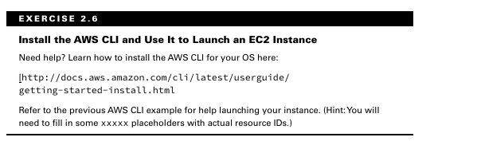

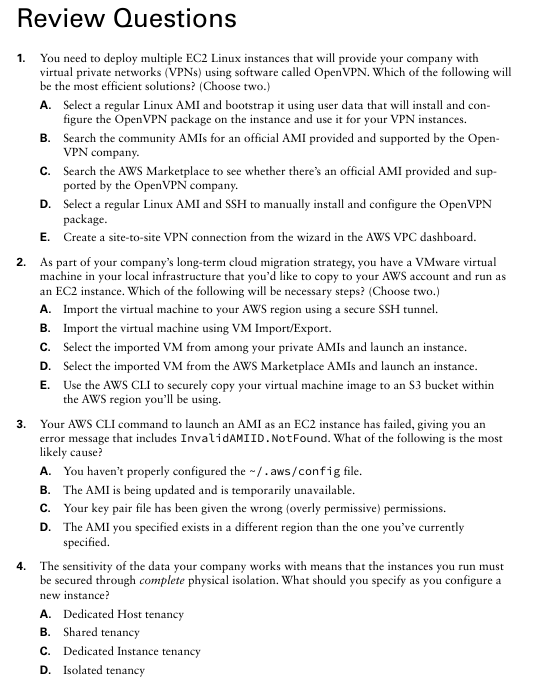

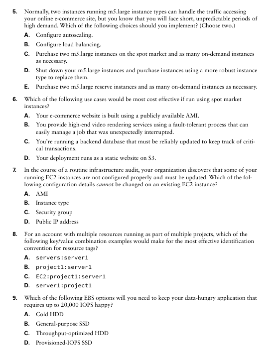

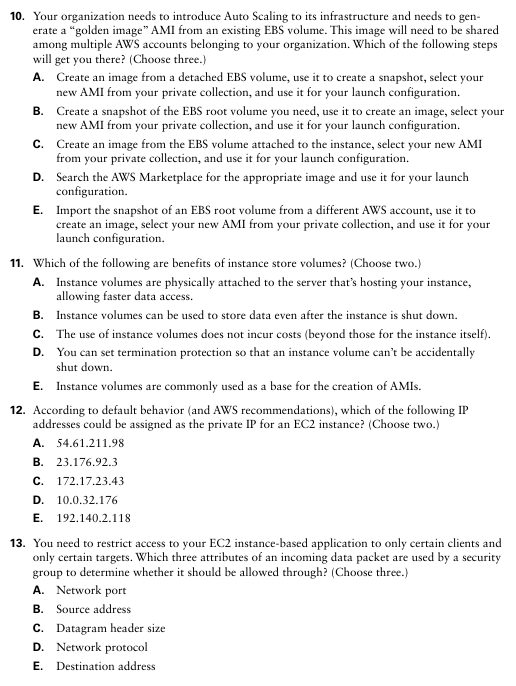

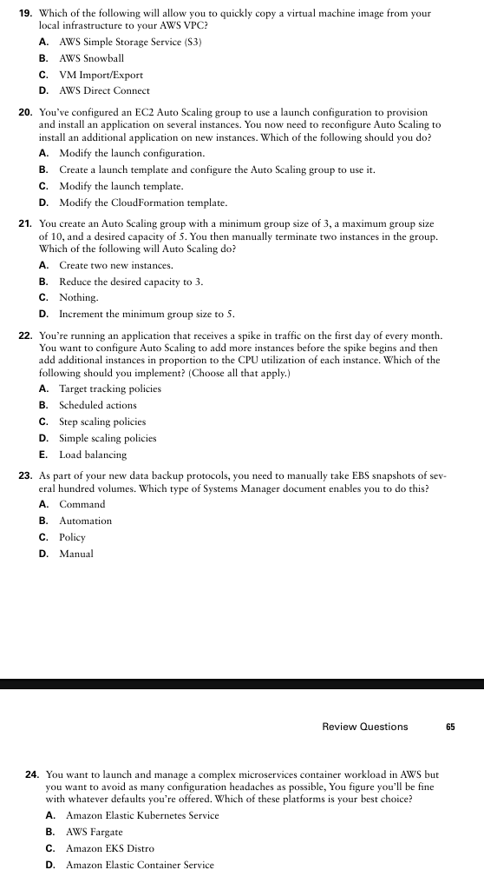
