# **Chapter 3: AWS Storage**

في الشابتر ده، هنعمل `deep dive` في عالم الـ `storage` على AWS. هنبدأ بأهم وأشهر `service` وهي `Amazon S3`، وهنفصصها حتة حتة، وبعدين هنشوف باقي خدمات الـ `storage` المهمة وإزاي بنستخدمها.

## **مقدمة**


خدمة `Amazon Simple Storage Service (S3)` هي المكان اللي الأفراد، والتطبيقات، ولستة طويلة من

 خدمات `AWS` بيحفظوا فيه الداتا بتاعتهم. هي منصة ممتازة للحاجات دي:

*   الاحتفاظ بأArchives للـ `backup`، وملفات الـ `log`، ونسخ من  الـ `disaster recovery`.
*   عمل `analytics` على `big data` وهي `at rest`.
*    `static hosting websistes`.


`S3` بيوفر `storage` رخيص وتقدر تعتمد عليه، وممكن، لو لزم الأمر، يتكامل بشكل كويس قوي مع عمليات شغالة جوه `AWS` أو براها.

ده **مش هو هو** نفس الـ `operating system volumes` اللي اتعلمتها في الفصل اللي فات؛ دي بتتحفظ على `block storage volumes` اللي بتشغل الـ `EC2 instances` بتاعتك. `S3`، على النقيض، بيوفر مساحة لـ `object storage` غير محدودة فعليًا.


> [!WARNING]
>
> ملحوظة مفيش حاجة اسمه update فى s3 لو ركزت شوية هتعرف ان مفيش مفهوم البلوك فعشان كده لما تعوز تعدل حاجة لازم تنزله وترفعه تاني مفيش حاجة فى الدنيا احسن من حاجة فى كل شئ فى الاخر كلها عملية trade off
> عشان كده مستحيل تتعامل فى Transactional Database (زي MySQL, PostgreSQL, SQL Server)  لان database بتتعامل مع blocks 

وبناءً على ده، في الـ `chapter` ده، هنتعلم الحاجات دي:

*   إزاي الـ `S3 objects` بتتحفظ، وبتتدار، وإزاي بنعملها `access`.
*   إزاي تختار ما بين الـ `storage classes` المختلفة عشان توصل للتوازن الصح بين الـ `durability` والـ `availability` والـ `cost`.
*   إزاي تدير الـ `life cycles` بتاعة تخزين الداتا على المدى الطويل، عن طريق إنك تدخل `Amazon S3 Glacier` في الديزاين بتاعك.
*   إيه هي الـ `AWS services` التانية اللي ممكن تساعدك في عمليات تخزين الداتا والـ `access` عليها.

## S3 Service Architecture

انت بتنظم الفايلات بتاعتك في `S3` جوه حاجة اسمها `buckets`. بشكل افتراضي، مسموحلك تعمل لحد 100 `bucket` لكل `AWS account` عندك. وزي أي `AWS service` تانية، ممكن تطلب من `AWS` إنهم يزودولك الـ `limit` ده.

مع إن الـ `S3 bucket` والمحتويات بتاعته بتبقى موجودة في `AWS region` واحدة بس، الاسم اللي بتختاره للـ `bucket` لازم يكون `globally unique` على مستوى الـ `S3 system` كله. والموضوع ده منطقي؛ لإنك غالبًا هتبقى عايز الداتا بتاعتك تكون في منطقة جغرافية معينة عشان أسباب ليها علاقة بالـ `operational needs` أو الـ `regulatory needs`. بس في نفس الوقت، فكرة إنك تقدر تعمل `reference` للـ `bucket` من غير ما تحدد الـ `region` بتاعته، ده بيبسط العملية.

ده الـ `URL` اللي هتستخدمه عشان تعمل `access` لفايل اسمه `filename` موجود جوه `bucket` اسمه `bucketname` عن طريق الـ `HTTP`:

`s3.amazonaws.com/bucketname/filename`

طبعًا، ده معناه إنك لازم تكون قادر تحقق الـ `permissions requirements` بتاعة الـ `object` ده.

ودي الطريقة اللي نفس الفايل ده بيتجاب بيها لو بتستخدم الـ `AWS CLI`:

`s3://bucketname/filename`

### Prefixes and Delimiters

زي ما اتفقنا قبل كده، `S3` في حقيقته عبارة عن `flat surface` ضخمة. يعني لو رميت فيه مليون `object`، هما فعليًا مرصوصين جنب بعض في مساحة واحدة كبيرة من غير أي فولدرات أو `subfolders` حقيقية. وده عكس تمامًا أي `file system` اتعاملنا معاه قبل كده زي اللي على جهازك.

**طيب، لو الدنيا بالبساطة دي، إزاي لما بفتح `AWS Console` بشوف فولدرات منظمة وشكلها حلو؟**

هنا بتيجي عبقرية وبساطة `S3`. النظام بيستخدم حيلة بسيطة جدًا لكن فعالة عشان يديك إحساس التنظيم ده. الحيلة دي قايمة على حاجتين: **`Prefixes`** و **`Delimiters`**.

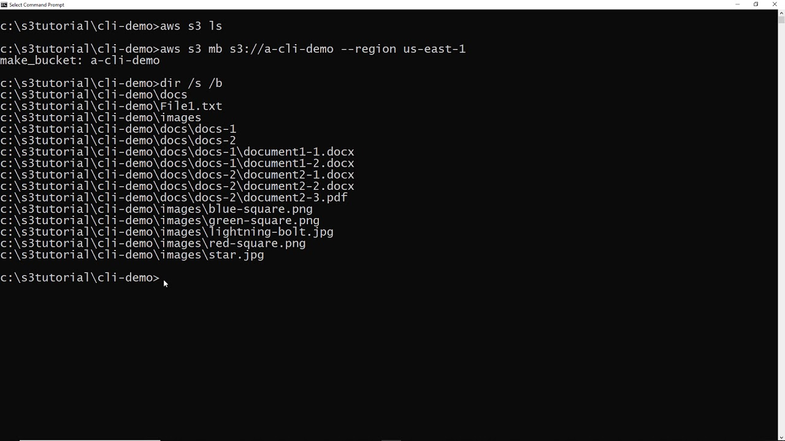

1.  **اسم الـ `Object` هو كل حاجة:**
    في `S3`، مفيش حاجة اسمها File Path. فيه حاجة واحدة بس اسمها **" الـ `Object`" (`Object Key`)**. الـ `key` ده هو الاسم unique للـ `object` جوه الـ `bucket`.

    يعني لو عندك ملف اسمه `report.pdf` وحطيته جوه فولدر اسمه `invoices`، في نظام الملفات العادي بيبقى عندك حاجتين: الفولدر والملف. في `S3`، أنت معندكش غير حاجة واحدة: `object` الـ `key` بتاعه هو `invoices/report.pdf`. **السطر ده كله على بعضه هو مجرد اسم.**

2.  **الـ `Prefix`:**
    الـ `prefix` هو أي جزء من بداية الـ `object key`.
    
    *   في المثال اللي فات (`invoices/report.pdf`)، كلمة `invoices/` تعتبر `prefix`.
    *   كلمة `invoices` لوحدها تعتبر `prefix`.
    *   كلمة `invoi` تعتبر `prefix`.
    الـ `prefix` ده بيسمحلك تعمل `query` على كل الـ `objects` اللي بتبدأ بنفس الحروف. يعني تقدر تقول لـ `S3`: "يا `S3`، هاتلي كل الـ `objects` اللي الـ `key` بتاعها بيبدأ بـ `invoices/`"، فهيجيبلك كل فواتيرك.
    
3.  **الـ `Delimiter`:**
    ده بقى هو سر الخدعة كلها. الـ `delimiter` هو مجرد حرف انت بتتفق عليه مع `S3 API` عشان يفصل مستويات التنظيم. الحرف الأشهر عالميًا هو الشرطة المايلة `/`.

    لما بتيجي تعرض محتويات الـ `bucket` بتاعك من خلال الـ `Console` أو بتعمل `API call`، انت بتقول للـ `API`: "اعرضلي محتويات الـ `bucket` ده، واعتبر إن الـ `delimiter` بتاعي هو `/`".

    **إيه اللي بيحصل جوه الـ `API`؟**
    الـ `API` بيبص على كل الـ `object keys` اللي عندك. أي `key` فيه `/`، بيعتبر كل الكلام اللي قبل الـ `/` ده "فولدر وهمي". ولو فيه كذا `object` ليهم نفس الـ `prefix` (زي `invoices/report1.pdf` و `invoices/report2.pdf`)، الـ `API` بيجمعهم كلهم تحت `prefix` واحد مشترك ويعرضهولك على شكل أيقونة فولدر اسمها `invoices`.

    **عشان كده، الـ `folder` اللي بتشوفه في الـ `console` ده مش `object` حقيقي، ده مجرد  `visual representation` لمجموعة `objects` بتشترك في نفس الـ `prefix`.** الدليل على كده، إنك لو مسحت كل الـ `objects` اللي جوه فولدر وهمي، الفولدر نفسه هيختفي، لأنه أصلًا مكنش موجود ككيان مستقل.

تخيل عندك الـ 3 `objects` دول في الـ `bucket` بتاعك:

1.  `images/cats/grumpy.jpg`
2.  `images/cats/happy.jpg`
3.  `images/dogs/sad.jpg`

في الحقيقة، دول 3 `objects` مرصوصين جنب بعض على الـ `flat surface`.

لكن لما تيجي تفتح الـ `Console` أو تكلم الـ `API` وتستخدم `/` كـ `delimiter`:
*   الـ `API` هيبص على الـ `keys` ويلاقي إن فيه `prefix` مشترك اسمه `images/`. هيعرضلك فولدر اسمه `images`.
*   لما تدوس على فولدر `images`، انت كأنك بتقول للـ `API`: "هاتلي كل اللي بيبدأ بـ `images/` واستخدم `/` كـ `delimiter` تاني".
*   الـ `API` هيبص على `images/cats/` و `images/dogs/`. هيلاقي اتنين `prefixes` جداد مشتركين، فهيعرضلك جوا فولدر `images` فولدرين تانيين اسمهم `cats` و `dogs`.

وهكذا. هي كلها حيلة برمجية ذكية بتحاكي شكل الـ `file system` اللي احنا متعودين عليه، عشان تخلي حياتنا أسهل، لكن من غير تعقيدات وتكاليف إدارة `file system` حقيقي.

مثال

```terraform
resource "aws_s3_bucket" "my_s3_demo_bucket" {
  bucket = "my-unique-s3-flat-demo-bucket-123456789" 
}
resource "aws_s3_object" "just_a_file" {
  bucket = aws_s3_bucket.my_s3_demo_bucket.id
  key    = "just_a_file.txt"
  source = "${path.root}/just_a_file.txt"
  content_type = "text/plain"
}
resource "aws_s3_bucket_object" "just_a_content" {
  bucket = aws_s3_bucket.my_s3_demo_bucket.id
  key    = "justcontent/just_a_file.txt"
  content = "Just some content in a file"
}
```

`aws_s3_bucket` ده resource اللي بتنشاء بيه s3 و bucket ده اللي بتحدد فيه اسمه ولازم يكون unique على aws بالكامل وregion بتتحط بشكل default من provider اللي انت حططه ممكن تعمل overwrite وتغير وaws_s3_object عشان تنقل ملف تحطه فى s3 و key انت فاهم ده ايه source هو مكان الملف اللي عايز انت ترفعه وبرده content_type مش الزامية هو ممكن يعرفه من امتداد الملف بشكل تلقائي والثانية انت بتنقل content تحطه فى ملف

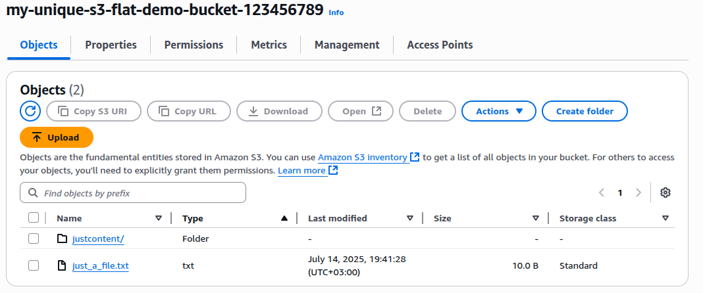


### **التعامل مع الـ `Large Objects`**

مع إنه مفيش حد أقصى نظريًا لكمية الداتا اللي ممكن تخزنها جوه أي `bucket`، لكن الـ `object` الواحد مينفعش حجمه يزيد عن 5 تيرابايت. وعمليات الـ `upload` المنفردة مينفعش تزيد عن 5 جيجابايت. عشان تقلل خطر إن الداتا تضيع أو عملية الـ `upload` تفشل في النص، `AWS` بتنصح إنك تستخدم `feature` اسمها **`Multipart Upload`** لأي `object` حجمه أكبر من 100 ميجابايت.

زي ما الاسم بيوحي، الـ `Multipart Upload` بيكسّر الـ `object` الكبير لأجزاء صغيرة متعددة، ويبعتهم واحد ورا التاني للـ `S3`. ولو أي جزء منهم فشل وهو بيتبعت، ممكن تعيد إرساله هو لوحده من غير ما تأثر على باقي الأجزاء اللي وصلت خلاص.

الـ `Multipart Upload` بيشتغل لوحده أوتوماتيك لو بتعمل الـ `upload` من خلال الـ **`AWS CLI`** أو من خلال **`high-level API`**. لكن لو شغال بـ **`low-level API`**، هتحتاج تكسّر الـ `object` بتاعك بنفسك بشكل يدوي.

ولو محتاج تنقل ملفات كبيرة لـ `S3 bucket`، فيه `configuration` اسمه 
**`Amazon S3 Transfer Acceleration`** ممكن يسرّعلك الدنيا. لما بتظبط الـ `bucket` إنه يستخدم `Transfer Acceleration`، عمليات الـ `upload` بتتوجه لأقرب `AWS edge location` ليك جغرافيًا، ومن هناك بتكمل طريقها باستخدام الشبكة الداخلية بتاعة أمازون نفسها (ودي أسرع بكتير من الإنترنت العادي).

عشان تعرف إذا كان الـ `Transfer Acceleration` ده هيحسن سرعة النقل فعلًا من مكانك لـ `AWS region` معينة، ممكن تستخدم أداة **`Amazon S3 Transfer Acceleration Speed Comparison tool`** . ولو اكتشفت إن عمليات النقل بتاعتك فعلًا هتستفيد من الـ `Transfer Acceleration`، المفروض تعمل `enable` للـ `setting` ده في الـ `bucket` بتاعك. وبعدها تقدر تستخدم `endpoint domain names` مخصوصة
 (زي `bucketname.s3-accelerate.amazonaws.com`) في عمليات النقل بتاعتك.

> [!IMPORTANT]
>
> براحه كده عشان نفهم هنمشي ازاي لو عايز انقل data من عندي على s3 فى aws
> وبتروح على الموقع ده
> https://s3-accelerate-speedtest.s3-accelerate.amazonaws.com/en/accelerate-speed-comparsion.html 
> 
>
> 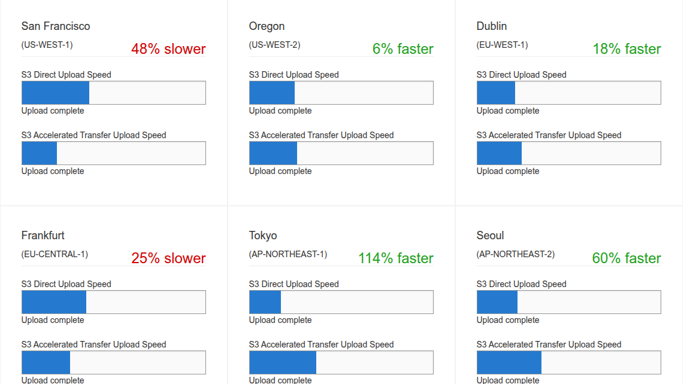
>
> بتشوف حجم الاستفادة اللي فى سرعة النقل ....بص حق الله انا مش عارف جاب الارقام دي ازاي بس كا طه انا بضرب كف على كف لان انا فى الغربية ازاي tokyo هتكون اسرع بالنسبة ليه من frankfurt بس هنقول ايه aws هي اللي ليك بتختار اسرع AWS edge location بالنسبة لجهازك او الجهاز اللي عليه data اللي انت عايزه 
>
> انت بس بتشوف اذا كنا فى استفادة او لاء
>
> بس خلي باللك فيه فلوس زيادة 
>
>
> ```terraform
> resource "aws_s3_bucket" "my_bucket" {
> bucket = "my-accelerated-bucket-123456"  
> }
> 
> 
> resource "aws_s3_bucket_accelerate_configuration" "acceleration" {
> bucket = aws_s3_bucket.my_bucket.id
> status = "Enabled"
> } 
> output "s3_accelerated_endpoint" {
> value = "https://${aws_s3_bucket.my_bucket.bucket}.s3-accelerate.amazonaws.com"
> }
> 
> ```
>
> وتاخد output وترفع عن طريق aws cli 
> ```bash
> $ aws s3 cp myfile.zip s3://my-accelerated-bucket-123456/ --endpoint-url https://my-accelerated-bucket-123456.s3-accelerate.amazonaws.com
> 
> ```
>
> على فكرة ممكن ترفع بـterraform بتستخدام  reference اسمه provisioner و null_resource  دا لو انت شاطر شوية 
> خلي باللك هي اللي بتختار edge location مش انت ,aws بتشوف الاسرع وبتنقل
> الموقع اللي فوق عشان تشوف لو في فايدة اساسا لو انت استخدمته او لاء

جرب بنفسك في **`Exercise 3.1`** واعمل الـ `bucket` بتاعك.

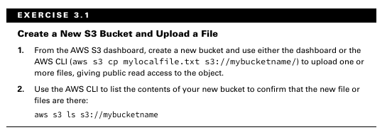


### **الـ `Encryption`**

أي داتا بتتحط على `S3` المفروض دايمًا تكون `encrypted` (متشفرة)، إلا طبعًا لو كانت معمولة عشان تبقى متاحة للكل — زي مثلاً لو هي جزء من `website`. أنت ممكن تستخدم `encryption keys` عشان تحمي الداتا بتاعتك وهي متخزنة جوه `S3` (ودي بنسميها **`data at rest`**)، وكمان عشان تحميها وهي بتتنقل من وإلى `S3` (ودي بنسميها **`data in transit`**)، وده عن طريق إنك تستخدم الـ `encrypted API endpoints` بتاعة أمازون بس.

الـ `data at rest` ممكن نحميها بطريقتين: يا إما `server-side encryption` أو `client-side encryption`.

> [!IMPORTANT]
>
> > **Data at rest (الداتا وهي في مكانها):** دي الداتا وهي متخزنة فعليًا ومستقرة، يعني الفايلات وهي قاعدة على الهارد ديسكات في الداتا سنترز بتاعة أمازون. حمايتها معناها إن لو حد قدر يوصل للديسك نفسه، ميقدرش يقرأ الداتا اللي عليه.
> >
> > **Data in transit (الداتا وهي بتتحرك):** دي الداتا وهي في رحلتها بتتنقل من مكان للتاني عبر شبكة (زي الإنترنت). زي مثلاً وقت ما بتعمل upload لملف من جهازك لـ S3، أو بتعمل download لملف منه. حمايتها معناها إن لو حد بيتجسس على الشبكة، هيشوف كلام متلغبط ومشفّر مش هيفهم منه حاجة.


#### **الـ `Server-Side Encryption`**

الـ "server-side" هنا هو منصة `S3` نفسها. الفكرة إن `AWS` هي اللي بتعمل `encrypt` للـ `data objects` بتاعتك أول ما بتتخزن على الديسكات بتاعتها، وهي اللي بتعملها `decrypt` لما بتبعتلها `requests` سليمة وموثقة عشان تسترجع الداتا دي.

عندك تلات اختيارات ممكن تستخدمهم في النوع ده:

##### **`Server-Side Encryption with Amazon S3-Managed Keys (SSE-S3)`**:

في الاختيار ده، `AWS` بتستخدم الـ `keys` بتاعتها الخاصة بيها عشان تدير كل خطوة في عملية الـ `encryption` والـ `decryption`. ده أبسط نوع، انت مش بتعمل أي حاجة غير إنك بتفعّله.


```terraform
resource "aws_s3_bucket" "sse_s3_demo_bucket" {
  bucket = "my-sse-s3-demo-bucket-unique-123456789" 


  server_side_encryption_configuration {
    rule {
      apply_server_side_encryption_by_default {
        sse_algorithm = "AES256" # This enables SSE-S3 as the default
      }
    }
  }
}
```

 **Server-Side Encryption with Amazon S3-Managed Keys (SSE-S3)** ده يعتبر أبسط وأسهل نوع encryption ممكن تفعله على S3. كل اللي عليك إنك تحدده في الـ Terraform code أو في الـ console، وAWS بتتكفل بكل حاجة، من توليد الـ encryption keys وتخزينها لغاية rotation وحمايتها، وده طبعاً بيقلل الـ overhead بتاع إدارة الـ security عليك بشكل كبير لدرجة إن الـ Key Management بيبقى صفر. وفوق كل ده، مفيش أي تكاليف إضافية لاستخدام SSE-S3، هو free تماماً مع الـ storage العادي اللي بتدفعه لـ S3.

لكن لازم تكون واخد بالك إن ليه شوية عيوب. أولاً، مفيش Audit Trail لاستخدام الـ Keys، يعني مش هتقدر تعرف مين عمل access على الـ encryption keys اللي S3 بيستخدمها ولا إمتى، ده لأن AWS بتديرها بشكل داخلي ومش بيظهر في الـ logs بتاعتك زي CloudTrail (وده طبعاً عكس SSE-KMS). ثانياً، تحكمك في الـ Keys دي بيبقى محدود جداً، بما إن AWS هي اللي بتدير كل حاجة، فممكن ده ميكونش كافي لو عندك متطلبات compliance معينة بتفرض عليك تحكم أكبر في الـ keys. وأخيراً، الـ trust boundary بتاعتك كلها بتبقى عند AWS، يعني بما إن AWS بتدير الـ data بتاعتك وكمان بتدير الـ encryption keys بتاعتها، لو عندك شك أو قلق إن AWS نفسها ممكن توصل لداتك، فـ SSE-S3 مش هيمنع ده نظرياً لأن AWS عندها الـ keys.


------

----

##### **`Server-Side Encryption with AWS KMS-Managed Keys (SSE-KMS)`**:

هنا الموضوع أعمق شوية من الـ `SSE-S3`. `AWS` بتستخدم خدمة الـ `Key Management Service (KMS)`، وده بيضيف طبقة حماية زيادة اسمها `envelope key`، والأهم إنه بيديلك `audit trail` كامل تقدر تتبع منه مين استخدم الـ `key` ده وإمتى. وكمان ممكن اختيارياً تعمل `import` للـ `keys` بتاعتك الخاصة جوه خدمة `KMS`.


> [!TIP]
>
> الـ `envelope key` في سياق `SSE-KMS` هو ببساطة **الـ `Data Key` المشفر**.
>
> يعني: `KMS` بيولد `Data Key` (unique key لكل ملف) عشان يشفر الداتا بتاعتك. وبعدين بيشفر الـ `Data Key` ده نفسه باستخدام الـ `CMK` بتاعك (المفتاح الرئيسي في `KMS`).
>
> الـ `Data Key` المشفر ده هو اللي بيتسمى `envelope key` أو عشان يحمي الـ `Data Key` الأصلي اللي هو موجود فى kms ، وده بيضيف طبقة حماية زيادة.
> بس دا معناها كل عملية تشفير وفك تشفير لازم تروح تجيب master key عشان يفك تشفير data key وبعده تفك تشفير data الفعلية

بالنسبة لـ **`Server-Side Encryption with AWS KMS-Managed Keys (SSE-KMS)`**، هو بيوفرلك `Audit Trail` مفصل جداً، فـ كل عملية استخدام للـ `CMK` بتاعك (سواء تشفير أو فك تشفير) بتتسجل بالمللي في `AWS CloudTrail`، وده بيديلك سجل أمني كامل تقدر تعرف منه مين عمل `access` على الداتا وإمتى، وبيبقى مهم أوي لـ `compliance` والـ `auditing`. كمان بتلاقي تحكم دقيق في الـ `Keys` دي، بتقدر تتحكم في الـ `policies` بتاع الـ `CMK` وتحدد بالظبط مين مسموحله يستخدمه وإزاي. ده غير إن `KMS` نفسه بيوفر خدمة مدارة بتسهل عليك إدارة الـ `keys`، بما في ذلك `key rotation` تلقائي، وده طبعاً بيقلل التعقيد عليك. وفوق ده كله، `KMS` بيستخدم طريقة اسمها `envelope encryption`، اللي بتشفر الـ `data key` نفسه (اللي بيشفر الداتا) باستخدام الـ `CMK` بتاعك، وده بيضيف طبقة حماية إضافية. عندك كمان إمكانية إنك تعمل `Import` لـ `Keys` خاصة بيك لو جاي بيها من بره `AWS` وتستخدمها. ومؤخراً، في `feature` اسمها `Bucket Keys` اللي بتستخدم `bucket_key_enabled = true` ودي بتقلل تكلفة `KMS requests` بشكل كبير لو عندك ملايين الـ `objects`، لأن `S3` بيطلب `bucket key` واحد بدل `data key` لكل `object`.

> [!NOTE]
>
> لما بتفعّل `bucket_key_enabled = true` في S3 مع التشفير بـ KMS، بتقلل عدد المرات اللي S3 بيطلب فيها مفتاح التشفير من خدمة KMS. في الوضع العادي، كل ملف بيرفع أو بيتحمّل بيعمل طلب لـ KMS، وده بيتحاسب عليه. لكن لما الخاصية دي بتبقى مفعّلة، S3 بيستخدم مفتاح مؤقت مرتبط بالـ bucket نفسه (اسمه bucket key) وبيعيد استخدامه لفترة، بدل ما يطلب من KMS كل مرة. وده بيقلل عدد الطلبات على KMS وبالتالي بيقلل التكلفة، خصوصًا لو بتتعامل مع ملفات كتير. 
> الميزة دي كمان موجدة بس فى
>  (Dual-Layer Server-Side Encryption with AWS KMS Keys (DSSE-KMS))
> لسه هنشوف 

لكن على الناحية التانية، `SSE-KMS` ليه عيوب. أولها وأهمها هي التكلفة الإضافية، استخدام `KMS` مش مجاني، وبيتحاسب عليك على عدد الـ `CMKs` اللي انت عاملها، وكمان على كل `API request` لـ `KMS` (يعني كل عملية تشفير أو فك تشفير). وثانياً، بيعتبر تعقيد نسبي في الإعداد والإدارة عن `SSE-S3`، لأنك بتضيف خدمة `KMS` كاملة ولازم تكون فاهم الـ `permissions` بتاعتها كويس.


```terraform
resource "aws_kms_key" "my_s3_kms_key" {
  description             = "KMS key for S3 default SSE-KMS encryption"
  # deletion_window_in_days = 7 # Minimum is 7 days before delete
  # enable_key_rotation     = true # genertae new key every year
}

resource "aws_s3_bucket" "my_s3_demo_bucket" {
  bucket = "my-unique-s3-flat-demo-bucket-123456789" 
}
resource "aws_s3_bucket_server_side_encryption_configuration" "encrypt_s3" {
  
  bucket = aws_s3_bucket.my_s3_demo_bucket.id
  rule {
    apply_server_side_encryption_by_default {
      sse_algorithm     = "aws:kms"
      kms_master_key_id = aws_kms_key.my_s3_kms_key.id
    }
  }
}
resource "aws_s3_object" "send_file" {
  
  bucket = aws_s3_bucket.my_s3_demo_bucket.id
  key    = "file.txt"
  source = "${path.root}/just_a_file.txt"
  content_type = "text/plain"
}
```

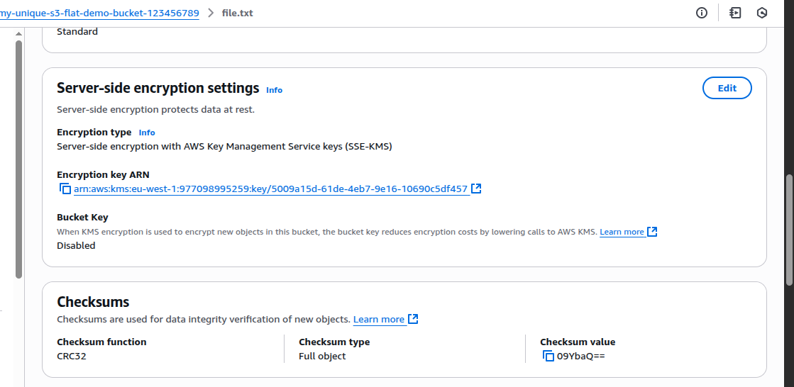

---

----


##### **`Server-Side Encryption with Customer-Provided Keys (SSE-C)`**:

الاختيار ده بيخليك انت اللي تدي لـ `S3` الـ `key` اللي هيستخدمه في عملية الـ `encryption`. يعني مع كل `request` لرفع ملف أو قراءته، لازم تبعت الـ `key` بتاعك معاه.

**SSE-C** هو نوع من أنواع التشفير في S3 بيديك **تحكم كامل في مفتاح التشفير**، يعني إنت اللي بتولّد المفتاح وتحفظه، وAWS ما بتشيلش عندها نسخة منه خالص. ده بيخلي الطريقة دي مناسبة جدًا لو عندك سياسات أمان أو قوانين مش بتسمح إن المفاتيح تتخزن عند حد تاني، زي في بعض الشركات أو المؤسسات الحكومية. كمان لو عندك نظام خارجي هو اللي بيدير المفاتيح، أو مش عايز تعتمد على KMS من AWS، يبقى SSE-C حل كويس وسهل في بعض الحالات.

بس برضو ليه شوية عيوب مهمة. أول حاجة، **لو المفتاح ضاع، الملف كأنه عمره ما كان موجود**، AWS مش هتعرف تساعدك في استرجاعه. كمان **ماينفعش تتعامل مع الملفات دي من خلال الـ AWS Console** (اللي هو الموقع)، يعني مش هتعرف تفتح أو تنزّل الملفات من المتصفح، وهتشوف رسائل زي "Unknown Error" وخلاص.

كمان **SSE-C مش شغال مع كل خدمات AWS**، زي:

- Amazon Athena
- S3 Select
- CloudFront
- وبعض ميزات  في S3

وفوق ده كله، **كل مرة ترفع أو تنزّل فيها ملف، لازم تبعت المفتاح يدوي**، وده ممكن يبقى خطر لو الاتصال مش متأمن كويس.

مثال

```terraform
provider "aws" {
  region = "us-east-1"
}

resource "aws_s3_bucket" "sse_c_demo_bucket" {
  bucket = "my-sse-c-demo-bucket-unique-123456789"
  acl    = "private"
}


output "sse_c_bucket_name" {
  value       = aws_s3_bucket.sse_c_demo_bucket.bucket
  description = "Name of the S3 bucket used for SSE-C demo."
}
```


أولاً: اعمل generate للـ `Encryption Key` بتاعك :**

لازم يكون المفتاح بالضبط 32 بايت (256 بت) علشان يناسب خوارزمية AES256 ولازم يكون base64

ولازم اعمل md5 معاها 

```bash
KEY_B64=$(openssl rand -base64 32)
KEY_MD5=$(echo -n "$KEY_B64" | base64 -d | openssl dgst -md5 -binary | base64)

```


**ثانياً: ارفع الملف مشفراً بـ `SSE-C` باستخدام الـ `AWS CLI`:**

```
aws s3api put-object \
  --bucket my-unique-s3-flat-demo-bucket-123456789 \
  --key myfile.txt \
  --body ./just_a_file.txt \
  --sse-customer-algorithm AES256 \
  --sse-customer-key "$KEY_B64" \
  --sse-customer-key-md5 "$KEY_MD5"
```

لما تفتح الـ `AWS S3 Console` بعد ما تنفذ أمر الـ `CLI`، هتلاقي الملف `myfile.txt.txt` في الـ `properties`

وعشان تعمل download

```
aws s3api get-object \
  --bucket my-unique-s3-flat-demo-bucket-123456789 \
  --key myfile.txt \
  --sse-customer-algorithm AES256 \
  --sse-customer-key "$KEY_B64" \
  --sse-customer-key-md5 "$KEY_MD5" \
  ./downloaded_myfile.txt

```

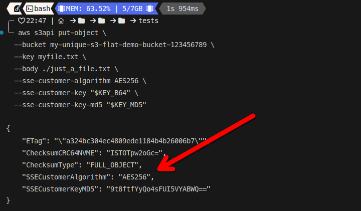
كان المفروض يظهر معايا  بس طلع مينفعش
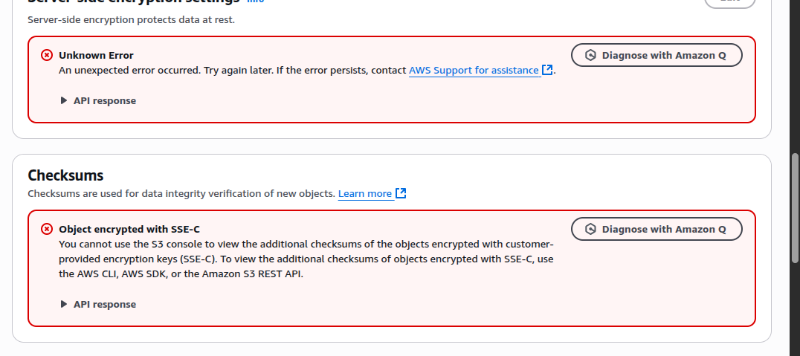

---

---


##### الـ **`Dual-Layer Server-Side Encryption with AWS KMS Keys (DSSE-KMS)`** 

يعتبر أحدث وأعلى مستوى من الـ `server-side encryption` اللي بتوفره `S3` بالتعاون مع `KMS`. هو بيزود طبقة `encryption` إضافية فوق `SSE-KMS` العادي، ده غير إنه بيضيف `cryptographic signature` (بيضمن `data integrity` و`non-repudiation`، يعني مش بس الداتا بتتشفر بطبقتين عشان تضمن أعلى مستوى `Security` زي kms، لأ كمان بيتم digital signature  عليها  عشان تتأكد إنها متغيرتش من ساعة ما اتخزنت في `S3`، وإنها جاية فعلاً من `S3`، وده طبعاً بيخليه مثالي لـ `workloads` اللي ليها `compliance requirements` صارمة جداً زي اللي في قطاعات `financial`, `healthcare`, و `government` اللي بتحتاج أقصى درجات التأكيد على `security` و`integrity` الداتا.

> [!TIP]
>
> هنا object data بتتشفر **مرتين** (طبقتين `encryption`) بشكل متتالي:
>
> 1.  **الطبقة الأولى:** الـ `object data` بتتشفر بواسطة `Data Key #1`. الـ `Data Key #1` ده بيتشفر بالـ `CMK` بتاعك في `KMS`.
> 2.  **الطبقة الثانية:** الـ `object` اللي بقى مشفر بالطبقة الأولى ده (يعني `encrypted data #1`) بيتم **إعادة تشفيره** (تشفر تاني) بواسطة `Data Key #2`. والـ `Data Key #2` ده برضه بيتشفر بالـ `CMK` بتاعك في `KMS`.
>
> *    الـ `object` نفسه بيعدي على عمليتين تشفير متتاليتين، عشان كده اسمها `Dual-Layer`. وده غير الـ `cryptographic signature` اللي بيضيفه عشان يضمن data integrity.
>
> 

لكن من الناحية التانية، `DSSE-KMS` ليه عيوب، أهمها التكلفة الأعلى مقارنة بـ `SSE-KMS` العادي، وده بسبب عمليات التشفير وdigital signature الإضافية في `KMS`. كمان فيه أداء أقل نسبياً، لأن طبقات الـ `encryption` الإضافية وعملية digital signature دي ممكن تأثر على الـ `latency`و`throughput`  لعمليات الكتابة والقراءة على `S3`، خصوصاً لو بتتعامل مع عدد ضخم جداً من الـ `objects` أو `high-throughput workloads`. ورغم إن `Terraform` بيسهل عليك إعداده، إلا إنه بيظل أكثر تعقيداً في الفهم والتطبيق من الأنواع التانية.


```terraform

resource "aws_kms_key" "my_dsse_kms_key" {
  description             = "KMS key for S3 DSSE-KMS encryption"
  deletion_window_in_days = 7  # Minimum 7 days before the key can be permanently deleted after scheduling
  enable_key_rotation     = true # Best practice: enables automatic key material rotation annually
}

resource "aws_s3_bucket" "dsse_demo_bucket" {
  bucket = "my-dsse-kms-demo-bucket-unique-123456789" # IMPORTANT: Change this to a globally unique name!
}

resource "aws_s3_bucket_server_side_encryption_configuration" "dsse_bucket_encryption_config" {
  bucket = aws_s3_bucket.dsse_demo_bucket.id

  rule {
    apply_server_side_encryption_by_default {
      sse_algorithm     = "aws:kms:dsse" 
      kms_master_key_id = aws_kms_key.my_dsse_kms_key.arn 
      # bucket_key_enabled = true
    }
  }
}

resource "aws_s3_object" "dsse_encrypted_object" {
  bucket       = aws_s3_bucket.dsse_demo_bucket.id
  key          = "just_a_file.txt" 
  source       = "${path.root}/just_a_file.txt" 
  content_type = "text/plain" 
}


```


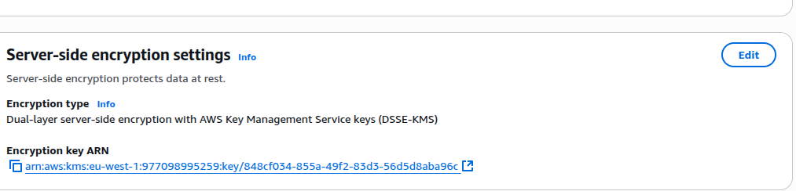


#### **الـ `Client-Side Encryption`**

الـ `Client-Side Encryption` ده قصة تانية خالص في عالم تشفير الداتا على `S3`. الفكرة هنا إنك بتشفر الداتا بتاعتك وهي لسه عندك على جهازك أو في الـ `application` بتاعتك، قبل ما تطلع حتى من شبكتك وتروح لـ `S3`. يعني على عكس الـ `Server-Side Encryption` بأنواعه اللي فاتت، اللي `S3` هو اللي بيتولى عملية التشفير بعد ما الداتا توصل عنده، هنا أنت اللي بتعمل الشغلانة دي كلها. وده طبعاً معناه إن `encryption keys` بتاعتك أنت اللي بتديرها بالكامل.

في طريقتين رئيسيتين عشان تعمل كده:

##### **الطريقة الأولى: باستخدام `AWS KMS–Managed Customer Master Key (CMK)`**

هنا الفكرة إنك بتعتمد على خدمة `AWS KMS` بس مش عشان `S3` يشفر. لأ، ده عشان الـ `client` بتاعك (يعني الـ `application` أو السكريبت اللي بيعمل `upload` للداتا) هو اللي يروح لـ `KMS`. الـ `client` بيطلب من `KMS` إنه يولدله `data key` فريد لكل `object` انت عايز ترفعه. الـ `KMS` بتولد الـ `data key` ده وبتشفرلك الـ `data key` ده بالـ `CMK` بتاعك (اللي هو المفتاح الرئيسي اللي انت بتديره في `KMS`). بعد كده، الـ `client` بيستخدم الـ `data key` الـ `plaintext` ده عشان يشفر الداتا الأصلية بتاعتك على جهازك local، وأول ما الداتا تتشفر، الـ `data key` الـ `plaintext` بيتم مسحه، وبيتم رفع الداتا المشفرة ومعاها نسخة من الـ `data key` اللي كان مشفر بالـ `CMK` بتاعك. النقطة المهمة هنا إن `AWS` أو `S3` عمرهم ما شافوا الداتا بتاعتك `unencrypted`، ولا حتى الـ `data key` الـ `plaintext`.

##### **الطريقة التانية: باستخدام `Client-Side Master Key`**

دي معناها إنك بتجيب `encryption key` رئيسي خاص بيك أنت (مفتاح أنت اللي عملته وبتديره برا `AWS` خالص)، وده اللي بيسموه `Client-Side Master Key`. الـ `encryption client` بتاع `S3` اللي عندك على جهازك بيستخدم المفتاح الرئيسي ده عشان يولد `data keys` تكون unique لكل `object`، ويشفر بيها الداتا بتاعتك localy قبل ما ترفعها لـ `S3`. هنا بقى أنت المسؤول عن كل حاجة، من أول توليد الـ `master key` ده، تخزينه بأمان خارجي، و`rotation`، وحمايته من أي اختراق.

طيب، ليه أصلاً ممكن نلجأ للتعقيد ده كله؟ معظم الوقت، الـ `Server-Side Encryption` بأنواعه بيكفي وبيكون أسهل بكتير. لكن في حالات معينة، ممكن تكون شركتك أو الجهة الرقابية اللي بتتعامل معاها عندها `requirements` صارمة جداً بتطلب منك تحكم كامل 100% في الـ `encryption keys` بتاعتك. المتطلبات دي ممكن تكون إن `AWS` نفسها متشوفش الـ `data` بتاعتك `plaintext` أبداً، أو متقدرش توصل لـ `encryption keys` بتاعتك تحت أي ظروف (وده بيحقق مفهوم `zero-knowledge` بالنسبة لـ `AWS`). في الحالات دي، الـ `client-side encryption` بيبقى هو الخيار الوحيد اللي بيوفر مستوى الأمان ده.

بس زي ما في مميزات، فيه تعقيد. الـ `Client-Side Encryption` ده بيزود مسؤولية كبيرة عليك في إدارة الـ `keys` والـ `encryption process` كلها، وده بيخليه أكتر تعقيداً في الإعداد والإدارة عن الـ `server-side encryption` اللي `AWS` بتتكفل فيه بالجزء الأكبر.

> [!CAUTION]
>
> فيه نقطة مهمة قوي، إن أمثلة S3 أغلبها بتركز على إن الـ Bucket كله بياخد نفس نوع التشفير، وده مش هو الأساس. الأساس إن القوة الحقيقية لـ S3 هي إنك تقدر تحط قواعد تشفير لكل object لوحده، أو على prefix معين.
>
> أنت فعلًا تقدر تحدد نوع التشفير اللي عايزه وانت بترفع الملف، بس للأسف ده بيحتاج تستخدم الـ SDK أو الـ CLI، وده بيتعارض مع فلسفة Terraform.
>
> فالحل عشان نطبق فكرة إن كل object أو prefix ليه طريقة تشفير منفصلة بشكل يمشي مع Terraform، هو إننا بنستخدم Bucket Policy. دي مش بتشفّر بنفسها، هي بتشتغل  وبتيمنعك ترفع أي ملف إلا لو كان مستوفي شروط معينة أنت حاططها، زي إنه لازم يكون متشفر بـ KMS key معين.
>
> تقدر تجبر ان prefix  معين او objects تبقى متشفر دا عن طريق حاجة قدام فى access control فى s3 هنشوف ازاي تجبره انه لازم يشفرة ووممكن كمان تجبره على نوع تشفير معين وممكن تجبر على مفاتيح بعينه


---

### **الـ `Logging` في `S3`: **

 الـ `Logging` في `S3` – واللي هو ببساطة تتبع كل `event` أو نشاط بيحصل على الـ `S3 buckets` بتاعتك وتسجيله في `log files` – بيكون مقفول **بشكل افتراضي (`off by default`)**.

**طب ليه مقفول من الأول؟**
السبب الرئيسي بسيط وواضح: الـ `S3 buckets` دي ممكن يحصل عليها `activity` كتير قوي، يعني كميات `requests` مهولة في الثانية الواحدة. تخيل معايا إن `S3` لو كان بيسجل كل `request` بشكل افتراضي، كنا هنلاقي نفسنا غرقانين في كميات `log data` مهولة بشكل مش طبيعي. ومش كل `use case`  يستاهل الكميات دي كلها من الـ `logs` ولا التكلفة بتاعت تخزينها ومعالجتها. ساعات بتكون مجرد داتا عامة، أو داتا مش محتاجة `auditing` مفصل.

**إزاي بتشغّله؟ **
لما بتقرر إنك تفعل الـ `logging` ده عشان تراقب النشاط على الـ `buckets` بتاعتك، هتحتاج تحدد حاجتين رئيسيتين:

1.  **الـ `source bucket`**: ده الـ `bucket` الأصلي بتاعك اللي فيه الداتا اللي عايز تراقب مين بيعملها `access` أو بيعدل فيها. يعني ده الـ `bucket` اللي بيطلع منه الـ `events`.
2.  **الـ `target bucket`**: ده الـ `bucket` التاني اللي `S3` هيحفظ فيه الـ `log files` اللي هيطلعها من الـ `source bucket`. **مهم جداً:** الـ `target bucket` ده لازم يكون في **نفس الـ `AWS Region`** بتاع الـ `source bucket`. وليه بنستخدم `bucket` تاني؟ عشان `S3` ميخشش في `loop` لا نهائي وهو بيسجل `events` الـ `log files` اللي بيحطها في نفس الـ `bucket` اللي بيراقبه، وكمان عشان الـ `security` وفصل الـ `logs` عن الداتا الأساسية.

```terraform
resource "aws_s3_bucket" "s3_log_storage_bucket" {
  bucket = "my-s3-logs-destination-bucket-unique-123456789"
}

resource "aws_s3_bucket" "s3_source_data_bucket" {
  bucket = "my-s3-source-data-bucket-unique-123456789"
}

resource "aws_s3_bucket_logging" "source_bucket_access_logging" {
  bucket        = aws_s3_bucket.s3_source_data_bucket.id
  target_bucket = aws_s3_bucket.s3_log_storage_bucket.id
  target_prefix = "s3-access-logs/"
}
resource "aws_s3_bucket_object" "upload_file_as_example" {
  bucket = aws_s3_bucket.s3_source_data_bucket.id
  key    = "file.txt"
  content = "This is an example file for S3 access logging."
  
}
resource "aws_s3_bucket_policy" "allow_s3_logging" {
  bucket = aws_s3_bucket.s3_log_storage_bucket.id

  policy = jsonencode({
    Version = "2012-10-17",
    Statement = [
      {
        Sid = "S3ServerAccessLogsPolicy",
        Effect = "Allow",
        Principal = {
          Service = "logging.s3.amazonaws.com"
        },
        Action = "s3:PutObject",
        Resource = "${aws_s3_bucket.s3_log_storage_bucket.arn}/*"
      }
    ]
  })
}

```

، تسجيل الـ logs هنا مش بيتم real-time (يعني مش لحظي). فيه تأخير طبيعي في ظهور الـ log files في الـ target bucket، والتأخير ده ممكن يوصل لحد 30 دقيقة أو أكثر بين وقت حدوث الـ event الفعلي ووقت حفظ الـ log file بتاعه على S3. وده لأن S3 بيجمع الـ events على دفعات قبل ما يكتبها، وده بيساعد على تحسين الأداء وتقليل التكلفة. على عكس خدمات تانية في AWS (هنتكلم عنها قدام) ممكن توفرلك logs بشكل شبه لحظي، خدمة logging.s3.amazonaws.com المخصصة لتسجيل S3 access logs دي مبتشتغلش بالطريقة دي. أما الجزء الخاص بالـ aws_s3_bucket_policy، فده حيوي جداً! وظيفته الأساسية هي إنه يدي تصريح صريح للخدمة الداخلية logging.s3.amazonaws.com (وهي اللي بتمثل S3 Log Delivery Service) إنها تقدر تكتب log files على الـ s3_log_storage_bucket بتاعك. بدون الـ policy دي، S3 مش هيقدر يوصل للـ bucket ويكتب فيه الـ logs، وبالتالي مش هتظهر عندك.


> [!NOTE]
> فى اكثر من خدمة داخلية جو s3 لو لقيت الدنيا فى مساحة هعمل عليهم امثلة وشوف فى مصادر تانية 
>
> | الوظيفة أو الميزة                             | Service Principal                  | وظيفتها                                 |
> | --------------------------------------------- | ---------------------------------- | --------------------------------------- |
> | **S3 Server Access Logging**                  | `logging.s3.amazonaws.com`         | بتكتب logs عن الـ access داخل S3        |
> | **S3 Replication (Cross-Region Replication)** | `replication.s3.amazonaws.com`     | بتنسخ الملفات بين buckets  replication  |
> | **S3 Object Lambda**                          | `s3-object-lambda.amazonaws.com`   | بتعدل في الداتا أثناء عملية `GET` من S3 |
> | **S3 Multi-Region Access Points**             | `s3.amazonaws.com` (بشكل عام)      | بتدير الوصول الموحد عبر اكثر من region  |
> | **S3 Batch Operations**                       | `batchoperations.s3.amazonaws.com` | بتنفذ عمليات على كميات كبيرة من الملفات |

انا قعدة معايا فوق 30 دقيقة تقريبا 


**تنظيم الـ `Logs` (اختياري بس مهم):**
عشان تسهل على نفسك بعدين لما تيجي تدور على حاجة في الـ `logs` دي، خصوصاً لو عندك كذا `source bucket` بيحطوا الـ `logs` بتاعتهم في نفس الـ `target bucket`، ممكن تحدد:

*   **`Prefixes`**: دي زي اسم فولدر وهمي بتحطه في بداية اسم كل `log file`. مثلاً: `my-app-logs/`, `web-server-logs/`, أو حتى `date-based prefixes` زي `2024/04/23/` عشان تخلي الـ `logs` متنظمة بتاريخها. ده بيساعدك تفلتر الـ `logs` بسهولة.
*   **`Delimiters`**: لو الـ `prefix` بتاعك فيه `/` (زي `2024/04/23/`)، الـ `S3 Console` هيعرضهولك كفولدرات وهمية (زي ما شرحنا قبل كده). الـ `delimiter` بيساعدك في التنظيم البصري للـ `logs`.

*   

> [!IMPORTANT]
>
> 
>
>
> لسه هنكلم عن s3 life cycle و هنكلم عن s3 storage classes لو عندك فكرة اقراء معندكش سيبه
>
> **إدارة    `Logs` ( `Log Retention Policies` ): **
>
> بص يا معلم، الـ `logs` اللي `S3` بيطلعها دي – زي ما عرفنا – ممكن تكون ضخمة جداً، وكمياتها بتزيد باستمرار. وطبعاً، كل `log file` بيترفع على `S3` ليه تكلفة `storage` بتاعته. فلو سيبت الـ `logs` دي تتراكم من غير إدارة، التكلفة بتاعت الـ `S3 storage` بتاعتك ممكن تزيد بشكل ملحوظ مع الوقت.
>
> هنا بيجي دور **`Log Retention Policies`**، واللي بنطبقها باستخدام الـ **`life cycle rules`** على الـ `target bucket` (البوكيت اللي بنحفظ فيه الـ `logs`). الـ `life cycle rules` دي زي ما يكون نظام أوتوماتيكي بتقوله: "يا `S3`، الداتا دي لما تكبر في السن شوية، اعمل بيها كذا وكذا". الـ `rules` دي بتسمحلك تحدد للداتا دي تعيش قد إيه، وإزاي يتم التعامل معاها على مدار عمرها.
>
> **الهدف الرئيسي هنا هو:** إنك تقلل التكلفة على المدى الطويل، وفي نفس الوقت تحافظ على الـ `logs` للمدة اللي أنت محتاجها لـ `auditing` أو `compliance` (المتطلبات القانونية أو التنظيمية).
>
> **إزاي `Life Cycle Rules` بتشتغل مع الـ `Logs`؟**
>
> الـ `life cycle rules` فيها نوعين أساسيين من الـ `actions`  ممكن تطبقها على الـ `log files` بتاعتك:
>
> 1.  **`Transition` (نقل الداتا لـ `Storage Class` أرخص):**
>     ده اللي بيسمحلك تنقل الـ `log files` القديمة لـ `storage classes` (أنواع تخزين) أرخص تلقائياً بعد عدد معين من الأيام.
>
>     **نقطة مهمة جداً عشان متتلخبطش:** الـ `S3 bucket` نفسه **مش بيكون كله على `storage class` واحدة**. يعني أنت مش بتعمل `bucket` نوعه `Glacier` كله على بعضه. لأ، `S3` بيشتغل على مستوى الـ **`object`** (الملف الواحد). كل `object` جوه الـ `bucket` هو اللي بيكون ليه `storage class` خاص بيه. الـ `lifecycle rules` دي بتسمحلك تغير الـ `storage class` بتاع الـ `object` ده تلقائياً.
>
>     *   **مثلاً:** ممكن تقول لـ `S3`: "أي `log file` جديد يترفع على الـ `target bucket`، خليه الأول في `S3 Standard` (عشان لو احتاجته بسرعة أول ما يترفع).
>     *   **بعد 30 يوم** (مثلاً)، انقل الـ `log file` ده تلقائياً لـ **`S3 Standard-IA`**. ده بيوفرلك في تكلفة الـ `storage` لأن الـ `log` ده مبقاش يتشاف كتير، لكن لسه تقدر توصله في `millisecond access` لو احتجته.
>     *   **بعد 90 يوم** (مثلاً، من تاريخ إنشاء الـ `log` الأصلي)، انقل الـ `log file` ده لـ **`S3 Glacier`**. كده أنت بتوفر أكتر بكتير، بس بتكون عارف إنك هتحتاج تستنى من دقايق لساعات عشان تسترجعه.
>     *   **بعد 365 يوم** (أو حسب احتياجك)، ممكن تنقله لـ **`S3 Glacier Deep Archive`**، وده أرخص حاجة خالص، بس هتستنى ساعات عشان تسترجعه.
>
> 2.  **`Expiration` (مسح الـ `Logs` خالص):**
>     بعد فترة طويلة جداً (مثلاً سنة أو سنتين أو حسب الـ `compliance` بتاعك)، ممكن الـ `log files` دي مبقاش ليها أي قيمة أو فايدة، أو إن القانون بيقولك لازم تمسحها. هنا الـ `lifecycle rules` بتسمحلك تحدد:
>
>     *   "امسح الـ `log files` دي خالص من الـ `bucket` بعد فترة زمنية معينة (مثلاً 730 يوم، يعني سنتين)".
>
> ده بيساعدك تضمن إنك مش بتدفع فلوس على داتا مبقتش محتاجها، وفي نفس الوقت بتخليك ملتزم بأي متطلبات `retention`  خاصة بالـ `logs`.


S3 Durability and Availability

## **الـ `S3 Durability` و `Availability`**

 الـ S3 بيوفرلك أكتر من storage class تقدر تستخدمها للـ objects بتاعتك. بس فيه ملحوظة مهمة جداً لازم تركز عليها: الـ storage class دي بتكون على مستوى الـ object الواحد، مش على مستوى الـ S3 bucket كله. يعني مش لازم الـ bucket كله يكون نوع واحد؛ أنت ممكن تحط كل object جوه نفس الـ bucket في storage class مختلفة حسب احتياجك.

. والـ `class` اللي بتختاره بيعتمد على قد إيه مهم إن الداتا تفضل موجودة وميحصلهاش حاجة (الـ `durability`)، وقد إيه محتاج توصلها بسرعة (الـ `availability`)، والفلوس اللي انت مستعد تصرفها.

> [!NOTE]
>
>  الـ `Durability` هي نسبة ضمان إن الداتا اللي رفعتها على `S3` مش هتضيع أو تتلف (`corrupted`) بمرور الوقت بسبب أي عطل في الهاردوير بتاع أمازون.


### **الـ `Durability`**

`S3` بيقيس الـ `durability` كنسبة مئوية. يعني مثلاً، ضمان الـ `durability` اللي نسبته 99.999999999% لمعظم الـ `S3 classes` و `Amazon S3 Glacier`...

> ...ده معناه متوسط خسارة سنوية متوقعة بنسبة 0.000000001% من الـ `objects`. يعني مثلاً، لو خزنت 10 مليون `object` على `Amazon S3`، فالمتوسط بيقول إنك ممكن تخسر `object` واحد بس كل 10,000 سنة.
> المصدر: aws.amazon.com/s3/faqs 

بمعنى تاني، وبشكل واقعي، تقريبًا مستحيل إنك تخسر داتا متخزنة على المنصات الأساسية بتاعة `S3` أو `Glacier` بسبب أي فشل في الـ `infrastructure`.

بس، هيبقى تصرف غير مسؤول إنك تعتمد على الـ `S3 buckets` بتاعتك كأنها النسخة الوحيدة من الداتا المهمة. في الأول والآخر، فيه احتمال حقيقي إن يحصل `misconfiguration` (إعدادات غلط)، أو الـ `account` بتاعك يتقفل، أو يحصل هجوم خارجي غير متوقع، وده ممكن يمنعك توصل للداتا بتاعتك للأبد. وكمان، مع إن الكلام ده ممكن يبان جنان دلوقتي، بس مش مستحيل نتخيل إن `AWS` نفسها في يوم من الأيام ممكن تقفل. كوداك وبلوك باستر كانوا مسيطرين على السوق بتاعهم في وقتهم، صح؟ لازم دايمًا تاخد `backup` للداتا بتاعتك في أماكن متعددة، وتستخدم خدمات وأنواع `media` مختلفة. هتتعلم إزاي تعمل كده في `Chapter 10`، اللي هو عن الـ `Resilient Architectures`.

معدلات الـ `durability` العالية اللي `S3` بيقدمها سببها الأساسي إنه بينسخ الداتا بتاعتك بشكل أوتوماتيكي على الأقل في تلاتة `availability zones`. ده معناه إنه حتى لو `facility` (منشأة) كاملة بتاعة `AWS` اتمسحت من على الخريطة فجأة، نسخ من الداتا بتاعتك هتسترجع من `zone` تانية.

انت ممكن توازن بين زيادة أو نقصان الـ `durability` قصاد مميزات تانية زي الـ `availability` والـ `cost` عشان توصل للتوازن الصح ليك. ومع إن كل الـ `classes` اللي بينصحوا بيها حاليًا متصممة عشان تتحمل فقدان الداتا بنسبة 99.999999999% ، معظمهم بيتخزنوا في تلاتة `availability zones` على الأقل. الاستثناء هو `S3 One Zone-IA`، اللي زي ما اسمه بيقول، بيخزن الداتا بتاعته في `zone` واحدة بس. والفرق ده بيظهر في الـ `availability` بتاعته اللي أقل شوية، ودي هنتكلم عنها دلوقتي


### **الـ `Availability`**

الـ `Object availability` بتتقاس هي كمان كنسبة مئوية؛ بس المرة دي، هي نسبة الوقت اللي ممكن تتوقع فيها إن `object` معين يكون متاح ليك فورًا أول ما تطلبه على مدار سنة كاملة.

الـ `Amazon S3 Standard class` مثلاً، بتضمن إن الداتا بتاعتك هتكون `available` وجاهزة كل ما تحتاجها بنسبة 99.99% من السنة. ده معناه إن هيكون فيه أقل من 9 ساعات `downtime` في السنة كلها. ولو حسيت إن الـ `downtime` عدى الحد ده في خلال سنة واحدة، ممكن تقدم طلب عشان تاخد `service credit`. على عكسه، الضمان بتاع الـ `durability` من أمازون معمول عشان يوفر حماية للداتا بنسبة 99.999999999%. ده معناه إن عمليًا مفيش فرصة إن الداتا بتاعتك تضيع، حتى لو ممكن في أوقات معينة متقدرش توصلها فورًا.

الـ **`S3 Intelligent-Tiering`** هي `storage class` جديدة نسبيًا بتوفرلك فلوس وفي نفس الوقت بتعمل `optimizing` للـ `availability`. مقابل رسوم `automation` شهرية، الـ `Intelligent-Tiering` بيراقب الطريقة اللي بتعمل بيها `access` للداتا اللي جوه الـ `class` دي مع مرور الوقت. وهو بينقل الـ `object` أوتوماتيك للـ `tier` الأرخص بتاع الـ `infrequent access` بعد ما يكون محدش عمله `access` لمدة 30 يوم متواصلة.

الجدول ده بيوضح ضمانات الـ `availability` لكل الـ `S3 classes`.

**جدول 3.1: ضمانات الـ `availability`  لتخزين `S3`**

| S3 Standard                 | S3 Standard-IA | S3 One Zone-IA | S3 Intelligent-Tiering |
| :-------------------------- | :------------- | :------------- | :--------------------- |
| **ضمان الـ `Availability`** | 99.99%         | 99.9%          | 99.5%                  |

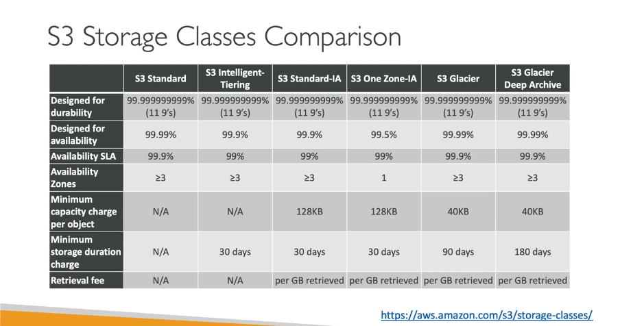


الأربعة `classes` دول كلهم يعتبروا في الـ `Tiers` "السخنة" والـ "WARM". يعني كلهم بيوفروا وصول فوري للداتا (`millisecond access`). محدش فيهم زي `Glacier` اللي بيحتاج دقايق أو ساعات عشان يرجعلك ملفاتك. الفرق الحقيقي بينهم بيظهر في **نموذج التسعير (`cost model`) والفلسفة ورا كل واحد**.

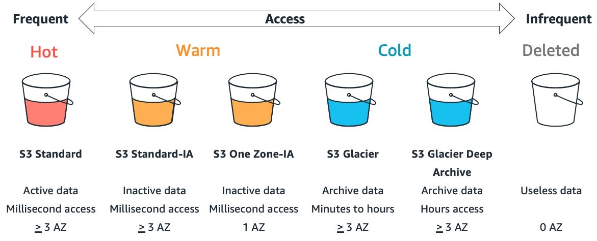


#### **1. `S3 Standard` **


ده هو الـ `class` الافتراضي، والأغلى فيهم من حيث تكلفة التخزين الشهرية، والأبسط في الفهم.

*   **الفروقات الاساسية:**
    *   **مفيش `Retrieval Fee`:** دي أهم نقطة. تقدر تعمل `download` للداتا بتاعتك مليون مرة في الشهر، مش هتدفع مليم زيادة على عملية Retrieval نفسها (طبعًا لسه فيه تكلفة نقل الداتا `Data Transfer`, بس دي قصة تانية).
    *   **مفيش حد أدنى لمدة التخزين:** تقدر ترفع ملف وتمسحه بعدها بثانية. مش هتتحاسب على أي حاجة غير المدة البسيطة دي.
    *   **مفيش حد أدنى لحجم الـ `Object`:** ارفع ملف حجمه 1 بايت، هتتحاسب على 1 بايت.

*   **فلسفته:** "ادفع أكتر شوية في التخزين، وخد حريتك كاملة في الوصول للداتا زي ما انت عايز ومن غير أي تكاليف مفاجئة."

*   **حالات استخدامه (Active Data):**
    *   **(`Website Assets`):** الصور والـ `CSS` والـ `JavaScript` اللي كل زوار موقعك بيحملوها باستمرار.
    *   **(`Content Distribution`):** ملفات برامج أو فيديوهات الناس بتعملها `download` كتير.
    *   **الداتا اللي بتتحلل باستمرار:** أي داتا بتستخدمها في عمليات `Big Data Analytics` والـ `servers` بتقراها وتكتب عليها كتير.
*   **باختصار:** أي داتا "نشيطة" وبتستخدمها بشكل متكرر ويومي وبيكون عليها عملية قراءة او upload عنيفة .

---

#### **2. `S3 Standard-IA` (Infrequent Access)**

هنا اللعبة بتبدأ تتغير. ده معمول للداتا اللي مش بتوصلها كتير، بس لما تحتاجها، لازم توصلها فورًا.

*   **الفروقات الاساسية:**
    *   **تكلفة تخزين شهرية أرخص بكتير** من `S3 Standard`.
    *   **فيه رسوم استرجاع (`Retrieval Fee`):** دي هي Trade-off. هتوفر في إيجار التخزين الشهري، بس كل مرة هتيجي تعمل `download` لملف، هتدفع رسوم على كل جيجابايت بتسترجعه.
    *   **فيه حد أدنى لمدة التخزين (30 يوم):** لو مسحت الملف قبل 30 يوم، هتتحاسب على تكلفة تخزين الـ 30 يوم كاملة.
    *   **فيه حد أدنى لحجم الـ `Object` (128 كيلوبايت):** لو رفعت ملف حجمه 10 كيلوبايت، هتتحاسب على إنه 128 كيلوبايت.

*   **فلسفته:** "لو عندك داتا مهمة بس مش بتستخدمها كل يوم، حطها عندي بسعر رخيص. بس لما تحتاجها، هدفعك تمن إني أروح أجبهالك."

*   **حالات استخدامه (Inactive Data):**
    *   **`Backups` طويلة الأجل:** نسخ احتياطية بتحتفظ بيها لشهور أو سنين، ومش بتلمسها إلا لو حصلت كارثة.
    *   **مشاركة الملفات:** زي `Dropbox` شخصي. بترفع ملفات عشان تشاركها مع حد مرة واحدة وبعدين بتفضل موجودة.
    *   **الأرشيف اللي ممكن تحتاجه بسرعة:** داتا قديمة لازم تحتفظ بيها، بس ممكن مديرك يطلبها منك فجأة عشان يعمل تقرير.

---

#### **3. `S3 One Zone-IA`**

ده هو الأخ المتطرف لـ `Standard-IA`. بياخد نفس الفكرة بس بيزودها عشان يوصل لأقصى توفير ممكن في التكلفة.

*   **الفروقات الاساسية (غير الـ 1 AZ):**
    *   **أرخص تكلفة تخزين شهرية** في كل الـ `tiers` اللي بتوفر وصول فوري. هو أرخص من `Standard-IA`.
    *   نفس القيود بتاعة `Standard-IA` بالظبط: فيه رسوم استرجاع، وفيه حد أدنى للمدة والحجم.
    *   **الفرق  الفلسفي:** هنا انت بتقول لـ `AWS` بشكل صريح: "أنا موافق أضحي بالـ `durability` العالية ضد الكوارث اللي بتدمر داتا سنتر كامل في مقابل أقل سعر ممكن".

*   **فلسفته:** "عايز أرخص سعر على الإطلاق لداتا توصلها فورًا؟ أنا اختيارك. بس تبقى عارف إن الداتا دي لو ضاعت بسبب كارثة في الـ `AZ` الوحيد اللي هي فيه، دي مشكلتك انت."

*   **حالات استخدامه (Reproducible Data):**
    *   **النسخ الثانوية من الـ `Backups`:** عندك `backup` أساسي في `Standard-IA`، بس عامل نسخة تانية أرخص في `One Zone-IA` زيادة أمان.
    *   **الداتا اللي تقدر تعملها تاني بسهولة:** زي الـ `Thumbnails` أو الفيديوهات اللي معمولها `transcoding`. لو الملفات دي ضاعت، ممكن تشغل الـ `script` تاني وتعملها من أول وجديد من الملفات الأصلية.
    *   باختصار: أي داتا **مش حرجة**، أو **سهل تعملها من جديد**.

---

#### **4. `S3 Intelligent-Tiering`**

ده هو الحل الذكي اللي `AWS` عملته عشان تريحك من الحيرة دي كلها.

*   **الفروقات الاساسية:**
    *   **بيشتغل أوتوماتيك:** هو مش `class` ثابت، ده نظام ذكي بيحرك الداتا بتاعتك بين `tier` سخن (زي `Standard`) و `tier` بارد (زي `Standard-IA`) على حسب استخدامك.
    *   **مفيش retrieval:** الميزة الجبارة هنا إنك مش بتدفع `retrieval fee` لما توصل للداتا حتى لو هي في الـ `tier` البارد، لأن النظام هو اللي حركها، فبيعتبر ده جزء من الخدمة.
    *   **فيه رسوم مراقبة شهرية (`Monitoring Fee`):** دي تكلفة بسيطة بتدفعها مقابل الذكاء ده. `AWS` بتاخد فلوس عشان تراقب كل `object` وتشوف هيتحرك ولا لأ.

*   **فلسفته:** "انت مش عارف الداتا بتاعتك هتستخدمها كتير ولا قليل؟ سبهالي وأنا هوفرلك فلوس أوتوماتيك من غير ما توجع دماغك."

*   **حالات استخدامه (Unknown or Changing Access Patterns):**
    *   **الداتا اللي استخدامها متقلب وغير متوقع:** زي أرشيف صور المستخدمين على موقع، ممكن صورة قديمة فجأة تبقى `viral` والناس توصلها كتير.
    *   **الـ `Data lakes`:** لما تكون بتجمع كميات داتا ضخمة من مصادر مختلفة ومش عارف أنهي جزء منها اللي هيبقى مهم وهيتم تحليله بكثرة في المستقبل.
    *   **لما تكون عايز توفر فلوس بس معندكش وقت** أو خبرة كافية تعمل `life cycle policies` معقدة بنفسك.

#### **مقارنة بين الـ `S3 Storage Classes`**

| الميزة                           | S3 Standard   | S3 Intelligent-Tiering | S3 Standard-IA | S3 One Zone-IA | S3 Glacier    | S3 Glacier Deep Archive |
| :------------------------------- | :------------ | :--------------------- | :------------- | :------------- | :------------ | :---------------------- |
| **مصممة للـ `Durability`**       | 99.999999999% | 99.999999999%          | 99.999999999%  | 99.999999999%  | 99.999999999% | 99.999999999%           |
| **مصممة للـ `Availability`**     | 99.99%        | 99.9%                  | 99.9%          | 99.5%          | 99.99%        | 99.99%                  |
| **ضمان الـ `Availability SLA`**  | 99.9%         | 99%                    | 99%            | 99%            | 99.9%         | 99.9%                   |
| **عدد الـ `Availability Zones`** | ≥ 3           | ≥ 3                    | ≥ 3            | 1              | ≥ 3           | ≥ 3                     |
| **أقل سعة للـ `Object`**         | N/A           | N/A                    | 128 KB         | 128 KB         | 40 KB         | 40 KB                   |
| **أقل مدة تخزين**                | N/A           | 30 يوم                 | 30 يوم         | 30 يوم         | 90 يوم        | 180 يوم                 |
| **رسوم التحميل**                 | N/A           | N/A                    | لكل جيجا بايت  | لكل جيجا بايت  | لكل جيجا بايت | لكل جيجا بايت           |

> [!IMPORTANT]
>
> ينفع عادي تنقل الـ `objects` بتاعتك من `storage class` لـ `storage class` تاني (يعني من `tier` لـ `tier` زي ما بنقول). بس هنا فيه ملحوظة مهمة أوي لازم تاخد بالك منها: فيه حاجة اسمها **`minimum storage duration`** لكل `storage class`. يعني لو نقلت `object` لـ `S3 Standard-IA` مثلاً، وقررت تنقله بعدها لـ `Glacier` قبل ما تعدي الـ 30 يوم بتاعته (اللي هي الـ `minimum storage duration` لـ `Standard-IA`)، `S3` هيحاسبك على الـ 30 يوم دول كاملين، حتى لو الداتا قعدت يوم واحد بس! دا شرط أساسي مينفعش تقل عنه.
>
> النقطة دي مهمة بالذات لو بتستخدم الـ `life cycle rules` اللي شرحناها. لو عايز العملية تتم بشكل أوتوماتيكي عن طريق الـ `lifecycle_configuration`، الـ `rule` بتاعك لازم يكون معمول بحيث يحترم الـ `minimum storage duration` دي، يعني الـ `transfer` مش هيحصل إلا بعد ما الـ `object` يقضي الـ `minimum storage duration` دي في الـ `tier` اللي هو فيها.
>
> طب افرض إنك مضطر ومش قادر تستنى المدة دي؟ هنا ممكن "تشغل دماغك" وتعملها بـ `tool` خارجية، زي الـ `AWS CLI` أو أي `SDK` (مثلاً إنك تنسخ الـ `object` من `storage class` لـ `storage class` تاني). بس خلي بالك، دي بتبقى للحالات الاضطرارية فعلاً، مش الوضع الطبيعي، لأن حتى في الحالة دي، أنت برضه هتدفع على الـ `minimum storage duration` كاملة للـ `storage class` الأولانية، مفيش مفر منها. `AWS` عاملة الشرط ده عشان تتأكد إنها بتغطي تكاليف التخزين والمعالجة حتى لو الداتا مش قعدت المدة كلها.

### **الـ `Eventually Consistent Data`**


عشان نفهم الموضوع ده بعمق، لازم نرجع لحتة مهمة جدًا قلناها قبل كده: الـ `Durability` العالية بتاعة `S3` (الـ 11 تسعة) سببها إنه بينسخ الداتا بتاعتك على الأقل في 3 داتا سنترز (`Availability Zones`) منفصلين عن بعض. وده تصرف عبقري عشان يحمي داتك من الكوارث.

**لكن...** عملية النسخ دي مش بتحصل في نفس اللحظة بالظبط. فيه فرق زمني بسيط جدًا (أجزاء من الثانية) على ما النسخة الجديدة من الداتا توصل لكل الداتا سنترز. والفرق الزمني البسيط ده هو اللي بيخلق مفهوم الـ **`Eventually Consistent`**.

تخيل إنك عندك ملف مهم اسمه `config.json` على `S3`. في لحظة معينة، قررت تعدل فيه ورفعت نسخة جديدة منه (`overwrite`).

**إيه اللي بيحصل ورا الكواليس في `AWS`؟**

1.  **الاستلام:** الـ `request` بتاعك بيوصل لأقرب داتا سنتر ليك (خلينا نسميه **DC-1**). الداتا سنتر ده بيكتب النسخة الجديدة من الملف على الديسكات بتاعته.
2.  **التأكيد:** أول ما `DC-1` يخلص كتابة، بيرد عليك ويقولك "تمام، الـ `upload` بتاعك نجح".
3.  **النسخ (Replication):** في نفس الوقت، `DC-1` بيبدأ يبعت النسخة الجديدة دي للداتا سنترز التانية (خلينا نقول **DC-2** و **DC-3**) عشان يضمنوا الـ `durability`. عملية النسخ دي بتاخد وقت، ممكن يكون `milliseconds` بسيطة.

**فين المشكلة بقى؟**

تخيل إن الـ `application` بتاعك، بعد ما عمل `upload` بجزء من الثانية، راح باعت `request` تاني عشان يقرأ نفس الملف `config.json`. الـ `Load Balancer` بتاع `AWS` ممكن يوجه الـ `request` ده لأي داتا سنتر من التلاتة.

*   **السيناريو السعيد:** الـ `request` يروح لـ **`DC-1`**. هيرجعلك النسخة الجديدة اللي لسه رافعها. كله تمام.
*   **السيناريو المحتمل (وهنا المشكلة):** الـ `request` يروح لـ **`DC-2`**، اللي ممكن تكون النسخة الجديدة لسه موصلتلوش. في الحالة دي، **`DC-2`** هيرجعلك **النسخة القديمة** من الملف!

ده بالظبط معنى الـ **`Eventually Consistent`**: يعني "في النهاية" (Eventually)، كل الداتا سنترز هتبقى متزامنة وهيكون عندها نفس النسخة الجديدة من الملف. بس فيه "فترة زمنية" قصيرة جدًا ممكن يحصل فيها عدم تطابق.

#### **إيه الفرق بين نوعين الـ Consistency اللي ذكرناهم؟**

`AWS` بتفرق بين حالتين عشان تخلي حياتنا أسهل:

1.  **`Eventual Consistency` (للتعديل والحذف):**
    ده بيحصل في حالتين:
    *   **`Overwrite PUTS`**: لما ترفع نسخة جديدة فوق ملف قديم.
    *   **`DELETES`**: لما تمسح ملف.
    في الحالتين دول، ممكن لو قريت الملف فورًا بعد التعديل تاخد النسخة القديمة، أو لو مسحته ممكن تلاقيه لسه موجود لثانية أو اتنين. الـ `Application` بتاعك لازم يكون متصمم وهو حاطط الاحتمال ده في الحسبان.

2.  **`Read-after-Write Consistency` (للملفات الجديدة):**
    `AWS` بتقدم الضمان ده عشان تطمنك لما ترفع ملف جديد لأول مرة.
    *   **`New Object PUTS`**: لما ترفع ملف **مش موجود قبل كده**.
    في الحالة دي، مفيش "نسخة قديمة" أصلًا في أي داتا سنتر عشان يحصل لخبطة. فأول ما `S3` يقولك "تمام الـ `upload` نجح"، هو بيضمنلك إن أي `read request` هييجي بعده فورًا هيشوف الملف الجديد ده. مفيش أي احتمالية إنك تلاقي الملف مش موجود.

*   لما ترفع ملف جديد، انت في أمان. تقدر تقراه وتستخدمه فورًا.
*   لما تعدل على ملف قديم أو تمسحه، لازم تبقى حذر. متصممش الـ `application` بتاعك على أساس إن التغيير ده هيسمّع في السيستم كله في نفس اللحظة. لو الموضوع ده حرج جدًا بالنسبة ليك، ممكن تحتاج تعمل `logic` بسيط في الكود بتاعك يستنى ثانية أو يعيد المحاولة لو ملقاش التغيير اللي هو متوقعه.


## **الـ `S3 Object Life Cycle`**

كتير من الشغل اللي هتعمله على `S3` غالبًا هيكون ليه علاقة بالـ `backup archives` . بس المشكلة في الـ `backup archives` دي، لو مصممها صح، إنك بتعمل منها نسخ جديدة بانتظام. مهم جدًا إنك تحتفظ بشوية من النسخ القديمة دي، بس في نفس الوقت هتبقى عايز تتخلص من وتمسح النسخ الأقدم عشان تسيطر على تكاليف التخزين بتاعتك.

الـ `S3` بيخليك تعمل كل ده بشكل أوتوماتيكي عن طريق الـ `features` بتاعته اللي هي `versioning` و `life cycle`.

### **الـ `Versioning`**

في معظم الـ `filesystem environments`، لو حفظت ملف بنفس الاسم والمكان بتاع ملف موجود أصلًا، الملف الجديد هيعمل `overwrite` (هيكتب فوق) الملف الأصلي. ده بيضمن إنك دايمًا هيكون معاك أحدث نسخة، بس في المقابل هتخسر النسخ القديمة — بما فيهم النسخ اللي عملتلها `overwrite` بالغلط.

بشكل افتراضي، الـ `objects` على `S3` بتشتغل بنفس الطريقة دي. **بس** لو شغلت الـ `versioning` على مستوى الـ `bucket`، ساعتها النسخ القديمة اللي اتعملها `overwrite` هتفضل محفوظة ومتاحة ليك على طول. ده بيحل مشكلة إنك تفقد داتا قديمة بالغلط، بس بيخلق مشكلة تانية وهي احتمالية الـ `archive bloat` (إن archive يتضخم ويكبر زيادة عن اللزوم). وهنا بقى بييجي دور الـ `life cycle management` عشان يساعد.

دا مثال تافه على على versioning 

```terraform
resource "aws_s3_bucket" "s3_log_storage_bucket" {
  bucket = "my-s3-logs-destination-bucket-unique-123456789"
  force_destroy = true
  versioning {
    enabled = true
  }
}
resource "aws_s3_bucket_object" "just_file" {
  bucket = aws_s3_bucket.s3_log_storage_bucket.id
  key    = "file.txt"
  content = "this version 1"
  
}
resource "aws_s3_bucket_object" "just_file_1" {
  bucket = aws_s3_bucket.s3_log_storage_bucket.id
  key    = "file.txt"
  content = "this version 2"
  
}

resource "aws_s3_bucket_object" "just_file_2" {
  bucket = aws_s3_bucket.s3_log_storage_bucket.id
  key    = "file.txt"
  content = "this version 3"
  
}


```


### **الـ `Life Cycle Management`**

بالإضافة للـ `storage class` اللي اسمها `S3 Intelligent-Tiering` اللي اتكلمنا عنها قبل كده، انت ممكن تظبط `life cycle rules` بنفسك للـ `bucket`، والـ `rules` دي هتنقل الـ `object` بشكل أوتوماتيكي لـ `storage class` تانية بعد عدد معين من الأيام.

يعني مثلاً، ممكن تخلي الـ `objects` الجديدة تفضل في `S3 Standard class` أول 30 يوم، وبعدها تتنقل للـ `class` الأرخص اللي هي `One Zone-IA` لمدة 30 يوم كمان. ولو فيه قوانين أو التزامات تنظيمية (`regulatory compliance`) بتجبرك تحتفظ بالنسخ القديمة، ممكن بعدها الملفات دي تتنقل لخدمة التخزين الرخيصة وطويلة الأجل اللي هي `Glacier` لمدة 365 يوم كمان، قبل ما تتمسح بشكل نهائي.

> [!TIP]
>
> 
>
> لما بتيجي تستخدم الـ `life cycle rules`، لازم تكون فاهم إن `AWS` حطت شوية قيود مش بشكل عشوائي، لكن عشان تضمن إنك بتستخدم النظام ده بطريقة منطقية وفعالة من حيث التكلفة.
>
> أول نقطة هي فكرة استخدام الـ **`prefixes`** لتطبيق الـ `rules` على `objects` معينة. دي ميزة قوية جدًا بتديلك تحكم دقيق على مستوى الـ `bucket` الواحد. بدل ما تطبق سياسة واحدة على كل الملفات اللي في الـ `bucket`، انت بتقدر تقسمه لمناطق منطقية. يعني ممكن يكون عندك سياسة للـ `logs` وسياسة تانية مختلفة تمامًا للـ `backups`، وسياسة تالتة لملفات المستخدمين، وكل ده جوه نفس الـ `bucket`. ده بيخلي الإدارة مرنة جدًا وبيمنعك من إنك تحتاج تعمل عشرات الـ `buckets` لكل نوع ملف، وبالتالي بيقلل التعقيد الإداري عليك.
>
> النقطة التانية والمهمة هي **الحد الأدنى للمدة الزمنية**. إنك لازم تسيب الـ `object` في `class` معينة لمدة محددة (زي 30 يوم) قبل ما تنقله لـclass تاني ده شرط مرتبط مباشرةً بنموذج التسعير. الـ `storage classes` الرخيصة (زي الـ `Standard-IA`) بتوفرلك تكلفة تخزين قليلة على أساس إنك هتخزن الداتا دي ومش هتوصلها كتير. لو `AWS` سمحت بنقل الملفات دي بسرعة، الناس ممكن تستغل النظام وتنقل الملفات يوميًا عشان توفر كام مليم، وده بيعمل عبء تشغيلي على `AWS` وبيبوظ فكرة التسعير نفسها. فالشرط ده يعتبر بمثابة التزام منك. ولو خلفت الالتزام ده ومسحت الملف أو نقلته بدري، بتدفع غرامة بسيطة، وهي إنك بتتحاسب على تكلفة تخزين المدة دي كاملة.
>
> 
>
> النقطة الأخيرة، واللي بتعتبر أساسية في فهم الـ `life cycle management`، هي إن **مسارات النقل بين الـ `storage classes` مش مفتوحة على البحري**. يعني مينفعش تنقل `object` من أي `class` لأي `class` تانية بمزاجك. `AWS` حاطة نظام وقيود واضحة للموضوع ده، والقيود دي مش محطوطة بشكل عشوائي، دي مبنية على الفكرة الأساسية لدورة حياة الداتا.
>
> 
>
> الفكرة كلها قايمة على إن الداتا، بيقل استخدامك عليها او على حسب مصطلح aws بتبرد
>
> 1.  **Hot Tier:** أول ما الداتا و بتترفع، بتكون في قمة أهميتها. بيتم الوصول ليها كتير، ومحتاجينها تكون متاحة فورًا. عشان كده بتبدأ حياتها في `class` غالية وعالية الأداء زي **`S3 Standard`**.
>
> 2.  **Warm Tier:** بعد فترة (شهر مثلاً)، أهمية الداتا دي بتقل شوية. معدل الوصول ليها بيقل. هنا بييجي دور الـ `life cycle rule` عشان تنقلها بشكل منطقي لـ `class` ، زي **`S3 Standard-IA`**. هي لسه متاحة بسرعة، بس تكلفة تخزينها أقل.
>
> 3.  **(Cold Tier / Archive):** بعد شهور أو سنين، الداتا دي بتتحول لـArchive. نادرًا جدًا لما حد بيحتاجها، بس لازم تفضل متخزنة لأسباب قانونية أو التزامات تانية. هنا بتتنقل لأبرد وأرخص مكان ممكن، زي **`S3 Glacier`** أو **`Glacier Deep Archive`**.
>
>
> 
>
> القيود اللي `AWS` حطاها على مسارات النقل هي ببساطة عشان تجبرك تتبع المنطق ده. العملية دي عاملة زي شلال الماية، بتنزل من فوق لتحت، من الغالي للرخيص، من السخن للبارد. صعب جدًا، وفي معظم الحالات مستحيل...، إنك تطلع بالعكس في الـ `life cycle` دي بشكل أوتوماتيكي.
>
> 
>
> فمينفعش مثلًا تعمل `life cycle rule` تنقل `object` من `Glacier`  لـ `Standard-IA` . ده ملوش معنى في life cycle الداتا. لو حبيت ترجع تستخدم ملف قديم أوي تاني بشكل مستمر، المفروض الأول تعمل له `restore`من s3، وبعدها تقدر ترفعه تاني كـ `object` جديد في الـ `class`  اللي انت عايزها.
>
> مش شرط بترتيب يعني ممكن تروح **S3 Standard** الى **S3 Glacier** ولكن العكس المستحيل يحصل لازم تمشي بترتيب المعين ده او بتجاه hot الى  cold
>
> فالقيود دي مش تعقيدات، دي حماية ليك عشان تضمن إنك بتستخدم النظام صح، وبتوفر فلوس بالطريقة اللي `AWS` صممتها، وبتضمن إن عمليات نقل الداتا بتحصل بشكل سليم .

دا مثال بنقل logs على مستوى objects معينة عن طريق perfix معين 
```terraform
resource "aws_s3_bucket" "s3_log_storage_bucket" {
  bucket = "my-s3-logs-destination-bucket-unique-123456789"
  force_destroy = true
}

resource "aws_s3_bucket" "s3_source_data_bucket" {
  bucket = "my-s3-source-data-bucket-unique-123456789"
  force_destroy = true
}

resource "aws_s3_bucket_logging" "source_bucket_access_logging" {
  bucket        = aws_s3_bucket.s3_source_data_bucket.id
  target_bucket = aws_s3_bucket.s3_log_storage_bucket.id
  target_prefix = "s3-access-logs/"
}
resource "aws_s3_bucket_object" "upload_file_as_example" {
  bucket = aws_s3_bucket.s3_source_data_bucket.id
  key    = "file.txt"
  content = "This is an example file for S3 access logging."
  
}
resource "aws_s3_bucket_policy" "allow_s3_logging" {
  bucket = aws_s3_bucket.s3_log_storage_bucket.id

  policy = jsonencode({
    Version = "2012-10-17",
    Statement = [
      {
        Sid = "S3ServerAccessLogsPolicy",
        Effect = "Allow",
        Principal = {
          Service = "logging.s3.amazonaws.com"
        },
        Action = "s3:PutObject",
        Resource = "${aws_s3_bucket.s3_log_storage_bucket.arn}/*"
      }
    ]
  })
}
output "s3_log_storage_bucket_name" {
  value = aws_s3_bucket.s3_log_storage_bucket.id
  
}

resource "aws_s3_bucket_lifecycle_configuration" "log_lifecycle_full_tiers" {
  bucket = aws_s3_bucket.s3_log_storage_bucket.id

  rule {
    id     = "full-log-lifecycle-through-all-tiers"
    status = "Enabled"

    filter {
      prefix = "s3-access-logs/"
    }

    transition {
      days          = 30
      storage_class = "STANDARD_IA"
    }

    transition {
      days          = 60
      storage_class = "GLACIER"
    }

    transition {
      days          = 180
      storage_class = "DEEP_ARCHIVE"
    }

    expiration {
      days = 365
    }
  }
}

```


عايز أضبط إعدادات الـ Terraform backend بحيث يتم نقل النسخ القديمة من الـ Terraform state في S3 تلقائيًا إلى Glacier بعد مرور 30 يوم من وقت ما تبقى نسخة قديمة (non-current version)

```terraform
resource "aws_s3_bucket" "terraform_backend_tfstae" {
  bucket = "terraform_backend_tfstae-unique-123456789"
  force_destroy = true
}

resource "aws_s3_bucket_versioning" "versioning" {
  bucket = aws_s3_bucket.terraform_backend_tfstae.id
  versioning_configuration {
    status = "Enabled"
  }
}
resource "aws_s3_bucket_lifecycle_configuration" "name" {
  
  bucket = aws_s3_bucket.terraform_backend_tfstae.id
  rule {
    id = "to_glacier_after_30_days"
    status = "enabled"
    filter {
      prefix = "terraform/"
    }
    noncurrent_version_transition {
      noncurrent_days = 30
      storage_class = "GLACIER"
    }
  }
  
  }
```


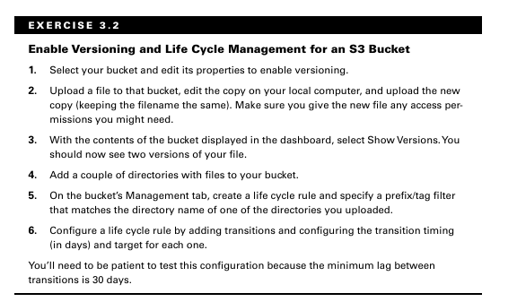

> [!IMPORTANT]
>
> انت ممكن تخلي s3 كله فى tier معين بس الاشهر انك تستخدمها بناء على كل object


## Accessing S3 Objects

لو مكنتش هتحتاج الداتا بتاعتك، مكنستش هتتعب نفسك وترفعها على `S3` أصلًا. عشان كده، لازم تفهم إزاي تعمل `access` للـ `objects` بتاعتك اللي على `S3`. والأهم من كده، إزاي تقفل الـ `access` ده وتسمح بيه بس للـ `requests` اللي بتمشي مع احتياجات البيزنس والأمان بتاعتك.

### **الـ `Access Control`**

أول ما بتعمل `S3 bucket` جديد، هو وكل الـ `objects` اللي جواه بيكونوا مقفولين تمامًا على أي حد بره الـ `account` بتاعك، انت بس اللي بتقدر توصلهم. عشان تسمح لحد تاني يوصلهم، عندك 3 طرق أساسية:

 `Access Control List (ACL)`،
 أو `S3 Bucket Policies`، 
و `Identity and Access Management (IAM) Policies`.

> [!CAUTION]
>
> فى حاجة اخيرة برده **`Block Public Access` : **
>
> عشان AWS تضمنلك أقصى درجات الأمان، عملت خاصية قوية جدًا اسمها **Block Public Access**. الفكرة الأساسية منها هي إنها تديلك القدرة إنك تقفل أي public access على الـ S3 bucket بتاعك وكل الـ objects اللي جواه، وده بيتم عن طريق مجموعة إعدادات. الإعدادات دي بتطبق على الـ bucket اللي بتظبطها عليه وعلى أي access points مرتبطة بيه.
>
> والـ Block Public Access ده ليه أعلى صلاحية، يعني كلامه هو اللي بيمشي. أهم نقطة فيه إنه بيتجاوز أي صلاحيات تانية ممكن تكون حاططها. يعني لو الـ ACL أو الـ Bucket Policy بتاعتك بتسمح بالوصول الـ public، والـ Block Public Access متفعل عشان يمنعه، الوصول هيتقفل فورًا.
>
> والخاصية دي موجهة بشكل أساسي للتحكم في الـ public access فقط، وهي عبارة عن أربعة options متقسمين بشكل واضح جدًا: فيه اتنين منهم موجهين للتحكم في الـ **ACLs**، واتنين تانيين موجهين للتحكم في الـ **Bucket Policy**، وده بيديك تحكم دقيق عشان تقفل كل منفذ ممكن يسبب public access غير مرغوب فيه.
> هشرح 2 بتوع acl مع acl و2 بتوع bucket poicy مع bucket policy
>
> 
>
> 

ولكن قبل ما اشرح acl او اي حاجة ثانية لازم نشرح حاجة اسمه **S3 Object Ownership**

ده إعداد على مستوى الـ S3 Bucket بيحدد مين هو "مالك" الـ objects اللي بتترفع جوه الـ bucket ده، ونتيجة لكده، بيحدد أنهي طريقة صلاحيات هتكون هي الأساسية (الـ ACLs ولا الـ Policies) او اللي شغالة
زمان، لو Account B رفع فايل في bucket بتاع Account A، كان الـ object ده بيفضل ملك Account B. ده كان بيعمل مشاكل كتير:

1. Account A (صاحب الـ bucket) مكنش يقدر يمسح الفايل أو يغير صلاحياته لأنه مش ملكه.
2. عشان Account A ياخد صلاحيات، كان لازم Account B وهو بيرفع الفايل يضيف ACL مخصوصة (bucket-owner-full-control). كانت عملية معقدة ومش مضمونة.
3. كان بيبقى عندك bucket واحد، لكن جواه objects بـ "ملاك" مختلفين، وده بيخلي إدارة الصلاحيات كابوس.

عشان كده AWS عملت الـ Object Ownership عشان تبسط الموضوع ده وتديلك اختيارات واضحة

**1. `ObjectWriter` (الوضع القديم - `Legacy`)**

الوضع ده، اللي اسمه ObjectWriter، هو الطريقة القديمة أو الـ legacy اللي كان S3 بيشتغل بيها، ومعناه إن "كاتب" الـ object أو اللي رفعه هو اللي بيفضل المالك الرسمي بتاعه. بالتطبيق العملي، لو Account B رفع فايل في bucket يملكه Account A، هيفضل الفايل ده ملكًا لـ Account B، وبالتالي Account A مش هيقدر يتحكم فيه. عشان Account A يقدر ياخد صلاحيات كاملة، لازم Account B وهو بيرفع الفايل يستخدم ACL صريحة زي bucket-owner-full-control عشان ينقل الملكية.`

يبنا ان  الوضع ده معقد، لكنه ما زال مفيدًا في سيناريوهات محددة تتطلب استخدام الـ ACLs بشكل أساسي. على عكس الإعدادات الأحدث اللي بتقلل من دور الـ ACLs أو بتعطلها تمامًا، ObjectWriter بيدعم استخدامها بكامله. ده بيخليه ضروري في بعض التطبيقات المعقدة، زي أنظمة الـ multi-tenant اللي كل tenant فيها بيرفع داتا وعايز يحتفظ بملكية الـ objects بتاعته بشكل مستقل، أو في أي سيناريو بيتم فيه رفع ملفات من خارج الـ account وتحتاج فيه تحكم دقيق في الملكية على مستوى كل object على حدة.

#### **2. BucketOwnerPreferred ** (الوضع  Hybrid)

الوضع ده، اللي اسمه BucketOwnerPreferred، هو وضع "هجين" أو Hybrid  مصمم عشان يسهل الانتقال من الطرق القديمة للطرق الحديثة في إدارة S3. فكرته الأساسية إن "الأفضلية" في الملكية تروح لصاحب الـ bucket.

بالتطبيق العملي، لو account تاني رفع فايل عندك ومحددش أي ACL معينة في الـ request بتاعه، الملكية هتجيلك انت كصاحب bucket بشكل تلقائي، وده بيحل المشكلة الأساسية بشكل بسيط. في نفس الوقت، لو اللي بيرفع الفايل ده كان application قديم بيستخدم ACL صريحة زي bucket-owner-full-control، الـ ACL دي هتشتغل عادي جدًا والملكية هتتنقلك برضه.

والنقطة الجوهرية هنا هي إنه **بيدعم استخدام الـ ACLs بشكل كامل**. على عكس وضع BucketOwnerEnforced اللي بيعطلها تمامًا، BucketOwnerPreferred بيخليها شغالة وممكنة. ده بيخليه الاختيار المثالي في حالتين: أولًا، لو عندك workflows أو تطبيقات قديمة لسه بتعتمد على الـ ACLs في شغلها وعايز تضمن إنها متتعطلش. ثانيًا، وهو الأهم بالنسبة لأمثلتنا، لو انت نفسك محتاج تستخدم ACLs عشان تحقق هدف معين، زي إنك تخلي object واحد بس public-read من غير ما تفتح الـ bucket كله بـ policy. استخدام public-read ACL يتطلب إن الـ ACLs تكون شغالة، والوضع ده بيوفرلك المرونة دي. هو يعتبر مرحلة وسطية ممتازة بتديك أفضل ما في العالمين: بساطة الملكية التلقائية مع الحفاظ على قوة ومرونة الـ ACLs للحالات الخاصة.

**3. BucketOwnerEnforced**

الوضع ده، اللي اسمه BucketOwnerEnforced، هو أقوى وأحدث وضع لإدارة الصلاحيات في S3، وهو اللي AWS بتنصح بيه لكل الـ Buckets الجديدة وهو default وهو مش بيسمح باستخدام acl. فكرته الأساسية هي فرض قاعدة واضحة وصريحة: "صاحب الـ bucket هو المالك الوحيد والإجباري لكل object جواه، بدون أي استثناءات".

بالتطبيق العملي، لما بتفعل الوضع ده، **الـ ACLs بتتعطل تمامًا (gets disabled)** على مستوى الـ bucket كله، وS3 بيتجاهلها كأنها مش موجودة. نتيجة لكده، أي object بيترفع في الـ bucket ده، سواء انت اللي رفعته أو أي account تاني، بيصبح ملكك انت كصاحب bucket بشكل فوري وإجباري. مفيش حاجة اسمها object ليه owner مختلف.

والنقطة الجوهرية هنا هي إن إدارة الصلاحيات بتعتمد **100% وبشكل حصري على IAM Policies و Bucket Policies**. ده بيبسط إدارة الأمان بشكل كبير جدًا لأنه بيوحد كل قواعد الوصول في مكان واحد واضح، وبيلغي التعقيدات اللي كانت بتيجي من وجود ACLs متفرقة على ملايين الـ objects. هو بيقدم نموذج أمان أنظف وأسهل في المراجعة والإدارة، وبيكون الاختيار المثالي لأي سيناريو مش بيعتمد بشكل أساسي على workflows قديمة مرتبطة بالـ ACLs.


#### **1. `Access Control List (ACL)`****

الـ `ACL` هي `list` بسيطة من الـ `grants`. كل `grant` بيحدد حاجتين: `Grantee` (مين اللي هياخد الصلاحية، زي `AWS account` معين أو `group` متعرف عليه زي `AllUsers`)، و `Permission` (الصلاحية نفسها، زي `READ` أو `WRITE` أو `FULL_CONTROL`). **الـ `Scope` بتاعها:** على مستوى الـ `resource` نفسه. يعني تقدر تحط `ACL` على الـ `bucket`، و `ACL` تانية مختلفة تمامًا على كل `object` جواه بشكل منفصل. ده بيخلي إدارتها على `scale` كبير مش عملية ,**الـ `Primary Use Cases`:** استخدامها الأساسي دلوقتي هو في حالة واحدة: إدارة الـ `cross-account object ownership`.السيناريو: لو `AWS account` تاني عمل `upload` لـ `object` في الـ `bucket` بتاعك، الـ `object` ده بيفضل ملكه هو. عشان انت كصاحب `bucket` تاخد `full control` عليه، لازم الـ `account` التاني وهو بيرفع الـ `object` يحدد الـ `ACL` كـ `bucket-owner-full-control`.


قبل ما نبدأ، أهم نقطة لازم تفهمها هي إن فيه `ACL` مستقلة بتتحط على **الـ `Bucket` ، و `ACL` تانية مستقلة بتتحط على **كل `Object` جواه.

---

#### **أولًا: إعداد الـ `ACL` **

الـ `ACL` بتتكون من `grants`، وكل `grant` بيتكون من جزئين: `Grantee` و `Permission`.

##### **1. أنواع الـ `Grantees` (مين اللي بياخد الصلاحية)**

*   **`Owner`:** الـ `AWS account` اللي عمل الـ `resource`.
*   **`Specific AWS Account`:** `AWS account` تاني بتحدده بالـ `ID` بتاعه.
*   **`All Users` Group:** أي حد على الإنترنت (`public`).
*   **`Authenticated Users` Group:** أي حد عنده `AWS account` وعامل `login`.

##### **2. أنواع الـ `Permissions` **

صلاحيات الـ `ACLs` بسيطة، لكن معناها بيختلف تمامًا حسب هي محطوطة على إيه:

*   **`READ`:**
    *   **تأثيرها على الـ `Bucket`:** تسمح بعمل `List` للـ `objects` (عرض لستة أسماء الفايلات).
    *   **تأثيرها على الـ `Object`:** تسمح بقراءة محتوى الـ `object` نفسه (تحميله أو عرضه).

*   **`WRITE`:**
    *   **تأثيرها على الـ `Bucket`:** تسمح برفع `objects` جديدة (`PutObject`) ومسح `objects` موجودة (`DeleteObject`).
    *   **تأثيرها على الـ `Object`:** **لا تنطبق (Not Applicable)** لان object storage بحد ذاته مفيهاش تعديل

*   **`READ_ACP`:**
    *   **تأثيرها على الـ `Bucket`:** تسمح بقراءة الـ `ACL` بتاعة الـ `Bucket`.
    *   **تأثيرها على الـ `Object`:** تسمح بقراءة الـ `ACL` بتاعة الـ `Object`.

*   **`WRITE_ACP`:**
    *   **تأثيرها على الـ `Bucket`:** تسمح بتعديل الـ `ACL` بتاعة الـ `Bucket`.
    *   **تأثيرها على الـ `Object`:** تسمح بتعديل الـ `ACL` بتاعة الـ `Object`.

*   **`FULL_CONTROL`:**
    *   **تأثيرها على الـ `Bucket`:** كل صلاحيات الـ `Bucket` اللي فاتت.
    *   **تأثيرها على الـ `Object`:** كل صلاحيات الـ `Object` اللي فاتت.

---

#### **ثانيًا: الـ `Canned ACLs` **

دي اختصارات عملتها `AWS` عشان تسهل علينا الشغل. خلينا نشوف تأثير كل واحدة على الـ `Bucket` وعلى الـ `Object`.

*   **`private`**:
    *   **تأثيرها على الـ `Bucket`:** الـ `Owner` بس هو اللي ليه `FULL_CONTROL`. الـ `Bucket` بيكون مقفول تمامًا.
    *   **تأثيرها على الـ `Object`:** الـ `Owner` بس هو اللي ليه `FULL_CONTROL`. الـ `Object` بيكون مقفول تمامًا.

*   **`public-read`**:
    *   **تأثيرها على الـ `Bucket`:** أي حد (`AllUsers`) يقدر يعمل **`List`** للفايلات اللي جوه. (خطر لو أسماء الفايلات حساسة).
    *   **تأثيرها على الـ `Object`:** أي حد (`AllUsers`) يقدر **يقرأ ويحمل** الفايل نفسه.

*   **`public-read-write`**:
    *   **تأثيرها على الـ `Bucket`:** أي حد (`AllUsers`) يقدر يعمل `List` للفايلات، وكمان **يرفع فايلات جديدة ويمسح أي فايل**. (خطر كارثي).
    *   **تأثيرها على الـ `Object`:** **لا تنطبق (Not Applicable)**، لأن صلاحية `WRITE` ملهاش معنى على `object` موجود بالفعل. `S3` هيرجع `error` لو حاولت تطبقها.

*   **`authenticated-read`**:
    *   **تأثيرها على الـ `Bucket`:** أي حد عنده `AWS account` يقدر يعمل `List` للفايلات.
    *   **تأثيرها على الـ `Object`:** أي حد عنده `AWS account` يقدر يقرأ ويحمل الفايل.

*   **`bucket-owner-full-control`**:
    *   **تأثيرها على الـ `Bucket`:** **لا تنطبق (Not Applicable)**. ملهاش معنى على مستوى الـ `Bucket`.
    *   **تأثيرها على الـ `Object`:** ده هو الحل لمشكلة الـ `cross-account ownership`. لما `account` تاني يرفع `object` ويحط عليه الـ `ACL` دي، هو كده بينقل الـ `FULL_CONTROL` على الـ `object` ده لصاحب الـ `Bucket`.


#### تعالى ناخد شوية امثلة 


هتلبس فى مشكلة  `Block Public Access` اللي انا قلت عليه فوق 


**1. `Block public access to buckets and objects granted through new public access control lists (ACLs)`**

في `Terraform` اسمه `block_public_acls`. وظيفته إنه يرفض أي `API call` مستقبلية بتحاول تطبق `ACL` جديدة تكون `public`. بالتطبيق ، لو أي `request` لرفع `object` جديد (`PutObject`) طلب إن الـ `ACL` بتاعته تكون `public-read`، الـ `request` ده كله هيتفشل من `S3` وهيرجع `error` بيقول `Access Denied`. الرفض هنا شامل، يعني مش بس الـ `ACL` هي اللي بتترفض، لأ ده الـ `object` نفسه مش بيترفع من أساسه. الإعداد ده لا يعمل بأثر رجعي، بمعنى إن أي `ACL` قديمة كانت `public` ستظل كما هي.

> [!NOTE]
>
> PutObject : لـ API call اللي بيستخدمه AWS S3 علشان ترفع ملف او objectجديد داخل bucket.

**2. `Block public access to buckets and objects granted through any access control lists (ACLs)`**

في `Terraform` اسمه `ignore_public_acls`. الإعداد ده بيعطل فعالية أي `ACL` تمنح `public access`، بغض النظر إذا كانت الـ `ACL` موجودة حاليًا أو يتم محاولة إضافتها. وقت استقبال أي `request` للوصول،للـ `S3` هيتجاهل أي `public ACL` موجودة على الـ `object` كما لو كانت غير موجود. ودا يؤدي إلى رفض اي
 public access  للـ `object` حتى لو كان يمتلك `ACL` تسمح بده. 

### 

طب لو فهمته وجيت وشغلت هيطلع معاك نفس error 


لما بتيجي تشتغل بـ ACLs مع Block Public Access في Terraform، لازم تاخد بالك جدًا من ترتيب التنفيذ. المشكلة مش إنك محتاج تنفذ Terraform أكتر من مرة، المشكلة إن Terraform لوحده ممكن يتلخبط في الترتيب لو معرفتلوش الاعتماديات صح.

**إيه هو الترتيب المنطقي اللي لازم يحصل؟**

1. **الأول:** لازم "تفتح الباب" عن طريق إنك تظبط إعدادات الـ Block Public Access الأول (block_public_acls = false, ignore_public_acls = false).
2. **بعد كده:** تقدر تطبق الـ ACL العامة (public-read) على الـ bucket.

لو Terraform حاول يعمل العكس (يطبق الـ ACL العامة الأول)، S3 هيرفض العملية لأن الـ Block Public Access لسه قافل الباب، وهيرجعلك error.

**إزاي بتجبر Terraform يمشي على الترتيب الصح؟**

هنا بيجي دور الـ argument  اللي اسمه **depends_on**. انت بتستخدمه عشان تقول لـ resource معين: "متتنفذش إلا لما الـ resource الفلاني يخلص الأول".

بص خد فى بالك برده حتى لو التزمت بالترتيب هتلبس فى مشكلة S3 Object Ownership 


دا هيرجع بينا لمشكلة  ان الوضع defualt لل S3 Object Ownership هو  BucketOwnerEnforced 
 وانه Default من سنة 2023 هو BucketOwnerEnforced وبكد فهمت ليه باخد error 

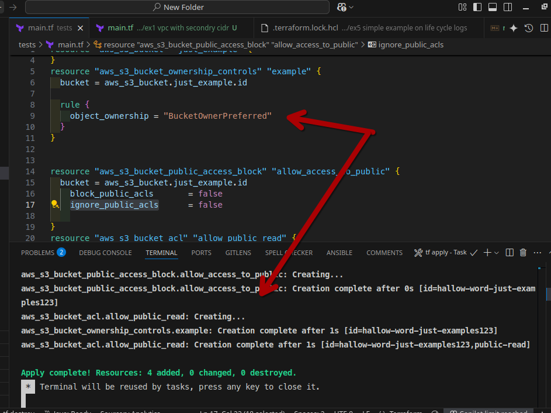

> [!IMPORTANT]
>
> 
>
> حتة مهمة جدًا في `Terraform`. لو أنا حذفت الـ `resource block` ده:
> ```terraform
> resource "aws_s3_bucket_ownership_controls" "example" {
>   bucket = aws_s3_bucket.just_example.id
> 
>   rule {
>     object_ownership = "BucketOwnerPreferred"
>   }
> }
> ```
> `Terraform` **مش هيرجع للوضع `default` بتاع الـ `provider`**. وده لأن في الحالة دي، `Terraform` بيبص على الكود الجديد ويلاقي إن الـ `resource` ده مبقاش موجود، فبيفهم من كده إنك بتقوله: "أنا مبقتش عايزك تدير الإعداد ده خالص، شيله من   الـ `state file` بتاعك". هو بيعتبرها إشارة لـ`stop managing` مش إشارة لـ "العودة للافتراضي" (`revert to default`).
>
> وبالتالي، هو مش هيبعت أي `API call` لـ `AWS` عشان يغير الإعداد ده، هو ببساطة هيشيل إيده من الموضوع وهيسيب الإعداد في `AWS` على **آخر وضع كان عليه**.
>
> **بس ده غلط ليه؟**
> زي ما انت قلت بالظبط، الدنيا هتشتغل معاك والـ `ACLs` هتفضل شغالة، لكنك كده بتعمل حاجة بتعاكس واحد من أهم مبادئ شغلنا، وهو إن **Single Source of Truth**. اللي بيحصل ده بيخلق حالة خطيرة جدًا اسمها **`Configuration Drift`** 
>
> النتيجة إن الإعداد في `AWS Console` هيفضل زي ما هو على آخر وضع كان عليه `BucketOwnerPreferred`
>
> 
>
> ... وبكده بقى عندك `Configuration Drift`. بقى الكود بتاعك بيقول حاجة (إنه مش بيدير الـ `ownership`)، والواقع في `AWS` بيقول حاجة تانية خالص (إن الـ `ownership` لسه متظبط عشان يسمح بالـ `ACLs`).
>
> **وده بيفتح الباب لمشاكل كبيرة في المستقبل:** أي مهندس جديد هيبص على الكود بتاعك مش هيفهم أبدًا ليه الـ `ACLs` شغالة، وهيعتبر إن فيه "شئ غريب" بيحصل.لو حد عمل أي تغيير تاني في المستقبل، النتيجة ممكن تكون غير متوقعة تمامًا لأن الكود مبقاش بيعبر عن الواقع.
>
> أي `scripts` أو `pipelines` بتعتمد على الكود ده عشان تاخد قرارات ممكن تفشل أو تعمل حاجات غلط.
>
> الحل الصح دايمًا هو إنك تخلي الكود يعبر عن الحالة النهائية اللي انت عايزها، مش إنك تمسح الـ `resource` وتسيبه "عايمة" 


```terraform
resource "aws_s3_bucket" "just_example" {
  bucket = "hallow-word-just-examples123"

}
resource "aws_s3_bucket_ownership_controls" "example" {
  bucket = aws_s3_bucket.just_example.id

  rule {
    object_ownership = "BucketOwnerPreferred"
  }
}


resource "aws_s3_bucket_public_access_block" "allow_access_to_public" {
  bucket = aws_s3_bucket.just_example.id
    block_public_acls       = false
    ignore_public_acls      = false
    
}
resource "aws_s3_bucket_acl" "allow_public_read" {
  bucket = aws_s3_bucket.just_example.id
  acl    = "private"
  depends_on = [ aws_s3_bucket_public_access_block.allow_access_to_public ]

}

resource "aws_s3_object" "file_private" {
  bucket = aws_s3_bucket.just_example.id
  
  key    = "just_prefix/private.txt"
  
  source = "private_file.txt" 
  
  acl    = "private"
  }

  resource "aws_s3_object" "file_public" {
  bucket = aws_s3_bucket.just_example.id
  
  key    = "just_prefix/public.txt"
  
  source = "public_file.txt" 
    acl    = "public-read"

  }
  

  output "public_file_url" {
  description = "The public URL for the public file."
  value       = "https://${aws_s3_bucket.just_example.bucket}.s3.${aws_s3_bucket.just_example.region}.amazonaws.com/${aws_s3_object.file_public.key}"
}

output "private_file_url" {
  description = "The URL for the private file (should return Access Denied)."
  value       = "https://${aws_s3_bucket.just_example.bucket}.s3.${aws_s3_bucket.just_example.region}.amazonaws.com/${aws_s3_object.file_private.key}"
}


```


دا المثال 

خلي باللك فى فرق كبير    ` acl    = "public-read` اللي على bucket دي معناها ان اي حد يقدر يقراء اسماء files على s3 بس ميقدرش يمسحه وﻻ يعمل حاجة 

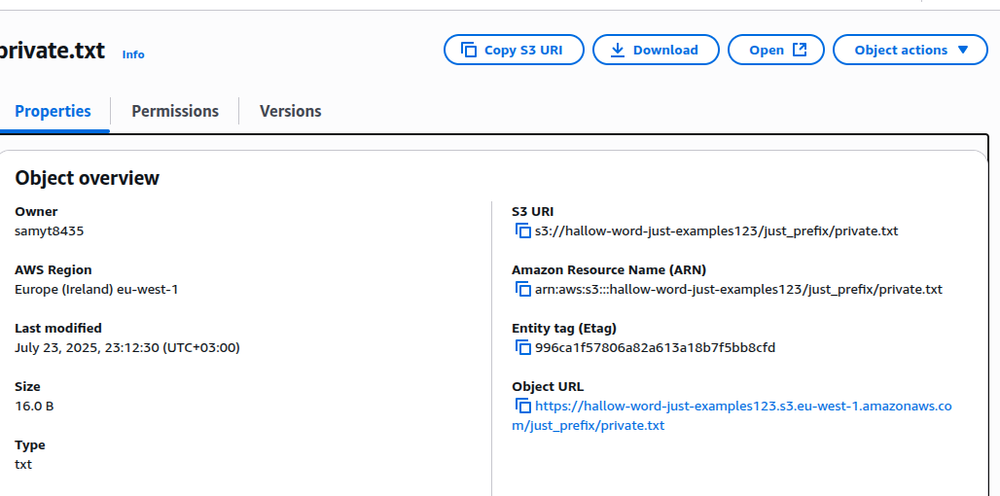 

> [!WARNING]
>
> ---
>
> ### **إزاي تنادي على الفايل بتاعك في `S3`؟**
>
> النوع الأول هو الـ **S3 URI**، 
> وده يعتبر الـ identifier بتاع شغل AWS الداخلي. هو عبارة عن identifier مختصر بتستخدمه لما تكون بتتكلم مع S3 من جوه منظومة AWS نفسها، وعشان كده هو مش لينك تقدر تفتحه في browser، لكنه أشبه بـ local address بتفهمه خدمات AWS. تركيبته بسيطة جدًا، بتكون على صيغة s3://[bucket-name]/[object-key]
>
> ، زي المثال اللي في الكود s3://hallow-word-just-examples123/just_prefix/private.txt. أما استخدامه الأساسي فبيكون لما تشتغل بـ AWS CLI في أوامر زي aws s3 cp أو aws s3 ls، أو لما بتكتب كود بـ AWS SDKs زي Python أو Node.js، وكمان لما بتكون خدمة زي AWS Glue عايزة تقرأ داتا من S3. ده.
>
> ---
>
> النوع الثاني هو الـ **Amazon Resource Name (ARN)**، وده هو الـ identifier اللي بيكون globally unique لأي resource جوه AWS كلها، مش بس لـ S3. ومهمته الأساسية إنه يحدد الـ resource ده بشكل قاطع ومفيهوش أي لخبطة. بيتكون بصيغة ثابتة هي arn:[partition]:s3:::[bucket-name]/[object-key]
> ، زي المثال اللي في الصورة arn:aws:s3:::hallow-word-just-examples123/just_prefix/private.txt. أما استخدامه الرئيسي فبيكون في إدارة الصلاحيات (Permissions Management)، فلما بتيجي تكتب IAM Policy أو Bucket Policy عشان تدي صلاحيات لـ user أو role، لازم تستخدم الـ ARN في خانة الـ Resource لأن IAM مبيفهمش صيغة الـ S3 URI..
>
> ---
>
> النوع التالت والأكثر شيوعًا هو الـ **Object URL**، وده ببساطة هو اللينك العادي بتاع الـ browser اللي بنستخدمه كلنا على الإنترنت. هو عبارة عن HTTPS endpoint تقدر تاخده كوبي وتحطه في أي browser عشان تفتح الفايل مباشرةً. الأفضل دايمًا إنك تستخدم الصيغة اللي فيها الـ region عشان تتجنب أي مشاكل، وبتكون على شكل https://[bucket-name].s3.[region].amazonaws.com/[object-key]، زي المثال اللي في 
> الصورة https://hallow-word-just-examples123.s3.eu-west-1.amazonaws.com/just_prefix/private.txt. أما استخدامه فبيكون لأي وصول جاي من بره منظومة AWS، زي إنك تفتح الفايل في browser، أو تحط صورة في موقعك جوه  تاج، أو تبعت لينك لحد يحمل منه الفايل، وده طبعًا بيعتمد على إن الفايل يكون معموله public-read.
>
> ---
>
> 


> [!TIP]
>
> 
>
> **4. `Entity Tag (Etag)` **
>
> هو عبارة عن `hash` بيتعمل من محتوى الفايل. لو غيرت حرف واحد في الفايل ورفعته تاني، الـ `Etag` بتاعه هيتغير.
>
> *   **بستخدمه امتى؟**
>     *   **`Data Integrity`:** عشان تتأكد إن الفايل اللي نزل عندك هو هو نفس الفايل اللي على السيرفر ومحصلش فيه أي تلف.
>     *   **`Caching`:** الـ `Browsers` والـ `CDNs` بيستخدموه عشان يعرفوا إذا كان الفايل اتغير ولا لأ، فبدل ما يحملوه كل مرة، بيستخدموا النسخة اللي عندهم لو الـ `Etag` هو هو.

مثال ثاني رفع ملف للاسف مش هعرف اجربه او مش هيكون ليه لزمه 

```TERRAFORM

resource "aws_s3_object" "daily_report" {
  bucket = "bucket-name-in-account-a-1234"
  key    = "daily-reports/report-2024-07-28.csv"
  content = "col1,col2\nval1,val2"


  acl    = "bucket-owner-full-control"
}

```

لو انا مفعل object_ownership=objectwrite وعيز ادي صلاحية لصاحب bucket على كل object


> [!CAUTION]
>
> طب دلوقتي عيزين ندي امثلة بعيدا عن CANNED  
> هنا بقى بيظهر واحد من أهم عيوب ACL، ويمكن اعتباره "العيب القاتل" اللي بيحد من استخدامها: **إنك مش بتقدر تدي صلاحيات لـ IAM users أو IAM groups معينة**. نظام الـ ACL مش بيشوف  IAM في الـ account بتاعك أصلًا.
>
> وأقولك على حاجة، كل الجروبات اللي الـ ACL بتفهمها هما ثلاثة بس مفيش غيرهم: جروب اسمه **AllUsers Group** وده بيمثل أي حد في الدنيا على الإنترنت، وجروب تاني اسمه **AuthenticatedUsers Group**  وده بيمثل أي شخص مسجل في AWS وعامل login وجروب ثالث بيمثل خدمات logs  وبس كده، مفيش أي طريقة تانية تعمل بيها جروبات أو تدي صلاحيات مفصلة لمستخدمين معينين باستخدام ACL لوحدها فعشان كده اغلب الناس بتكتفى بي canned acl 
> طب ليه مينفعش acl مع iam users لانها بس بتتعامل مع id بتاع acount


دا مثال عندنا نوعين CanoicalUser ودا اي root user وبحط id بتاعه وبحدد نوعه وبديله permission read و برده لو عايز احط جروب هما 3 بس وبستخدام uri عشان احدد جروب معين 

| الاسم                   | URI                                                         |
| ----------------------- | ----------------------------------------------------------- |
| **All Users**           | `http://acs.amazonaws.com/groups/global/AllUsers`           |
| **Authenticated Users** | `http://acs.amazonaws.com/groups/global/AuthenticatedUsers` |
| **Log Delivery**        | `http://acs.amazonaws.com/groups/s3/LogDelivery`            |

**Log Delivery** شوية خدامات من aws تقدر تاخد Logs منهم زي **S3 Server Access Logging** و**AWS CloudTrail** و **Elastic Load Balancing** و**Amazon CloudFront:**و**AWS Config**

بس خلي بالك aws_s3_object فى terraform مش بتدعم تدي grant على object وينفع aws cli او sdk

------

---

### **الـ `S3 Bucket Policies`**

في `AWS`، فيه طريقتين تدي بيهم صلاحيات:

**1. `Identity-based Policy`**

*   دي `policy` بتتلزق على الـ **`Identity`** نفسه (زي `IAM User`, `IAM Group`, أو `IAM Role`).
*   وظيفتها تجاوب على سؤال: **"الـ `Identity` ده يقدر يعمل إيه؟"**
*   **مثال:** `policy` بتلزقها في `IAM User` اسمه `taha`، وبتقوله: انت مسموحلك تعمل تنشاء ec2 وتحمل من s3 معين طالما داخل account ب
*   

**2. `Resource-based Policy`**

*   دي `policy` بتتلزق على الـ **`Resource`** نفسه (زي `S3 Bucket` أو `SQS Queue`).
*   وظيفتها تجاوب على سؤال: **"الـ `Resource` ده مين مسموحله يوصله ويعمل فيه إيه؟"**
*   **مثال (وهي الـ `Bucket Policy`):** `policy` بتلزقها على `S3 Bucket` وبتقول: اسمح للـ `AWS account` الفلاني إنه يعمل `s3:GetObject` على الـ `bucket` ده.

> [!IMPORTANT]
>
> هنا في نقطة مهمة IAM متقدرش تدي role ليه اي entity فى aws لزم تستخدام نوع من خاص شوية من Resource-based Policy اسمه assume_role_policy او trust policy دي هشرحها تحت بعد شرح **`Resource-based Policy`** الخاصة بـbucket أللي اسمه bucket policy
>
> 

الخاصية دي موجودة في خدمات معينة بس، وغالبًا بتكون الخدمات اللي طبيعتها إنها بتشتغل كـ "endpoints" بتستقبل requests من مصادر كتير ومختلفة، أو بتحتاج تتشارك بين accounts كتير.

الفايدة الأساسية للـ Bucket Policy عن الـ IAM Policy هي قدرتها على منح الصلاحيات **لـ principals من خارج الـ account بتاعك**، زي إنك تخلي الـ bucket عام (public) أو تدي صلاحية لـ AWS account تاني. بالإضافة لكده، هي بتقدم مكان  واحد تشوف منه كل القواعد Policies بالـ bucket ده بالذات.

> [!CAUTION]
>
> لما بيحصل أي طلب على AWS، زي تحميل أو تعديل ملف، القرار النهائي بيعتمد على فحص نوعين من الـ policies مع بعض: الـ Identity-based Policy (اللي لازقة في الـ user أو الـ role)، والـ Resource-based Policy (اللي لازقة في الـ resource نفسه). لو حصل أي تعارض صريح بين الاتنين، زي إن واحدة بتقول Allow والتانية بتقول Deny، الطلب بتاعك هيفشل فورًا لأن الـ Deny الصريح بيكسب دايمًا. أما لو مكنش فيه أي policy بتتكلم عن الـ request ده أصلًا، سواء بالسماح أو بالرفض، الطلب هيفشل برضه وده اللي بنسميه Implicit Deny. الحالة الوحيدة اللي الطلب فيها بيعدي هي لو لقى Allow صريح في واحدة من الـ policies، في حين إن الـ policy التانية مش جايبة سيرة الـ request ده خالص أو مفيهاش أي Deny يمنعه. بالاصح إن عشان الطلب ينجح، لازم يلاقي Allow واحد على الأقل في طريقه، وميقابلش أي Deny صريح.
> لسه هنشوف ايه allow وايه deny متقلقش
>
> 
>

> [!IMPORTANT]
>
> لو شفت كلمة trust policy سيبها او مش عايزك تركز فيها دلوقتي افهم اولا bucket policy كويسه وهتلاقيني شرح ليك trust policy فى iam بعد bucket policy 


------

عشان كده، الـ `Bucket Policy` هي `resource-based policy` لأنك بتلزقها على الـ `S3 bucket` مباشرةً.

دي `resource-based policy` بتتكتب بصيغة `JSON` وبتتعلق بالـ `bucket` نفسه. الـ `policy` دي عبارة عن `statements`، كل `statement` بيحدد:

*   `Effect`: إما `Allow` أو `Deny`.
*   `Principal`: مين اللي بتطبق عليه القاعدة (user, account, service, أو `*` للكل) مين اللي ليه حق يطلب.
*   `Action`: إيه الـ `API calls` المسموحة أو الممنوعة (زي `s3:GetObject`) انه يحمل ملف.
*   `Resource`: القاعدة دي بتطبق على أنهي `resources` بالظبط (الـ `bucket ARN` أو `objects` معينة).
    انهي مكان فى s3 مش شرط bucket مفهوم policy مكمل معاك فى كل حاجة
*   `Condition`: شروط إضافية لازم تتحقق، زي إن الـ `request` يكون جاي من `IP address` معين.
*   **الـ `Scope` بتاعها:**
    على مستوى الـ `bucket` بالكامل. هي أداة مركزية بتطبق سياسة واحدة على كل الـ `objects` اللي جوه الـ `bucket`يعني مينفع ترفع ملف بbaucket policy زي acl

ترتيب bucket policy بيحصل ازاي 

1.  **هل فيه أي `Deny` صريح؟**
    *   أول حاجة `IAM` بيدور عليها هي أي `statement` يكون الـ `Effect` بتاعه `"Deny"` وينطبق على الـ `request` ده.
    *   لو لقى **واحد بس**، بيوقف عملية التقييم كلها فورًا ويرجع بنتيجة **`Deny`**. مش بيبص على أي `Allow` موجود في أي حتة تانية.

2.  **لو مفيش `Deny`، هل فيه أي `Allow` صريح؟**
    *   لو `IAM` دور وملقاش أي `Deny` صريح، بيكمل ويدور على `statement` يكون الـ `Effect` بتاعه `"Allow"` وينطبق على الـ `request`.
    *   لو لقى **واحد على الأقل**، يبقى النتيجة هي **`Allow`**.

3.  **لو مفيش لا `Deny` ولا `Allow`؟**
    *   لو `IAM` دور في كل الـ `policies` المطبقة (سواء `Bucket Policy` أو `IAM Policy` أو غيرها) وملقاش أي `statement` ينطبق على الـ `request` ده أصلًا، يبقى النتيجة هي **`Deny`** بشكل افتراضي. ده اسمه **`Implicit Deny`**

> [!TIP]
>
> نفس compnent اللي انت شايفه فى bucket policy هي فى iam policy بس كمان بتكون اقل ففهمك هنا ضروري قوي عشان الفصول اللي جيه وعشان تفهم policy بتشمي ازاي


> [!TIP]
>
> ممكن تضيف حاجة اسمه sid او statementid وهو اشبه ب id للـstatment
> ```json
> 
> {
>   "Version": "2012-10-17",
>   "Statement": [
>     {
>       "Sid": "MyStatementID", // <-- ID
>    # .....................
>     },
>     {
>       "Sid": "another MyStatementID", // <--   
>    # ...........
>     }
>    ]
>    }
>    ```
>    
>   


> [!TIP]
>
> 
>
> 
>
> الـ **`Principal`** هو أهم حتة في أي `Resource-based Policy`، لأنه ببساطة بيحدد **"مين"** اللي بنتكلم عنه في القاعدة دي، مين اللي بنديله صلاحية أو بنمنعها عنه.
>
> عشان تحدد الـ `Principal` صح، لازم تعرف إن فيه كذا طريقة، وكل طريقة ليها استخدام.
>
> **قواعد كتابة الـ `Principal`**
>
> الـ `Principal` مش مجرد `ARN` وخلاص. الطريقة اللي بتكتبه بيها بتعتمد على الـ **`key`** اللي بتستخدمه.
>
> *   لما تستخدم `key` اسمه **`AWS`**، يبقى لازم تحط `ARN` (زي `ARN` بتاع `user` أو `role` أو `account`).
> *   عشان تريح دماغك، ممكن تحط كذا `ARN` في `list` واحدة تحت الـ `key` اللي اسمه `AWS`، وكده تدي نفس الصلاحية لكذا واحد مرة واحدة.
>
> ```json
> "Principal": {
>   "AWS": [
>     "arn:aws:iam::111122223333:user/taha", 
>     "arn:aws:iam::111122223333:role/AnalyticsServerRole", 
>     "arn:aws:iam::444455556666:root" 
>   ]
> }
> ```
>
> *   **مهم:** لازم تحدد الـ `key` (زي `AWS`, `Service`...). الحالة الوحيدة اللي مش بتكتب فيها `key` هي لما تقول `Principal: "*"` عشان تدي الصلاحية للدنيا كلها.
> *   زي ما الـ `Principal` بياخد `list`، كمان الـ `Action` والـ `Resource` ممكن ياخدوا `list` عشان تطبق نفس القاعدة على كذا حاجة.
>
> ---
>
> أنواع الـ `Principals`
>
> **1. `AWS` Principal**
>
> ده النوع اللي بيتعامل مع أي `identity` متعرفة جوه `IAM` بتاعك.
> *   **قيمته ممكن تكون:**
>     *   **`ARN` بتاع `AWS Account` كامل:** زي `...:root`، وده بيدي الإذن لكل 
>         الـ `identities` اللي جوه الحساب ده إنهم ينفذوا الأكشن (طبعاً لو الـ `policy` بتاعتهم هما كمان تسمح).
>     *   **`ARN` بتاع `IAM User` معين:** زي `...:user/taha-dev`.
>     *   **`ARN` بتاع `IAM Role` معين:** زي `...:role/EC2-Admin-Role`.
>     
> *   **ملحوظة مهمة عن EC2:** مينفعش تحط `ARN` بتاع `EC2 instance` في الـ `policy` كـ `Principal`. السيرفرات مش `principals` ثابتة بالشكل ده. الحل الصح والوحيد هو إنك تدي الـ `EC2` دي `IAM Role`، وهي بتشتغل بتاخده الـ `Role` ده. فأي `S3 Bucket Policy` هتكتبها، هتدي الصلاحية للـ `ARN` بتاع الـ `Role`، مش السيرفر. والعملية دي كلها بتعتمد على **`Trust Policy`** اللي بتخلي الـ `EC2` أصلًا يقدر يستخدم الـ `Role`. او تستخدام service اللي بعده
>
> ---
>
> **2. `Service` Principal**
>
> ده النوع اللي بتستخدمه لما تكون خدمة من خدمات AWS هي اللي محتاجة تنفذ `action` بالنيابة عنك.
> *   **قيمته بتكون:** اسم الخدمة على صيغة `[service-name].amazonaws.com`.
>
> ```json
> "Principal": { "Service": "ec2.amazonaws.com" }
> ```
> لما تحدد `Principal` كخدمة زي دي، ده بيسمح لأي `instance` في حسابك إنها تاخد الإذن لو متظبطة صح. بس ده مش معناه إنك سايبها مفتوحة، لأنك تقدر تضيف عنصر **`Condition`** للـ `policy` عشان تقفلها على حاجات معينة، زي `ARN` أو `Tags`،وحجات تانية كتير وده بيديك تحكم أدق.
>
> ---
>
> **3. `Federated` Principal**
>
> ده النوع اللي بتستخدمه لما تكون عايز تدي صلاحيات لناس **مش موجودين عندك كـ `IAM users`**. بـ identity جاية من بره AWS خالص، زي حساباتهم في Google أو Active Directory بتاع الشركة.
>
> الـ `Principal` ده بيستخدم **حصرياً** في **`Trust Policy`** بتاعة `IAM Role`. الـ `policy` دي كأنها بتقول: "أنا كـ `Role`، بثق في external identity provider  ده (`IdP`)، وهسمح لأي حد يجيلي منه بـ `token` سليم إنه يستخدام policy معينه مربوطه بـrole ده".
>
> *   **مثال (`Login with Google`):**
>     1.  بتروح على `IAM` وتعمل `OIDC Identity Provider` وتعرفه على Google.
>     2.  بتعمل `IAM Role` والـ `Trust Policy` بتاعته بتحط فيها `ARN` الـ `IdP` ده كـ `Federated Principal`.
>
>
> ```
> "Principal": {
>   "Federated": "arn:aws:iam::...:oidc-provider/accounts.google.com"
> }
> ```
>
> 
>
> بعد كده، أي حد بيعمل `login` بـ Google، التطبيق بتاعك بياخد منه `token` ويروح بيه لـ `AWS STS` عشان ياخد صلاحيات مؤقتة من الـ `Role` ده، ويقدر يكلم بيها خدمات AWS.
>
> ---
>
> #### **4. `CanonicalUser` Principal**
>
> ده نوع قديم ونادر، بيتعامل مع الـ `AWS root account` بس باستخدام `ID`  . مش هتحتاجه في الغالب.
>
> *   **قيمته بتكون:** الـ `Canonical User ID` بتاع الحساب.
>     `"CanonicalUser": "79a59df900b949e55d96a1e698fbaced..."`
>
> 
>
> 

> [!CAUTION]
>
> الفرق الأساسي في طريقة كتابة Identity-based Policy و Resource-based Policy هو **أن Identity-based Policy مفيش فيه  Principal**، لأن الـ Principal هو الـ identity (الـ user أو الـ role) الملحقة به الـ policy. هتشوف ده لما نخلص bucket polict
> 
>


> [!TIP]
>
> 
>
> actions
>
> لما تيجي تكتب `policy` عشان تدي صلاحيات على S3، لازم تبقى عارف كويس إن فيه نوعين من الصلاحيات: صلاحيات على **الـ `Bucket` نفسه** ، وصلاحيات على **الـ `Objects`** . الفرق ده مهم جدًا عشان تعرف تكتب `ARN` الـ `Resource` صح.
> 
>  ---
> 
>**أولًا: الصلاحيات اللي على مستوى الـ `Object` (عشان تتعامل مع الملفات)**
> 
>دي أكتر حاجة هتستخدمها في شغلك فى انواع تانية كتير. الـ `Resource` بتاعها لازم ينتهي بـ `/*` عشان تقول "كل الملفات اللي جوه الـ `bucket` ده".
> 
> **الصيغة:** `arn:aws:s3:::your-bucket-name/*`
>
> 1.  **`s3:GetObject`**
>    *   **بتعمل إيه؟** بتخليك تقرأ وتحمل محتوى الملف. دي أهم صلاحية لو عايز تدي لحد صلاحية قراءة بس.
> 
>2.  **`s3:PutObject`**
>     *   **بتعمل إيه؟** بتخليك ترفع ملف جديد، أو ترفع على ملف قديم بنفس الاسم.
>
> 3.  **`s3:DeleteObject`**
>    *   **بتعمل إيه؟** بتخليك تمسح ملف معين.
>    
>4.  **`s3:GetObjectAcl` / `s3:PutObjectAcl`**
>     *   **بتعمل إيه؟** بتخليك تقرأ أو تعدل الـ `ACL` بتاعة ملف عشان تعرف مين مسموحله يوصله. (مبقتش تستخدم كتير).
>
> 5.  **`s3:RestoreObject`**
>    *   **بتعمل إيه؟** لو الملف بتاعك متشال في تخزين رخيص زي `Glacier`، الصلاحية دي بتخليك تعمل `restore` للملف عشان يبقى جاهز للاستخدام.
> 
>---
> 
>#### **ثانيًا: الصلاحيات اللي على مستوى الـ `Bucket` **
> 
>دي صلاحيات بتتحكم في الـ `bucket` ككل. الـ `Resource` بتاعها بيبقى `ARN` الـ `bucket` من غير `/*`.
> 
>**الصيغة:** `arn:aws:s3:::your-bucket-name`
> 
>1.  **`s3:ListBucket`**
>     *   **بتعمل إيه؟** بتعرضلك قايمة بأسماء الملفات اللي جوه الـ `bucket`. دي ضرورية جدًا عشان الـ `Console` أو الـ `CLI` يعرفوا يوروك إيه اللي جوه.
>
> 2.  **`s3:DeleteBucket`**
>    *   **بتعمل إيه؟** بتمسح الـ `bucket` كله (بس لازم يكون فاضي الأول). دي صلاحية خطيرة جدًا.
> 
> 3.  **`s3:GetBucketLocation`**
>     *   **بتعمل إيه؟** بتخليك تعرف الـ `bucket` ده في أنهي `region`. صلاحية بسيطة ومش خطيرة.
>
> 4.  **صلاحيات إدارة الـ `bucket`:**
>    *   **`...BucketPolicy`**: بتخليك تتحكم في الـ `Bucket Policy` نفسها (تقرأها، تعدلها، تمسحها).
>     *   **`...LifecycleConfiguration`**: بتخليك تتحكم في قواعد الـ `Lifecycle` اللي بتمسح الملفات القديمة أو تنقلها لتخزين أرخص.
>
> ---
> 
>**ملحوظات مهمة وإنت بتكتب الـ `Resource ARN`**
> 
>*   **صلاحيات الـ `Bucket`** زي `s3:ListBucket` لازم تحطها على `ARN` الـ `bucket` نفسه (`...:your-bucket`). لو حطيتها على `.../*` مش هتشتغل.
> *   عشان تدي صلاحية على **الـ `bucket` وكل اللي جواه**، لازم تحط الاتنين في `list` جوه الـ `Resource`.
>
> 
>```
> "Resource": [
>    "arn:aws:s3:::your-bucket",      // ده عشان ListBucket
>     "arn:aws:s3:::your-bucket/*"   // وده عشان GetObject و PutObject
>]
> ```
>
> 
>
> *   **`s3:ListBucket` على مجلد معين:** مع إنها صلاحية على الـ `bucket`، بس ممكن تقيدها إنها تعرض الملفات اللي في "prefix معين" معين بس، وده بيتعمل باستخدام `Condition` في الـ `policy` 
>
> ---
>
> **استخدام الـ `Wildcards` (عشان تنجز)**
>
> عشان متكتبش صلاحيات كتير، ممكن تستخدم `wildcards` (`*` و `?`).
>
> 1.  **`s3:Get*`**: بتدي كل الصلاحيات اللي بتبدأ بـ "Get" (زي `GetObject`, `GetBucketLocation`). دي طريقة سريعة تدي بيها صلاحيات قراءة كاملة.
>2.  **`s3:Put*`**: بتدي كل الصلاحيات اللي بتبدأ بـ "Put" (زي `PutObject`, `PutBucketPolicy`).
> 3.  **`s3:*`**: **(خطر جدًا)** بتدي كل الصلاحيات الممكنة على S3. متستخدمهاش غير لو عارف .


زي ما قولت فى public block policy في bucket فى 2 خاصين بي acl و 2 بـbucket policy


**Block public access to buckets and objects granted through new public bucket or access point policies`**

في Terraform اسمه `block_public_policy`. وظيفته إنه يمنعك من *حفظ* أي `Bucket Policy` جديدة فيها `public access`. الـ `API call` نفسها اللي بتحاول تحفظ الـ` policy` (اللي هي PutBucketPolicy) هي اللي بتفشل، وS3 هيرجعلك `error` يمنع الـ `policy` دي إنها تتخزن أصلًا. هو عامل زي validator بيمنع الغلطة قبل ما تحصل، وبيضمن إن misconfiguration زي دي متقدرش تتسيف على الـ bucket بتاعك.

> [!TIP]
>
> `PutBucketPolicy` هو الـ API اللي بيخليك **تضيف أو تعدّل Policy كاملة** على الـ S3 bucket،


**`Block public and cross-account access to buckets and objects through any public bucket or access point policies`**

الإعداد ده، اللي اسمه restrict_public_buckets في Terraform، هو "شبكة الأمان" الأخيرة بتاعتك ضد أي policy عامة، خصوصًا القديمة منها.

فكرته مش إنه يمنعك تحفظ policy فيها public access زي أخوه (block_public_policy)، لأ، هو بيسيبك تحفظها عادي خالص. قوته الحقيقية بتبان بعد كده، وقت ما request حقيقي بيوصل للـ bucket.

لما S3 يجي يفحص الطلب ده، وأول حاجة يلاقيها إن الإعداد ده شغال، بيعمل حركة ذكية جدًا: وهو بيقرأ الـ Bucket Policy، بيقوم عامل "تجاهل" أو ignore لأي statement فيها بيدي public access (يعني أي statement فيه Principal: "*"). بيتعامل مع السطور دي كأنها مش موجودة في اللحظة دي.

وبعد ما يتجاهل الأجزاء الـ public دي، بيبص على اللي فاضل من الـ policy. لو ملقاش أي صلاحية تانية تسمح بالوصول، يبقى القرار النهائي هيكون Access Denied، والطلب هيترفض. وده بيحصل حتى لو الـ policy الأصلية اللي انت حافظها كانت بتقول اسمح بالوصول.

الميزة الجبارة هنا هي إنك بتقدر تأمّن bucket قديم عليه policies معقدة بشكل فوري، من غير ما تحتاج تفتح ملف الـ JSON المخيف ده وتخاطر إنك تبوظ الدنيا بالغلط. هو بيعطل تأثير الـ policy الخطرة من غير ما يمسحها.


شوية امثلة 

```terraform
resource "aws_s3_bucket" "public_read_bucket" {
  bucket = "my-tf-policy-public-read-bucket"
}

resource "aws_s3_bucket_public_access_block" "public_read_access" {
  bucket = aws_s3_bucket.public_read_bucket.id

  block_public_policy     = false
  restrict_public_buckets = false
}

resource "aws_s3_bucket_policy" "public_read_policy" {
  bucket = aws_s3_bucket.public_read_bucket.id

  policy = jsonencode({
    Version = "2012-10-17",
    Statement = [
      {
        Effect    = "Allow",
        Principal = "*",
        Action    = "s3:GetObject",
        Resource  = "${aws_s3_bucket.public_read_bucket.arn}/*"
      }
    ]
  })
}
```


1. **if** الـ **Principal** هو **"\*"**...
   - **معناه:** لو الشخص اللي بيطلب الـ request هو **أي حد في العالم على الإنترنت** (سواء عنده account أو لأ، anonymous).
2. **AND if** الـ **Action** هي **"s3:GetObject"**...
   - **معناه:** لو الفعل اللي بيحاول يعمله هو "قراءة أو تحميل object" (فايل).
3. **AND if** الـ **Resource** هو **".../my-tf-policy-public-read-bucket/\*"**...
   - **معناه:** لو الفايل اللي بيحاول يوصله موجود **جوه** الـ bucket ده 
     (علامة /* معناها "أي object بداخل الـ bucket") وﻻ حظ اننا بستخدام arn اللي هو amazon resource name

**الجزء الثاني: النتيجة (then)**

- **then** الـ **Effect** هو **"Allow"**.
  - **معناه:** لو كل الشروط اللي فاتت دي اتحققت، يبقى النتيجة هي **"السماح بالطلب"**.


---

**منع من `IP Address` معين فقط**

 عندك `bucket` فيه ملفات داخلية بتاعة الشركة، ومش عايز أي حد يوصلها إلا الموظفين اللي شغالين من مكتب الشركة (يعني من الـ `IP` بتاع الشركة).

**فكرتها إيه؟**
هنا بنستخدم الـ `Condition` بلوك عشان نحط شرط على الـ `IP` اللي جاي منه الـ `request`.

```terraform
variable "office_ip_range" {
  description = "The public IP address range for the company office."
  type        = string
  default     = "203.0.113.0/24"  
}

resource "aws_s3_bucket" "internal_docs_bucket" {
  bucket = "my-company-internal-docs-bucket"
}

resource "aws_s3_bucket_policy" "ip_restriction_policy" {
  bucket = aws_s3_bucket.internal_docs_bucket.id

  policy = jsonencode({
    Version = "2012-10-17",
    Statement = [
      {
        Effect = "Deny",
        Principal = "*",
        Action = "s3:*",
        Resource = [
          aws_s3_bucket.internal_docs_bucket.arn,
          "${aws_s3_bucket.internal_docs_bucket.arn}/*"
        ],
        Condition = {
          NotIpAddress = {
            "aws:SourceIp" = var.office_ip_range
          }
        }
      }
    ]
  })
}
```
*   **Effect: "Deny"`**: احنا هنا بنستخدم سياسة الرفض، وهي أقوى.
*   **`Condition: { NotIpAddress: ... }`**: ده الشرط . معناه: "لو الـ `IP` بتاع الـ `request` **مش** في الرينج ده...".
*   (`Deny`) أي حد (`*`) من إنه يعمل أي حاة (`s3:*`) على الـ `bucket` ده، **بشرط إن** الـ `IP` بتاعه مش هو الـ `IP` بتاع الشركة".
*   محدش هيعرف يوصل للـ `bucket` ده إلا من جوه شبكة الشركة.


---

**إجبار كل الملفات المرفوعة إنها تكون `Encrypted`**

**السيناريو:** عايز تضمن إن كل فايل بيترفع على الـ `bucket` بتاعك لازم يكون معموله `Server-Side Encryption` عشان الأمان والـ `Compliance`. لو حد حاول يرفع فايل عادي، ترفضه.

**فكرتها إيه؟**
هنستخدم `Deny` statement تاني، بس المرة دي الشرط هيكون على الـ `header` بتاع الـ `request`.

**الكود:**
```terraform
resource "aws_kms_key" "just_key" {

}
output "just_kms_key" {
  value = aws_kms_key.just_key.arn
}
resource "aws_s3_bucket" "encrypted_uploads_bucket" {
  bucket = "my-encrypted-uploads-bucket"
  
}
resource "aws_s3_bucket_public_access_block" "just_example" {
  bucket = aws_s3_bucket.encrypted_uploads_bucket.id
  block_public_policy = false
  ignore_public_acls = false
}
resource "aws_s3_bucket_policy" "force_encryption_policy" {
  bucket = aws_s3_bucket.encrypted_uploads_bucket.id
  policy = jsonencode({
    Version = "2012-10-17",
    Statement = [
      {
        Effect = "Deny",
        Principal = "*",
        Action = "s3:PutObject",
        Resource = "${aws_s3_bucket.encrypted_uploads_bucket.arn}/hallow/world/*",
        Condition = {
  StringNotEquals = {
    "s3:x-amz-server-side-encryption" = "aws:kms"  
  }

        }
      }
    ]
  })
}
```
*   **`Action: "s3:PutObject"`**: القاعدة دي بتطبق على عمليات الرفع بس.
*   انا هنا اجبرته على نوع تشفير معين اللي هو kms
*   محدش هيقدر يرفع فايل على الـ `bucket` ده إلا لو حدد صراحةً إنه عايز يستخدم `Server-Side Encryption`.

لما جرب ابعته منغير key 


---

**منع  Hotlinking**

Hotlinking حاجة مشهور ان موقع ياخد static file بتاعك ويستخدمه سواء صور او فيديوهات

عندك `bucket` عليه صور بيستخدمها الموقع بتاعك. انت عايز تضمن إن الصور دي تظهر بس لما حد يفتح الموقع بتاعك، وتمنع أي موقع تاني إنه "يسرق" اللينكات ويحطها عنده ويسحب من الـ `traffic` بتاعك.

**فكرتها إيه؟**
بنستخدم `Condition` بيبص على `HTTP Referer header`. الـ `header` ده بيقول الـ `request` بتاع الصورة جاي من أنهي صفحة.

```terraform
variable "my_website_domain" {
  description = "The domain name of your website."
  type        = string
  default     = "my-awesome-website.com"
}

resource "aws_s3_bucket" "website_images_bucket" {
  bucket = "my-website-images-bucket-2024"
}

resource "aws_s3_bucket_public_access_block" "images_bucket_access" {
  bucket = aws_s3_bucket.website_images_bucket.id

  block_public_policy     = false
  restrict_public_buckets = false
}

resource "aws_s3_bucket_policy" "prevent_hotlinking_policy" {
  bucket = aws_s3_bucket.website_images_bucket.id

  policy = jsonencode({
    Version = "2012-10-17",
    Statement = [
      {
        Sid    = "AllowGetRequestsOriginatingFromMyWebsite",
        Effect = "Allow",
        Principal = "*",
        Action = "s3:GetObject",
        Resource = "${aws_s3_bucket.website_images_bucket.arn}/*",
        Condition = {
          StringLike = {
            "aws:Referer" = [
              "http://${var.my_website_domain}/*",
              "https://${var.my_website_domain}/*"
            ]
          }
        }
      }
    ]
  })
}
```
الـ `policy` دي بتقول: "اسمح لأي حد (`*`) إنه يحمل الفايلات (`GetObject`)، **بشرط إن** الـ `request` يكون جاي من أي صفحة جوه الـ `domain` اللي اسمه `my-awesome-website.com`". لو حد خد لينك الصورة وحطه في موقع تاني، الـ `Referer` هيتغير، والشرط مش هيتحقق، والصورة مش هتظهر.

---

**: السماح بالوصول للـ `Accounts` اللي جوه aws Organization**

aws Organization خدمة في AWS u عشان تدير اكثر حسابات AWS تحت إدارة واحدة من حيث (billing، access، SCPs...). 

عندك `bucket` مركزي للـ `logs` وعايز تضمن إن **فقط** الـ `AWS accounts` اللي تبع الـ `Organization` بتاعت شركتك هي اللي تقدر تكتب فيه، وتقفل الباب على أي `account` تاني في العالم.

**فكرتها إيه؟**
بنستخدم `Condition` بيفلتر بناءً على `Organization ID`.

**الكود:**
```terraform
variable "my_organization_id" {
  description = "The ID of your AWS Organization."
  type        = string

}

resource "aws_s3_bucket" "org_logs_bucket" {
  bucket = "my-organization-logs-bucket"
}

resource "aws_s3_bucket_policy" "org_only_policy" {
  bucket = aws_s3_bucket.org_logs_bucket.id

  policy = jsonencode({
    Version = "2012-10-17",
    Statement = [
      {
        Sid    = "AllowAccessFromMyOrganizationOnly",
        Effect = "Allow",
        Principal = "*",
        Action = [
            "s3:PutObject",
            "s3:GetObject"
        ],
        Resource = "${aws_s3_bucket.org_logs_bucket.arn}/*",
        Condition = {
          StringEquals = {
            "aws:PrincipalOrgID" = var.my_organization_id
          }
        }
      }
    ]
  })
}
```
**الـ `policy` دي بتقول: "اسمح لأي `principal` (`*`) إنه يقرأ ويكتب، **بشرط إن** الـ `principal` ده يكون جاي من `account` هو عضو في الـ `Organization` اللي الـ `ID` بتاعها كذا". ده بيعمل طبقة أمان قوية جدًا على مستوى الشركة كلها.

---

**إعطاء صلاحية تعديل الـ `Tags` فقط**

 عندك `user` في Archiving Team، ووظيفته إنه يصنف الفايلات ويحط عليها `tags` (زي `project: "Alpha"` أو `status: "Archived"`). انت عايزه يقدر يحط ويمسح `tags`، لكن **مش عايزه يقدر يقرأ محتوى الفايلات** نفسها أو يمسحها.

**فكرتها إيه؟**
بندي صلاحية على `Actions` محددة جدًا ليها علاقة بالـ `Tagging` بس.

**الكود:**

```terraform
variable "archiver_user_arn" {
  description = "The ARN of the IAM user responsible for tagging."
  type        = string
}

resource "aws_s3_bucket" "archiving_bucket" {
  bucket = "my-company-archiving-bucket"
}

resource "aws_s3_bucket_policy" "tagging_only_policy" {
  bucket = aws_s3_bucket.archiving_bucket.id

  policy = jsonencode({
    Version = "2012-10-17",
    Statement = [
      {
        Sid    = "AllowTaggingActionsOnly",
        Effect = "Allow",
        Principal = {
          AWS = var.archiver_user_arn
        },
        Action = [
            "s3:GetObjectTagging",
            "s3:PutObjectTagging"
        ],
        Resource = "${aws_s3_bucket.archiving_bucket.arn}/*"
      },
      {
        Sid    = "AllowListBucketToFindObjects",
        Effect = "Allow",
        Principal = {
          AWS = var.archiver_user_arn
        },
        Action = "s3:ListBucket",
        Resource = aws_s3_bucket.archiving_bucket.arn
      }
    ]
  })
}
```
الـ `policy` دي بتدي للـ `user` صلاحيتين بس: `PutObjectTagging` (يحط `tags`) و `GetObjectTagging` (يقرأ الـ `tags`). وكمان اديناله `ListBucket` عشان يقدر يشوف أسماء الفايلات ويعرف هو هيحط `tags` على إيه. لو حاول يعمل `GetObject` عشان يحمل الفايل، هيجيله `Access Denied`.

.       Action = "s3:ListBucket",
        Resource = aws_s3_bucket.archiving_bucket.arn انت كده بتديله ان يقدر يشوف اسماء files أللي موجودة كلها 
طب لو على perfix معينة ودي حالة خاصة فى الكتابة شوية

```terraform

resource "aws_s3_bucket_policy" "allow_restricted_list_policy" {
  bucket = aws_s3_bucket.restricted_list_bucket.id

  policy = jsonencode({
    Version = "2012-10-17",
    Statement = [
      {
        Sid       = "AllowListingOfSharedReportsPrefixOnly",
        Effect    = "Allow",
        Principal = {
          AWS = var.viewer_user_arn_restricted
        },
        Action    = "s3:ListBucket",
        Resource  = aws_s3_bucket.restricted_list_bucket.arn,
        

        Condition = {
          StringLike = {

            "s3:prefix": [
                "shared-reports/*",
                "shared-reports/"
            ]
          }
        }
      }
    ]
  })
}
```

هيقدر يعمل listobject عند `shared-reports` وكمان عند اي files بعده `shared-reports`


---

### IAM 

> [!IMPORTANT]
>
> فيه نقطة جوهرية ومهمة جدًا لازم تكون في بالك: المجموعة الكبيرة من الصلاحيات اللي بنسميها **Administrative Permissions** — زي إنشاء أو حذف الـ resources — مينفعش أبدًا تتحط في **resource-based policy** زي الـ S3 Bucket Policy.
>
> والسبب بسيط ومنطقي، صلاحية زي s3:CreateBucket أو elasticfilesystem:CreateFileSystem مينفعش تتحط على الـ resource نفسه، لإن الـ resource ده **أصلًا لسه متعملش** عشان تلزق عليه policy.
>
> عشان كده، النوع ده من الـ Administrative Permissions **ملوش أي لزمة أو تأثير إلا لو اديته لـ identity معينة**، يعني لازم يتحط في IAM Policy بتتلزق على Role أو User.


#### **طبيعة الـ IAM User **

الـ IAM User هو identity ليها **long-term credentials**. الـ long-term credentials دي هي الـ Access Key والـ Secret Key اللي بيستخدمهم عشان يكلم الـ API أو الـ CLI، وكمان الباسورد اللي بيدخل بيه على الـ AWS Console. الصلاحيات بتاعته بتتعرف عن طريق Identity-based Policies اللي بتتربط (attach) بيه بشكل مباشر. الـ policy دي بتجاوب على سؤال واضح: **"الـ user ده مسموح له يعمل إيه؟"**. 

 مثال الكامل اللي بيبني IAM User، وبيعمل له Policy خاصة بـ S3، وبعدين بيعمل attach للـ Policy دي في الـ User كده policy معاها طول العمر

```terraform
provider "aws" {
  region = "us-east-1"
}

resource "aws_iam_user" "developer_user" {
  name = "taha-developer"
  tags = {
    Team = "Backend"
  }
}

resource "aws_iam_access_key" "developer_key" {
  user = aws_iam_user.developer_user.name
}


resource "aws_iam_policy" "s3_read_policy" {
  name        = "S3-ReadOnly-Company-Bucket"
  description = "Allows read-only access to the company bucket"

  policy = jsonencode({
    Version = "2012-10-17",
    Statement = [
      {
        Effect = "Allow",
        Action = [
          "s3:GetObject", 
          "s3:ListBucket" 
        ],

        Resource = [
          "arn:aws:s3:::my-company-reports-bucket", 
          "arn:aws:s3:::my-company-reports-bucket/*" 
        ]
      }
    ]
  })
}

resource "aws_iam_user_policy_attachment" "developer_s3_attach" {
  user       = aws_iam_user.developer_user.name
  policy_arn = aws_iam_policy.s3_read_policy.arn
}


output "developer_user_arn" {
  value = aws_iam_user.developer_user.arn
}

output "developer_credentials" {
  sensitive = true
  value = {
    access_key_id     = aws_iam_access_key.developer_key.id
    secret_access_key = aws_iam_access_key.developer_key.secret
  }
}
```

#### **الـ IAM Role**

على عكس الـ User، الـ IAM Role هو identity **ملهاش long-term credentials**، يعني مش بيحتفظ بـ Access Key أو باسورد. هو مصمم مخصوص عشان principals تانية (زي خدمات AWS أو users) **تستخدمه (assume)** بشكل مؤقت. لما Entity  **بيعمل assume للـ Role**، خدمة STS بتصدرله **temporary credentials** ليها وقت صلاحية محدد. عشان عملية الـ assume دي تحصل، **لازم الـ Role يكون عنده Trust Policy** (assume_role_policy). الـ Trust Policy دي هي Resource-based Policy بتطبق على الـ Role نفسه، ووظيفتها تحدد مين بالظبط الـ principals الموثوق فيها اللي مسموح لها تطلب إنها **تستخدم** الـ Role ده. من غير Trust Policy سليمة، الـ Role بيبقى غير ملوش لزمه يمكن الكلام صعب اقراء وانت هتفهم بس اقراء لاخر

##### **إزاي تدي صلاحيات للخدمات في AWS باستخدام `Trust Policy`**

قبل ما نفهم الـ `Trust Policy`، لازم نفهم الأول خدمة `AWS STS`، لأنها هي أساس كل عمليات الصلاحيات المؤقتة.

> [!IMPORTANT]
>
> **إيه هو `AWS STS` (Security Token Service)؟**
>
> `AWS STS` هي `web service` ، شغلانتها الأساسية إنها تعمل وتوزع **`temporary credentials`** (صلاحيات مؤقتة) للـ `identities` اللي بنثق فيهم. بدل ما نستخدم `credentials` دايمة زي `Access Keys` بتاعة `IAM User`، اللي لو اتسربت ممكن تعمل مشكلة، الـ `STS` بيخليك تطلب صلاحيات بتنتهي صلاحيتها بعد فترة، وده بيزود الأمان.
>
> العملية دي بتتم من خلال `action` اسمه **`AssumeRole`**. لما `principal` موثوق فيه (زي خدمة Lambda) بيطلب إنه يستخدام `IAM Role` معين، هو بيكلم الـ `API` بتاعة `STS`. وقتها `STS` بيتأكد من الـ `Trust Policy` بتاعة الـ `Role` عشان يشوف إذا كان الـ `principal` ده مسموح له بالتقمص. لو تمام، `STS` بيصدر `temporary credentials` (Access Key, Secret Key, و Session Token) فيها نسخة من كل الصلاحيات المربوطة بالـ `Role`، والـ `principal` بيستخدمها عشان يشتغل.

دلوقتي بعد ما فهمنا `STS`، نقدر نشرح إزاي بنستخدم `Trust Policy`. الأول، لازم نميز بين `Permissions` و `Roles`.

ببساطة، الـ **`Permissions`** (اللي بنعرفها في `IAM Policy`) بتحدد **"إيه"** اللي ممكن يتعمل، زي `s3:PutObject` أو `s3:ListObjects`. أما الـ **`Role`**، فهو الـ `identity` اللي **"بيشيل"** الـ `permissions` دي، وبيتم إسناده لـentity او خدمة ، سواء كان خدمة AWS أو حساب تاني. عملية تحديد مين يقدر يستخدم الـ `Role` هي دي وظيفة الـ `Trust Policy`.

**مثال بسيط نسمح لـ Lambda انها تحط objects على  في S3**

عشان نعمل كده، بنمشي على 3 خطوات أساسية:

أول حاجة، بنحدد الصلاحيات اللي محتاجينها في مورد `aws_iam_policy`.

```terraform
resource "aws_iam_policy" "lambda_writer_policy" {
  name = "lambda-s3-writer-and-logs-policy"
  policy = jsonencode({
    Version = "2012-10-17",
    Statement = [
      {
        Effect   = "Allow",
        Action   = "s3:PutObject",
        Resource = "${aws_s3_bucket.lambda_target_bucket.arn}/*" 
      },
      {
        Effect = "Allow",
        Action = [ "logs:CreateLogStream", "logs:PutLogEvents" ],
        Resource = "arn:aws:logs:*:*:*"
      }
    ]
  })
}
```
الـ `policy` دي بتمنح صلاحيتين: `s3:PutObject` على `bucket` معين، وصلاحية كتابة الـ `logs` في CloudWatch. مهم نلاحظ إن الـ `policy` دي مفهاش `Principal`، لأنها مجرد تعريف للصلاحيات؛ تحديد مين يستخدمها هو دور الـ `Role`.

الخطوة التانية هي إنشاء الـ `identity` اللي هتشيل الصلاحيات دي. الـ `Role` هو `identity` مصمم عشان الخدمات تقدر تستخدمه لفترة محدودة من الوقت  .

```terraform
resource "aws_iam_role" "lambda_s3_writer_role" {
  name = "lambda-s3-writer-role"
  #max_session_duration = 7200

  assume_role_policy = jsonencode({
    Version = "2012-10-17",
    Statement = [
      {
        Action = "sts:AssumeRole",
        Effect = "Allow",
        Principal = {
          Service = "lambda.amazonaws.com"
        }
      }
    ]
  })
}
```
الحتة بتاعة الـ Trust Policy (أو assume_role_policy) دي نوعها **Resource-based Policy**. يعني بالظبط زي ما الـ Bucket Policy بتطبق على الـ S3 Bucket، الـ Trust Policy دي بتطبق على **الـ IAM Role نفسه**.

شغلانتها إنها تحدد مين الـ Principal الموثوق فيه، أو بمعنى تاني، أنهي كيانات أو resources مسموح ليها تستخدم الـ Role ده. في الكود بتاعنا، الـ Principal ده هو خدمة lambda.amazonaws.com. والـ Trust Policy بتسمح للخدمة دي إنها تنفذ action واحد بس وهو sts:AssumeRole. ومعنى sts:AssumeRole ده إنها تقدر تستخدم صلاحيات الـ Role لفترة مؤقتة عشان تخلص شغلها

الخطوة اللي جي دي هي اللي بتجمع بين الخطوتين اللي فاتوا. فيها بناخدIAM Policy اللي عملناها، ونربطها أو **نلزقها** في الـ identity (اللي هي الـ Role في حالتنا) اللي هتشيل الصلاحيات دي.

يعني قبل الخطوة دي كان عندنا policy لوحدها و role لوحده، بعد الخطوة دي بقى الـ Role جواه الصلاحيات وجاهز للشغل.

```terraform
resource "aws_iam_role_policy_attachment" "lambda_writer_attach" {
  role       = aws_iam_role.lambda_s3_writer_role.name
  policy_arn = aws_iam_policy.lambda_writer_policy.arn
}
```
الـ **resource** ده aws_iam_role_policy_attachment شغلانته بسيطة ومهمة جدًا: إنه يعمل attach للـ policy اللي عملناها بالـ Role.

بعد الخطوة دي، الـ Role مبقاش فاضي؛ بقى جواه كل الـ permissions اللي حددناها (زي s3:PutObject و logs:*). كده بقى عندنا identity كاملة وجاهزة للشغل، ليها Trust Policy محددة، ومجموعة permissions واضحة.

**إسناد الـ Role للـ Lambda Function**

أخيرًا، بعد ما الـ Role بقى جاهز ومجهز بالكامل، بتيجي الخطوة الأخيرة وهي إننا نسنده للـ Lambda function اللي هتستخدمه. بكده، الـ Lambda بتاخد الصلاحية إنها تستخدم الـ Role ده عشان تنفذ الـ actions المطلوبة منها.

```terraform
resource "aws_lambda_function" "s3_writer_lambda" {
  # ... other settings
  role = aws_iam_role.lambda_s3_writer_role.arn
}
```
لما بنسند الـ Role للـ Lambda function، إحنا كده بنديها القدرة إنها **تستخدم الـ identity** بتاعته. وقت التنفيذ، خدمة Lambda هتستدعي sts:AssumeRole بنجاح، وهتاخد temporary credentials فيها كل الـ permissions اللي مربوطة بالـ Role (زي s3:PutObject و logs:*)، وده اللي هيخليها تنفذ مهمتها بنجاح.

#### الطريقة الثانية : `IAM User` يستخدام  `Role` في نفس الحساب

**كمثال:**
عندنا `IAM User` اسمه `taha-developer`. بشكل عام، معندوش صلاحيات يعمل حاجة خطيرة. بس ساعات بيحتاج يعمل مهمة إدارية معينة، زي إنه يمسح ملفات من `S3 bucket` حساس. مش عايزين نديله الصلاحية دي بشكل دائم، عايزينه ياخدها وقت ما يحتاجها بس.

**إيه اللي هنعمله؟**
هنعمل `Role` اسمه `s3-admin-role` فيه صلاحيات المسح، وهنخلي الـ `Trust Policy` بتاعته تسمح للـ `User` اللي اسمه `taha-developer` إنه يتقمصه.

**1. الـ `Trust Policy` بتتغير:**
الـ `Principal` هنا مبقاش `Service`، بقى `AWS`، وبنحدد الـ `ARN` بتاع الـ `User`.

```terraform
resource "aws_iam_role" "s3_admin_role" {
  name = "s3-admin-role"

  assume_role_policy = jsonencode({
    Version = "2012-10-17",
    Statement = [
      {
        Effect = "Allow",
        Action = "sts:AssumeRole",

        Principal = {
          AWS = "arn:aws:iam::123456789012:user/taha-developer"
        }
      }
    ]
  })
}
```

**2. الـ `User` نفسه محتاج يستخدام role:**
دي حتة بتلخبط ناس كتير. مش كفاية إن الـ `Role` يثق في الـ `User`. لازم **الـ `User` نفسه يكون معاه صلاحية** إنه يروح يطلب  الـ `Role` ده.
فبنعمل `policy` صغيرة ونلزقها في `taha-developer`:

```terraform
resource "aws_iam_policy" "assume_s3_admin_role_policy" {
  name = "AllowAssumeS3AdminRole"
  policy = jsonencode({
    Version = "2012-10-17",
    Statement = [
      {
        Effect = "Allow",
        Action = "sts:AssumeRole",

       Resource = "arn:aws:iam::123456789012:role/s3-admin-role" 
      }
    ]
  })
}

resource "aws_iam_user_policy_attachment" "taha_attach" {
  user       = "taha-developer"
  policy_arn = aws_iam_policy.assume_s3_admin_role_policy.arn
}
```

**إزاي `taha-developer` بيستخدمها؟**
عن طريق الـ AWS CLI، بيكتب أمر زي ده:

```
aws sts assume-role --role-arn "arn:aws:iam::..." --role-session-name "DeleteFilesSession"
```

الأمر ده بيرجعله `temporary credentials`. بعدين بيظبط الـ `environment variables` بتاعته بالـ `credentials` الجديدة دي، وأي أمر `aws s3` هينفذه بعد كده هيستخدم الصلاحيات المؤقتة دي.

الطريقة الثانية: `Cross-Account Access`

شركة "A" (حساب رقم `111111111111`) عندها `S3 bucket`.
شركة "B" (حساب رقم `999999999999`) عايزة تدي صلاحية لواحد من الـ `Users` بتوعها إنه يقرأ من الـ `bucket` بتاع شركة "A".

**إيه اللي بيحصل؟**
ده بيتم على خطوتين في الحسابين.

**في حساب "A" (اللي فيه الـ S3 Bucket):**
بنعمل `IAM Role`، والـ `Trust Policy` بتاعته بتثق في **حساب "B" بالكامل**.

```terraform
# الكود ده في حساب "A"
resource "aws_iam_role" "cross_account_s3_reader_role" {
  name = "CrossAccountS3ReaderRole"
  
  assume_role_policy = jsonencode({
    Version = "2012-10-17",
    Statement = [
      {
        Effect = "Allow",
        Action = "sts:AssumeRole",

        Principal = {
          AWS = "arn:aws:iam::999999999999:root"
        }
      }
    ]
  })
}


resource "aws_iam_role_policy_attachment" "s3_read_attach" {
  role       = aws_iam_role.cross_account_s3_reader_role.name
  policy_arn = "arn:aws:iam::aws:policy/AmazonS3ReadOnlyAccess"
}
```

> [!TIP]
>
>   policy_arn = "arn:aws:iam::aws:policy/AmazonS3ReadOnlyAccess" لو سؤال ايه دي policy جاهزة من aws بتديك صلاحية القراءة على s3 بشكل عام فى كتير من policy لسه فى الفصل السابع هنكلم عنم

**في حساب "B":**
بنعمل `policy` نلزقها في الـ `User` بتاعنا، ونديله صلاحية يعمل `assume` للـ `Role` اللي لسه عاملينه في حساب "A".

```terraform
# الكود ده في حساب "B"
resource "aws_iam_policy" "assume_role_in_account_a" {
  name = "AllowAssumeRoleInAccountA"
  policy = jsonencode({
    Version = "2012-10-17",
    Statement = [
      {
        Effect = "Allow",
        Action = "sts:AssumeRole",
        Resource = "arn:aws:iam::111111111111:role/CrossAccountS3ReaderRole"
      }
    ]
  })
}
```

وبنلزق الـ `policy` دي في الـ `User` المطلوب في حساب "B".


## **`Amazon S3 Access Points`**

### **1. إيه هو الـ `Access Point`؟**

الـ `Access Point` هو `endpoint` للشبكة انت بتعملها بنفسك وبتربطها بـ `S3 bucket` معين. كل `Access Point` بيكون ليه `DNS hostname` بيكون unique خاص بيه.

الفكرة هنا إنك بدل ما تخلي كل التطبيقات تكلم الـ `hostname` الرئيسي بتاع الـ `bucket`، انت بتعمل `Access Point` مخصص لكل `application` أو لكل حالة استخدام.

كلمة "للشبكة" هنا هي كلمة عامة بتغطي **كل أنواع الشبكات الممكنة**. انت اللي بتختار، وانت بتعمل الـ `Access Point`، "الشبكة" اللي الـ `endpoint` ده هيكون متاح عليها:

*   **هل هي الإنترنت؟** (بتسيب `Network Origin` على `Internet`).
*   **هل هي الـ `VPC`؟** (بتغير `Network Origin` لـ `VPC`).

#### **2. إيه المشاكل اللي الـ `Access Points` بتحلها؟**

**المشكلة الأولى: تعقيد الـ `Bucket Policies`**

*   **قبل `Access Points`:** لو عندك `bucket` واحد كبير بتستخدمه 10 تطبيقات مختلفة، وكل تطبيق ليه صلاحيات مختلفة على `folders` (أو `prefixes`) مختلفة، كنت مضطر تكتب `Bucket Policy` واحدة بس عملاقة. الـ `policy` دي بتبقى مليانة بـ `statements` وشروط معقدة جدًا، وصعب جدًا تقراها أو تعدلها أو تتأكد إنها صح و ومن الاساس حجم 
    `bucket policy`المفروض ميزدش عن 20kb

*   **الحل بالـ `Access Points`:**
    انت بتعمل `Access Point` لكل تطبيق. كل `Access Point` بيكون ليه `policy` خاصة بيه اسمها **`Access Point Policy`**.
    و بدل `Bucket Policy` واحدة معقدة فيها 10 قواعد، بيبقى عندك 10 `Access Point Policies`، كل واحدة فيهم بسيطة وصغيرة ومكتوب فيها قاعدة واحدة بس. ده بيخلي إدارة الصلاحيات متقسمة وأسهل بكتير.

**المشكلة الثانية:**

*   **قبل `Access Points`:** لو كنت عايز تخلي `bucket` معين ميفتحش إلا من `VPC` معينة، كنت مضطر تحط `Condition` في الـ `Bucket Policy` بيقول `aws:sourceVpce`. ده كان بيقفل الـ `bucket` كله على الـ `VPC` دي.

*   **الحل بالـ `Access Points`:**
    الـ `Access Points` بتديك تحكم أقوى. تقدر تعمل:
    1.  `Access Point` عادي متاح من الإنترنت عشان الـ `users` يوصلوا منه بيكون ليه `Policy` محددة
    2.  وتعمل `Access Point` تاني لنفس الـ `bucket`، وتحدد إن الـ **`Network Origin`** بتاعه لازم يكون **`VPC`**  بيكون ليه `Policy` محددة مختلفة عن الثانية
        الـ `hostname` بتاع الـ `Access Point` التاني ده بيكون `private` ومش بيتشاف من على الإنترنت أصلًا. انت كده بتعمل "Private VPC Endpoint Access" للداتا بتاعتك من جوه شبكتك بس، وده بيزود الأمان بشكل كبير جدًا. أي `request` للـ `Access Point` ده من بره الـ `VPC` بتاعتك هيترفض على مستوى الشبكة قبل ما يوصل لمرحلة تقييم الصلاحيات أصلًا.


فالـ `Access Point` هو endpoint، وانت اللي بتحدد نوع الشبكة دي .

لما بتيجي تتعامل مع `S3 Access Point`، مهم تعرف إن فيه إعدادات بتقدر تتحكم فيها على مستواه بشكل مستقل، وإعدادات تانية بتفضل على مستوى الـ `Bucket` كله. كل `S3 Access Point` بيكون ليه **`public_access_block_configuration`** خاص بيه، وده بيديك تحكم محترم، فتقدر تخلي الـ `bucket` نفسه مقفول تمامًا، وتعمل `Access Point` وتفتحله هو بس الـ `public access`. كمان بيكون ليه **`Access Point Policy`** خاصة بيه، ودي فكرتها زي الـ `Bucket Policy` لكنها بتطبق عليه هو بس.

> [!IMPORTANT]
>
> `public_access_block_configuration` بتاع bucket ملهاش علاقة اطلاقا  
> بـ public_access_block_configuration الخاص بـAccess Point كل واحد عيش في حالة ولكن دا مختلف تمام مع التعامل مع bucket polices و IAM و Acess polices

**لكن مهم تعرف** إن الـ `policies` دي مش منفصلة تمامًا؛ لما بيجي `request` عن طريق
 `Access Point`لى `S3` بيبص على **كل** الـ `policies` مع بعض (الـ `Access Point Policy` والـ `Bucket Policy` والـ `IAM Policy`)، ولو أي واحدة فيهم فيها `Deny` صريح، الـ `request` هيترفض.

على الناحية التانية، فيه إعدادات بتفضل على مستوى الـ `Bucket` بس، زي **`Object Ownership`** اللي بيحدد مين مالك الفايلات، وكمان **`aws_s_bucket_acl`** اللي بتتحط على الـ `bucket` أو الـ `object` مباشرةً. وده بيوصلنا للسؤال المهم: **هل أقدر أتعامل بـ `ACL` مع `Access Point`؟** والإجابة هي **نعم، بشكل غير مباشر**. انت مش بتحط `ACL` على الـ `Access Point` نفسه، لكن لو
 الـ `Object Ownership` بتاع الـ `bucket` بيسمح بالـ `ACLs`لـ `S3` هيبص على الـ `ACL` اللي على الـ `object` كجزء من عملية تحديد الصلاحيات الكاملة للـ `request` اللي جاي عن طريق الـ `Access Point`.


الـ URL الخاص بالـ S3 Access Point له شكل مميز ومحدد، وهو ده اللي بيخليه مختلف عن أي طريقة وصول تانية لـ S3.

```
https://<access-point-name>-<account-id>.s3-accesspoint.<region>.amazonaws.com/<object-key>
```

شوف s3

```
https://<bucket-name>.s3.<region>.amazonaws.com/<object-key>
```

لما AWS عملت الـ Access Points، كان عندها مشكلة تصميمية محتاجة تحلها. المشكلة هي: **"إزاي نفرق في الـ policy بين إنك تدي صلاحية على الـ Access Point نفسه، وإنك تدي صلاحية على object معين من خلال الـ Access Point ده؟"**

خلينا نفكر فيها بالراحة:

1. **الـ Resource الأول هو الـ Access Point:**
   الـ ARN بتاعه واضح ومباشر:

   ```
   arn:aws:s3:us-east-1:123456789012:accesspoint/my-access-point
   ```

2. وده بنستخدمه لما نكون عايزين ندي صلاحيات زي `s3:ListBucket`، لأنك بتعمل list للمحتويات **من خلال** الـ Access Point.

3. **الـ Resource التاني هو الـ Object:**
   طيب، لو أنا عايز أدي صلاحية `s3:GetObject` على ملف اسمه `data/report.csv`، أكتب الـ Resource إزاي؟
   لو جربنا نكتبه كده:

   ```
   `arn:aws:s3:us-east-1:123456789012:accesspoint/my-access-point/data/report.csv`
   ```

4. هنا AWS هتدخل في حيرة. هل `my-access-point/data/report.csv` ده كله هو اسم الـ Access Point؟ ولا ده access point اسمه `my-access-point` وجواه مسار؟ النظام اللي بيقرأ الـ ARN محتاج قاعدة واضحة وصريحة عشان ميتلغبطش.

**فالحل كان إيه؟**

الحل اللي عملته AWS هو إنهم فرضوا **"كلمة فاصلة"** أو **"كلمة مفتاحية"** إجبارية. الكلمة دي هي `object`.

القاعدة بقت كالتالي:

*   لما تشوف الـ ARN بتاع الـ Access Point لوحده، يبقى أنا بتكلم عن **الـ Access Point نفسه**.
*   لكن لما تشوف الـ ARN بتاع الـ Access Point، وبعده الكلمة  `/object/`، يبقى أنا بتكلم عن **object معين** بيتم الوصول له **من خلال** الـ Access Point ده.

كلمة `/object/` هنا شغلتها كلها إنها تقول
**"يا سيستم، أي حاجة جاية بعد الكلمة دي، دي بتمثل مسار لـ object جوه الـ bucket، دي مش جزء من اسم الـ Access Point. اتعامل معاها على الأساس ده."**
قصة `object` هي إنها مش اسم فولدر أنت عملته، دي **الكلمة الرسمية** اللي AWS حطتها في النص عشان تفصل بين اسم الـ Access Point ومسار الـ object، وتحل مشكلة اللغبطة دي بشكل نهائي.

 


> [!CAUTION]
>
> لما بيجي طلب على `S3` عن طريق `Access Point`، `AWS` بتمشي على سلسلة من policies عشان تقرر إذا كان الطلب ده هينجح ولا لأ. القاعدة الأساسية اللي كلنا متفقين عليها هي إن لو الطلب خد **`Deny`** واضح واحد بس من أي `policy` في طريقه (سواء `IAM Policy`
>  `Access Point Policy`, أو `Bucket Policy`)، الطلب هيفشل فورًا.
>
> طيب، لو مفيش أي `Deny`، اللي بيحصل هو إن `AWS` بتدور على `Allow`  لو الطلب خد **`Allow`** من أي واحدة من الـ `policies` دي، ومخدش حاجة من الباقي (يعني الباقيين كانوا ساكتين ومش جايبين سيرة الطلب ده)، الطلب هينجح.
>
> والكلام ده بيكون صح 100% في الحالة الأكثر شيوعًا لما يكون الـ `user` والـ `bucket` في **نفس الـ `AWS account`**و`Allow` واحد بس بيكون كافي.
>
> **لكن فيه ملحوظة مهمة جدًا** بتظهر في حالة الـ **`Cross-Account Access`** (يعني لو `user` من `account` بيحاول يوصل لـ `bucket` في `account` تاني). في السيناريو ده بالذات، مش بيكفي إن `policy` واحدة بس تقول `Allow`. لازم الـ `Allow` ييجي من الناحيتين: لازم **الـ `IAM Policy`** (اللي عند الـ `user`) تسمح، **وكمان الـ `Resource Policy`** (الـ `Bucket` أو `Access Point Policy`) تسمح. لو الموافقة مجتش من الطرفين، الطلب هيفشل.
>
> .
>
> 

not allow يعني مفيش حاجة حددت انه deny او allow

حالة Same-Account Access 


**حالة Cross-Account Access **


طيب لو عندك EC2 instance وعايزها تكلم S3، تعمل إيه؟

أول خطوة إجبارية، وقبل أي حاجة تانية، هي إنك تدي للـ EC2 دي IAM Role.

السبب المباشر هو إن خدمة S3 مصممة إنها ترفض أي طلب جاي من مصدر معندوش Identity معروفة ومسجلة في AWS.

1. **في حالة إن الـ EC2 معندهاش IAM Role:**
   لما الـ EC2 بتبعت طلب لـ S3، خدمة S3 بتبص على الطلب ده ومبتلاقيش أي Identity مرتبطة بيه. بالنسبة لـ S3، ده طلب جاي من "مصدر مجهول". النتيجة إن S3 بيرفض الطلب فورًا وبيبعتلك Access Denied. العملية بتقف هنا، و AWS مش بتكمل تبص على أي policies أو إعدادات تانية لأن المصدر نفسه غير معرّف.
2. **في حالة إن الـ EC2 عندها IAM Role:**
   لما الطلب بيوصل لـ S3، هو بيشوف إن الطلب ده جاي ومعه Identity محددة (هي الـ IAM Role اللي الـ EC2 وخداه). هنا بس S3 بيقبل الطلب ويبدأ عملية التقييم اللي قلنا عليها فوق بيبدأ يبص على الـ IAM Policy اللي جوه الـ Role وعلى الـ Bucket Policy عشان يقرر إذا كان الطلب ده مسموح له يتنفذ ولا لأ

طيب، نيجي للحالة دي اللي بتحصل كتير جدًا: الـ EC2 instance والـ VPC اللي هي شغالة جواها موجودين في حساب واحد (هنسميه **Account A**)، والـ S3 Bucket اللي عايزين نوصله موجود في حساب تاني خالص (هنسميه **Account B**).

هنا القاعدة الأساسية بتفضل زي ما هي: **الـ EC2 لازم وحتمًا يكون عندها IAM Role**. ده هو الـ Identity بتاعها اللي من غيره هي ولا حاجة في عالم AWS.

لكن عشان ده سيناريو Cross-Account، الموضوع بيعتمد على مبدأ **الثقة المتبادلة (Mutual Trust)**. مش كفاية طرف واحد يوافق، لازم الطرفين يوافقوا بشكل صريح.

1. **الخطوة الأولى: التصريح من ناحية الـ EC2 (في Account A):**
   الـ IAM Role اللي مربوط بالـ EC2 instance لازم الـ IAM Policy بتاعته تدي تصريح صريح بالوصول للمصدر الخارجي. يعني الـ policy لازم تقول:
   "أنا بسمح للـ Identity دي إنها تعمل الأفعال (s3:GetObject, s3:PutObject) على الـ Resource المحدد (الـ ARN بتاع الـ S3 Bucket أو الـ Access Point اللي في **Account B**)."
   من غير السطر ده، الـ Role نفسه معندوش إذن إنه "يسافر" بره حسابه.
2. **الخطوة الثانية: القبول من ناحية الـ S3 Bucket (في Account B):**
   وهنا تيجي الخطوة الأهم. صاحب الـ S3 Bucket لازم هو كمان يوافق إن الـ Identity الغريبة دي (اللي جاية من **Account A**) تدخل عنده. ده بيحصل عن طريق الـ Resource Policy (سواء Bucket Policy أو Access Point Policy).
   الـ policy دي لازم تقول:
   "أنا بسمح للـ Principal الفلاني (الـ ARN بتاع الـ IAM Role اللي جاي من **Account A**) إنه يعمل الأفعال دي على الـ Resource بتاعي."

**لو أي طرف من الاتنين دول موافقش، الطلب هيفشل.** يعني لو الـ IAM Role عنده التصريح بس الـ Bucket Policy مش جايبة سيرته، الطلب هيترفض. ولو الـ Bucket Policy بتسمح للـ Role بس الـ Role نفسه معندوش التصريح في الـ policy بتاعته، الطلب برضه هيترفض.


خلوني أوضح نقطة مهمة جدًا هنا عشان محدش يتلغبط بين حاجتين بيعملوا وظيفتين مختلفتين تمامًا، وهما الـ `vpc_configuration` والـ `VPC Endpoint`.

لما بتكلم عن الـ **`vpc_configuration`** اللي بنحطها جوه `S3 Access Point`، أنا هنا بتكلم عن **فلتر أو security rule**. دي شغلتها كلها إنها تضمن إن الطلبات اللي بتوصل للـ Access Point ده هيتم استقبالها فقط لو كانت جاية من الـ `VPC` المحددة اللي أنا حاطط الـ ID بتاعها.

**ولكن**، ده مش معناه إن الـ traffic نفسه مشي  جوه شبكة AWS. دي مجرد secuirty role، ملهاش دعوة بالمسار اللي الطلب سلكه عشان يوصل S3 Access Point.

وهنا بقى بيجي دور الـ **`VPC Endpoint`** عشان يحل مشكلة **"المسار"** ده. عشان أضمن إن الـ traffic اللي طالع من الـ `EC2` بتاعتي لـ S3 يمشي في طريق خاص وآمن وميطلعش على الإنترنت ، لازم أستخدم `VPC Endpoint`.

الـ `Endpoint` بيروح يغير في الـ `Route Table` بتاعة الـ `VPC` ويضيف قاعدة واضحة بتقول: "أي traffic رايح لخدمة S3، بيتم عمل routing ليه داخل aws cloud ، ومتخرجهوش للـ `Internet Gateway`".

دمثال بسيط لاستخدام access point و vpc_configuration و VPC Endpoint

```terraform

resource "aws_instance" "ssh_server" {
  ami                    = data.aws_ami.latest_amazon_linux.id
  instance_type          = "t2.micro"
  key_name               = aws_key_pair.ssh_key.key_name
  subnet_id              = aws_subnet.public_subnet["public_1a"].id
  iam_instance_profile   = aws_iam_instance_profile.ec2_profile.name
  vpc_security_group_ids = [aws_security_group.sg_ssh.id]

  root_block_device {
    volume_type           = "gp3"
    volume_size           = 10
    delete_on_termination = true
  }

  tags = {
    Name = "SSH-Server"
  }
}

resource "aws_s3_bucket" "just_example_on_s3" {
  bucket = "just-example-and-go-to-hell"

  
}
resource "aws_s3_bucket_public_access_block" "name" {
  bucket = aws_s3_bucket.just_example_on_s3.id
  ignore_public_acls = true
  block_public_acls   = true
  block_public_policy = true
  restrict_public_buckets =true

  
}
resource "aws_vpc_endpoint" "s3_endpoint" {
  vpc_id            = aws_vpc.virtual_private_cloud.id
  service_name      = "com.amazonaws.${var.aws_region}.s3" 
  vpc_endpoint_type = "Gateway"

  route_table_ids = [aws_route_table.public_route_table.id]

  tags = {
    Name = "S3-VPC-Endpoint"
  }
}

resource "aws_s3_access_point" "vpc_access" {
  bucket     = aws_s3_bucket.just_example_on_s3.id
  name       = "vpc-only-access-point"  
  
  vpc_configuration {
    vpc_id = aws_vpc.virtual_private_cloud.id
  }

  public_access_block_configuration {
    block_public_acls       = true
    ignore_public_acls      = true
    block_public_policy     = true
    restrict_public_buckets = true
  }
}
resource "aws_s3control_access_point_policy" "vpc_policy" {
  access_point_arn = aws_s3_access_point.vpc_access.arn

  policy = jsonencode({
    Version = "2012-10-17",
    Statement = [
      {
        
        Effect    = "Allow",
        Principal = "*",
        Action    = "s3:ListBucket",
        Resource  = aws_s3_access_point.vpc_access.arn
      },
      {
        Effect    = "Allow",
        Principal = "*",
        Action = [
          "s3:PutObject",
          "s3:DeleteObject"
        ],
        Resource = "${aws_s3_access_point.vpc_access.arn}/object/just_preifux/*"
      },
      {
        Effect    = "Deny",
        Principal = "*",
        Action    = "s3:ListBucket",
        Resource  = aws_s3_access_point.vpc_access.arn
      },
      {
        Effect    = "Deny",
        Principal = "*",
        Action = [
          "s3:GetObject"
        
        ],
        Resource = "${aws_s3_access_point.vpc_access.arn}/object/just_preifux/*"
      }

    ]
  })
}

output "s3_access_point_arn" {
  description = "The ARN of the S3 Access Point, used for policies."
  value       = aws_s3_access_point.vpc_access.arn
}
resource "aws_s3_object" "object" {
  bucket = aws_s3_bucket.just_example_on_s3.id
  key    = "just_preifux/just_file"
  source = "just_a_file.txt"
}
  
resource "aws_iam_role" "ec2_s3_role" {
  name = "ec2-s3-access-role"

  assume_role_policy = jsonencode({
    Version = "2012-10-17",
    Statement = [
      {
        Action = "sts:AssumeRole",
        Effect = "Allow",
        Principal = {
          Service = "ec2.amazonaws.com"
        }
      }
    ]
  })
}

resource "aws_iam_role_policy" "ec2_s3_policy" {
  name = "ec2-s3-access-policy"
  role = aws_iam_role.ec2_s3_role.id

  policy = jsonencode({
    Version = "2012-10-17",
    Statement = [
      {
        Effect   = "Allow",
        Action   = "s3:*",
        Resource = "*"
      }
    ]
  })
}
resource "aws_iam_instance_profile" "ec2_profile" {
  name = "ec2-s3-instance-profile"
  role = aws_iam_role.ec2_s3_role.name
}
```

/aws/assets/image-20250727083606578.png)
انا ضفت deny عشان بس اوضح ان bucket policy شغالة مش معنا سمحة لل ec2 انه تكلم s3 ﻻ مازالت bucket policy تعمل لازم تخليه allow عشان 

/aws/assets/2666245e-34a0-4e4a-bb1b-793548235e0b.png)


## **الـ Presigned URLs**

لما بيكون عندك فايل مهم ومقفول عليه (private) في الـ S3 bucket، وبيكون فيه user معين عايز يوصل للفايل ده وهو معندوش AWS account ولا access keys، هنا بيجي دور الحل  اللي اسمه **Presigned URL**.

ببساطة، الـ Presigned URL هو عبارة عن **"لينك مؤقت بصلاحيات مؤقتة"**.

لما بتعمل Presigned URL، انت في الحقيقة بتعمل الآتي:

1. بتاخد اللينك العادي بتاع الفايل.
2. بتضيف عليه **Signature** معمول باستخدام الـ access keys **بتاعتك انت**.
3. التوقيع ده بيكون فيه معلومات مهمة:
   - مين اللي عمل Signature على اللينك ده (انت).
   - إيه هي الصلاحية اللي انت بتديها (زي GetObject - تحميل الفايل).
   - **اللينك ده هينتهي امتى** (زي بعد 10 دقايق).


### **إزاي بيشتغل عمليًا؟**

العملية كلها بتتم بشكل كامل على جهازك أو السيرفر بتاعك (client-side) من غير ما تحتاج تكلم AWS في لحظتها، وده بيتم عن طريق الـ CLI أو الـ SDK. اللي بيحصل هو إن الـ SDK بيجمع كل المعلومات الأساسية زي اسم الـ Bucket والـ Object Key، بالإضافة للـ AWSAccessKeyId بتاعك، ومدة الصلاحية (Expires) اللي بتحدد امتى اللينك هينتهي. بعد كده، كل المعلومات دي بتتحط في string واحد منظم جدًا.

وهنا بتيجي أهم خطوة، وهي إن الـ SDK بيقوم بعملية hash للـ string ده كله، وبيستخدم **الـ  Secret Access Key بتاعك** كمفتاح سري لعملية الـ hash دي. فالـ Signature اللي بتطلع في الآخر هي فعلًا ناتج تشفير كل المعلومات دي مع الـ Secret Key. ولو انت فاهم JWS (JSON Web Signature)، هتكون فاهم كويس قوي عملية الـ Signature دي بتتم إزاي لأنها نفس المبدأ.

**مثال بالأمر في CLI:**


```
aws s3 presign s3://MyBucketName/PrivateObject --expires-in 600
```

الأمر ده بيحدد الفايل ومدة الصلاحية (10 دقايق)، والـ output اللي هيطلعلك هيكون لينك طويل جدًا فيه كل المعلومات المؤقتة دي (AWSAccessKeyId, Expires, Signature).


**توضيح مهم: مش بس للتحميل (GetObject)**

واحدة من أقوى النقط في الـ Presigned URLs هي إنها مش مقتصرة على تحميل الفايلات بس. **انت تقدر تعمل Presigned URL لأي S3 action تقريبًا**، بما فيها عمليات الكتابة.

**إزاي؟**
الـ SDK أو الـ CLI بيديلك اختيار إنك تحدد الـ HTTP Method اللي انت عايز تسمح بيه.

- 
- **عشان تسمح بالتحميل:** بتستخدم GET (وده الافتراضي).
- **عشان تسمح بالرفع (Upload):** بتستخدم PUT.
- **عشان تسمح بالحذف:** بتستخدم DELETE.

**مثال عملي على PUT:**
السيناريو: عايز تسمح لـ user إنه يرفع فايل اسمه new-report.csv في مكان معين، من غير ما تديله access keys دايمة.

**هتعمل Presigned URL لعملية PUT:**

Generated bash

```

aws s3 presign s3://MyBucketName/uploads/new-report.csv --expires-in 300
```

**ملحوظة:** الأمر presign في الـ CLI بيفترض GET بشكل افتراضي. عشان تعمل PUT، غالبًا هتحتاج تستخدم الـ SDK اللي بيديك تحكم أكبر.
هتاخد لينك مؤقت. الـ user يقدر يستخدم أي أداة زي curl ويبعت PUT request للينك ده ومعاه الفايل اللي عايز يرفعه. S3 هيتحقق من الـ Signature وهيسمح بعملية الرفع دي بس، على الفايل ده بالذات، وخلال مدة الصلاحية.

ده بيخلي الـ Presigned URLs أداة ممتازة لعمليات الرفع الآمنة والمؤقتة من الـ frontend مباشرةً.


## **ا لـ Static Website Hosting على AWS**

 فكرة الـ **Static Website Hosting** على **AWS** بتعتبر من أساسيات الشغل في الـ **Cloud**، وبتعتمد بشكل أساسي على خدمة **Amazon S3**. تعال نفصص الموضوع حتة حتة.

#### **يعني إيه أصلاً Static Website؟**

ببساطة، الموقع بنقول عليه **static** لما كل الشغل بتاع عرض الصفحات والـ **scripts** بيحصل كله ناحية الـ **client-side** (يعني على الـ **browser** بتاع اليوزر) مش ناحية الـ **server-side**. الـ **architecture** دي بتخلي الـ **code** بتاع الـ **HTML**, **CSS**, و **JavaScript** بسيط وخفيف، ومصمم مخصوص عشان يتنفذ على الـ **browser** بتاع اليوزر على طول. مفيش هنا بقى **backend** بيعمل **processing** أو بيتكلم مع **database** عشان يعرض الصفحة

ولأن **S3** منصة تخزين رخيصة جداً وفي نفس الوقت **reliable** (يعني يُعتمد عليها بنسبة 99.999999999%)، فده بيخليه بيئة **hosting** مثالية للمواقع اللي من النوع ده.


### **طريقة الـ S3-Only Direct Hosting**

الطريقة دي هي أبسط وأسرع مسار عشان تعمل hosting لموقع static، والفكرة كلها إنك بتستخدم S3 Bucket لوحده كسيرفر مباشر.

**إيه اللي حصل في الكود بتاعنا خطوة بخطوة؟**

1. **إنشاء الـ Bucket:** عملنا S3 Bucket جديد. ده هو الـ container الأساسي اللي هيشيل كل الـ files بتاعة موقعنا.
2. **تعطيل public access block polocy:** بشكل افتراضي، AWS بتفرض قيود أمان على الـ Bucket بتمنع أي Policy تخليه public. إحنا استخدمنا aws_s3_bucket_public_access_block وخلينا الإعدادات بتاعته false. الخطوة دي بتدينا الصلاحية إننا نطبق عليه public polciy.
3. **تطبيق الـ Bucket Policy:** بعد ما بقى مسموح لينا، استخدمنا aws_s3_bucket_policy. الـ Policy دي بتدي permission لأي حد في العالم (Principal: "*") إنه يعمل read للملفات اللي جوه الـ Bucket عن طريق Action: "s3:GetObject".
4. **تفعيل وضع الـ Website Hosting:** هنا استخدمنا aws_s3_bucket_website_configuration عشان نفعّل خاصية الـ Static Website Hosting. بالإعدادات دي، الـ Bucket بيفهم إنه لازم يرد على الـ requests اللي جاية له زي أي web server. حددنا له الـ index document (اللي هو index.html) والـ error document.
5. **رفع ملفات الموقع:** آخر خطوة، استخدمنا aws_s3_object عشان نرفع الـ files بتاعة الموقع نفسه (الـ HTML, CSS, etc.) من فولدر site/ المحلي ونحطها جوه الـ Bucket.

```terraform
resource "aws_s3_bucket_public_access_block" "pab" {
  bucket = aws_s3_bucket.site_bucket.id

  block_public_acls       = true
  block_public_policy     = true
  ignore_public_acls      = false
  restrict_public_buckets = false
}

resource "aws_s3_bucket_policy" "allow_public_read" {
  bucket = aws_s3_bucket.site_bucket.id
  policy = jsonencode({
    Version = "2012-10-17",
    Statement = [{
      Sid       = "PublicReadGetObject",
      Effect    = "Allow",
      Principal = "*",
      Action    = "s3:GetObject",
      Resource  = "${aws_s3_bucket.site_bucket.arn}/*"
    }]
  })
depends_on = [ aws_s3_bucket_public_access_block.pab ]
}

resource "aws_s3_bucket_website_configuration" "website_config" {
  bucket = aws_s3_bucket.site_bucket.id

  index_document {
    suffix = "index.html"
  }

  error_document {
    key = "error.html"
  }
}

resource "aws_s3_object" "site_files" {
  for_each = fileset("site/", "**/*")

  bucket       = aws_s3_bucket.site_bucket.id
  key          = each.value
  source       = "site/${each.value}"
  etag         = filemd5("site/${each.value}")
  content_type = lookup(local.mime_types, regex("\\.([^.]+)$", each.value)[0], "application/octet-stream")
}

output "website_url" {
  value = aws_s3_bucket_website_configuration.website_config.website_endpoint
}
```


### **إيه الكويس والوحش في الطريقة دي؟**

#### **الحاجات الكويسة:**

*   **سهلة ومباشرة:** أبسط طريقة تطلع بيها موقع على AWS، كودها سطرين ورد غطاهم.
*   **ببلاش تقريباً:** رخيصة جداً، بتدفع ملاليم على التخزين والتحميل.
*   **بتعلمك الأساسيات:** بتفهمك يعني إيه **Permissions** و **Policies** في S3 على أبوه.

#### **العيوب (الحاجات الوحشة والخطيرة):**

*   **مفيش أمان (No HTTPS):** ودي أكبر مصيبة. موقعك بيبدأ بـ `http` مش `https`. يعني أي حد في النص يقدر يشوف البيانات اللي رايحة وجاية، والـ **Browser** هيكتب عليه **"Not Secure"** بالبنط العريض. منظرك هيبقى وحش قوي.
*   **الـ Bucket بتاعك بقى على المشاع:** أي حد بيفهم شوية يقدر يعرف كل الملفات اللي أنت حاططها في الـ **Bucket**، وده خطر أمني.
*   **بطيء لو حد بعيد فتحه:** لو أنت في مصر والـ **Bucket** في أمريكا، وواحد من اليابان حب يفتح الموقع، هيقعد يحمل عنده كتير. مفيش **CDN** يسرّع الدنيا.


 


## Amazon S3 Glacier

### مقدمة:  الـ `Archiving` في AWS

لما تفكر في الـ `archiving` والـ `storage` الرخيص طويل الأمد في AWS، اسم "Amazon S3 Glacier" هو أول حاجة هتيجي في بالك. الخدمة دي اتصممت من الأساس عشان تكون الحل المثالي لتخزين كميات ضخمة من البيانات اللي مش بتحتاج توصلها كل يوم، زي `backups` قديمة، سجلات مالية وقانونية، أو أي داتا تاريخية أنت ملزم تحتفظ بيها. الفكرة كلها إنك بتدفع أقل تكلفة ممكنة للـ `storage` مقابل إنك بتضحي بسرعة الوصول للداتا دي، مع ضمان `durability` يكاد يكون مطلق إن الداتا دي عمرها ما هتضيع.

بس عشان تفهم القصة صح، لازم تعرف إن اسم "Glacier" ده وراه حكايتين، أو اتنين `systems` مختلفين تمامًا. فيه الـ `system` الحديث اللي هو جزء لا يتجزء من S3، وفيه الـ `legacy system` القديم اللي كان عايش في عالم لوحده. فهمك للفرق ده هو مفتاح شغلك الصح مع الخدمة دي، عشان متخلطش بين مفاهيم قديمة ومفاهيم جديدة، وتبني شغلك على أساس سليم.

---

### الـ `System` الحديث : S3 Glacier كـ `Storage Class`

دي الطريقة اللي AWS نفسها بتعملها `recommendation` للكل، وهي الطريقة اللي المفروض أي حد بيبدأ مشروع جديد يستخدمها. في العالم ده، Glacier مش خدمة منفصلة، هو ببساطة عبارة عن  أو `Storage Class` بتختارها للملف بتاعك وهو موجود جوه الـ S3 `Bucket` العادي. يعني كل حاجة بتبدأ وتنتهي في S3. الـ `system` ده بيجي بثلاث انواع مختلفة عشان يناسب كل الاحتياجات: `S3 Glacier Instant Retrieval`، و `S3 Glacier Flexible Retrieval`، و `S3 Glacier Deep Archive`. كل واحدة ليها سعرها وسرعة الـ `retrieval` بتاعتها، وده بيديك `flexibility` كبيرة.

والنقطة الجوهرية اللي بتحل أكبر مشكلة كانت في النظام القديم، هي الـ `ID` بتاع الملف. هنا، مفيش حاجة اسمها `ID` عشوائي. الـ `ID` بتاعك هو الـ `Object Key` اللي أنت بتحدده بنفسك، زي `videos/family-trip-2014/day-1.mp4`. ده معناه إنك مش محتاج أي أنظمة خارجية عشان تتابع ملفاتك أو تعمل `mapping` لأي حاجة. ده بيخلي الإدارة سهلة ومنطقية، لأنك بتتعامل مع الـ `objects` بتاعتك بنفس الطريقة بغض النظر عن الـ `storage class` بتاعتها. كل أدوات S3 القوية، من `Lifecycle Policies` اللي بتنقل الملفات أوتوماتيك، للـ `Tagging` عشان تنظم شغلك، للـ `IAM Policies` عشان تتحكم في الـ `access`، كلها شغالة معاك بنفس الكفاءة والسلاسة.

### الـ `Legacy System` والمنعزل: خدمة Glacier المستقلة

عشان الصورة تبقى كاملة، لازم تعرف كان فيه إيه زمان. الـ `legacy system` ده كان خدمة منفصلة تمامًا، بتعيش في `silo` خاص بيها بعيد عن عالم S3. كنت بتتعامل معاها من خلال `API` وأوامر مختلفة تمامًا (`aws glacier ...`). هنا مكنش فيه `Buckets`،  اللي بتخزن فيها كان اسمها `Vault`، والملف اللي بترمي فيها كان اسمه `Archive`.

الكارثة الحقيقية كانت في طريقة تعريف الملفات. لما كنت بترفع الـ `Archive` ده، الـ `system` كان بيولّد `Archive ID` طويل وعشوائي وغريب، والمصيبة إنك كنت أنت المسؤول إنك تاخد الـ `ID` ده وتخزنه في حتة تانية، زي `database` مثلًا. يعني كنت بتحتاج تبني سيستم جانبي مخصوص عشان يعمل `mapping` بين أسامي ملفاتك الحقيقية والـ `IDs` العشوائية دي. ولو الـ `database` دي حصلها حاجة أو الـ `ID` ضاع، فعملية استرجاع ملفك بتبقى كابوس حقيقي. النظام ده كان بيخلق عبء إداري كبير، وبيفصل بياناتك المهمة عن باقي منظومة AWS. الـ `legacy system` ده لسه موجود النهاردة بس لهدف واحد: الحفاظ على الـ `backward compatibility` للأنظمة القديمة جدًا اللي اتبنت عليه عشان متقعش.


لو بتبدأ مشروع جديد أو بتصمم `infrastructure` من الصفر، اعتبر إن الـ `legacy system` ده مش موجود أصلًا. فكر في S3 Glacier النهاردة على إنه زي تكييف

دلوقتي، فيه 3 أنواع أو `tiers` من `Glacier` الحديث

### **Amazon S3 Glacier Instant Retrieval**

**وقت استرجاع الداتا:** **`Milliseconds`**.


الـ `storage class` دي مصممة للوصول الفوري. كلمة `Instant` في اسمها معناها إن الداتا بتكون `synchronously available`، يعني متاحة في نفس اللحظة اللي بتطلبها فيها، زيها زي `S3 Standard`. أنت بتعمل `GET request` عادي، والـ `object` بيرجعلك في نفس الـ `API call`. عشان كده الـ `Availability` بتاعتها عالية (`99.9%`) ومش مرتبطة بعملية `restore`. هي `storage class` للـ `long-term data` اللي بنحتاج نوصلها بسرعة نادرة.


> [!TIP]
>
> الـ **Restore** هو asynchronous job، يعني عملية بتشتغل في الخلفية، أنت بتبدأها عشان تعمل **temporary, active copy** (نسخة مؤقتة ونشطة) من object متخزن في storage class بتكون asynchronous زي S3 Glacier Flexible Retrieval أو S3 Glacier Deep Archive.
>
> لما object بيتحط في الفئات دي، هو بيتشال في storage tier بطيء ورخيص جدًا، وفي الحالة دي بيبقى غير قابل للقراءة المباشرة. أي محاولة إنك تعمل عليه GET request هترجعلك error. عشان توصل لمحتوى الـ object ده، لازم الأول تبدأ عملية الـ restore عن طريق API call لـ action اسمه **RestoreObject**. في الـ call ده، أنت بتحدد الـ object اللي عايز ترجعه، والمدة الزمنية بالأيام (number of days) اللي النسخة المؤقتة دي هتفضل متاحة فيها.
>
> بمجرد ما AWS بتستلم الـ restore request بتاعك، بيتحط في طابور. لما بيجي دوره، AWS بتبدأ عملية سحب الداتا من الـ storage tier البطيء. بعد ما الداتا كلها بترجع، AWS بتعمل نسخة مؤقتة منها وتخزنها في storage tier سريع ومختلف، وده غالبًا بيكون **Reduced Redundancy Storage (RRS)**.
>
> > **طب إيه هو RRS ده؟**
> > RRS اختصار لـ **Reduced Redundancy Storage**. ". ومعناها إن AWS مش بتعمل نسخ كتير من الداتا بتاعتك في الـ storage class دي زي ما بتعمل في S3 Standard. هي معمولة للداتا اللي مش حرجة أوي، أو الداتا اللي سهل نعملها تاني لو ضاعت (زي thumbnails بتاعة الصور مثلًا).
> > طب ليه AWS بتستخدمها في عملية الـ restore؟ لأن النسخة اللي بترجعلك دي نسخة **مؤقتة** مش أصلية. الأصل بتاعك لسه متشال بأمان في Glacier بالـ durability  بتاعته. فالنسخة المؤقتة دي AWS بتحطها على storage class أرخص زي RRS عشان توفر في التكلفة، ولو حصلها حاجة (وده نادر جدًا)، سهل أوي إنها تتعمل تاني من الأصل اللي في Glacier. هي storage class قديمة شوية ومبقاش حد بيستخدمها بشكل مباشر كتير دلوقتي، بس الفكرة نفسها مهمة.
>
> بعد ما النسخة المؤقتة دي بتتعمل على RRS، بتبقى متاحة ليك للقراءة عن طريق GET requests طول المدة اللي أنت حددتها. أهم حاجة تبقى عارف إن الـ object الأصلي بيفضل زي ما هو في Glacier مش بيتغير. وبمجرد ما المدة المحددة للنسخة المؤقتة بتخلص، بتتمسح أوتوماتيك، والـ object بيرجع تاني لحالته الأصلية غير القابلة للوصول المباشر.

### **Amazon S3 Glacier Flexible Retrieval**


فى اكثر من آلية لعملية restore فى Flexible وهي تسمى كده عشان ان فى اكثر آلية لعملية restore بتختلف على الوقت وطبعا الفلوس

**1. `Expedited Retrieval`**

الـ `retrieval option` ده هو أسرع طريقة ممكن ترجع بيها الداتا من `S3 Glacier Flexible Retrieval`، والوقت بتاعها بيكون من **1 إلى 5 دقائق**. ده مصمم للحالات الطارئة اللي بتحتاج فيها توصل لملف `archive` بشكل عاجل وغير متوقع. بس السرعة دي ليها تمن، وده يعتبر أغلى `retrieval tier`. التكلفة هنا بتتحسب على حاجتين: مصاريف لكل `request` بتعمله، ومصاريف أعلى بكتير على كل `GB` بترجعه. كمثال، لو هترجع `100 GB` باستخدام الـ `Expedited tier`، هتدفع مبلغ كبير نسبيًا على الـ `GBs` دي. الـ `option` ده مناسب للملفات الصغيرة والمتوسطة، ومش مصمم لكميات الداتا الضخمة جدًا في المرة الواحدة.

---

**2. `Standard Retrieval`**

الـ `option` ده هو الحل الوسط والـ `default` في `Flexible Retrieval`. الوقت بتاعه بيكون من **3 إلى 5 ساعات**. ده مناسب لمعظم حالات الاستخدام اللي بتكون مخططة مسبقًا، يعني أنت عارف إنك محتاج الداتا دي بس مش محتاجها في نفس اللحظة. من ناحية التكلفة، هو أرخص بكتير جدًا من الـ `Expedited tier`. برضه بتتحاسب على مصاريف لكل `request` ومصاريف لكل `GB`، لكن الأرقام هنا أقل بشكل ملحوظ. لو هنرجع لنفس المثال، استرجاع `100 GB` باستخدام الـ `Standard tier` تكلفته هتكون جزء صغير جدًا من تكلفة الـ `Expedited`.

---

**3. `Bulk Retrieval`**

الـ `option` ده هو أرخص طريقة  ترجع بيها الداتا، لكنه في نفس الوقت الأبطأ. الوقت بتاعه بيكون من **5 إلى 12 ساعة**. هو مصمم مخصوص للـ `large-scale data retrieval`، يعني لما تكون محتاج ترجع كميات داتا ضخمة جدًا بتتقاس بالـ `terabytes` أو حتى `petabytes`، ومش مستعجل عليها خالص. التكلفة هنا هي أقل ما يمكن، سواء مصاريف الـ `request` أو مصاريف كل `GB`. لو رجعنا لمثال الـ `100 GB`، تكلفتها باستخدام الـ `Bulk tier` هتكون رمزية تقريبًا مقارنة بالاتنين اللي فاتوا.


فى مثال انا عامله تقدر تلاحظ انك مش هتقدر تحمل 


#### **Amazon S3 Glacier Deep Archive**


نفس آلية `Flexible Retrieval` بالظبط، بس أبطأ بكتير لأن الداتا متخزنة في `storage infrastructure` أرخص وأبطأ. لازم تبدأ `RestoreObject job` .

**إيه الـ `retrieval options` هنا؟**
فيه اختيارين بس:

1.  **`Standard`:**
    *   **الوقت:** الـ `SLA` هو **خلال 12 ساعة**.
    *   **التكلفة:** تكلفة الـ `restore` قليلة.

2.  **`Bulk`:**
    *   **الوقت:** الـ `SLA` هو **خلال 48 ساعة**.
    *   **التكلفة:** أرخص `restore` على ممكن تقبله فى حياتك.


---

### مقارنة التكاليف بين `S3 Glacier Tiers` 

لما تيجي تختار بين الـ `S3 Glacier storage classes`، لازم تبص على نوعين من التكاليف: تكلفة **التخزين** (`storage cost`) وتكلفة `retrieval cost`. القاعدة الأساسية بتقول: كل ما الـ `tier` كان أرخص في التخزين، كل ما استرجاع الداتا منه بياخد وقت أطول وبيكون أغلى.

#### **تكلفة التخزين (`Storage Cost`)**

دي الفلوس اللي بتدفعها كل شهر على كل `gigabyte` بتخزنه. تعالى ناخد مثال عشان الفرق يبقى واضح: لو هتخزن **1 تيرابايت** لمدة شهر:

*   في الـ **`Glacier Instant Retrieval`**، هتدفع حوالي **4 دولار**.
*   في ال- **`Glacier Flexible Retrieval`**، هتدفع حوالي **3.60 دولار**.
*   أما لو حطيته في الـ **`Glacier Deep Archive`**، هتدفع حوالي **دولار واحد بس (0.99 دولار)**.

الفرق واضح جدًا: `Deep Archive` هو الأرخص بفارق كبير في التخزين، بس خلي بالك، الـ `retrieval` منه ممكن ياخد 12 ساعة أو أكتر.

#### **Retrieval Cost`**

دي الفلوس اللي بتدفعها لما تحتاج ترجع الداتا بتاعتك. هنا المعادلة بتتعكس شوية. لو هنرجع **100 جيجابايت** من كل `tier`:

*   من **`Glacier Instant Retrieval`**: هتدفع حوالي **3 دولار**. (لأنه وصول فوري ومش محتاج `restore job`).
*   من **`Glacier Flexible Retrieval`** (باستخدام `Standard` retrieval): هتدفع حوالي **1 دولار بس**.
*   من **`Glacier Deep Archive`** (باستخدام `Standard` retrieval): هتدفع حوالي **2 دولار**.

**وهنا لازم تاخد بالك من حاجة مهمة جدًا:**
الـ `Deep Archive` تخزينه أرخص من الـ `Flexible`، بس **استرجاعه أغلى** منه (في حالة الـ `Standard` retrieval). هي دي المعادلة اللي AWS عاملاها، كأنها بتقولك: "هخزنلك الداتا شبه ببلاش، بس لو حبيت ترجعها هتدفع أكتر شوية". عشان كده `Deep Archive` معمول للداتا اللي أنت فعلًا مش هتلمسها إلا للضرورة القصوى.


---

### ** (`Minimum Storage Duration`)  S3 Glacier**

| `S3 Storage Class`                  | أقل مدة تخزين إجبارية |
| :---------------------------------- | :-------------------- |
| **`S3 Glacier Instant Retrieval`**  | **90 يومًا** (3 شهور)  |
| **`S3 Glacier Flexible Retrieval`** | **90 يومًا** (3 شهور)  |
| **`S3 Glacier Deep Archive`**       | **180 يومًا** (6 شهور) |

** ده معناه إيه؟**

*   لو حطيت ملف في **`Glacier Instant`** أو **`Glacier Flexible`** وبعدين مسحته بعد 60 يوم بس، الفاتورة هتجيلك على تمن تخزين **90 يوم** كاملين.
*   لو حطيت ملف في **`Glacier Deep Archive`** وبعدين مسحته بعد 4 شهور (120 يوم)، الفاتورة هتجيلك على تمن تخزين **180 يوم** كاملين (6 شهور).

القاعدة دي مهمة جدًا عشان متتفاجئش بتكاليف غير متوقعة 


### **مثال عملي على `Lifecycle Policy` والتكلفة**

تخيل إن شركتك بتعمل `backup` أسبوعي حجمه 5 جيجا، وقررت تعمل `lifecycle policy` عشان الداتا دي تتحرك أوتوماتيك بين الـ `storage tiers` وتوفر فلوس.

**السياسة بتاعتك هتمشي كالتالي:**

1.  **أول 30 يوم:** الـ `backup` بيفضل في `S3 Standard` عشان لو احتجناه يبقى الوصول سريع.
2.  **بعد كده، لمدة 90 يوم:** بيتنقل لـ `S3 One Zone-IA`، وده أرخص شوية.
3.  **بعد الـ 120 يوم دول:** بيتنقل لـ `Glacier Instant Retrieval`، وهيفضل هناك لمدة سنتين.
4.  **في الآخر خالص:** بيتمسح.

**حسبة التكلفة الشهرية للتخزين:**
بعد فترة، لما السياسة دي تشتغل، هيكون عندك داتا متوزعة على الـ `tiers` دي. بالأسعار التقريبية، التكلفة الشهرية للتخزين بس هتكون:

*   حوالي **20 جيجا** في `S3 Standard` هيكلفوك **0.46 دولار**.
*   حوالي **65 جيجا** في `One Zone-IA` هيكلفوك **0.65 دولار**.
*   حوالي **520 جيجا** في `Glacier Instant` هيكلفوك **2.08 دولار**.

الإجمالي الشهري للتخزين هيبقى حوالي **3.19 دولار**.

**بس لازم تاخد بالك من حاجة مهمة جدًا:**
التكلفة دي هي تكلفة **التخزين (`storage`)** بس. لسه فيه تكاليف تانية بتدفعها على العمليات نفسها، زي:

*   **`Retrievals`:** استرجاع الداتا من أي `tier`.
*   **`API Requests`:** طلبات الـ `PUT`, `COPY`, `LIST`.
*   **`Lifecycle Transition Requests`:** تكلفة طلبات نقل الملفات بين الـ `tiers` المختلفة.

عشان كده لازم دايمًا تبص على صفحة الأسعار الرسمية بتاعة S3 عشان تعرف كل التفاصيل وميحصلش مفاجآت في الفاتورة.


## Amazon Elastic File System


  `Amazon Elastic File System` أو اختصارًا `EFS`. دي خدمة تخزين ملفات كده في الـ `AWS`، بس مش أي تخزين! دي بقى بتتميز إنها `automatically scalable`، يعني بتزيد السعة بتاعتها لوحدها كده أوتوماتيك مع زيادة استخدامك، مش محتاج أنت تزودها يدويًا. وكمان دي `shareable file storage`، يعني ممكن أكتر من `Linux instance` يدخلوا عليها في نفس الوقت ويشوفوا نفس الملفات ويتعاملوا معاها، كإنها `folder` مشتركة كده.

**طب وإزاي بتوصلها وبتستخدمها في إيه؟**
هي مصممة أساسًا عشان تدخل عليها من جوه الـ `Virtual Private Cloud (VPC)` بتاعك، وده بيحصل عن طريق حاجة اسمها `Network File System (NFS) mounts` بتعملها على الـ `EC2 Linux instances` بتاعتك. يعني الـ `instance` بتاعك بيشوف الـ `EFS` ده كإنها `folder` عادية عنده يقدر يحط فيها ملفات ويقرأ منها. وممكن كمان لو عندك `servers` بتاعتك في الـ `on-premises` (يعني في مكانك مش في الـ `cloud`)، توصلها بـ `EFS` عن طريق الـ `AWS Direct Connect connections` عشان تنقل الملفات بتاعتك أو تخزنها هناك. الهدف الأساسي من `EFS` هو إنها تسهل عليك خالص إنك تعمل `secure` (آمن)، و`low-latency` (يعني استجابة سريعة ومفيش تأخير)، و`durable file sharing` (يعني مشاركة ملفات موثوقة ومتقفلة ضد الأعطال) بين عدد كبير من الـ `instances` بتاعتك.

استخدامات `EFS` كتير أوي، تنفع لأي حاجة محتاجة `shared file storage`، زي مثلاً ملفات المواقع اللي أكتر من `web server` بيقرا منها، أو بيئة `development/test` اللي فيها `developers` كتير شغالين على نفس الـ `codebase`، أو حتى في حلول الـ `big data analytics` لما يكون عندك `datasets` كبيرة وعايز `compute instances` كتير توصلها في نفس الوقت. كمان بتنفع لـ `container storage` أو الـ `home directories` للمستخدمين في بيئات العمل.

#### أهم القرارات اللي بتاخدها وإنت بتعمل EFS

وإنت بتعمل file system جديد، فيه كام قرار أساسي لازم تاخدهم بيأثروا على كل حاجة: الأداء، التكلفة، والأمان.

#### **1.  (Availability & Durability): Regional ولا One Zone؟**

ده أول وأهم قرار. أمازون بتسألك: عايز تخزن الداتا بتاعتك فين؟

- **Regional (الوضع الافتراضي والأكثر أمانًا):** هنا الـ EFS بيخزن نسخة من الداتا بتاعتك في **أكتر من Availability Zone (AZ)** في نفس الـ Region.
  - **الميزة:** بيديلك أعلى درجات الـ availability والـ durability. لو AZ كاملة وقعت، الداتا بتاعتك لسه موجودة وشغالة من الـ AZs التانية.
  - **العيب:** أغلى في التكلفة.
- **One Zone (الأرخص):** من اسمه، بيخزن الداتا بتاعتك في **AZ واحدة بس**.
  - **الميزة:** أرخص بكتير في التخزين (ممكن يوفر حوالي 47%). مثالي لبيئات الـ development والـ testing أو أي workload مش محتاج availability عالية قوي أو عندك backup منه في مكان تاني.
  - **العيب:** لو الـ AZ دي حصل فيها مشكلة، الداتا مش هتبقى متاحة لحد ما المشكلة تتحل.


---

**Automatic Backups**

لما بتعمل `EFS` جديد، هتلاقي اختيار مهم اسمه **`Enable automatic backups`**. لما بتعلّم على المربع ده، أنت مش بتشغل خاصية جوه الـ EFS نفسه، لأ، أنت بتخلي خدمة تانية متخصصة اسمها **AWS Backup** هي اللي تتولى الموضوع وتعمل `backup` للداتا بتاعتك بشكل أوتوماتيكي ومنتظم.

الخطة الأوتوماتيكية دي معمولة عشان تريحك وبتدي لك بداية ممتازة بالإعدادات اللي AWS بتنصح بيها:

*   **المواعيد:** بتعمل `backup` للداتا بتاعتك **مرة كل يوم (`daily`)**.
*   **مدة الاحتفاظ:** بتحتفظ بكل `backup` لمدة **35 يوم**، وبعدها بيتمسح أوتوماتيك عشان يوفر في المساحة والتكلفة.
*   **توفير التكاليف:** بعد فترة (عادة 30 يوم)، الـ `backup` بيتنقل لوحده من التخزين السريع للـ `cold storage` الأرخص عشان يقلل عليك الفاتورة.

**المميزات:** دي طريقة سهلة وسريعة جدًا عشان تضمن إن عندك نسخة احتياطية من غير أي وجع دماغ أو إعدادات معقدة. بضغطة زرار واحدة بتكون حميت نفسك من مسح الملفات بالغلط أو أي كارثة ممكن تحصل.

**لكن خلي بالك:**

1.  **الفلوس:** الخاصية دي مش ببلاش وليها تكلفة إضافية
    . أنت بتتحاسب على حجم الـ `backups` اللي متخزنة في خدمة AWS Backup.
2.  **التحكم:** الخطة دي ممكن متكونش كفاية لو عندك متطلبات معينة (مثلاً محتاج `backup` كل ساعة، أو محتاج تحتفظ بيه لمدة سنة).

**الحل إيه لو محتاج أكتر؟**
بسيط جدًا. بتروح بنفسك على الـ `console` بتاعت خدمة **AWS Backup**، وهناك تقدر تعدل الخطة الأوتوماتيكية دي أو تعمل خطط جديدة مخصصة بالظبط زي ما أنت عايز.


### **أداء Amazon EFS**

لما تيجي تظبط الـ EFS بتاعك، أهم وأعقد حتة هي إعدادات الأداء. عشان تتحكم في الأداء بشكل كامل، أمازون بتديلك قرارين أساسيين لازم تاخدهم، كل واحد فيهم بيتحكم في جانب مختلف من السرعة والتكلفة. القرار الأول هو **`Throughput Mode`** وده بيحدد طريقة حساب السرعة ، والقرار التاني هو **`Performance Mode`** وده بيحدد فلسفة الأداء نفسها، أو بمعنى أصح، الـ EFS هيركز على إيه أكتر.

#### **القرار الأول: Throughput Mode**

هنا أنت بتختار الاستراتيجية اللي هتجيب بيها السرعة (`MB/s`) بتاعتك وهتحاسب عليها إزاي. عندك طريقتين أساسيتين، كل واحدة ليها فروعها وقواعدها.

##### **الطريقة الأولى: `Bursting Throughput` **

ده النموذج التقليدي والافتراضي بتاع EFS. فكرته كلها إنه بيربط أداءك بحجم الداتا اللي أنت مخزنها.

*   **بيشتغل إزاي؟**
    القاعدة بسيطة ومباشرة: أمازون بتديلك `baseline throughput` (سرعة أساسية مضمونة) ثابت قيمته **`50 MiB/s` لكل `1 TiB` من الـ `storage`**. يعني لو عندك `100 GiB` بس، يبقى سرعتك الأساسية `5 MiB/s`. لو عندك `2 TiB`، سرعتك الأساسية `100 MiB/s`، وهكذا.
    طب لو احتجت سرعة أعلى من الـ `baseline` ده بشكل مفاجئ؟ هنا بييجي دور نظام الـ `Burst Credits`. ، لما بيكون استهلاكك أقل من سرعتك الأساسية،  `credits` بتاعك بتزيد . ولما تحتاج سرعة أعلى بشكل مفاجئ (`spiky workload`)، النظام بيسحب من credits دي عشان يديلك `burst` مؤقت.
    مثالي للـ `workloads` اللي مش بتحتاج سرعة عالية طول الوقت، زي سيرفرات الـ `development` والـ `testing`، أو المواقع الصغيرة اللي عليها زيارات متقطعة. هو أحسن اختيار من ناحية التوفير لو متطلباتك بسيطة.
*   **إيه خطورته؟**
    وهنا بتيجي الخطورة اللي ناس كتير بتقع فيها. لو الـ `workload` بتاعك استهلاكه عالي بشكل مستمر، "credits" دي هتفضى بسرعة جدًا. ولما الـ `Burst Credits` تخلص، أداءك هيقع وهيتخنق عند مستوى الـ `baseline` المنخفض، وممكن يبطّأ التطبيق كله لدرجة إنه يقف.
    عشان تعرف الـ `credits` بتاعتك هتخلص ولا لأ، لازم تراقب `metric` مهمة جدًا في `CloudWatch` اسمها **`BurstCreditBalance`**. لو لقيت الـ `metric` دي بتقل بشكل مستمر وبتقرب من الصفر، ده إنذار خطر معناه إن النموذج ده مش مناسب ليك ولازم تفكر في الطرق المتقدمة.


##### **الطريقة الثانية: `Enhanced Throughput`**

هنا أنت بتفصل تمامًا بين حجم التخزين وبين السرعة. أنت بتتحكم في السرعة بشكل مباشر، والطريقة دي نفسها بتنقسم لنوعين فرعيين:

1.  **النوع  الأول: `Elastic Throughput` **
    *   **إيه ده؟** ده نظام "ادفع على قد استخدامك" بالحرف. مش بتدفع اشتراك ثابت، أنت بتدفع على قد اللي استهلكته فعلًا. الـ `EFS` بيراقب التطبيق بتاعك، لو لقى ضغط والـ `I/O` زاد، بيعلي السرعة أوتوماتيك. لو الضغط قل، بيوطي السرعة لوحده.
    *   **لمين يصلح؟** مثالي للـ `workloads` اللي مش متوقعة أو `spiky` جدًا. زي تطبيقات الـ `Analytics` اللي بتشتغل مرة في اليوم وتسحب داتا كتير وبعدين تنام، أو أي تطبيق صعب تتنبأ باستهلاكه. هو بيحميك من إنك تدفع زيادة على سرعة مش بتستخدمها، وفي نفس الوقت بيضمنلك الأداء لما تحتاجه.

2.  **النوع الفرعي الثاني: `Provisioned Throughput`**
    *   **إيه ده؟** هنا مفيش هزار. أنت بتشتري سرعة ثابتة ومضمونة..أنت اللي بتحدد بالظبط محتاج كام `MiB/s` (مثلًا `250 MiB/s`) وبتحاسب عليها بشكل مباشر، بغض النظر عن استهلاكك الفعلي.
    *   **لمين يصلح؟** مثالي للـ `workloads` اللي محتاجة سرعة عالية ومستمرة طول الوقت، زي الـ `production web servers` اللي عليها ضغط عالي، أو عمليات الـ `data processing` اللي شغالة 24/7. ده بيديلك أداء ثابت ومضمون تقدر تعتمد عليه.

---

##### **القرار الثاني: `Performance Mode`**

بعد ما حددت هتجيب السرعة منين وهتدفع تمنها إزاي، هنا بتحدد **فلسفة** Performance دي نفسها، أو بمعنى آخر، الـ EFS هيركز على إيه أكتر.

1.  **`General Purpose` :**
    *   **بيركز على إيه؟** الـ **`latency`**. الهدف الأساسي بتاعه هو سرعة الرد على الطلب الواحد.
    *   **مثالي لـ:** الـ `web servers`، أنظمة إدارة المحتوى (CMS)، بيئات الـ `development`، أي تطبيق تفاعلي. هو بيقدر يستوعب آلاف الـ `IOPS`، لكن قوته في سرعة خدمة كل طلب لوحده.
2.  **`Max I/O` :**
    *   **بيركز على إيه؟** الـ **`aggregate throughput` والـ `IOPS`**. الهدف الأساسي بتاعه هو القدرة على استيعاب عدد ضخم من الطلبات  في نفس اللحظة.
    *   **مثالي لـ:** عمليات الـ `big data analytics`، الـ `media processing workflows`، أو أي `scientific computing` لما يكون عندك مئات أو آلاف الـ `EC2 instances` بيقروا ويكتبوا على نفس الـ `file system` في نفس الوقت.

**القاعدة الذهبية اللي بتربط القرارين ببعض:**
فيه بقى نقطة مهمة جدًا بتربط القرارين دول ببعض. لو اخترت طريقة **Elastic Throughput**، أمازون **بتجبرك** تستخدم فلسفة **General Purpose** بس، ومتقدرش تستخدم **Max I/O** معاه خالص. أما باقي طرق الـ **Throughput** (زي **Bursting** و **Provisioned**)، فدي بتديلك الحرية الكاملة إنك تختار بين **General Purpose** و **Max I/O** براحتك، على حسب طبيعة التطبيق بتاعك.


#### **إيه هي الـ `Storage Classes` اللي جوه الـ EFS؟**

الـ EFS بتاعك بيتقسم لـ **تلات Storage Classes** مختلفة جوه نفس الـ file system، والفكرة كلها إنك توفر فلوس على حسب استخدامك للداتا.

أول درجة هي **EFS Standard**، ودي الدرجة الافتراضية والغالية. أي ملف جديد بتعمله أو بتعدله بيروح هنا لوحده. دي مصممة للداتا "hot" اللي بتستخدمها كتير كل يوم ومحتاجة أسرع أداء وأقل latency ممكن. الدرجة التانية هي **EFS Infrequent Access (IA)**، ودي أرخص بكتير في التخزين، وهي للداتا "cold" اللي بقالك فترة مش بتستخدمها كتير بس لسه ممكن تحتاجها. أداؤها أبطأ شوية من الـ Standard لما تيجي تفتح ملف منها لأول مرة، وكمان بتدفع رسوم بسيطة على كل مرة بتعمل فيها access للداتا دي. آخر وأرخص درجة هي **EFS Archive**، ودي بتاعة الأرشفة طويلة الأمد والداتا "very cold" اللي نادرًا جدًا لما هتفتحها، زي الـ logs القديمة. دي أبطأ واحدة فيهم في الوصول وأغلى واحدة في رسوم الـ access، ومش بتقدر تستخدمها أصلًا إلا لو الـ EFS بتاعك شغال بـ Elastic Throughput.

وعشان الملفات تتنقل بين الدرجات دي، إنت مش بتعمل حاجة بإيدك، إنت بتظبط حاجة اسمها **Lifecycle Management Policy**. دي عبارة عن قواعد ذكية بتقول للـ EFS إيه اللي يعمله. فمثلًا، بتقوله: "أي ملف محدش لمسه لمدة 30 يوم، انقله من Standard لـ IA، ولو فضل 60 يوم كمان محدش لمسه وهو في IA، انقله لـ Archive." وفي نفس الوقت، بتفعل قاعدة تانية بتقول: "أي ملف، بغض النظر هو في أنهي درجة، **أول ما أي حد يعمل عليه access**، رجعه فورًا للدرجة الـ Standard السريعة"، وده بيضمن إن الداتا اللي بترجع تستخدمها تاني بتبقى دايمًا في أسرع مكان.

---

### **تأثير الـ Storage Classes على إيه بالظبط؟ (النسخة الكاملة)**

هنا بقى الزتونة كلها. الـ Storage Classes بتأثر بشكل أساسي على تلات حاجات: **الفلوس، والأداء** (بطريقة معينة)، وكمان **الـ Throughput بتاعك** (لو بتستخدم نظام معين).

#### **1. التأثير على الفلوس (Cost):**

ده التأثير الأساسي والهدف كله من وجودها. **بتوفرلك فلوس كتير جدًا في فاتورة التخزين**. بدل ما تدفع السعر الغالي بتاع Standard على كل الداتا بتاعتك، إنت بتدفع السعر ده على الداتا النشطة بس. الداتا اللي استخدامها قل بتتنقل لـ Infrequent Access (IA) الأرخص، والداتا اللي اتركنت خالص بتتنقل لـ Archive الأرخص على الإطلاق. ده بيقلل فاتورة التخزين الشهرية بشكل كبير جدًا.

**لكن خلي بالك:** التوفير ده في **تكلفة التخزين**، لكن فيه **access fee** بتدفعها كل مرة بتفتح فيها ملف من IA أو Archive. تكلفة الوصول دي بتكون أعلى في Archive مقارنة بـ IA.

#### **2. التأثير على الأداء Performance:**

هنا لازم تركز قوي. التأثير مش على الـ Throughput (الـ MB/s)، التأثير بيكون على **First-Byte Latency**.

- **إيه معناه؟** لما تيجي تفتح ملف موجود في درجة باردة (IA أو Archive) لأول مرة بعد ما اتركن، هياخد وقت أطول شوية عشان يبدأ يفتح مقارنة بملف في Standard. ده اسمه first-byte latency أعلى.
- **الترتيب من الأسرع للأبطأ:**
  - **Standard:** أسرع حاجة (sub-millisecond latency).
  - **Infrequent Access (IA):** أبطأ شوية من Standard.
  - **Archive:** أبطأ من IA (أعلى latency فيهم).
- **هل ده بطء دائم؟** لأ، هو **بطء بسيط لأول مرة بس**. أول ما بتفتح الملف، الـ EFS بيفهم إن الملف ده بقى "نشيط" تاني، فبيرجعه أوتوماتيك للدرجة الغالية والسريعة (Standard) عشان لو احتجته تاني يبقى سريع زي الأول.

#### **3. التأثير على الـ Throughput Mode بتاعك (ودي نقطة ذكية جدًا):**

- **لو بتستخدم Provisioned أو Elastic Throughput:** الـ Storage Class ملهاش أي تأثير على الـ throughput بتاعك، لأنك في الحالتين دول بتدفع تمن السرعة بشكل مباشر ومفصول عن حجم التخزين.
- **لو بتستخدم Bursting Throughput (وهنا النقطة الذكية):**
  - زي ما اتفقنا، في الـ Bursting، الـ baseline throughput بتاعك بيتحسب على أساس **حجم الـ storage الكلي**.
  - **المفاجأة:** أمازون بتحسب حجم الداتا اللي في الـ **IA و الـ Archive** ضمن الحجم الكلي ده!
  - **إيه معنى الكلام ده؟** معناه إنك ممكن تنقل ملفاتك القديمة للـ IA والـ Archive الأرخص، فتوفر مبلغ ضخم في فاتورة التخزين، **وفي نفس الوقت تفضل مستفيد من حجمها في زيادة الـ baseline throughput بتاعك!** دي ميزة جبارة بتديلك أحسن ما في العالمين: توفير في الفلوس، وزيادة في الأداء.


####  Encryption at Rest

ده بيحمي الداتا والملفات بتاعتك وهي **متخزنة** على الـ Disks في الـ data centers بتاعت AWS.

**بيشتغل إزاي؟**

*   الـ option ده بتفعّله **وإنت بتعمل create للـ file system**.
*   مهم تعرف إنك لو فعلته، خلاص مينفعش تقفله تاني لنفس الـ file system ده. لو عايز تغير، لازم تعمل واحد جديد وتنقل الداتا عليه.
*   عملية التشفير وفك التشفير دي **transparency** تمامًا. يعني إيه؟ يعني لما الـ application بتاعك يكتب ملف على الـ EFS، بيتشفر لوحده قبل ما يتسجل على الـ disk. ولما ييجي يقراه، بيتفك تشفيره لوحده قبل ما يتبعتلك. مش محتاج تغير أي حاجة في الكود بتاعك.
*   الـ Algorithm اللي بيستخدمه هو **AES-256**، وده standard .

**Key Management**

الـ keys اللي بتستخدم في التشفير ده بتدار عن طريق خدمة اسمها **AWS Key Management Service** أو **KMS**. عندك اختيارين:

1.  **AWS Managed Key:**
    *   ده الاختيار الـ default والأسهل. AWS هي اللي بتعمل الـ key وتديره بالنيابة عنك (بيبقى اسمه `aws/efs`).
    *   مفيش أي تكلفة زيادة عشان تستخدمه.
    *   مش هتقدر تتحكم في الـ policies بتاعته.

2.  **Customer Managed Key (CMK):**
    *   هنا إنت اللي بتعمل الـ key بتاعك وتديره جوه الـ KMS.
    *   **المميزات:** بيديلك **full control** على الـ key. تقدر تحدد مين اللي ليه access عليه، وتعمله enable أو disable في أي وقت (ولو عملتله disable، محدش هيقدر يوصل للداتا اللي متشفرة بيه)، وكمان تراقبه عن طريق AWS CloudTrail.
    *   الاختيار ده مهم لو عندك متطلبات security أو compliance .
    *   فيه تكلفة بسيطة لاستخدام الـ CMK.


---

#### Automatic backups 

لما تيجي تعمل EFS file system جديد، هتلاقي اختيار مهم قوي اسمه **Automatic Backups**. بمجرد ما تفعّل الاختيار ده ، إنت كده بتبني شبكة أمان قوية للداتا بتاعتك بكل سهولة. بس المهم تبقى عارف إن الخاصية دي مش بتتعمل بـ EFS نفسه، لأ، دي في الحقيقة أمر لخدمة تانية متخصصة اسمها **AWS Backup** عشان هي اللي تشيل الشغلانة دي بالنيابة عنك. فلما بتفعّلها، الـ EFS بيعمل backup plan جاهزة بالإعدادات اللي أمازون بتنصح بيها. والخطة الأوتوماتيكية دي معمولة عشان تعمل backup مرة كل يوم، وبتحتفظ بيه لمدة 35 يوم، وده اللي اسمه الـ retention period، وبعدها بتمسح النسخ القديمة لوحدها. وعشان توفر فلوس أكتر، الخطة كمان بتنقل الـ backups للـ cold storage الأرخص بعد حوالي شهر من عمايلها. وكل النسخ دي بتتحفظ في أمان ومتشفرة في مكان مخصوص اسمه **AWS Backup vault**. وأكبر ميزة في الخاصية دي هي سهولتها الشديدة وإنها بتوفر حماية فورية ضد الأخطاء البشرية زي مسح الملفات بالغلط أو أي كوارث تانية، وده بيديلك القدرة إنك ترجع الـ file system كله للحالة اللي كان عليها في أي يوم من الـ 35 يوم اللي فاتوا. بس لازم تاخد بالك إن الخدمة دي مش ببلاش وليها تكلفة زيادة، وكمان الخطة الافتراضية دي ممكن متكونش كفاية لو عندك متطلبات معينة زي إنك تكون محتاج backup كل ساعة أو تحتفظ بيه لسنين طويلة عشان الـ compliance. والحل للمتطلبات دي بسيط، بتقدر تروح بنفسك على الـ console بتاعت خدمة AWS Backup، وهناك عندك التحكم الكامل إنك تعدل الخطة دي أو تعمل خطط جديدة متفصلة على مقاسك بالظبط. الخلاصة، اختيار الـ Automatic Backups ده نقطة بداية ممتازة عشان تضمن أمان الداتا بتاعتك من غير وجع دماغ، بس هو كمان بيفتحلك الباب إنك تستخدم القوة الكاملة لخدمة AWS Backup عشان تصمم استراتيجية حماية بيانات متكاملة.


---

#### Connection of EFS

الـ EFS كخدمة، **بتعيش وبتنتمي لـ VPC واحدة بس**. لما بتعمل `mount targets` للـ EFS، إنت بتعملها جوه `subnets` خاصة بالـ VPC دي. مبتدرش تعمل `mount target` في VPC تانية.

1.  **`VPC Peering`:**
    اتشرح قبل كده ولسه هيتشرح فى الفصل الرابع

##### EFS والانترنت

خدمة EFS وبروتوكول NFS اللي بتستخدمه مصممين عشان يشتغلوا جوه  private, trusted networ  زي الـ VPC بتاعتك.

**طيب إيه "الحاجة" اللي لازم أستخدمها عشان أوصله من بره؟**

عشان توصل للـ EFS بتاعك من مكان بره AWS (زي مكتبك أو الـ `data center` بتاعك)، لازم الأول تعمل اتصال آمن ومشفّر بين شبكتك الخارجية وشبكة AWS (الـ VPC). عندك حلين أساسيين:

1.  **`AWS Site-to-Site VPN`:**
    ده عبارة عن "tunnel" مشفّر وآمن بيتعمل فوق شبكة الإنترنت العادية. بيربط بين الراوتر بتاعك في مكتبك وبين الـ VPC بتاعتك في AWS. بمجرد ما tunnel ده يشتغل، السيرفرات اللي عندك في المكتب هتقدر تشوف الـ EFS كأنه معاها في نفس الشبكة هنكلم عنه فى الفصل الرابع

2.  **`AWS Direct Connect`:**
    ده الحل الأغلى والأكثر احترافية. بدل ما تستخدم الإنترنت، إنت بتعمل وصلة فايبر خاصة ومباشرة بين الـ `data center` بتاعك وبين AWS. دي بتديلك أداء ثابت جدًا وأمان أعلى لأنها مش بتعدي على الإنترنت أصلًا  هنكلم عنه فى الفصل الرابع برده


#### AWS EFS policy

EFS بيقبل نوعين من policy النوع الاول resource based policy و النوع الثاني iam policy سبق وشرحناهم بالتفصيل ولكن الاختلاف المرة اللي فات كان bucket s3 ولكن هنا EFS فى الاختلاف بس فى actions غير كده طريقة الكتابة واحدة تمام دول اشهر حاجة 

> [!CAUTION]
>
> مفهوم الـ **Principal** (يعني "مين" اللي بيحاول يعمل access) مش موجود بنفس القوة والتنوع في الـ policy بتاعة EFS زي ما هو موجود في خدمات تانية زي S3. في EFS، تقريبًا كل تركيزه على نوع واحد بس من الـ Principal اللي هو **الـ ARN بتاع IAM Role أو User**. غير كده، باقي الأنواع اللي ممكن تشوفها في S3 مش موجودة هنا.
>
> **بس خلي بالك،** ده مش عيب أو نقص في E-F-S خالص، لأنها بتعوض الحتة دي وبقوة عن طريق طبقات أمان تانية على مستوى الشبكة، وأهمهم:
>
> - **aws_efs_mount_target:** اللي بيضمن إن محدش يقدر يوصل للـ EFS إلا لو كان جوه subnet معين في الـ VPC بتاعتك.
> - **Security Group:** اللي بيتحكم بالمللي في أنهي EC2 instances مسموحلها تكلم الـ mount targets على بورت NFS.

**المجموعة الأولى: `Client Actions` **

دي الـ `actions` اللي بتتحكم في السيرفرات (الـ `clients`) وهي بتحاول توصل للداتا. دي هي اللي بتستخدمها في الـ `EFS File System Policy` بتاعتك.

**1. `elasticfilesystem:ClientMount`**

*   **بيعمل إيه؟** ده هو الـ "On/Off Switch" بتاع الوصول للـ EFS كله. بيتحكم في مين يقدر يعمل `mount` أصلًا.
*   **ليه هو مهم؟** لأنه أول وأقوى خط دفاع. لو منعت حد من إنه يعمل `mount`، فهو كأن الـ EFS ده مش موجود بالنسبة له.
*   **مثال:** امنع أي حد يعمل `mount` إلا لو كان معاه `IAM Role` معين.

```json
{
    "Sid": "Allow-Specific-Role-To-Mount-Only",
    "Effect": "Allow",
    "Principal": { "AWS": "arn:aws:iam::111122223333:role/WebAppRole" },
    "Action": "elasticfilesystem:ClientMount",
    "Resource": "arn:of:your:efs"
}
```


**2. `elasticfilesystem:ClientWrite`**

*   **بيعمل إيه؟** دي كلمة عامة بتشمل **أي عملية بتغير في الداتا أو الـ `metadata`**: إنشاء ملف، تعديل، مسح، تغيير اسم، تغيير صلاحيات (`chmod`/`chown`).
*   **ليه هو مهم؟** لأنه الأداة الأساسية عشان تعمل `file system` للقراءة فقط (`read-only`).
*   **مثال:** اسمح للكل بالـ `mount` والقراءة، بس امنع أي حد من الكتابة.

```json
{
    "Sid": "Enforce-Read-Only-For-Everyone",
    "Effect": "Deny",
    "Principal": { "AWS": "*" },
    "Action": "elasticfilesystem:ClientWrite",
    "Resource": "arn:of:your:efs"
}
```


**3. `elasticfilesystem:ClientRootAccess`**

*   **بيعمل إيه؟** ده الـ `action` بتاع "المفتاح الماستر". بيسمح لليوزر `root` بتاع سيرفر معين إنه يتجاوز الـ `Root Squash` ويدخل بصلاحياته الكاملة.
*   **ليه هو مهم؟** لأنه بيخليك تدي صلاحيات خطيرة جدًا بس بشكل متحكم فيه.
*   **مثال:** اسمح للـ `root` بتاع سيرفر الإدارة فقط إنه يدخل بصلاحياته الكاملة.

```json
{
    "Sid": "Enforce-Read-Only-For-Everyone",
    "Effect": "Deny",
    "Principal": { "AWS": "*" },
    "Action": "elasticfilesystem:ClientWrite",
    "Resource": "arn:of:your:efs"
}
```


---

المجموعة الثانية: `Administrative Actions` 

دي الـ `actions` اللي بتتحكم في إدارة خدمة EFS نفسها. مكانها الصح مش في الـ `EFS File System Policy`، لكن في `IAM Policy` بتلزقها على اليوزر أو الـ `Role` بتاع الأدمن.

**4. `elasticfilesystem:CreateFileSystem`**

*   **بيعمل إيه؟** بيدي صلاحية إنه يعمل `EFS file system` جديد من الأساس.
*   **مثال (في IAM Policy):** اسمح ليوزر إنه يعمل `file systems` جديدة.

```json
{
    "Effect": "Allow",
    "Action": "elasticfilesystem:CreateFileSystem",
    "Resource": "*" 
}
```


**5. `elasticfilesystem:DeleteFileSystem`**

*   **بيعمل إيه؟** بيدي صلاحية إنه يمسح `EFS file system` بالكامل. ده `action` خطير جدًا.

```json
{
    "Effect": "Deny",
    "Action": "elasticfilesystem:DeleteFileSystem",
    "Resource": "*"
}
```

**6. `elasticfilesystem:CreateMountTarget`**

*   **بيعمل إيه؟** بيدي صلاحية إنه يعمل `mount target` جديد، اللي هو الـ `network interface` اللي السيرفرات بتتصل بيه جوه الـ `subnet`.

```json
{
    "Effect": "Allow",
    "Action": "elasticfilesystem:CreateMountTarget",
    "Resource": "arn:of:a:specific:efs"
}
```


**7. `elasticfilesystem:DeleteMountTarget`**

*   **بيعمل إيه؟** بيدي صلاحية إنه يمسح `mount target` موجود.

```json
{
    "Effect": "Allow",
    "Action": "elasticfilesystem:DeleteMountTarget",
    "Resource": "arn:of:a:specific:mount-target"
}
```

**8. `elasticfilesystem:TagResource`**

*   **بيعمل إيه؟** بيدي صلاحية إنه يضيف أو يعدل الـ `Tags` على الـ `EFS file system`.

```json
{
    "Effect": "Allow",
    "Action": "elasticfilesystem:TagResource",
    "Resource": "*"
}
```

> [!IMPORTANT]
>
> **ملحوظة مهمة: ليه صلاحيات EFS مش زي S3 (القصور الظاهري والتعويض بتاعه)**
>
> لو إنت جاي من عالم S3 ومتعود تدي صلاحيات الوصول للداتا عن طريق `IAM Policy` بتلزقها على `Role`، هتلاحظ حاجة غريبة جدًا وممكن تعتبرها "قصور" في EFS: **مينفعش تدي صلاحية `mount` أو `edit` عن طريق `IAM Policy` لوحدها.** لازم وحتمًا تستخدم `EFS File System Policy` (الـ resource-based policy).
>
> السؤال الطبيعي هو: ليه فيه القيد ده في EFS مع إنه مش موجود في S3؟ وإزاي أقدر أعمل تحكم دقيق لو الأداة الأساسية بتاعتي (الـ `IAM Policy`) مش شغالة هنا؟
>
> **السبب التقني: طبيعة الخدمة نفسها هي اللي بتفرض القيود دي**
>
> السبب مش عيب في التصميم، لكنه نتيجة مباشرة لطبيعة الخدمة المختلفة تمامًا عن S3.
>
> *   **في S3:** كل حركة بتعملها (قراءة، كتابة، حذف) هي **`API call` مستقل** بيتم عن طريق بروتوكول `HTTP/HTTPS`. كل `call` من دول لازم يكون بـdigital signature بالـ `identity` بتاعتك (`IAM Role`). عشان كده، `IAM` هو الحكم الأساسي اللي بيبص على الـ `IAM Policy` بتاعتك مع كل `call` ويقرر يسمحلك ولا لأ.
>
> *   **في EFS:** الموضوع مختلف تمامًا. إنت مش بتعمل `API calls` عشان تقرأ وتكتب، إنت بتستخدم بروتوكول شبكات قديم  اسمه **`NFS`**. لما بتعمل `mount`، إنت بتفتح **`session`  مستمرة** بين السيرفر بتاعك والـ EFS. الـ `IAM Role` بتاعك بيستخدم **مرة واحدة في الأول بس** عشان  `Authentication` ويفتح session دي. بمجرد ما الجلسة تتفتح، كل عمليات القراءة والكتابة اللي بتحصل جواها بتخضع لقواعد الـ `NFS`، وهنا خدمة EFS بتبص على حاجة واحدة بس عشان تعرف صلاحياتك (`Authorization`): **الـ `EFS File System Policy`** اللي لازقة عليها.
>
> **إيه علاقة ده بميزة إن EFS بيبدأ من مساحة صفر وبيكبر لوحده؟**
>
> **العلاقة مباشرة جدًا.** السبب اللي بيخليه  `elastic` ومرن كده هو هو نفس السبب اللي بيخلي الـ `policy` بتاعته مختلفة.
>
> عشان يديلك الإحساس إنه `network drive` عادي عندك على الشبكة وتقدر تستخدمه كأنه هارد ديسك بيكبر ويصغر معاك، لازم يستخدم بروتوكول على مستوى نظام التشغيل زي `NFS`. والبروتوكول ده بطبيعته بيعتمد على `session` مستمرة، مش `API calls` متقطعة. وبالتالي، كان لازم AWS تبني نموذج أمان متوافق مع طبيعة الـ `NFS`، وهو ده اللي بتعمله الـ `EFS File System Policy`.
>
> فالقصور الظاهري ده في الحقيقة هو **أثر جانبي ضروري** للميزة الأساسية اللي EFS بيقدمهالك (التخزين المرن والشبكي).
>
> **إذًا، إيه هو التعويض عن هذا "القصور"؟**
>
> بما إنك مش هتقدر تتحكم في كل حاجة من `IAM Policy`، أمازون بتديلك **3 طبقات أمان تانية قوية جدًا** كتعويض، وبتخليك تعمل تحكم يمكن يكون أدق كمان من S3:
>
> 1.  **التعويض على مستوى الشبكة (الأقوى):**
>     *   **`Security Groups` و `Mount Targets`:** دي أقوى أداة عندك. تقدر تحدد بالمللي أنهي `EC2 instances` (بناءً على الـ `Security Group` بتاعها) مسموح لها أصلًا إنها تشوف `Mount Target`  بتاع الـ EFS. لو السيرفر مش في الـ `Security Group` الصح، هو مش هيوصل للـ `policy` أصلًا عشان يتم تقييمه.
> 2.  **التعويض على مستوى الـ `Resource` (المرن):**
>     *   **`EFS File System Policy` نفسها:** زي ما قولنا، . قوتها مش في إنها بتدعم أنواع `Principals` كتير زي S3 مثلا مش بتدعم service وﻻ الانواع ثاني فقط arn، لكن قوتها في الـ `Conditions`. تقدر تعمل `policy` ذكية جدًا بتقول "اسمح لأي `IAM Role` بالوصول، بس بشرط إن الـ `Role` ده يكون عليه `tag` معين قيمته تطابق `tag` تاني على الـ EFS نفسه". ده بيديلك تحكم مركزي عن طريق الـ `Tags`.
> 3.  **التعويض على مستوى التطبيق (الدقيق):**
> 4.  **`EFS Access Points`:** دي بتخليك تعمل "virtual entry point" على نفس الـ EFS. كل entry point ممكن يوديك على فولدر معين، وبيجبر أي حد يدخل منه إنه يستخدم `user ID` معين. ده بيخليك تعمل `multi-tenancy` وتعزل
>
> ```terraform
> resource "aws_iam_policy" "efs_admin_policy" {
>   name = "efs-management-policy"
>   
> 
>   policy = jsonencode({
>     Version = "2012-10-17",
>     Statement = [
>       {
>         Sid    = "AllowEFSDescribeActions",
>         Effect = "Allow",
>         Action = [
>           "elasticfilesystem:DescribeFileSystems",
>           "elasticfilesystem:DescribeMountTargets",
>           "elasticfilesystem:DescribeAccessPoints",
>           "elasticfilesystem:DescribeTags"
>         ],
> 
>         Resource = "*"
>       },
>       {
>         Sid    = "AllowEFSTaggingActions",
>         Effect = "Allow",
>         Action = [
>           "elasticfilesystem:TagResource",
>           "elasticfilesystem:UntagResource"
>         ],
>         Resource = "*"
>       }
>     ]
>   })
> }
> 
> ```
>
> هنا فيه نقطة جوهرية ومهمة جدًا لازم نفهمها: **مينفعش تدي صلاحيات الوصول للداتا** زي edit أو mount (اللي هي Client Actions) عن طريق IAM Policy بتلزقها على Role بشكل مباشر.
>
> الطريقة الصح والوحيدة عشان تعمل كده هي بفصل المسؤوليات:
> أولًا، بتعمل **IAM Role** عشان يكون بمثابة **identity** . الـ Role ده في حد ذاته مش معاه صلاحيات الوصول، هو مجرد identity هنستخدمها بعد كده.
>
> ثانيًا، بتروح للـ **EFS File System Policy** (اللي زي S-3 Bucket Policy)، وفيها بتعمل قاعدة بتقول: "أنا بثق في الـ identity دي". فبتضيف الـ ARN بتاع الـ IAM Role كـ Principal مسموح له، وبعدين بتديله الـ Client Actions اللي محتاجها (زي ClientMount و ClientWrite).
>
> وبناءً على الـ Role ده اللي بقى EFS بيثق فيه، تقدر بعد كده تسنده للي محتاجه. فمثلًا:
>
> - تقدر تسنده لـ **EC2 instance** عن طريق Instance Profile.
> - أو ممكن تسمح لـ **IAM User** إنه يستخدمه عن طريق خدمة **STS** وينفذ API call زي sts:AssumeRole عشان ياخد credentials مؤقتة خاصة بالـ Role ده، وبالتالي اليوزر بياخد كل الصلاحيات اللي الـ Role ده واخدها في EFS Policy.
>
> باختصار، الـ IAM Role هو "مين إنت"، والـ EFS File System Policy هي اللي بتقرر "تقدر تعمل إيه" بناءً على الـ identity بتاعتك.
> الموضوع مقيد عن  s3 بكتير ممكن تعمل الحاجة بأكثر من طريقة لكن هنا ﻻ

دا مثل 
```
resource "aws_vpc" "private_cloud" {
  cidr_block = "10.56.0.0/16"
  enable_dns_hostnames = true
  enable_dns_support = true

  
}

variable "subenets" {
  default = { "one":{"cidr":"10.56.1.0/24","public":true,"az":"a"}

  }
  
}
resource "aws_subnet" "subenets" {
  for_each = var.subenets
  vpc_id = aws_vpc.private_cloud.id
  availability_zone = "${var.aws_region}${each.value.az}"
  map_public_ip_on_launch = each.value.public 
  cidr_block = each.value.cidr
  tags = {
    Name= "${each.key} subnet"
  }
}

resource "tls_private_key" "key" {
  algorithm = "ED25519"
}

resource "local_file" "private_key" {
  content = tls_private_key.key.private_key_pem
  filename = "${path.root}/private.pem"
  file_permission = 0400
  
}
resource "aws_key_pair" "public_key" {
  key_name   = "terraform-generated-key"
  public_key = tls_private_key.key.public_key_openssh
}
resource "aws_security_group" "allow_ssh" {
  name        = "allow_ssh"
  vpc_id      = aws_vpc.private_cloud.id

  ingress {
    from_port   = 22
    to_port     = 22
    protocol    = "tcp"
    cidr_blocks = ["0.0.0.0/0"]
  }

  egress {
    from_port   = 0
    to_port     = 0
    protocol    = "-1"
    cidr_blocks = ["0.0.0.0/0"]
  }

  tags = {
    Name = "allow_ssh"
  }
}
data "aws_ami" "amazon_linux" {
  most_recent = true

  filter {
    name   = "name"
    values = ["amzn2-ami-hvm-*-x86_64-gp2"]
  }

  filter {
    name   = "virtualization-type"
    values = ["hvm"]
  }

  owners = ["137112412989"] 
}


resource "aws_internet_gateway" "igw" {
  vpc_id = aws_vpc.private_cloud.id

  tags = {
    Name = "IGW"
  }
}
resource "aws_route_table" "public_rt" {
  vpc_id = aws_vpc.private_cloud.id

  route {
    cidr_block = "0.0.0.0/0"
    gateway_id = aws_internet_gateway.igw.id
  }

  tags = {
    Name = "Public Route Table"
  }
}
resource "aws_route_table_association" "public_assoc" {
  for_each = { for k, v in aws_subnet.subenets : k => v if var.subenets[k].public }

  subnet_id      = each.value.id
  route_table_id = aws_route_table.public_rt.id
}


resource "aws_security_group" "efs_access_sg" {
  name        = "efs-access-sg"
  description = "Allow NFS traffic for EFS"
  vpc_id      = aws_vpc.private_cloud.id

  ingress {
    from_port   = 2049
    to_port     = 2049
    protocol    = "tcp"
    self = true
  }

  egress {
    from_port   = 0
    to_port     = 0
    protocol    = "-1"
    cidr_blocks = ["0.0.0.0/0"]
  }

  tags = {
    Name = "efs-access-sg"
  }
}


resource "aws_efs_file_system" "web_content_efs" {
  creation_token = "web-content-efs"

  performance_mode = "generalPurpose"

  throughput_mode = "bursting"

  tags = {
    Name = "WebApp-Content"
  }
}
resource "aws_efs_mount_target" "mount_targets" {
  for_each        = aws_subnet.subenets
  file_system_id  = aws_efs_file_system.web_content_efs.id
  subnet_id       = each.value.id
  security_groups = [aws_security_group.efs_access_sg.id]
}
resource "aws_iam_role" "ec2_efs_role" {
  name = "ec2-efs-access-role"
  
  assume_role_policy = jsonencode({
    Version = "2012-10-17",
    Statement = [{
      Action    = "sts:AssumeRole",
      Effect    = "Allow",
      Principal = { "Service" = ["ec2.amazonaws.com"] }
      
    }]
  })
}


resource "aws_iam_instance_profile" "ec2_profile" {
  name = "ec2-efs-access-profile"
  role = aws_iam_role.ec2_efs_role.name
  
}

resource "aws_instance" "just_machine" {
  ami                         = data.aws_ami.amazon_linux.id 
  instance_type               = "t2.micro"
  subnet_id                   = aws_subnet.subenets["one"].id
  key_name                    = aws_key_pair.public_key.key_name
  vpc_security_group_ids      = [aws_security_group.allow_ssh.id,aws_security_group.efs_access_sg.id]
  iam_instance_profile = aws_iam_instance_profile.ec2_profile.name
  associate_public_ip_address = true
  user_data_replace_on_change = true
    user_data = <<-EOF
    #!/bin/bash
    yum update -y
    yum install -y amazon-efs-utils
    EOF


  lifecycle {
    create_before_destroy = true
  }
}
resource "aws_efs_file_system_policy" "force_tls_policy" {
  file_system_id = aws_efs_file_system.web_content_efs.id

  policy = jsonencode({
    "Version" : "2012-10-17",
    "Statement" : [
      {
        "Sid"    : "EnforceInTransitEncryption",
        "Effect" : "Deny",
        "Principal" : { "AWS" : "*" },
        "Action" : "*",
        "Condition" : {
          "Bool" : {
            "aws:SecureTransport" : "false"
          }
        },
        

      },
            {
        "Sid": "AllowAccessToEC2Role",
        "Effect": "Allow",
        "Principal": {
          "AWS": aws_iam_role.ec2_efs_role.arn
        },
        "Action": [
          "elasticfilesystem:ClientMount",
          "elasticfilesystem:ClientWrite",
          "elasticfilesystem:ClientRead",
          "elasticfilesystem:DescribeMountTargets"        
        ],
        "Resource": aws_efs_file_system.web_content_efs.arn
      }

    ]
  })
}


output "public_ip" {
  value = "ssh -i tests/private.pem ec2-user@${aws_instance.just_machine.public_dns}"
}

output "efs_id" {
  description = "The ID of the EFS File System"
  value       = aws_efs_file_system.web_content_efs.id
}

```

الفكرة كلها إنك لما بتعمل IAM Role وتلزقه على EC2 عشان يوصل لـ EFS، إنت مش بتدي للـ Role نفسه policy فيها صلاحيات mount أو edit. الـ Role هنا مجرد **identity** أو "بطاقة هوية" عشان نعرف مين اللي بيحاول يعمل access.

الصلاحية الحقيقية بتيجي من **EFS File System Policy** (اللي زي S3 Bucket Policy). إنت بتروح على الـ policy دي وبتقولها: "أنا بثق في أي حد معاه الـ identity اللي الـ ARN بتاعها كذا، واسمحيله يعمل Client Actions".

وهنا تيجي النقطة المهمة جدًا اللي أنت قولتها: كل ده ملوش أي لازمة من غير الـ **flag** اللي اسمه **iam** وإنت بتعمل mount. من غير الـ flag ده، الـ EC2 بيحاول يعمل access كأنه "مجهول "، والـ EFS هيرفضه طالما الـ policy مش سامحة للكل (Principal: *). لما بتضيف -o iam، إنت كأنك بتقول لأداة amazon-efs-utils: "استخدم الـ identity بتاعة الـ Role اللي مع الـ EC2 ده، وروح قدمها للـ EFS عشان يثق فيك ويدخلك".

> [!IMPORTANT]
>
> ```ف
> resource "aws_efs_file_system" "web_content_efs" {
>   creation_token = "web-content-efs"
> 
>   performance_mode = "generalPurpose"
> 
>   throughput_mode = "bursting"
> 
>   tags = {
>     Name = "WebApp-Content"
>   }
> }
> ```
>
> 
>
> الـ creation_token هو مجرد "unique number" مؤقت بتلزقه على طلب إنشاء الـ EFS file system. لزمته وأهميته الأساسية هي ضمان حاجة اسمها **Idempotency**، ومعناها إنك لو نفذت نفس الأمر أكتر من مرة، النتيجة هتكون واحدة بس.
>
> ده بيحل مشكلة خطيرة ممكن تحصل لو فيه أي خلل في الشبكة وإنت بتعمل terraform apply. من غير الـ creation_token، لو حصلت مشكلة والرد مرجعش، Terraform ممكن يفتكر إن العملية فشلت ويبعت طلب تاني، فتلاقي نفسك عملت اتنين EFS file systems بالغلط.
>
> لكن بوجود الـ creation_token، لما AWS بيجيلها طلب تاني بنفس "الباركود"، هي بتعرف إنها نفذت الطلب ده قبل كده، فبدل ما تعمل file system جديد، بترجعلك تفاصيل الأولاني اللي اتعمل. باختصار، هو ضمانة ضد التكرار غير المقصود.


---

### **EFS Access Points **

لما بتتعامل مع `EFS file system` عادي، إنت بتدّي للسيرفرات بتاعتك مفتاح الباب الرئيسي للـ `file system` كله. ده معناه إن أي سيرفر بيعمل `mount` بيقدر يشوف كل الفولدرات والملفات من أول الـ `root directory` ( `/` )، وبعد كده إنت بتعتمد على صلاحيات لينكس العادية (`Linux permissions`) عشان تحدد مين يقدر يقرأ ويكتب في أنهي فولدر. الطريقة دي شغالة، بس في عالم التطبيقات الكبيرة والـ `microservices`، الطريقة دي ممكن تبقى معقدة جدًا وصعبة إدارتها، وبتفتح الباب للأخطاء الأمنية.

هنا بيجي دور الـ **`EFS Access Points`** عشان تحللك المشكلة دي بعبقرية. الـ `Access Point` مش `file system` جديد، هو مجرد A virtual application-specific entry point

إنت بتبنيه فوق الـ `EFS file system` بتاعك.

1.  **(`Root Directory Path`):** أهم ميزة في الـ `Access Point` هي إنه بيجبر أي حد يدخل منه إنه يشوف فولدر معين بس كأنه هو الـ `root` بتاع الـ `file system` كله. يعني لو عندك `Access Point` بيشاور على فولدر `/webapp/uploads`، أي سيرفر هيعمل `mount` باستخدام الـ `Access Point` ده، مش هيشوف غير محتويات فولدر `uploads`، ومش هيبقى عنده أي فكرة عن وجود أي فولدرات تانية زي `/analytics` أو `/database_backups` على نفس الـ `file system`. ده بيعمل طبقة عزل قوية جدًا بين التطبيقات.

2.  **(`POSIX User and Group`):** الـ `Access Point` بيسمحلك تفرض identity على `POSIX` معينة (يعني `User ID` و `Group ID`) على أي عملية بتتم من خلاله. ده معناه إن أي ملف جديد بيتعمل من خلال الـ `Access Point` ده، هيتسجل بالـ `owner` اللي أنت محدده، بغض النظر عن اليوزر اللي عمل الملف ده على السيرفر نفسه. ده بيحل مشاكل الصلاحيات المعقدة، فمثلًا، لو عندك 10 سيرفرات وكل سيرفر عليه `user` مختلف، تقدر تعمل `Access Point` واحد بيجبرهم كلهم إنهم يكتبوا الملفات بنفس الـ `owner ID`، وده بيوحد الصلاحيات وبيمنع الفوضى.

3.  **`Creation Info`:** دي ميزة صغيرة بس عملية جدًا. تقدر تقول للـ `Access Point` إنه يتأكد من وجود الـ `root directory` بتاعه، ولو مش موجود، يعمله هو لوحده بالصلاحيات والـ `owner` اللي أنت محددهم. ده بيسهل  إعداد البيئات الجديدة من غير ما تحتاج تعمل الفولدرات دي بنفسك الأول.


مثال


تقدر تخش تشوف الكود فى الامثلة على github 
الفكرة هنا هتنشاء access  point لكل ec2 كل واحد بـfolder

حاجة زي كده 

```terraform
resource "aws_efs_access_point" "webapp_ap" {
  file_system_id = aws_efs_file_system.shared_efs.id

  root_directory {
    path = "/webapp"
    creation_info {
      owner_gid   = 1001
      owner_uid   = 1001
      permissions = "750"
    }
  }

```

root_directory هنا بيحدد root directory بتاع access point يعني بالنسبة ليه root هو /webapp 

#### **ليه بنحتاج نحددهم في creation_info بالذات؟**

لما بتستخدم creation_info، إنت بتدي أمر لـ **خدمة EFS نفسها** إنها تعمل الفولدر ده لو مش موجود.

**وهنا السؤال المهم:** لما خدمة EFS بتعمل الفولدر، هتسجله باسم مين؟ مين هيبقى الـ owner بتاعه؟

خدمة EFS نفسها مش شغالة بيوزر اسمه ec2-user أو root. هي خدمة مستقلة. لو مديتلهاش تعليمات واضحة، مش هتعرف مين المفروض يمتلك الفولدر ده.

عشان كده، الـ arguments دي **إجبارية** جوه creation_info. إنت لازم تقول لخدمة EFS بشكل صريح:
"يا EFS، لما تعملي الفولدر اللي اسمه /webapp، سجّليه بالـ User ID رقم 1001 والـ Group ID رقم 1001، واديله الصلاحيات 750."

الهدف الأساسي هو **توحيد الصلاحيات وحل مشاكل الـ permission denied** اللي ممكن تحصل بعد كده.

**تخيل السيناريو ده من غير Access Points:**

1. عندك سيرفرين WebApp-1 و WebApp-2.
2. الأدمن بتاع WebApp-1 دخل وعمل فولدر /uploads. الفولدر ده هيبقى الـ owner بتاعه هو اليوزر بتاع الأدمن ده (مثلًا uid=1000).
3. لما ييجي الـ web application اللي شغال على WebApp-2 (بيوزر تاني خالص، مثلًا uid=1005) يحاول يكتب ملف جوه /uploads، هيجيله permission denied لأنه مش هو الـ owner ومعندوش صلاحية الكتابة.

**إزاي الـ Access Points بتحل المشكلة دي؟**

لما بتستخدم Access Point فيه posix_user و root_directory.creation_info، إنت بتفرض قواعد  من الأول:

1. **creation_info:** بتضمن إن الفولدر الأساسي (/webapp) من أول ما يتعمل بيكون مملوك لـ user ID و group ID ثابتين ومعروفين (مثلًا 1001).
2. **posix_user (اللي في الـ Access Point نفسه):** دي بتعمل حاجة أقوى. هي بتجبر **أي ملف جديد يتعمل من خلال الـ Access Point ده** إنه ياخد نفس الـ owner IDs (1001/1001)، **بغض النظر** عن مين اليوزر اللي عمل الملف على الـ EC2.

```terraform
resource "aws_efs_file_system_policy" "multi_tenant_policy" {
  file_system_id = aws_efs_file_system.shared_efs.id

  policy = jsonencode({
    "Version" : "2012-10-17",
    "Statement" : [
      {
        "Sid" : "Allow-WebApp-Through-Its-AP",
        "Effect" : "Allow",
        "Principal" : { "AWS" : aws_iam_role.webapp_role.arn },
        "Action" : "elasticfilesystem:ClientWrite",
        "Resource" : aws_efs_file_system.shared_efs.arn,
        "Condition" : {
          "StringEquals" : {
            "elasticfilesystem:AccessPointArn" : aws_efs_access_point.webapp_ap.arn
          }
        }
      },
      {
        "Sid" : "Allow-Analytics-Through-Its-AP",
        "Effect" : "Allow",
        "Principal" : { "AWS" : aws_iam_role.analytics_role.arn },
        "Action" : "elasticfilesystem:ClientWrite",
        "Resource" : aws_efs_file_system.shared_efs.arn,
        "Condition" : {
          "StringEquals" : {
            "elasticfilesystem:AccessPointArn" : aws_efs_access_point.analytics_ap.arn
          }
        }
      },
      {
        "Sid" : "Allow-Everyone-To-Mount",
        "Effect" : "Allow",
        "Principal" : { "AWS" : "*" },
        "Action" : "elasticfilesystem:ClientMount",
        "Resource" : aws_efs_file_system.shared_efs.arn
      }
    ]
  })
}

```

طريقة تطبيق الصلاحيات في EFS مختلفة جوهريًا عن S3، والفرق الأساسي بيظهر في إزاي بتحدد الـ **path** اللي بتطبق عليه الصلاحية. في S3، إنت متعود إنك بتحدد الـ Resource بتاعك بشكل دقيق جدًا، فممكن تقول arn:aws:s3:::my-bucket/images/* عشان تطبق الصلاحية على كل الـ objects اللي جوه فولدر images بس. لكن في EFS، الموضوع مش كده، الـ Resource بيكون هو الـ ARN بتاع الـ EFS file system كله على بعضه، ومفيش طريقة إنك تضيف path معين جوه الـ policy عشان تدي صلاحية على فولدر بعينه.

وهنا بييجي الدور العبقري للـ **EFS Access Points**. بدل ما تحدد الـ path في الـ policy، إنت بتعمل Access Point بيشاور على الـ path ده، وبعدين بتروح للـ policy وتستخدم **Condition** عشان **تشترط** إن الوصول لازم ييجي من خلال الـ Access Point ده بالذات. يعني بدل ما تقول "اسمح بالكتابة على فولدر /analytics"، إنت بتقول "اسمح بالكتابة **بشرط** إن الطلب يكون جاي من الـ Analytics Access Point".

وبالتالي، الـ policy اللي في المشروع ده بتبني طبقات أمان ذكية جدًا. هي بتقول إن أي حد في الدنيا (Principal: *) مسموح له يعمل **ClientMount**، وده معناه إن أي سيرفر يقدر "يوصل" بالـ EFS file system ويشوفه. **لكن**، مش أي حد هيقدر يكتب. صلاحية الكتابة (ClientWrite) مقفولة تمامًا إلا لو اتحقق شرطين مع بعض: أولًا، لازم الـ identity اللي بتحاول تكتب تكون هي الـ IAM Role المخصوص (زي aws_iam_role.analytics_role.arn)، وثانيًا، لازم الـ identity دي تكون داخلة من  ليها (الـ EFS Access Point بتاعها). فبكده، حتى لو السيرفر بتاع التحليلات عمل mount للـ EFS كله، هو مش هيقدر يكتب أي حاجة إلا لو استخدم الـ Access Point بتاعه، اللي بدوره بيحبسه جوه فولدر /analytics بس.


````terrafrom
resource "aws_efs_file_system" "shared_efs" {
  creation_token = "shared-multi-tenant-efs"

  throughput_mode                = "provisioned"
  provisioned_throughput_in_mibps = 50

  performance_mode = "maxIO"

  encrypted  = true
  kms_key_id = aws_kms_key.efs_custom_key.arn

  lifecycle_policy {
    transition_to_ia                    = "AFTER_7_DAYS"
    transition_to_archive               =  "AFTER_14_DAYS"
    transition_to_primary_storage_class = "AFTER_1_ACCESS"
  }

  tags = {
    Name = "Shared-EFS-For-Apps-Advanced"
  }
}
````

انا هنا بس حبيت اغير throughput_mode وخليته provisioned وديته 50 mb/s سرعة وكذلك performance_mode في حجتين مهمين اول حاجة 

```
  lifecycle_policy {
    transition_to_ia                    = "AFTER_7_DAYS"
    transition_to_archive               =  "AFTER_14_DAYS"
    transition_to_primary_storage_class = "AFTER_1_ACCESS"
  }
```

انا هنا استخدمت life cycle تقدر تشوف الرسمة وتفهمه احسن من اي كلام


```
  encrypted  = true
  kms_key_id = aws_kms_key.efs_custom_key.arn

```

انا هنا شفرت efs عن طريق انشاء مفتاح فى kms واستخدمته لتشفير
```
resource "aws_kms_key" "efs_custom_key" {
  description             = "Custom KMS key for the shared EFS"
  #deletion_window_in_days = 7
}
```

الفكرة دا مش مشروع مجرد تجربة لكل حاجة اتقالت مع بعض 

---

## **`Amazon FSx`: **


، `Amazon FSx` دي مش مجرد خدمة تخزين ملفات عادية وخلاص زي `EFS`، لأ دي حاجة متخصصة أكتر بكتير. فكر فيها  بتجيبلك **File Systems قوية ومعروفة** بره الـ `AWS cloud`، وتوفرها لك كـ `fully managed service` جوه الـ `AWS`. يعني الـ `AWS` هي اللي بتدير كل حاجة من تحت لتحت وأنت بتستخدم النظام وخلاص

الـ `FSx` بتنزل في أربع أنواع مختلفة، كل نوع فيهم معمولة لـ `use case`  معين ومحتاج `features`  أو أداء خاص:

### **1. `FSx for Lustre` **


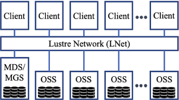

*   **إيه هو ده؟**
*   `Lustre` ده في الأساس `open source distributed filesystem` (نظام ملفات موزع ومفتوح المصدر) معروف جداً في عالم الـ `High-Performance Computing (HPC)`. هو معمول خصيصاً عشان يدي للـ `Linux clusters` (مجموعات كبيرة من سيرفرات الـ `Linux`) القدرة إنها توصل لأنظمة ملفات `high-performance`  بشكل غير عادي.
*   **لماذا تستخدمه (مميزاته الرئيسية)؟**
    *   **السرعة الخرافية:** ده يعتبر من أسرع حلول الـ `file storage` اللي ممكن تاخدها للـ `Linux` على `AWS`.
    *   **`Throughput` عالي جداً:** بيوفر معدلات نقل بيانات (قراءة وكتابة) عالية بشكل مهول، وده مهم لما يكون عندك `datasets`  ضخمة جداً وعايز توصلها وتتعامل معاها بسرعة فائقة.
    *   **مصمم للـ `parallel access`:** يعني مئات أو آلاف الـ `instances` يقدروا يوصلوا لنفس الملفات في نفس الوقت بأداء ممتاز.
*   **هينفعك في إيه؟:**
    *   **`High-Performance Computing (HPC)`:** يعني شغل المحاكاة العلمية المعقدة، التحليلات الهندسية الضخمة.
    *   **`Machine Learning`:** لما تكون بتعمل `training` لـ `models` كبيرة جداً بتحتاج تقرا وتكتب كميات ضخمة من البيانات بسرعة.
    *   **`Media Processing`:** زي شغل الـ `rendering` أو معالجة الفيديوهات الـ `4K` أو الـ `8K` اللي بتحتاج `access` سريع جداً لملفات الميديا الضخمة.

> [!TIP]
>
> العيب الوحيد فى Lustre انه معقد غير كده هو يضرب efs بالجزمة


### **2. `FSx for Windows File Server`**


*   **إيه هو ده؟**
    ده بيقدملك نفس فكرة مشاركة الملفات اللي بيقدمها `EFS`، بس الفرق الجوهري إنه **مصمم خصيصاً للـ `Windows servers`**. يعني لو كل السيرفرات والتطبيقات بتاعتك شغالة `Windows`، ده هيكون اختيارك الأول لتخزين الملفات المشتركة.

*   **لماذا تستخدمه (مميزاته الرئيسية)؟**
    *   **تكامل  مع `Windows`:** بيشتغل بسلاسة تامة مع كل أدوات وخدمات الـ `Windows` اللي أنت متعود عليها.
    *   **دعم `SMB`:** ده الـ `protocol` الأساسي اللي الـ `Windows` بتستخدمه عشان تشارك الملفات. فبيخلي الـ `Windows servers` بتاعتك توصل للملفات دي كأنها `network drive` عادي جداً.
    *   **دعم `NTFS`:** ده نظام الملفات اللي الـ `Windows` بتستخدمه لإدارة الملفات والـ `permissions` (الصلاحيات). `FSx for Windows File Server` بيدعم الـ `NTFS permissions` بشكل كامل، وده مهم جداً للتحكم في مين يقدر يوصل لإيه.
    *   **تكامل مع `Microsoft Active Directory`:** لو عندك `Active Directory` (سواء `managed` في `AWS` أو `on-premises`)، تقدر تستخدمه عشان تدير صلاحيات الوصول للملفات دي، وده بيبسط جداً إدارة المستخدمين في بيئات الشركات.

*   **هينفعك في إيه؟:**
    *   **`Home Directories`:** لو عندك موظفين كتير بيشتغلوا على `Windows` وعايز مكان واحد يحطوا فيه ملفاتهم الشخصية المشتركة.
    *   **`Shared Storage` لتطبيقات الـ `Windows`:** أي تطبيق `Windows` بيحتاج `shared file storage` (زي `CMS` أو `CRM` أو `ERP` خاص بالـ `Windows`).
    *   **`Migration` للـworkloads  من `on-premises`:** لو عندك `file servers` على `Windows` في الـ `data center` بتاعك وعايز تنقلهم للـ `cloud` بنفس الـ `experience`.


---

### **`Amazon FSx for OpenZFS`: **


يا صاحبي، `FSx for OpenZFS` دي بتجيبلك `capabilities` (إمكانيات) `file system` قوي ومشهور جداً اسمه `OpenZFS`، ومعروف بقوته في إدارة البيانات وكمان الـ `high performance` بتاعه، وتخليهولك
 `fully managed service` (خدمة مدارة بالكامل) جوه الـ `AWS`. هنا بقى لازم تفهم نقطة جوهرية: **ده مش `distributed file system`  زي `Lustre`** اللي اتكلمنا عليه، اللي بيتوزع على كذا `server` عشان يديك `massive power`. لأ، `FSx for OpenZFS` ده بيكون `single` (واحد بس)، لكنه `highly scalable file system instance` (يعني نظام ملفات واحد لكنه قوي جداً وبيكبر معاك في الحجم والأداء لدرجة ضخمة). فكر فيه كأنه `super-powerful` و `enterprise-grade` 
و `single-node file server` (سيرفر فايلات قوي جداً ومستوى مؤسساتي وبيشتغل على node واحدة)، بس طبعاً `managed` بالكامل من `AWS`. هو في الأساس `integrated volume manager` 
وأيضاً `file system`، يعني بيدير مساحات التخزين بتاعته وبيوفر الـ `file system` فوقيها.

**ليه تستخدمه؟**
مميزاته الرئيسية بتخلي الـ `applications` بتاعتك تشتغل بكفاءة غير عادية. أولاً، بيوفر `ultra-high performance` (أداء عالي جداً) مع `low latency` (زمن وصول قليل)، وده معناه سرعة قراءة وكتابة ممتازة للفايلات. ثانياً، `data integrity`  فيه على أعلى مستوى؛ `OpenZFS` معروف جداً بمميزاته اللي بتضمن إن الـ `data` بتاعتك متتلفش، لو فيها أي `corruption` (تلف)، ولو فيه `redundancy` بيعمل `self-healing`  للـ `data` التالفة لوحده. ثالثاً، الـ `snapshots` و `clones` السريعة بتاعته؛ تقدر تاخد `snapshots`  من الـ `file system` بتاعك في ثواني معدودة مهما كان حجمه، ودي مفيدة جداً للـ `backups` أو عشان ترجع لأي `point-in-time copy` سابقة بسرعة، والـ `clones` بتخليك تعمل نسخ فورية من الـ `snapshots` دي للـ `testing` أو الـ `development` وده بيوفر وقت ومساحة عشان بيستخدم `Copy-on-Write`. رابعاً، فيه `data compression`  و `deduplication` (إزالة التكرار)، ودي `features` بتساعدك توفر في مساحة التخزين بشكل كبير، ده غير `Thin Provisioning` اللي بيخلي الـ `file system` يستهلك مساحة على قد احتياجه الفعلي بس.

**هينفعك في إيه؟**
`FSx for OpenZFS` ده مثالي للـ `workloads` زي: `media processing` (شغل الـ `video editing` والـ `rendering` اللي بيحتاج `fast access` لـ `large files` مع ضمان الـ `data protection`)؛ `Electronic Design Automation (EDA)` (شغل تصميم الرقائق الإلكترونية اللي بيولد كميات ضخمة من الملفات الصغيرة والمعقدة اللي بتحتاج أداء عالي جداً)؛ `machine learning` (خاصة في مراحل الـ `data preparation` و الـ `feature engineering` و الـ `model training`، اللي بتحتاج `fast` و `reliable access` لـ `datasets` ضخمة)؛ وكمان `container image stores` (عشان تخزن الـ `container images` بتاعتك وتعملها `serve` بسرعة للـ `container orchestrators` زي `ECS` أو `EKS`)؛ وأخيراً، للـ `dev/test environments` بفضل الـ `snapshots` و الـ `clones` السريعة اللي بتخليك تعمل `provision` لبيئات كتيرة جداً في ثواني.


---

## **AWS Storage Gateway**


---

موضوع إنك تربط التطبيقات والـ backup solutions اللي عندك في الـ on-premises بخدمات التخزين اللي في الـ cloud ممكن يبقى complicated ووجع دماغ، لأن التطبيقات القديمة مش بتفهم لغة الـ cloud API. هنا بيجي دور خدمة **AWS Storage Gateway** عشان تحللك المشكلة دي بعبقرية. الخدمة . هي بتديلك software gateway appliance، وده ببساطة جهاز (ممكن يكون software بس أو hardware) إنت بتنزله عندك في الـ on-premises environment، وبيشتغل  وسيط بين شبكتك local وبين الـ AWS cloud او حتى بين cloud و  cloud ومش شرط نفس provider المهم طرف يكون aws

الـ appliance ده مرن جدًا، ممكن يكون hardware appliance حقيقي بتشتريه من أمازون، أو virtual machine بتشغلها على VMware ESXi, Microsoft Hyper-V, أو Linux KVM. وممكن كمان يكون مجرد EC2 image لو بتستخدمه بين شبكات مختلفة جوه AWS نفسها. الجهاز ده لما بيشتغل عندك بيبقى فيه كذا virtual connectivity interface عشان أي سيرفر أو تطبيق عندك يقدر يكلمه بالبروتوكولات القديمة اللي هو متعود عليها زي NFS, SMB, أو iSCSI. يعني التطبيقات اللي عندك بتوصل بالـ appliance ده كأنها بتوصل بـ physical storage device عادي، زي hard disk أو network share، وبتبدأ تبعتله الداتا.

وهنا بتيجي الحركة الذكية: الداتا نفسها مش بتتخزن بشكل دائم على الـ appliance ده، لأ، الـ appliance ده دوره إنه ياخد الداتا دي، ويترجمها للغة الـ cloud، وبعدين يرفعها ويتخزنها بشكل  خدمات AWS cloud storage زي **S3** و **S3 Glacier**. يعني الـ gateway بيركز بشكل أساسي على S3 عشان يوفرلك حلول backup, archiving, و on-premises file access بطريقة seamless تمامًا. والميزة الأهم إن جزء من الداتا دي اللي بتستخدمها كتير ممكن يفضل في local cache عندك في الـ appliance، عشان لو حبيت ترجع لأي داتا بسرعة، تبقى locally available ومش محتاج تنزلها كل مرة من الـ cloud، وده بيحسن الأداء جدًا.

وعشان تفهم قوة Storage Gateway، لازم تعرف إنه مش نوع واحد، هو بيجي في **تلات modes مختلفة**، كل واحدة مصممة تحل مشكلة معينة:

1. **File Gateway:** النوع ده بيخلي الـ S3 bucket بتاعك يظهر عندك في الشبكة كأنه file share عادي تقدر توصله عن طريق بروتوكول NFS أو SMB. ده مثالي لو عايز تخزن ملفاتك في S3 بس في نفس الوقت عايز اليوزرز والتطبيقات اللي عندك يوصلولها كأنها network drive عادي من غير ما تحتاج تغير أي حاجة فيهم.
2. **Volume Gateway:** النوع ده بيخلي الـ cloud storage يظهر عندك كأنه hard disks (volumes) تقدر توصلها بالسيرفرات بتاعتك عن طريق بروتوكول iSCSI. وده نفسه بيجي في شكلين:
   - 
   - **Cached Volumes:** هنا الداتا الأساسية كلها بتتخزن في S3، وجزء صغير بس من الداتا اللي بتستخدمها كتير بيفضل في local cache. ده بيوفرلك مساحة تخزين ضخمة جدًا في الـ cloud بتكلفة قليلة.
   - **Stored Volumes:** هنا الداتا الأساسية كلها بتفضل عندك locally، وبيتتاخد منها backup بشكل دوري لـ S3 في صورة EBS snapshots. ده بيديلك أداء سريع جدًا وفي نفس الوقت حماية من الكوارث.
3. **Tape Gateway:** النوع ده عبقري، بيعمل virtual tape library (VTL) في الـ cloud. الـ backup software القديم اللي عندك (زي Veritas أو Veeam) اللي متعود يشتغل مع physical tapes، هيشوف الـ gateway ده كأنه tape library حقيقية، وهيبدأ يعمل عليها backup. والـ gateway بدوره هياخد الـ virtual tapes دي ويرميها في S3 أو S3 Glacier Deep Archive عشان الأرشفة طويلة الأمد بتكلفة تكاد تكون صفر.


---

## **AWS Snow Family**


الـ `AWS Snow Family` دي خدمة معمولة مخصوص لو عندك `large data sets` وعايز تنقلها للـ `cloud`. لأن ساعات نقل `terabyte-scaled` أو `petabyte-scaled data` على `Internet connection` عادي بياخد وقت و `bandwidth` لدرجة إنه مبيبقاش `practical` خالص. فلو بتفكر تنقل الكميات دي عشان تعملها `backup` أو تستخدمها بشكل `active` جوه AWS، يبقى إنك تطلب `Snow device` هو أحسن `option` ليك.

**إزاي بتشتغل؟**
لما بتطلب `device` من AWS، هما بيشحنولك `physical device` بالحجم المناسب. أنت بتنقل الـ `data` بتاعتك عليه، ولما تخلص، بتبعته تاني لـ Amazon. بعد كده، Amazon هي اللي بتنقل الـ `data` دي على الـ `S3 buckets` بتاعتك.

**استخدامات تانية (`Edge Locations`):**
الـ `Snow devices` دي مش بس للنقل، بعضها ممكن يستخدم في `connected edge locations`. يعني ممكن تشغل عليها `workloads` في أماكن معندهاش `enterprise-ready hardware`، لأن تصميمها `rugged and secure`.

**أنواع الـ `Snow Devices`:**


1. **`Snowcone`:**

   

   *   ده أصغر `device` في العيلة.
   *   بيجي بـ `22 TB` من الـ `usable storage`.
   *   فيه `server` بـ `four vCPUs` و `4 GB of usable memory`.
   *   بيدعم `RJ45` (كابل نت) و `Wi-Fi`.

2. **`Snowball Edge`:**

   *   ده أكبر وأتقل، وبيجي بنوعين (`profiles`):
   *   

   


*   **`Snowball Edge Storage Optimized`:** ده بتاع التخزين أساسًا. فيه `80 TB` من الـ `usable storage`، و`40 vCPUs`، و`80 GB of memory`.
*   **`Snowball Edge Compute Optimized`:** ده بتاع الـ `compute` (المعالجة). مساحة التخزين أقل شوية (`42 TB`)، لكن فيه `52 vCPUs` و`208 GB of memory`. معمول أساسًا للـ `edge computing workloads`.

1. **`AWS Snowmobile`:**
   *   ده مش `device`، ده `shipping container` بطول `45-foot`، يعني تريلا حرفيًا!
   *   


*   هو `waterproof` و `tamper-resistant`.
*   معمول للـ `petabyte` أو `exabyte data migrations`، يعني لنقل كميات `data` ضخمة جدًا. بتوصله بالـ `local network` بتاعك، ولما تخلص، AWS بتسوقه لـ `AWS region` وتعمل `upload` للـ `data`.

**الأمان:**
كل الـ `Snow devices` دي بتبقى `256-bit encrypted` و `HIPAA-compliant`، يعني آمنة جدًا.

**إمتى تختارها؟**
ده محتاج شوية حسابات. لازم تعرف سرعة الـ `upload` الحقيقية عندك. فكر فيها: لو عندك نت سرعته `10 MB/second`، عشان تعمل `upload` لـ `one-terabyte archive` هتاخد حوالي **10 أيام**! فلو محتاج تنقل الـ `data` دي بجد، يا إما هتستثمر في `expensive AWS Direct Connect connection`، أو هتطلب `AWS Snowball device`.


##  AWS DataSync 

 

خدمة **AWS DataSync** دي هي الأداة المتخصصة اللي أمازون عملتها عشان تحللك مشكلة واحدة أساسية: إزاي تنقل كميات كبيرة من الداتا اللي عندك في الـ `on-premises data centers` بتاعتك لحسابك على AWS بأقل مجهود وبأعلى سرعة ممكنة  الخدمة دي مرنة جدًا لأنها مش بتجبرك تنقل الداتا بتاعتك لـ S3 بس، لأ، دي بتديلك حرية إنك تحط الداتا دي في أكتر من مكان زي **S3** ، أو **EFS** و **FSx** عشان تبقى جاهزة فورًا للمعالجة والتحليل من خلال الـ `EC2 instances` بتاعتك. وبما إنها بتشتغل على الإنترنت العادي بتاعك، فهي مثالية لنقل الداتا اللي حجمها كبير، لكن مش ضخم لدرجة إنك تحتاج تبعت هاردات فيزيكال زي في خدمة Snowball.

عشان تفهم DataSync صح، لازم تعرف إنها بتتكون من تلات أجزاء أساسية بتشتغل مع بعض. أول حاجة هي **DataSync Agent**، وده عبارة عن `virtual machine` صغيرة إنت بتنزلها عندك في البيئة بتاعتك الـ `on-premises`، والـ `agent` ده هو  اللي بيقوم بكل الشغل التقيل، هو اللي بيقرأ الداتا من عندك ويضغطها ويشفرها ويبعتها لـ AWS. تاني حاجة هي **Locations** (المواقع)، وهنا أنت بتعرف السيستم على نقطتين: `Source Location` (مكان الداتا جاية منين، زي سيرفر NFS أو SMB عندك) و `Destination Location` (مكان الداتا رايحة فين في AWS، زي S3 أو EFS). تالت حاجة والأخيرة هي **Task** (المهمة)، ودي هي الخطة اللي بتحدد كل حاجة، بتربط الـ `Source` بالـ `Destination` وبتحدد فيها إعدادات النقل زي جدولتها عشان تشتغل كل يوم، أو تحديد أقصى سرعة تستخدمها من الإنترنت عشان متخنقش الشبكة عندك.


وهنا بتيجي قوة DataSync الحقيقية، هي مش مجرد `copy-paste` للداتا. الخدمة دي مبنية على بروتوكول نقل خاص بأمازون مصمم عشان يبقى سريع جدًا، بيقسم الملفات الكبيرة لأجزاء وبينقلها بشكل  `parallel` عشان يستغل أقصى سرعة ممكنة من خط الإنترنت بتاعك، وممكن توصل سرعة النقل دي لـ 10 Gbps لو خطك يستحمل. ومن ناحية الأمان، كل الداتا اللي بتتنقل بتكون مشفرة بالكامل (`in-transit encryption`)، والخدمة كمان بتعمل `data validation` عشان تتأكد إن الداتا اللي وصلت AWS هي هي بالظبط نفس الداتا اللي طلعت من عندك من غير أي تلف أو تغيير. كل ده بيتم بشكل مؤتمت بالكامل، فبمجرد ما تظبط الـ `Task` بتاعتك مرة واحدة، تقدر تسيبها تشتغل لوحدها وتوفر على نفسك مجهود كبير جدًا.

وهنا تيجي أهم حتة بتلخبط ناس كتير: **إيه الفرق الجوهري بين DataSync و AWS Storage Gateway؟** الاتنين بيشتغلوا من الـ `on-premises` للـ `cloud`، وكمان من  cloud لـ cloud سواء نفس provider او غيره لكنهم بيحلوا مشكلتين مختلفتين تمامًا. الفرق مش في التكنولوجيا قد ما هو في **الفلسفة والهدف**. خدمة **DataSync** هي أداة ** Migration and Transfer**، **

**هدفها إنها تاخد كمية داتا من مكان (أ) وتوديها مكان (ب) بشكل فعال، سواء مرة واحدة أو بشكل دوري. . أما خدمة **AWS Storage Gateway** فهي أداة Extension and Integration**، هدفها إنها تخلق "tunnel" دائم ومستمر بين البيئة بتاعتك في الـ `on-premises` والـ `storage` بتاع AWS. هي بتخلي الـ `storage` اللي في الـ `cloud` يظهر عندك كأنه هارد ديسك localy أو `network share`، عشان التطبيقات بتاعتك اللي عندك تقدر تكلمه بشكل مباشر ولحظي.


