# **Amazon Virtual Private Cloud (VPC)**

---

**بالنسبة لـ `AWS Certified Solutions Architect Associate Exam Objectives`، الشابتر ده بيغطي أهداف الامتحان اللي ليها علاقة بـ `VPC`، ومنها على سبيل المثال وليس الحصر:**

*   🔒 **Domain 1: Design Secure Architectures**
*   ♻️ **Domain 2: Design Resilient Architectures**
*   ⚡ **Domain 3: Design High-Performing Architectures**
*   💰 **Domain 4: Design Cost-Optimized Architectures**

---

## **مقدمة عن الـ `Amazon Virtual Private Cloud (VPC)`**

 `Amazon Virtual Private Cloud (VPC)` ده حتة أساسية أوي في `AWS`، 
تقدر تقول إنها الـ `networking layer` اللي بتشتغل عليه الـ `EC2 instances` بتاعتك، 
وأي `network resources` تانية لخدمات `AWS` تانية. ببساطة كده، الـ `VPC` هي `virtual network` خاصة بيك أنت بس.

**إيه يعني `virtual network` خاصة بيك؟**
الأهم إنها `isolated` بشكل كامل، يعني كانك عامل شبكة خاصة بيك لوحدك جوه `AWS Cloud`، ومحدش تاني يقدر يوصلها `by default`. أنت اللي بتتحكم فيها وتحدد كل حاجة جوه الشبكة دي، كانك بالضبط بتبني
 `data center` خاص بيك بس على `cloud`.

بس طبعاً، مش محبوسة، تقدر توصل الـ `VPC` بتاعك ده بأي شبكة تانية انت عايزها. ممكن توصله بالـ `Internet` عشان الـ `users` بتوعك يقدروا يوصلوا للـ `applications` بتاعتك، أو بشبكات الـ `data center` بتاعتك اللي على الأرض (`on-premises networks`) عشان تعمل `hybrid cloud setup`، أو حتى بـ `VPCs` تانية ليك أو لعملاء تانيين جوه `AWS` عشان يكلموا بعض بشكل `private`.

خلي بالك بقى من النقطة دي كويس أوي: الـ `VPCs` مش بس لـ `EC2`. لأ دي حجر أساس لخدمات `AWS` كتيرة جداً. يعني فهمك إزاي الـ `VPC` ده بيشتغل هو مفتاح نجاحك في الامتحان، وكمان عشان تبقى `AWS architect` شاطر. **متفتكرش إنك ممكن تتجاهل الـ `VPCs` دي لمجرد إنك مش بتستخدم `EC2`، ده تفكير غلط جداً!** أي `resource` مهمة بتشغلها في `AWS`، غالباً هتكون جوه `VPC`.

## **`VPC` و الـ `AWS Regions`:**


الـ `VPC` الواحدة دي بتعيش جوه `AWS region` واحدة بس. يعني لو عملت `VPC` في `London region`، مش هتلاقيها ظاهرة عندك في `Ohio region` مثلاً. كل `region` ليها الـ `VPCs` بتاعتها المستقلة. وعادي جداً يبقى عندك `multiple VPCs` في نفس الـ `AWS account` بتاعك، وممكن تعمل أكتر من `VPC` في نفس الـ `region` الواحدة. عشان نخلي الدنيا بسيطة وممنهجة واحنا بنتعلم، هنبدأ الشرح بسيناريوهات بتفترض إن عندنا `VPC` واحدة بس في `region` واحدة. وبعد كده، لما نتقدم شوية، هنخش في سيناريوهات فيها `multiple VPCs` أكتر.

**الـ `VPC` والشبكات التقليدية:**
لو أنت راجل بتاع `networking` وفاهم الـ `components` بتاعت الشبكات التقليدية (`TCP/IP network`)، هتلاقي حاجات كتير في الـ `VPC` شبهها بالظبط وهتتعرف عليها. لكن هنا بقى الفرق الجوهري: على الرغم من إن الـ `VPCs` بتشتغل بنفس مبدأ الشبكة التقليدية، إلا إن فيه فروقات مهمة أوي.

أكبر فرق هو إن الـ `VPCs` دي `scalable` بشكل لا نهائي. يعني تقدر توسع وتمد الشبكة بتاعتك زي ما أنت عايز من غير ما تحتاج تضيف أي `physical hardware` جديد. عشان الـ `scalability` الرهيبة دي تبقى ممكنة، `AWS` عملت `abstraction` لبعض الـ `components` اللي هتلاقيها في أي شبكة تقليدية (زي الـ `switches` والـ `VLANs`). الحاجات دي مش موجودة `physically` في الـ `VPC`. بدل كده، هي كلها عبارة عن
 `software functions` بتشتغل من ورا الكواليس وبأسماء مختلفة في `AWS`، وده اللي بيخلي الـ `VPC` مرنة وقوية جداً.


### **`VPC CIDR Blocks` **

 الـ `VPC` ده زي أي شبكة تقليدية، لازم يكون فيه على الأقل `range`  واحد من الـ `IP addresses` تكون ورا بعضها (`contiguous IP addresses`). الـ `range` ده بنعبر عنه بحاجة اسمها 
**`Classless Inter-Domain Routing (CIDR) block`**.

الـ `CIDR block` ده هو اللي بيحدد بالظبط إيه الـ `IP addresses` اللي ممكن نديها للـ `EC2 instances` بتاعتك وأي `resources` تانية هتحطها جوه الـ `VPC` ده. لما تيجي تعمل `VPC` جديد، لازم إجباري تعمل `assign` (تدي) `primary CIDR block` ليه. وبعد ما تعمل الـ `VPC`، بتاخد الـ `primary VPC CIDR block` الكبير ده وتقسمه لأجزاء أصغر اسمها **`subnets`**، والـ `subnets` دي هي اللي بتحط فيها الـ `AWS resources` بتاعتك اللي محتاجة `IP addresses`.

فيه طرق كتير عشان تعبر عن `range` من الـ `IP addresses`، بس أقصر وأشهر طريقة هي الـ **`CIDR notation`**، وساعات بيسموها `slash notation` (عشان فيها علامة `slash /` في الآخر).

*   على سبيل المثال، لو عندك الـ `CIDR` ده: `172.16.0.0/16`. ده معناه إنه جواه كل الـ `addresses` اللي بتبدأ بـ `172.16`، يعني من `172.16.0.0` لغاية `172.16.255.255`. وده بيدينا عدد ضخم جداً من الـ `IP addresses`، تحديداً 65,536 `address` بالظبط! (مثلاً لو كان `/24` كان هيديك 256 `address`).

ممكن برضه تسمع إن الـ `CIDR block` ده بيتقال عليه **`IP prefix`**. الجزء بتاع `/16` اللي في آخر الـ `CIDR` ده هو اللي بنسميه **`prefix length`**. الـ `prefix length` ده بيعبر عن طول الـ `subnet mask`، واللي في حالة الـ `VPC CIDR` ممكن يكون من `/16` لغاية `/28`.

**ملحوظة مهمة أوي هنا:** فيه **`inverse relationship`** (علاقة عكسية) بين الـ `prefix length` وعدد الـ `IP addresses` اللي جوه الـ `CIDR` ده. يعني كل ما الـ `prefix length` ده يصغر (الرقم اللي بعد الـ `/` يبقى أصغر)، كل ما عدد الـ `IP addresses` اللي جوه الـ `CIDR` ده يكبر. عشان كده، الـ `/28` `prefix length` بيديلك 16 `address` بس، في حين إن الـ `/16` `prefix length` بيديلك الـ 65,536 `address` اللي ذكرناها فوق.

الـ `IP` هنا اختصار لـ `Internet Protocol version 4 (IPv4)`. والـ `prefix lengths` المتاحة لـ `IPv4` بشكل عام بتبقى من `/0` لغاية `/32`.

على الرغم إنك ممكن تحدد أي `IP range` صحيح عشان يبقى الـ `VPC CIDR` بتاعك، بس الـ **`best practice`** والأفضل دايماً إنك تستخدم واحد من الـ `ranges` دي اللي متعرفة في حاجة اسمها `RFC 1918` (ودي `ranges` مخصصة للشبكات الـ `private` اللي مش بتظهر على الإنترنت مباشرة) عشان تتجنب أي `conflicts` (تعارضات) مع الـ `public Internet addresses` (الـ `IPs` اللي بتتشاف على الإنترنت).

**الـ `RFC 1918` `ranges` دي هي:**
*   `10.0.0.0 – 10.255.255.255` (الـ `CIDR` المكافئ ليها هو `10.0.0.0/8`)
*   `172.16.0.0 – 172.31.255.255` (الـ `CIDR` المكافئ ليها هو `172.16.0.0/12`)
*   `192.168.0.0 – 192.168.255.255` (الـ `CIDR` المكافئ ليها هو `192.168.0.0/16`)

**نقطة مهمة أوي أوي لازم تاخد بالك منها:** لو انت ناوي تربط الـ `VPC` بتاعك بأي شبكة تانية – سواء كانت شبكة الـ `data center` بتاعك اللي على الأرض (`on-premises network`) أو حتى `VPC` تاني جوه `AWS` – لازم تتأكد كويس أوي إن الـ `VPC CIDR` اللي هتختاره **مش عامل `overlap` (مش متداخل)** مع أي `addresses` مستخدمة بالفعل في الشبكة التانية دي. لو حصل `overlap`، الشبكتين مش هيعرفوا يكلموا بعض، وممكن تحصلك مشاكل كتير في الـ `routing` والاتصال.


> [!IMPORTANT]
>
> لازم تبقى عارف كويس أوي إنك **متقدرش تغير الـ primary CIDR block بعد ما تعمل الـ VPC بتاعك**. الحتة دي مش زي أي setting ممكن تعدلها بعدين. عشان كده، قبل ما تعمل أي VPC جديد، فكّر كويس أوي في كل address requirements اللي ممكن تحتاجها دلوقتي وفي المستقبل كمان، وحاول تتوقع احتياجاتك صح من الأول. لو اخترت CIDR block صغير واحتجت تكبره بعدين، هتضطر تعمل VPC جديد خالص وتنقل كل حاجتك عليه، ودي قصة تانية مكلفة ومتعبة.


#### **`Secondary CIDR Blocks` **

 بما إننا عرفنا إنك متقدرش تغير الـ `primary CIDR block` بتاع الـ `VPC` بعد ما تعمله، `AWS` هنا بتديلك حلول تانية عشان توسع الشبكة بتاعتك لو احتجت `IP addresses` زيادة في المستقبل. الحل ده هو إنك ممكن **اختياريًا** تعمل `specify` (تحدد) `secondary CIDR blocks` لـ `VPC` بتاعك ده بعد ما تكون عملته خلاص.

بس الـ `secondary CIDR blocks` دي ليها شروط عشان تشتغل صح:

1.  **لازم تيجي يا إما من نفس الـ `RFC 1918 address range` اللي الـ `primary CIDR` جاي منه، يا إما تكون `publicly routable range`** (يعني `IP range` ممكن تشوفه على الإنترنت).
2.  **وأهم حاجة إنها `must not overlap` (ميتعادش عليها أو متتداخلش)** مع الـ `primary CIDR block` ولا مع أي `secondary blocks` تانية أنت عاملها جوه نفس الـ `VPC`.

**عشان نوضح بمثال:**
*   لو الـ `primary CIDR` بتاع الـ `VPC` بتاعك هو `172.16.0.0/16`. ده `range` جاي من عيلة الـ `172.16.0.0/12` (اللي هي `172.16.0.0 – 172.31.255.255`).
*   هنا ينفع تعمل `secondary CIDR` يكون `172.17.0.0/16`، ليه؟ لأن الـ `172.17.0.0/16` ده لسه جوه نفس عيلة الـ `172.16.0.0/12` اللي الـ `primary` بتاعك منها، ومفيش بينهم `overlap`.
*   لكن، مينفعش خالص تحدد `192.168.0.0/16` كـ `secondary CIDR`، لأن ده جاي من `RFC 1918 range` مختلفة تماماً (`192.168.0.0/16`) عن الـ `range` بتاع الـ `primary` بتاعك (`172.16.0.0/12`).

**نصيحة مهمة جداً وأنت بتختار الـ `primary CIDR`:**
لو بتفكر إنك ممكن في أي وقت تحتاج تعمل `secondary CIDR` في المستقبل، ركز أوي وأنت بتختار الـ `primary CIDR` بتاعك من البداية. لو اخترت `192.168.0.0/16` كـ `primary CIDR` (واللي هو `RFC 1918 range` صغير ومحدود)، مش هتقدر تعمل `secondary CIDR` من أي `RFC 1918 address ranges` التانية (يعني مش هتقدر تستخدم `10.0.0.0/8` أو `172.16.0.0/12` كـ `secondary` معاه). عشان كده، لو ناوي على توسع كبير مستقبلاً في الشبكة الداخلية، ساعات بيبقى أفضل إنك تختار `primary CIDR` من الـ `range` الأكبر زي `10.0.0.0/8` عشان يديلك مساحة أكبر للتوسع بـ `secondary CIDRs` من نفس الـ `range` في المستقبل.


---

#### **`IPv6 CIDR Blocks` **

بص يا معلم، بما إن الـ `IPv4` بقى خلاص فيه مشكلة في العدد ومبقاش مكفي، الـ `IPv6` جه عشان يحل المشكلة دي ويوفر عدد `IP addresses` لا نهائي تقريباً.

بالنسبة للـ `IPv6 CIDR` في الـ `VPC` بتاعك، فيه نقطة مهمة جداً لازم تعرفها: على عكس الـ `primary CIDR` بتاع الـ `IPv4` اللي أنت بتختاره بنفسك كـ `IP prefix`، هنا أنت **متقدرش تختار الـ `IPv6 CIDR` بتاعك بمزاجك** وبشكل عشوائي. لأ، هنا `AWS` هي اللي بتعمل بتدي `IPv6 CIDR` لـ `VPC` بتاعك لما بتطلب منها كده.

الـ `IPv6 CIDR` اللي `AWS` بتديهولك ده بيكون عبارة عن `publicly routable prefix`، يعني `IP range` تقدر توصله وتتعامل معاه من `global unicast IPv6 address space`. ده معناه إن كل الـ `IPv6 addresses` اللي جوه الـ `range` ده بتكون قابلة للوصول من الـ `Internet` بشكل مباشر (طبعاً لو الـ `security groups` والـ `network ACLs` عندك تسمح بكده).

*   على سبيل المثال، ممكن `AWS` تديلك الـ `CIDR` ده: `2600:1f18:2551:8900/56`.
*   **ملحوظة مهمة:** الـ `prefix length` بتاع أي `IPv6 VPC CIDR` بيتم تحديده بواسطة `AWS` بيكون دايماً ` /56`.

**طب لو أنا عندي `public IPv6 CIDR block` خاص بيا؟**
لو أنت بالفعل عندك `public IPv6 CIDR block` خاص بيك (مثلاً أنت شاري `IPs` دي من مزود خدمة الإنترنت بتاعك أو من جهة مسؤولة عن `IP addresses`)، أيوة ممكن جداً تعمله `assign` للـ `VPC` بتاعك باستخدام ميزة اسمها **`bring your own IP address (BYOIP)`**.

لما بتستخدم `BYOIP` مع `IPv6`، عندك شوية مرونة في الـ `prefix length`:
*   لو عايز الـ `IPv6 addresses` بتاعتك تكون قابلة للوصول من خلال الـ `Internet` (يعني عايزها `publicly routable`)، ممكن تعمل `advertise` لـ `prefix length` صغير زي `/48`.
*   لو مش فارق معاك إنها تكون `publicly routable` بنفس الدرجة دي، أو عندك `use case` تاني، أقل `prefix length` ممكن تستخدمه هو `/56`.

باختصار، `AWS` بتديلك `IPv6 CIDR` جاهز بـ `/56` عشان تسهل عليك، ولو عندك `IPs` خاصة بيك، تقدر تدخلها بـ `BYOIP` مع مرونة في الـ `prefix length` حسب احتياجك.


> [!TIP]
>
>  على الرغم من إنك تقدر تفعل وتستخدم IPv6 بشكل كامل في الـ VPC والـ subnets بتاعتك، إلا إن AWS بتفرض عليك (حتى وقتنا هذا) وجود IPv4 CIDR block أساسي لكل من الـ VPC نفسه وأي subnet هتعمله جواه.
>
> النقطة المهمة هنا إن الـ IPv4 والـ IPv6 بيشتغلوا بشكل **متوازي (Side-by-Side)**. يعني كل واحد فيهم بيوصل الـ traffic بتاعه بطريقة مستقلة تماماً عن التاني، ومفيش بروتوكول بيعتمد على التاني في routing الداتا بتاعته أو تشغيل الـ instances اللي بتستخدمه. ببساطة، هما زي مسارين منفصلين للاتصال جوه نفس الـ subnet. الـ IPv4 ده بيبقى موجود كـ architectural requirement من AWS، لكن أنت ليك مطلق الحرية في إنك تخلي IPv6 هو المسار الأساسي والرئيسي للـ communication بتاعتك.


------


------

> [!IMPORTANT]
>
> **مفهوم الـ Default VPC**
>
> - **إيه هو؟** ده VPC AWS بتعملهولك بشكل أوتوماتيكي عشان تسهل عليك تبدأ بسرعة من غير ما تبني شبكة من الصفر. بيكون جواه public subnet في كل Availability Zone، و Internet Gateway، و security group افتراضي.
> - أنت بتبدأ وعندك VPC جاهز. والـ best practice في الشغل الحقيقي هو **إنك متستخدمش الـ Default VPC ده للـ production**، وتبني واحد مخصص بنفسك عشان تتحكم في كل تفصيلة
>
> ------


**`DNS Resolution` (`enableDnsSupport`)**

لما بتفعل خاصية `DNS resolution` (اللي هي بتكون متفعلة بشكل افتراضي في أي `VPC` بتعمله)، أنت كده ببساطة بتشغل **خدمة الـ `DNS server` الداخلية اللي `AWS` بتوفرها للـ `VPC` بتاعك**. الخدمة دي ليها وظيفتين أساسيتين:

1.  **بترد على أي `DNS query` (استعلام `DNS`) طالع من أي `resource` جوه الـ `VPC` بتاعك.**
2.  **بتسمح للـ `resources` دي إنها تعمل `resolve`  الـ `public DNS hostnames`** (زي `google.com`) لـ `IP addresses`.

من غير الخاصية دي، الـ `EC2 instances` بتاعتك هتبقى معزولة عن عالم الـ `DNS`، ومش هتقدر تكلم أي خدمة بره باستخدام اسمها، زي مثلاً إنها تعمل `download` لـ `update` من `repository` على الإنترنت.

> [!WARNING]
>
> **إيه هو الـ `Amazon-provided DNS Server` ده وإيه IP؟**
>
> الـ `Amazon-provided DNS Server` هو خدمة `DNS resolver` بتقدمها `AWS` جوه الـ `VPC` بتاعك. الخدمة دي ليها `IP address` ثابت ومميز، **وهو دايماً تاني `IP` في الـ `CIDR` الرئيسي بتاع الـ `VPC` كله**.
>
> *   **المعادلة لحساب عنوانه:** هو الـ `base` بتاع الـ **`primary VPC CIDR`** بتاعك + 2.
> *   **مثال عملي:** لو الـ `VPC` بتاعك الـ `primary CIDR` بتاعه هو `10.0.0.0/16`:
>     *   الـ `base` هو `10.0.0.0`.
>     *   إذن، الـ `IP` بتاع الـ `Amazon-provided DNS server` **لكل الـ `subnets` اللي جوه الـ `VPC` ده** هيكون **`10.0.0.2`**.
>     *   ولو كان `172.31.0.0/16`، هيبقى الـ `DNS server` هو **`172.31.0.2`**.
>
> **طب إزاي الـ `instance` بتوصله من أي `subnet`؟**
>
> وهنا بتيجي النقطة المهمة اللي أنت لاحظتها. على الرغم من إن عنوان الـ `DNS server` ثابت وموحد على مستوى الـ `VPC` كله، إلا إن كل `subnet` له دور في توصيل الـ `traffic` ده.
>
> 1.  `AWS` بتحجز 5 `IP addresses` **في كل `subnet`** بتعمله. واحد من الـ `IPs` المحجوزة دي (وهو الـ `IP` التالت في الـ `subnet range`، يعني مثلاً `10.0.1.2`) بيتم استخدامه داخليًا عشان يوجه الـ `DNS queries`.
> 2.  لما بتعمل `EC2 instance` جوه أي `subnet`، نظام التشغيل بتاعها بيتعمله `configuration` أوتوماتيك عن طريق الـ `DHCP` عشان يستخدم العنوان الموحد (`10.0.0.2` في مثالنا) كـ `primary DNS server`.
> 3.  لما الـ `instance` بتبعت `DNS query` للعنوان `10.0.0.2`، الـ `VPC Router` اللي جوه الـ `subnet` بتاعها هو اللي بيفهم إن الـ `query` ده رايح للـ `DNS service` بتاعة `AWS`، وبيوجهه للوجهة الصحيحة من ورا الكواليس.
>
> 
>
> *   **عنوان الـ `DNS Server` (`.2` address):** هو عنوان **واحد وثابت** ومحسوب من الـ `VPC CIDR` الرئيسي، وهو صالح لكل الـ `subnets` داخل  الـ `VPC`.
> *   **حجز الـ 5 `IPs`:** بيتم **داخل كل `subnet` على حدة**، عشان كل `subnet` يكون عنده الـ `infrastructure` اللازمة لتوجيه الـ `traffic` بتاعه، بما في ذلك الـ `DNS traffic`.
>
> 

برافو عليك، أنت ملاحظتك صح 100% وفي الصميم. هما فعلًا مش موضوعين منفصلين، هما وجهين لعملة واحدة، والعملة دي هي خاصية **`enableDnsHostnames`**.

كلامك مظبوط، المفروض الاتنين يندمجوا تحت عنوان الخاصية دي عشان الشرح يكون منطقي ومتكامل.

اتفضل النسخة الجديدة المدمجة اللي بتشرح الموضوع ككتلة واحدة:

---

### **خاصية `DNS Hostnames (enableDnsHostnames)`: إزاي الـ `Instances` بتاخد DNS؟**

خاصية `enableDnsHostnames` دي مش بتعمل حاجة واحدة، دي ليها وشين أو بتشتغل على مستويين في نفس الوقت. هي المسؤولة عن إن الـ `instances` بتاعتك يبقى ليها identity و dns، سواء كان public، أو كان private.

بس قبل ما نتكلم  فيه قاعدة أساسية ومهمة جدًا:

> [!WARNING]
>
> **`enableDnsHostnames` (إنك تدي DNS) بتعتمد على `enableDnsSupport`**
>
> - عشان تفعل `enableDnsHostnames` وتخليها `true`، لازم **إجباري** تكون `enableDnsSupport` هي كمان `true`.
> - **ليه؟** لأن مفيش فايدة إنك تدي للـ `instances` بتاعتك `DNS`، لو الـ `VPC` نفسه مش عارف يعمل `resolve` للأسماء دي.


#### **1.  `Public DNS Hostname`**

لما بتفعل خاصية `enableDnsHostnames`، أنت بتسمح لـ `AWS` إنها تدي **`public DNS hostname`** للـ `instances` بتاعتك. بس ده مش بيحصل لكل الـ `instances`، ده بيحصل **بشرط أساسي**: إن الـ `instance` نفسها يكون ليها **`public IP address`**. لو معندهاش، مش هيتعملها `public DNS hostname`.

*   **شكل الـ `Hostname` ده بيبقى إيه؟**
    بيكون اسم طويل `AWS` بتعمله `generate`، ومبني على الـ `Public IP`، وشكله بيكون بالمنظر ده:
    `ec2-public-ipv4-address.region.compute.amazonaws.com`
    (مثلاً: `ec2-54-123-45-67.us-east-1.compute.amazonaws.com`)

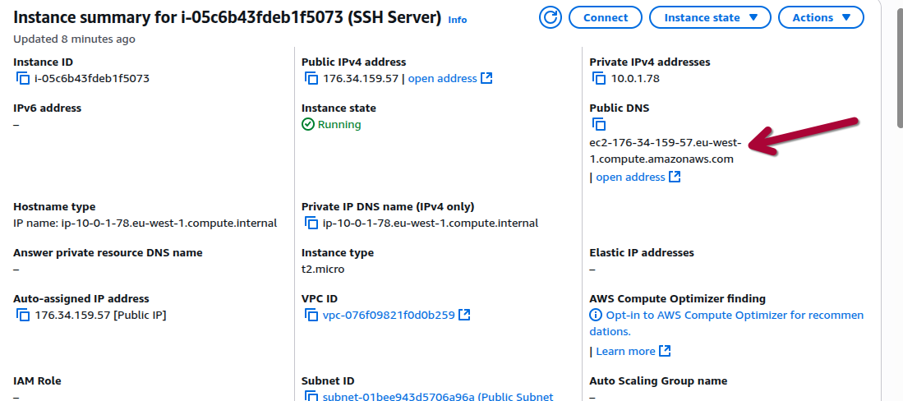

---

#### **2. `Private DNS Hostname`**

في نفس الوقت، ولما نفس الخاصية (`enableDnsHostnames`) بتكون متفعلة، `AWS` بتعمل حاجة تانية أهم وأشمل: بتدي **`Private DNS Hostname`** **لكل `EC2 instance` بتتعمل جوه الـ `VPC`**، سواء كانت `public` أو `private`.

*   **شكله إيه؟**
    الاسم ده بيكون مميز ومبني على الـ `Private IP` بتاع الـ `instance`، وشكله بيكون كالآتي:
    `ip-10-0-1-50.us-east-1.compute.internal`

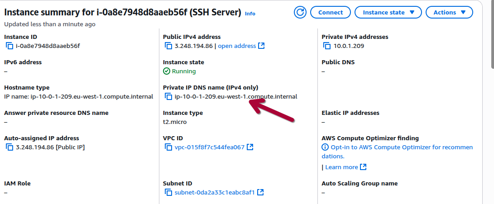

الاسم ده هو وسيلة التواصل بين الـ instances وبعضها جوه شبكتك الخاصة. طول ما الإعدادين (enableDnsSupport و enableDnsHostnames) متفعلين، أي EC2 instance هتعملها هتاخد الـ private DNS hostname بتاعها بشكل أوتوماتيكي وهيكون شغال على طول.

النظام ده بيديلك طبقة abstraction أساسية، بتخليك تعمل تصميم architecture مرن وتقدر تصلحه بسهولة. يعني بدل ما تخلي الـ Web Server بتاعك يكلم الـ Database بالـ Private IP بتاعها بشكل مباشر (وده اسمه hardcoding IP)، أنت بتستخدم خدمة زي **Amazon Route 53 Private Hosted Zone** عشان تعمل DNS record مخصص (مثلاً db.internal.my-app) وتخليه يشاور على الـ Private IP بتاع الـ Database.

**وهنا بقى بتشوف القوة الحقيقية:** لو احتجت في المستقبل تستبدل الـ instance بتاعة الـ Database دي (عشان باظت أو عشان تعملها upgrade)، الـ instance الجديدة أكيد هتاخد Private IP جديد ومختلف. بدل ما تلف على كل الـ Web Servers وتغير الـ IP في الـ configuration بتاعتهم، كل اللي هتعمله هو خطوة واحدة: **هتخش على Route 53 وتعدل الـ DNS record ده (db.internal.my-app) عشان يشاور على الـ Private IP الجديد**. الـ Web Servers هتفضل تكلم نفس الاسم الثابت اللي هي حافظاه، والـ DNS هيوجههم للـ instance الجديدة من غير ما هما يحسوا بأي حاجة. الآلية دي بتفصل "هوية الخدمة" عن "السيرفر الفعلي اللي شايلها"، وده بيخلي السيستم بتاعك مستقر وإدارته سهلة على المدى الطويل..

------

> [!IMPORTANT]
>
> **ملحوظة مهمة عن ثبات الـ Private IP**
>
> على عكس الـ Public IP اللي بيتغير مع كل عملية Stop/Start للـ EC2 instance، الـ **Private IP** الأساسي بتاع الـ instance **مصمم ليكون ثابت ومستقر**. طالما الـ instance موجودة (حتى لو في حالة stopped)، الـ Private IP بتاعها مش هيتغير.
>
> سبب الثبات ده هو إن الـ Private IP مربوط بشكل دائم بالـ Primary Network Interface (ENI) بتاع الـ instance، والـ ENI دي بتفضل مرتبطة بالـ instance طول عمرها. الثبات ده هو حجر الأساس اللي بيخلي التواصل الداخلي بين الـ services جوه الـ VPC بتاعك موثوق ومستقر، وبيخلي الـ Private DNS Hostname ليه قيمة حقيقية في التطبيقات العملية.
>
> وده هيخلي Private DNS Hostname ثابت برده لانه بيعتمد على private ip

---


### **الـVPC Router**

في قلب كل `VPC` فيه الـ `VPC Router` اللي هو العضلات اللي بتوجه الـ `traffic`.


لكن الـ `Router` ده مش بيشتغل من دماغه، لأ، ده بيمشي بالمللي على مجموعة قواعد مكتوبة في حاجة اسمها **`Route Tables`**. الـ `Route Tables` دي هي اللي بتشتغل كعقل للـ `VPC`، وهي اللي بتقول لكل `packet` بيانات "أنت تروح من هنا" و"أنت طريقك من هناك". كل قاعدة جوه الجدول ده (بنسميها `route`) ليها جزئين: **`Destination`** (الوجهة اللي الـ `packet` رايح لها) و **`Target`** (getway اللي الـ `packet` هيعدي منها عشان يوصل للوجهة دي سواء internet getway او vpn getway


وهنا بتيجي النقطة الجوهرية في تصميم الشبكة، وهي إن `AWS` مش بتجبرك على طريقة واحدة، لكن بتديك نظام مرن بيعتمد على نوعين من الـ `Route Tables`.

#### **الـ `Main Route Table`: **

لما بتعمل أي `VPC` جديد، `AWS` بتعملك **`Route Table` واحد بس** بشكل أوتوماتيكي، وده بنسميه **`Main Route Table`**. الجدول ده بيكون فيه `route` واحد بس أساسي ومينفعش يتمسح: **الـ `local route`**. الـ `route` ده بيقول "أي `traffic` رايح لأي حتة جوه الـ `VPC` ده (`10.0.0.0/16` مثلاً)، خليه `local`". وده هو السبب اللي بيخلي الـ `subnets` كلها تعرف تكلم بعضها بشكل افتراضي.

> [!IMPORTANT]
>
> ليه ده (`10.0.0.0/16` مثلاً)، لانه cider block بتاع vpc 

في البداية، أي `subnet` بتعمله بيرتبط لوحده بالـ `Main Route Table` ده. ده معناه إن كل الـ `subnets` بتاعتك بتبدأ وهي بتمشي على نفس مجموعة القواعد ونفس "قانون المرور" الموحد.

#### **الـ `Custom Route Tables`:**

القوة الحقيقية بقى بتيجي لما تعرف إنك مش محبوس في الـ `Route Table` الواحد ده. أنت تقدر تعمل **`Custom Route Tables`** بالعدد اللي أنت عايزه جوه نفس الـ `VPC`.

الهدف منها إنك تفصل وتتحكم في كل `subnet` لوحده. بتعمل `Route Table` جديد بقواعد مختلفة تمامًا، وبعدين تروح للـ `subnet` اللي أنت عايزه وتربطه بالـ `Route Table` الجديد ده بنفسك وبشكل مباشر. أول ما بتعمل كده، الـ `subnet` ده بينسى الـ `Main Route Table` خالص وبيبدأ يمشي على القواعد الجديدة اللي في الـ `Custom Route Table` بتاعه. القواعد دي ممكن توجه الـ `traffic` لأهداف كتير مختلفة زي `Internet Gateway`, `NAT Gateway`, `VPN Gateway`, `VPC Peering Connection` وغيرها.

#### **التطبيق العملي: فصل الـ `Public` عن الـ `Private`**

أشهر مثال بيوضح القصة دي هو لما بنفصل الـ `subnets` العامة عن الخاصة:

*   **للـ `Public Subnet`:** بنعمله `Custom Route Table` ونحط فيه `route` واضح وصريح بيقول: "أي `traffic` رايح للإنترنت (`0.0.0.0/0`)، ارميه على الـ `Internet Gateway`". **وهو ده اللي بيخلي الـ `subnet` ده `public`، مش أي حاجة تانية.**


*   **للـ `Private Subnet`:** بنسيبه زي ما هو مرتبط بالـ `Main Route Table`، اللي هو بطبيعته مفيهوش أي `route` للإنترنت، وده بيضمن إنه يفضل معزول ومحمي. **طب لو `instance` جوه الـ `Private Subnet` دي محتاجة تعمل `update` من الإنترنت؟** هنا بنعدل في الـ `Main Route Table` (أو بنعمل `custom route table` خاص بالـ `private subnets`) ونضيف `route` بيقول: `0.0.0.0/0` -> `target: nat-gateway-xxxx`. بكده، الـ `private instances` تقدر تطلع للإنترنت، لكن الإنترنت ميعرفش يبدأ اتصال بيها.

بالطريقة دي، وبمجرد استخدام اتنين `Route Tables` بس، بنكون عملنا طبقتين شبكة مختلفتين جوه نفس الـ `VPC`، كل واحدة ليها سلوك وقواعد أمان مختلفة تمامًا.


كل `subnet` لازم يكون مربوط بـ `Route Table` واحد بس في أي وقت (علاقة `one-to-one`). لكن الـ `Route Table` الواحد ممكن يكون مربوط بكذا `subnet` في نفس الوقت (علاقة `one-to-many`). المرونة دي في استخدام كذا `Route Table` هي اللي بتديك القوة إنك تصمم بنية تحتية للشبكة معقدة وآمنة على `AWS`.


AWS خصصت IP لكل service عشان تنظم الشغل. الـ **IP اللي آخره .1** هو gateway  اللي كل الـ traffic بيعدي عليها عشان يتوجه. أما الـ **IP اللي آخره .2** فهو مجرد endpoint متخصص لخدمة الـ DNS فقط. من ورا الكواليس، الخدمتين دول شغالين على نفس الـ infrastructure بتاعة الـ Router يعني على لـ **IP اللي آخره .1** ، لكن لكل واحدة منهم IP خاص بيها عشان AWS تفصل بين وظيفة الـ routing  ووظيفة الـ DNS .

### **`DHCP Option Sets`**


خاصية **`DHCP Option Sets`** هي واحدة من أقوى الأدوات اللي `AWS` بتديها لك عشان تتحكم في الـ `network configurations` الأساسية اللي الـ `EC2 instances` بتاعتك بتاخدها بشكل أوتوماتيكي أول ما تشتغل جوه الـ `VPC`. فكر فيه على إنه "ملف سياسة الشبكة" اللي بيتطبق على الـ `VPC` كله.

أي `VPC` بتعمله، سواء كان `Default` أو `Custom`، بيتربط بـ `DHCP Option Set` افتراضي. الإعدادات الافتراضية دي بتغطي الأساسيات: بتخلي الـ `instances` تستخدم الـ `Amazon-provided DNS server` وبتديها `domain name` مناسب للـ `region`. لكن القوة الحقيقية بتظهر لما بتقرر تعمل **`Custom DHCP Option Set`** بنفسك، وده بيفتحلك الباب عشان تتحكم في الإعدادات دي بالتفصيل:

#### **1. `Domain name` **
هنا بتقدر تحدد الـ `domain suffix` اللي الـ `instances` هتستخدمه في الـ `private DNS hostname` بتاعها. بدل الاسم الافتراضي بتاع `AWS` (زي `eu-west-1.compute.internal`)، ممكن تحط الـ `domain` بتاع شركتك (زي `corp.mycompany.com`). الخطوة دي أساسية لو عايز تعمل `integration` سلس مع شبكة شركتك (`on-premises`) أو لو بتستخدم خدمات زي `Route 53 Private Hosted Zones` عشان تدير الـ `DNS` الداخلي بأسماء ليها معنى.

#### **2. `Domain name servers` (سيرفرات الـ DNS)**
دي أهم خاصية. هنا بتقدر تحدد الـ `IP addresses` بتاعة الـ `DNS servers` اللي كل الـ `instances` في الـ `VPC` هتكلمها. عندك مرونة كاملة: ممكن تسيبها `AmazonProvidedDNS` عشان تستخدم خدمة `AWS`، أو تحط الـ `IPs` بتاعة الـ `Active Directory DNS servers` اللي في شركتك عشان تعمل `Hybrid DNS`، أو تحط `IP` بتاع `DNS resolver` أنت عامله بنفسك جوه الـ `VPC` عشان تعمل `caching` أو `filtering`.

#### **3. `NTP servers` **
في الأنظمة الحساسة زي الأنظمة المالية أو اللي بتعتمد على `logging` دقيق، لازم كل السيرفرات تكون متفقة على نفس الوقت بالمللي. هنا بتقدر تحط الـ `IP addresses` بتاعة سيرفرات الـ `Network Time Protocol (NTP)` اللي أنت بتثق فيها، وبكده بتجبر كل الـ `instances` إنها تظبط ساعتها من نفس المصدر الموحد، وده مهم جدًا للـ `compliance` والـ `auditing`.

#### **4. `NetBIOS name servers` & `NetBIOS node type`**
الإعدادين دول يعتبروا `legacy` ومخصصين للتوافق مع أنظمة `Windows` القديمة جدًا اللي لسه بتعتمد على بروتوكول `NetBIOS` عشان تعمل `name resolution` على الشبكة. في 99% من حالات الاستخدام الحديثة، **هتسيب الخانات دي فاضية تمامًا**. لكن لو بتعمل `migrate` لتطبيق قديم جدًا بيعتمد على `WINS server`، هتحتاج تحط الـ `IP` بتاعه هنا وتختار `node type 2 (P-node)` عشان يشتغل صح في بيئة `AWS` اللي مش بتدعم `broadcast`.

> [!TIP]
>
> هي حتة فى رايي ملهاش اي لازمه اعرفها وامشي
> **إيه هو الـ `NetBIOS`؟ (قصة من أيام زمان)**
>
> بص ياباشا، في أوائل التمانينات والتسعينات، قبل ما الإنترنت والـ `TCP/IP` يبقوا هما المسيطرين على العالم، `IBM` عملت بروتوكول بسيط عشان الأجهزة اللي شغالة `DOS` و `Windows` في  واحد `LAN` تعرف تشوف بعض وتشارك الملفات والطابعات. البروتوكول ده اسمه **`NetBIOS (Network Basic Input/Output System)`**.
>
> **كان بيعمل إيه؟**
> كان بيعمل حاجة أساسية جدًا: بيدي لكل جهاز على الشبكة **اسم فريد ومميز** (زي `HR-PC` أو `SALES-PRINTER`)، وبيسمح للأجهزة إنها تكلم بعض بالأسماء دي بدل الـ `IPs` (اللي كانت معقدة وقتها).
>
> **كان بيعرف الأسماء دي إزاي؟**
> كان عنده طريقتين:
>
> 1.  **`Broadcast` (صداع):** الجهاز اللي عايز يعرف `IP` بتاع `HR-PC`، كان بيصرخ في الشبكة كلها ويسأل "يا جماعة، مين فيكم `HR-PC`؟". `HR-PC` لما كان بيسمع النداء ده، كان بيرد عليه بالـ `IP` بتاعه. الطريقة دي كانت بتعمل دوشة وزحمة رهيبة في الشبكات.
> 2.  **`WINS Server` (الحل الأذكى):** الشركات الكبيرة عملت سيرفر مركزي اسمه `WINS (Windows Internet Name Service)`. ده كان عامل زي "دليل التليفونات" بتاع الـ `NetBIOS`. أي جهاز بيقوم، بيروح يسجل اسمه والـ `IP` بتاعه في الـ `WINS server`. ولما أي جهاز تاني يحب يكلمه، بيروح يسأل الـ `WINS server` الأول بدل ما يصرخ في الشبكة كلها.
>
> ---
>
> **طب إيه علاقة ده بالـ `DHCP Option Set` بتاع `AWS`؟**
>
> `AWS` عارفة إن فيه شركات كبيرة جدًا عندها تطبيقات قديمة (`legacy applications`) مكتوبة من 20 أو 30 سنة، ولسه شغالة لحد النهاردة. التطبيقات دي ممكن تكون متبرمجة إنها تكلم سيرفر الـ `database` بتاعها بالاسم الـ `NetBIOS` بتاعه، مش بالـ `DNS name`.
>
> لما الشركات دي بتعمل `lift-and-shift` للتطبيقات دي وتنقلها على `AWS`، التطبيقات دي مش هتشتغل غير لو لقت نفس البيئة القديمة اللي كانت متعودة عليها.
>
> وهنا بتيجي فايدة الخانتين دول في الـ `DHCP Option Set`:
>
> 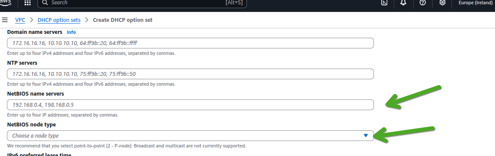
>
> **1. `NetBIOS name servers`**
>
> *   **دي خانة "عنوان سيرفر الـ `WINS`":** لو عندك تطبيق قديم محتاج يكلم `WINS server` عشان يعرف الـ `IPs` بتاعة السيرفرات التانية، أنت بتحط هنا الـ `IP address` بتاع الـ `WINS server` بتاعك (اللي ممكن تكون عامله على `EC2 instance` جوه الـ `VPC`).
> *   لما بتعمل كده، أي `EC2 instance` (خصوصًا `Windows`) هتاخد الـ `configuration` دي وهتعرف أوتوماتيك إن ده هو دليل التليفونات بتاع الـ `NetBIOS` بتاعها.
> *   
>
> الـ NetBIOS Node Types**
>
> الخانة دي بتخليك تختار الطريقة (mode) اللي الـ Windows instance هتستخدمها عشان تدور على IP بتاع اسم NetBIOS معين. كل node type هو عبارة عن استراتيجية بحث مختلفة.
>
> **1. B-node (Broadcast)**
>
> - **إزاي بيشتغل؟** دي الطريقة البدائية. الـ instance بتصرخ في الشبكة كلها (broadcast) وبتسأل "يا جماعة، مين فيكم السيرفر الفلاني؟". السيرفر صاحب الاسم بيرد عليها بالـ IP بتاعه.
> - **ليه مينفعش في AWS؟** لأنه بيعتمد كليًا على الـ broadcast، والـ AWS VPC **لا يدعم الـ broadcast**. لو اخترت الاختيار ده، الـ name resolution هيفشل 100%.
>
> **2. P-node (Peer-to-Peer أو Point-to-Point)**
>
> - **إزاي بيشتغل؟** دي الطريقة المنظمة. الـ instance مش بتصرخ في الشبكة. هي بتروح تسأل "دليل التليفونات" مباشرة، اللي هو الـ WINS server (أو الـ NetBIOS name server). هي بتبعت query مباشر (unicast) للسيرفر ده، وهو بيرد عليها بالـ IP.
> - **ليه ده هو الصح في AWS؟** لأنه مش بيعتمد على broadcast خالص. هو بيستخدم اتصال مباشر، وده شغال وزي الفل جوه الـ VPC. **عشان كده ده هو الاختيار الوحيد اللي AWS بتنصح بيه وبتدعمه.**
>
> **3. M-node (Mixed)**
>
> - **إزاي بيشتغل؟** ده نوع هجين بيحاول يجمع بين الاتنين. الأول بيجرب يعمل broadcast (B-node). لو ملقاش رد، بيروح يسأل الـ WINS server (P-node).
> - **ليه مينفعش في AWS؟** لأنه بيبدأ بالـ broadcast، والخطوة دي هتفشل وهتسبب تأخير (delay) من غير أي لازمة قبل ما يروح للخطوة التانية الصح.
>
> **4. H-node (Hybrid)**
>
> - **إزاي بيشتغل؟** ده برضه نوع هجين، لكنه أذكى من اللي قبله. هو بيعمل العكس: الأول بيروح يسأل الـ WINS server (P-node). لو الـ server ده مش بيرد أو مش موجود، بيضطر يلجأ للحل الأخير وهو إنه يعمل broadcast (B-node).
> - **ليه برضه مش مثالي في AWS؟** الجزء الأولاني منه (P-node) هيشتغل صح. لكن الجزء التاني (بتاع الـ broadcast) هيفشل. نظريًا هو ممكن يشتغل، لكن P-node بيضمن إن مفيش أي محاولات broadcast فاشلة هتحصل من الأساس.
>
> 
>
> ------
>
> ---
>
> **توضيح النقطة اللي أنت قولتها (وهي صحيحة تمامًا):**
>
> - **جوه الـ VPC نفسه (بين EC2 instances):**
>   الـ Broadcast ممنوع تمامًا. عشان كده، الطريقة الوحيدة اللي تضمن بيها اتصال NetBIOS هي **P-node** (إنهم يكلموا WINS server مباشرة).
> - **لكن في شبكة Hybrid (لما تربط الـ VPC بشبكة شركتك):**
>   شبكة شركتك اللي على الأرض (on-premises) ممكن جدًا تكون شبكة قديمة ولسه بتدعم وبتستخدم الـ **Broadcast**.
>
> **وهنا بتيجي فايدة الـ Options التانية زي H-node:**
>
> تخيل السيناريو ده:
>
> 1. أنت عندك EC2 instance على AWS.
> 2. وعندك WINS server في الشركة (on-premises).
> 3. وعندك سيرفرات تانية قديمة في الشركة مش متسجلة في الـ WINS server ده وبتعتمد على الـ Broadcast.
>
> لو خليت الـ EC2 instance بتاعتك شغالة **H-node (Hybrid)**:
>
> - **الخطوة الأولى (المثالية):** الـ instance هتحاول تكلم الـ WINS server اللي في الشركة عن طريق الـ VPN/Direct Connect عشان تسأل عن اسم سيرفر معين. لو لقيته، خلاص الموضوع انتهى.
> - **الخطوة التانية (الاحتياطية):** لو الـ WINS server ده وقع أو مش بيرد، أو الاسم مش متسجل فيه، الـ EC2 instance هتروح عاملة **Broadcast**. الـ Broadcast ده مش هيشتغل جوه الـ VPC نفسه، لكن لو الـ VPN بتاعك متظبط إنه يسمح بمرور الـ Broadcast traffic (وده إعداد متقدم)، الـ Broadcast ده **ممكن يوصل لشبكة الشركة الداخلية** والسيرفر القديم اللي هناك يسمعه ويرد عليه.
>
> الـ Options زي M-node و H-node موجودة عشان **التوافقية مع الشبكات الهجينة (Hybrid Networks)**. هي بتدي للـ EC2 instance المرونة إنها تجرب الطريقة الحديثة الأول (P-node)، ولو فشلت، ترجع تجرب الطريقة القديمة (B-node) اللي ممكن تكون لسه شغالة في شبكة شركتك


#### **5. `IPv6 preferred lease time` (مدة إيجار IPv6)**
لو الـ `VPC` بتاعك مفعل فيه `IPv6`، الخاصية دي بتخليك تتحكم في مدة "إيجار" الـ `IPv6 address` اللي الـ `instance` بتاخدها من الـ `DHCPv6 server`. بتقدر تحدد المدة بالثواني. دي خاصية متقدمة ممكن تحتاجها لو عندك سياسات أمان معينة بتتطلب تغيير الـ `IPs` بشكل دوري. لو معندكش متطلب زي ده، الأفضل تسيبها فاضية عشان تستخدم القيمة الافتراضية بتاعة `AWS`.

فى هنا نقطة قاتله  اسلوب تعامل aws مع IPV4 غير IPV6 بشكل تام مش نفس الادارة وﻻ نفس طريقة التعامل مفيش مدة preferred lease time مفيش الكلام ده فى aws فى IPV4 نظرا لاختلاف طريقة الادارة بطريقة تامه 


"... طيب، أنا كـ engineer استفاد إيه عمليًا من وجع الدماغ ده؟ ليه أعمل custom set وأسيب الإعدادات الافتراضية بتاعة AWS؟

الفايدة هنا ضخمة، وبتظهر في السيناريوهات الحقيقية بتاعت الشركات، ودي أهمها:

**1. دمج الـ VPC مع شبكة الشركة (Hybrid Cloud):****الوضع الطبيعي (قبل أي حاجة):**
تخيل إن شركتك عندها Data Center على الأرض (بنسميه on-premises)، وعندك كمان VPC على AWS. دلوقتي عندك شبكتين منفصلين تمامًا:

1. **شبكة الشركة (On-premises):**
   - فيها سيرفرات مهمة زي fileserver.corp.mycompany.com و hr-app.corp.mycompany.com.
   - فيه DNS Server داخلي (غالبًا بيكون جزء من Microsoft Active Directory) هو الوحيد اللي يعرف إن fileserver.corp.mycompany.com ده الـ IP بتاعه 192.168.1.10.
   - الأجهزة اللي جوه الشركة متظبطة إنها تسأل الـ DNS Server ده.
2. **شبكة AWS (VPC):**
   - فيها EC2 instances (زي web-server و analytics-server).
   - الـ EC2 instances دي متظبطة إنها تسأل الـ Amazon-provided DNS server (اللي هو الـ .2 address).
   - الـ DNS server بتاع AWS ده **معندهوش أي فكرة** عن السيرفرات اللي في شركتك. لو EC2 instance سألته عن fileserver.corp.mycompany.com، هيرد عليها ويقول "معرفش الاسم ده".

**الخطوة الأولى: ربط الشبكتين**

عشان الـ instances اللي في الـ VPC تعرف تكلم السيرفرات اللي في الشركة (والعكس)، لازم الأول نعمل اتصال شبكي بينهم. ده بيتم عن طريق حاجة من اتنين:

- **AWS Site-to-Site VPN**: نفق مشفر وآمن بيعدي على الإنترنت لسه هنكلم عنه
- **AWS Direct Connect**: اتصال فايبر خاص ومباشر بين شركتك و AWS لسه هنكلم عنه

بعد الخطوة دي، الـ EC2 instance تقدر تعمل ping على الـ IP بتاع الـ fileserver (192.168.1.10) وهو هيرد عليها. **لكن المشكلة لسه موجودة: الـ instance لسه مش عارفة تعمل resolve للاسم.**

**الخطوة التانية والأساسية: توحيد الـ DNS باستخدام DHCP Option Set**

وهنا بيجي دور الـ DHCP Option Set عشان يحل المشكلة دي من جذورها:

1. **بنعرف الـ IP بتاع الـ DNS Server اللي في الشركة:** نفترض إن الـ IP بتاعه هو 192.168.1.5.
2. **بنروح على AWS ونعمل Custom DHCP Option Set:**
   - بنعمل set جديد.
   - في خانة Domain name servers، بدل ما نسيبها AmazonProvidedDNS، بنكتب الـ IP بتاع الـ DNS Server بتاع الشركة: **192.168.1.5**.
3. **بنربط الـ Custom Set ده بالـ VPC بتاعنا:**
   بمجرد ما تعمل Associate، بيحصل الآتي فورًا:
   - كل الـ EC2 instances اللي في الـ VPC (الجديدة، واللي شغالة حاليًا بعد reboot أو DHCP lease renewal) بتاخد configuration جديدة بتقولها: "لو عايزة تسألي عن أي اسم، روحي اسألي السيرفر اللي عنوانه 192.168.1.5".

دلوقتي لما الـ web-server اللي في الـ VPC يحتاج يوصل للملفات اللي على fileserver.corp.mycompany.com:

1. هيبعت DNS query بالاسم ده.
2. الـ query ده مش هيروح للـ DNS بتاع AWS، لأ، هيروح مباشرة للسيرفر اللي في الشركة (192.168.1.5) عن طريق نفق الـ VPN أو الـ Direct Connect.
3. الـ DNS Server بتاع الشركة هيرد عليه ويقوله "الاسم ده الـ IP بتاعه هو 192.168.1.10".
4. الـ web-server دلوقتي بقى معاه الـ IP، فيقدر يكلم الـ fileserver مباشرة.

> [!IMPORTANT]
>
> 
>
> لما بتعمل `Custom DHCP Option Set` وتخلي الـ `EC2 instances` بتاعتك تستخدم الـ `DNS server` بتاع شركتك (`on-premises`) عشان تعرف تعمل `resolve` للـdns الداخلية، أنت بكده بتحل مشكلة وبتخلق مشكلة تانية.
>
> **المشكلة:**
> الـ `DNS server` بتاع شركتك معندهوش أي فكرة عن أسماء خدمات `AWS` زي الـ `RDS databases` أو `S3 endpoints` (اللي بتنتهي بـ `.amazonaws.com`). ده بيؤدي لوضع اسمه **`Split-Brain DNS`**: الـ `instances` بتعرف توصل لشبكة الشركة، لكنها بتفقد القدرة على الوصول لخدمات `AWS` باستخدام أسمائها.
>
> **الحل:**
> عشان تحل المشكلة دي، لازم تعمل نظام `DNS` هجين بيعرف يكلم العالمين. أشهر حلين للموضوع ده هما:
>
> 1.  **`Conditional Forwarding`:** بتروح على الـ `DNS server` بتاعك اللي في الشركة وتعمل قاعدة توجيه مشروط بتقوله: "أي `query` يجيلك لـ `domain` بتاع `.amazonaws.com`، مرره (`forward`) على طول للـ `Amazon-provided DNS server` (اللي هو الـ `.2` address) وهو هيرد عليك".
>
> 2.  **`Route 53 Resolver` (الحل الأفضل):** بتستخدم خدمة `AWS` المخصصة للموضوع ده. بتخلي كل الـ `queries` تروح للـ `Resolver` الأول، وهو اللي بيقرر بذكاء: لو الـ `query` لاسم داخلي في شركتك، بيبعته للـ `DNS` بتاع الشركة، ولو لخدمة `AWS`، بيعملها resolve تكون localy جوه `AWS` على طول.
>
> باختصار، تعديل الـ `DHCP Option Set` لوحده مش كافي، ولازم تكمله بواحد من الحلين دول عشان تضمن إن الـ `DNS` يشتغل صح في بيئة الـ `Hybrid Cloud`.


------

**2. Centralized Time Sync المشكلة: ليه الوقت مهم أوي؟**

في عالم الكمبيوتر، الوقت مش مجرد أرقام على الشاشة، ده أساس كل حاجة تقريبًا:

- **Logging & Troubleshooting:** تخيل عندك مشكلة حصلت بين سيرفرين. لو رحت تبص على الـ logs بتاعة كل واحد، ولقيت إن الساعة في السيرفر الأول متقدمة 5 ثواني عن السيرفر التاني، مستحيل هتعرف ترتب الأحداث صح وتعرف مين بعت لمين الأول وإيه اللي سبب المشكلة.
- **Transactions المالية:** في أي نظام مالي، الـ timestamp (بصمة الوقت) بتاع كل عملية هو دليل قاطع. أي اختلاف ولو بأجزاء من الثانية ممكن يسبب كوارث في الحسابات.
- **Security & Authentication:** بروتوكولات كتير زي Kerberos (اللي بيستخدمه Active Directory) بتعتمد على إن كل الأطراف متفقة على نفس الوقت. لو فيه اختلاف، عملية الـ authentication بتفشل.
- **الـ Distributed Systems:** الأنظمة الموزعة بتعتمد على timestamps عشان تعرف حالة البيانات وتعمل synchronization بين الـ nodes.

**الوضع الافتراضي في AWS:**
بشكل افتراضي، الـ EC2 instances اللي بتستخدم Amazon Linux بتكون متظبطة إنها تعمل sync للوقت بتاعها من خدمة Amazon Time Sync Service. دي خدمة ممتازة ودقيقة جدًا.

**طب إمتى بحتاج أغير الوضع الافتراضي؟**

هنا بتيجي حالات الاستخدام اللي بتخلي Custom DHCP Option Set ضروري:

1. **الـ Compliance ومتطلبات التدقيق:**
   بعض الصناعات (زي البنوك أو الجهات الحكومية) بيكون عندها متطلبات صارمة بتقول إن كل السيرفرات لازم تعمل sync من مصدر وقت داخلي وموثق (authoritative time source) موجود جوه الشركة. مينفعش تعتمد على خدمة خارجية حتى لو كانت AWS.
2. **الـ Hybrid Cloud (تاني):**
   لو عندك سيرفرات على AWS وسيرفرات في الـ data center بتاعك على الأرض، أنت محتاج **كل السيرفرات دي، في المكانين**، تكون متفقة على نفس الوقت بالظبط. الحل الوحيد هو إنك تخليهم كلهم يبصوا على نفس الـ NTP server المركزي.

**إزاي DHCP Option Set بيحقق ده؟**

الحل بيكون بنفس الطريقة اللي عملناها مع الـ DNS:

1. **بتحدد الـ NTP Server بتاعك:** بيكون عندك NTP server موثوق، سواء كان جوه الـ data center بتاعك (مثلاً 192.168.1.20) أو ممكن تعمل واحد جوه الـ VPC نفسه.
2. **بتعمل Custom DHCP Option Set:**
   - بتروح تعمل set جديد.
   - في خانة **NTP servers**، بتكتب الـ IPs بتاعة الـ NTP servers اللي أنت عايز كل الـ instances تستخدمها. ممكن تحط لغاية 4 servers عشان لو واحد وقع، الـ instance تروح للي بعده.
3. **بتربط الـ Custom Set بالـ VPC:**
   بمجرد ما تربطه، أي EC2 instance جديدة أو قديمة بتاخد الـ configuration دي عن طريق الـ DHCP، ونظام التشغيل بتاعها بيفهم أوتوماتيك إنه لازم يظبط ساعته من الـ NTP servers اللي أنت حددتها دي.

كل السيرفرات اللي في الـ VPC بتاعك، وكل السيرفرات اللي في الـ data center بتاعك، كلهم بيظبطوا ساعتهم من نفس المصدر. بكده، لما تبص على الـ logs بتاعت أي system، بتكون متأكد 100% إن الـ timestamps متطابقة ومفيش أي مجال للخطأ، وده بيخلي حياتك في الـ troubleshooting والـ auditing أسهل بكتير.

**3. تحسين الـ DNS Performance والأمان:****المشكلة في الوضع الافتراضي:**
في الوضع العادي، كل `instance` في الـ `VPC` بتاعك لما بتحتاج تعمل `resolve` لـ `DNS name` (زي `api.github.com`)، بتبعت `query` للـ `Amazon-provided DNS server` (اللي هو الـ `.2` address). السيرفر ده بيروح يسأل على الإنترنت ويرجعلك بالإجابة. العملية دي سريعة، لكن فيها نقطتين ضعف:

1.  **`Latency`:** كل مرة بتسأل فيها، فيه رحلة بتحصل بين الـ `VPC` بتاعك وسيرفرات `AWS` عشان تجيبلك الإجابة. لو بتعمل آلاف الـ `queries` في الدقيقة، الـ `latency` دي بتتجمع وممكن تبطأ التطبيق بتاعك.
2.  **مفيش تحكم:** أنت ملكش أي سيطرة على اللي بيحصل في الـ `DNS server` بتاع `AWS`. متقدرش تشوف الـ `logs` بتاعته، متقدرش تعمل `filtering`، ومتدرش تعمل `caching` بالطريقة اللي أنت عايزها.

**الحل بالـ `Custom DNS Resolver`:**
هنا أنت بتقرر تبني الـ `DNS resolver` بتاعك بنفسك جوه الـ `VPC`. بتعمل `EC2 instance` وبتسطب عليها `software` زي `unbound` أو `bind` أو حتى `Pi-hole`. السيرفر ده بيعمل حاجتين:

*   **`Caching` :** لما `instance A` بتسأل عن `api.github.com`، الـ `resolver` بتاعك بيطلع يجيب الإجابة ويخزنها عنده (يعملها `cache`). لما `instance B` تيجي تسأل عن نفس الاسم بعدها بثواني، الـ `resolver` بيرد عليها من الـ `cache` بتاعه على طول من غير ما يطلع للإنترنت تاني. **النتيجة:** استجابة شبه فورية للـ `queries` المتكررة، وأداء أسرع للتطبيقات اللي بتعتمد على `DNS`.
*   **`Filtering` & `Security` :** تقدر تعمل `configure` للـ `resolver` بتاعك عشان يعمل حاجات كتير، زي:
    *   **يحجب مواقع معينة:** تمنع كل الـ `instances` إنها توصل لـ `domains` معروف إنها خبيثة (`malware domains`) .
    *   **يسجل كل الـ `queries`:** بيبقى عندك `log` كامل بكل `DNS query` حصلت جوه الـ `VPC` بتاعك، وده كنز في عمليات الـ `troubleshooting` والتحقيقات الأمنية.

**إزاي `DHCP Option Set` بيحقق ده؟**
بعد ما بتبني الـ `DNS resolver` بتاعك ده (مثلاً على `IP` داخلي زي `10.0.1.10`)، بتروح تعمل `custom DHCP option set` وتحط الـ `IP` ده (`10.0.1.10`) كـ `DNS server`. وبكده، كل الـ `instances` في الـ `VPC` بتتوجه أوتوماتيك إنها تستخدم الـ `resolver` بتاعك ده بدل بتاع `AWS`.

**4. تحديد Domain Name مخصص:**بشكل افتراضي، أي `instance` بتاخد `private DNS hostname` بيكون آخره `domain` عام زي `.us-east-1.compute.internal`. الاسم ده طويل، مش بيعبر عن شركتك، وصعب يتعمل له `integrate` مع أنظمة الشركة الداخلية.

**الحل بالـ `Custom Domain Name`:**
لما بتعمل `custom DHCP option set`، بتقدر تحدد `Domain Name` خاص بيك أنت، زي مثلاً `prod.my-company.net`.

**إيه اللي بيتغير بالظبط؟**
لما بتعمل كده، الـ `hostname` بتاع الـ `instances` بيتغير. بدل ما يبقى:
`ip-10-0-1-50.us-east-1.compute.internal`

هيبقى:
`ip-10-0-1-50.prod.my-company.net`

**طب إيه الفايدة العملية من التغيير ده؟**

1.  `Consistency` لو كل سيرفرات شركتك الداخلية بتنتهي بـ `.corp.my-company.com`، تقدر تخلي سيرفرات `AWS` تنتهي بنفس الـ `domain`. ده بيخلي الـ `naming convention` (طريقة التسمية) موحدة في كل مكان، وده بيسهل الإدارة والـ `automation` جدًا.
2.  **`Integration` مع الـ `Private DNS`:** لو أنت بتستخدم خدمة زي `Amazon Route 53 Private Hosted Zones` عشان تدير الـ `DNS` الداخلي بتاعك، تحديد `custom domain name` هو خطوة أساسية. بتعمل `private hosted zone` بنفس الاسم (`prod.my-company.net`)، وساعتها تقدر تعمل `DNS records` بأسماء سهلة زي `database.prod.my-company.net` وتشاور بيها على الـ `instance` بتاعتك، بدل ما تستخدم الاسم الطويل اللي فيه `IP`.
3.  **سهولة الإدارة بالـ `Configuration Management Tools`:** أدوات زي `Ansible` أو `Puppet` أو `Chef` بتبقى أسهل في إدارتها لما يكون عندك `domain` ثابت ومعروف تقدر تتعامل معاه وتعمل `search` للـ `hosts` على أساسه.


### **`VPC Flow Logs` **


دي مش `option` بتختاره وقت إنشاء الـ `VPC`، لكنها خاصية حيوية **بتفعلها** على الـ `VPC` بتاعك بعد ما يتعمل.

*   **بتعمل إيه؟** بتسجل معلومات عن **كل `IP traffic` بيعدي** على أي `network interface` جوه الـ `VPC` بتاعك. السجل ده بيبقى فيه معلومات زي:
    *   الـ `IP` اللي بعت الـ `traffic` (Source IP).
    *   الـ `IP` اللي استقبل الـ `traffic` (Destination IP).
    *   الـ `Ports` المستخدمة.
    *   البروتوكول (`TCP`, `UDP`, إلخ).
    *   هل الـ `traffic` ده **`ACCEPTED`** (اتسمح له يعدي) ولا **`REJECTED`** (اترفض) بواسطة الـ `Security Group` أو الـ `Network ACL`.

*   **ليه الخاصية دي مهمة جدًا؟**
    *   **`Troubleshooting`:** لو فيه `instance` مش عارفة توصل لـ `instance` تانية، أول حاجة بتبص عليها هي الـ `Flow Logs` عشان تشوف هل الـ `traffic` بيترفض وفين بالظبط.
    *   **`Security Monitoring`:** بتساعدك تكتشف أي محاولات اتصال غريبة أو مش مسموح بيها على الشبكة بتاعتك، وبتكون دليل مهم جدًا في أي تحقيق أمني.

بتقدر تبعت الـ `logs` دي لـ `Amazon S3` أو `CloudWatch Logs` عشان تحللها وتعمل عليها `dashboards` و `alerts`.


> [!TIP]
>
> اختيار الـ CIDR Block - أكبر غلطة بيقع فيها المبتدئين
>
> النص بيقولك "فكر كويس" قبل ما تختار، بس مش بيقولك إزاي.
>
> - **الغلطة:** معظم الناس بتختار أول حاجة بتيجي في بالها: 10.0.0.0/16 أو 192.168.0.0/16.
> - **الكارثة بتحصل امتى؟** لما تيجي توصل الـ VPC بتاعك ده بالشبكة الداخلية بتاعت شركتك (On-premises) أو بشركة تانية عن طريق (VPC Peering أو VPN). غالبًا هتلاقي إن شبكتهم **هي كمان** بتستخدم نفس الـ IP range ده. والنتيجة هي **IP Conflict** (تضارب في العناوين)، ودي مشكلة ضخمة وصعبة الحل جدًا.
> - **حل جزءي:**
>   - **ابعد عن المشهور:** بلاش تستخدم 10.0.0.0/16 بالظبط. اختار حتة "غريبة" من الـ range الكبير بتاع 10.0.0.0/8. مثلاً، استخدم 10.42.0.0/16 أو 10.99.0.0/16. ده بيقلل احتمالية التضارب في المستقبل بنسبة 90%.
>   - **استخدم الـ 172.16.0.0/12:** ده range كبير والناس بتنساه كتير، فغالبًا بيكون اختيار آمن.

> [!IMPORTANT]
>
> * **المشكلة: IP Address Overlap في البيئات الكبيرة**
>
>    لما بيكون عندك VPC أو اتنين، سهل أوي تختار الـ CIDR blocks بنفسك، تقول ده هياخد 10.0.0.0/16 والتاني 10.1.0.0/16 والدنيا بتمشي.
>
>   المشكلة الكبيرة بتبدأ لما الشركة بتكبر وبيحصل الآتي:
>
>   - بيبقى عندك عشرات أو مئات الـ AWS accounts جوه AWS Organization واحدة.
>   - كل فريق (Dev, Staging, Prod) بيعمل VPCs لنفسه.
>   - وبتحتاج تربط الـ VPCs دي ببعضها بـ VPC Peering أو Transit Gateway.
>   - وتربطهم كلهم بشبكة الشركة اللي على الأرض (on-premises) عن طريق VPN أو Direct Connect.
>
>   هنا بقى، بتحصل الكارثة بتاعة الـ **IP address overlap**. ده لما فريقين بالصدفة يختاروا نفس الـ CIDR block (مثلاً الاتنين ياخدوا 10.0.0.0/16).
>
>   **النتيجة:** الـ Routing بيبوظ تمامًا. لما سيرفر يحاول يكلم IP زي 10.0.1.50، الـ router مش بيبقى عارف يوديه للـ VPC الأولاني ولا للتاني، والاتصال بيفشل.
>
>   ------
>
>   
>
>   **الحل: Amazon VPC IP Address Manager (IPAM)**
>
>   الـ IPAM هي الخدمة اللي AWS عملتها مخصوص عشان تحل الحوار ده. هي بتخليك تدير كل الـ IP address ranges بتاعتك من مكان واحد مركزي.
>
>   **بتشتغل إزاي (مكوناتها الأساسية):**
>
>   1. 
>   2. **IPAM:**
>      ده الـ resource الرئيسي اللي بتعمله مرة واحدة على مستوى الـ AWS Organization كلها.
>   3. **Scope:**
>      جوه الـ IPAM، بتعمل scopes. الـ scope ده زي ما تقول "درج" بتفصل فيه أنواع الـ IPs:
>      - **Private Scope**: عشان تدير بيه الـ private IP ranges (RFC 1918).
>      - **Public Scope**: عشان تدير بيه الـ public IP ranges اللي أنت شاريها (لو بتستخدم BYOIP).
>   4. **Pool (ده هو الـ IP pool اللي أنت بتسأل عنه):**
>      جوه الـ scope، بتعمل pools. الـ pool ده هو مجموعة الـ CIDR blocks اللي أنت بتعرفها.
>      - **Top-level pool**: بتعمل pool كبير بتحط فيه الـ supernet بتاع شركتك كله (مثلاً 10.0.0.0/8).
>      - **Regional pools**: بعد كده، بتقسم الـ pool الكبير ده لـ pools أصغر لكل AWS region بتشتغل فيها (مثلاً 10.0.0.0/12 لـ eu-west-1، و 10.16.0.0/12 لـ us-east-1).
>   5. **Allocation (التخصيص):**
>      دلوقتي، لما أي developer أو script Terraform يجي يعمل VPC جديد، هو **مش بيخترع CIDR block من دماغه**. هو بيروح للـ IPAM ويقوله: "لو سمحت، أنا عايز VPC جديد حجمه /16 في region eu-west-1".
>      الـ IPAM بيبص في الـ pool بتاعه، بيشوف إيه الـ ranges اللي لسه فاضية، وبيديله CIDR block جديد ومضمون إنه مش overlapping مع أي حاجة تانية.
>
>   **مميزات الـ IPAM:**
>
>   - 
>   - **منع الـ Overlap تمامًا:** بيحل المشكلة من جذورها.
>   - ** Automation:** بيتكامل مع Terraform عشان عملية تخصيص الـ IPs تبقى أوتوماتيك.
>   - **Monitoring & Auditing:** بيديلك dashboard تشوف فيها كل الـ IP ranges المستخدمة، ومين اللي بيستخدمها، ونسبة الاستهلاك، عشان تخطط للمستقبل.


> [!TIP]
>
> فخ الـ Secondary CIDR Blocks
>
> **الفخ:** لو اخترت الـ Primary CIDR بتاعك يكون من عيلة 192.168.0.0/16، مش هتقدر تضيف أي Secondary CIDR من العائلات التانية بتاعت RFC 1918 (لا من 10.0.0.0/8 ولا من 172.16.0.0/12). **إنت كده حبست نفسك في الـ range ده للأبد.**
>
> **قاعدة : لا تستخدم 192.168.0.0/16 أبدًا في أي VPC حقيقي أو production.** الـ range ده معمول للشبكات المنزلية الصغيرة واللابات المؤقتة، مش للبنية التحتية اللي المفروض تكبر وتتوسع. استخدامه بيقفل عليك أبواب كتير في المستقبل.


## **`Subnets`**


الـ `subnet` ده عامل زي  "قسم" جوه الـ `VPC` بتاعك، وده اللي بتحط جواه الـ `VPC resources` بتاعتك، زي الـ `EC2 instances`. الـ `subnet` بيخليك تعزل الـ `instances` عن بعض، وتتحكم في الـ `traffic` اللي رايح وجاي للـ `instances` بتاعتك، وكمان تنظمهم على حسب وظيفتهم. على سبيل المثال، ممكن تعمل `subnet` للـ `public web servers` اللي محتاجة تكون متاحة من الإنترنت، وتعمل `subnet` تاني للـ `database servers` اللي الـ `web instances` بس هي اللي بتقدر توصلها. من ناحية المبدأ، الـ `subnets` دي شبه الـ `virtual LANs (VLANs)` في الشبكات التقليدية.

أي `instance` لازم تكون موجودة جوه `subnet`. وعشان كده دايماً هتسمع جملة "اعمل `launch` لـ `instance` جوه `subnet`". بمجرد ما تعمل `instance` جوه `subnet`، أنت **متقدرش تنقل الـ `instance` دي**. وده بالتبعية معناه إنك متقدرش تنقل `instance` من `VPC` لـ `VPC` تاني أو من `availability zone` للتانية. لكن، الحل إنك تعملها `terminate` (تمسحها) وتعمل `instance` تانية في الـ `subnet` اللي أنت عايزه. وعشان تحافظ على الداتا اللي على الـ `EBS volume` بتاع الـ `instance` دي، ممكن تاخد `snapshot` من الـ `volume`، وتعمل منه `AMI`، وبعدين تستخدم الـ `AMI` ده عشان تعمل `instance` جديدة في الـ `subnet` التاني.

### **`Subnet CIDR Blocks`**

من الـ `VPC CIDR block` الكبير، أنت بتقطع `CIDR block` أصغر لكل `subnet`. مثلاً، لو الـ `VPC` بتاعك الـ `CIDR` بتاعه هو `172.16.0.0/16`، ممكن واحد من الـ `subnets` بتاعتك يكون الـ `CIDR` بتاعه `172.16.100.0/24`. الـ `range` ده بيشمل كل الـ `IP addresses` من `172.16.100.0` لـ `172.16.100.255`، وده بيديلك 256 `address` في الإجمالي.

`AWS` بتحجز أول أربع `IP addresses` وآخر `IP address` في كل `subnet`. ومينفعش تدي الـ `addresses` دي لأي `instance`. لو افترضنا إن الـ `subnet CIDR` هو `172.16.100.0/24`، يبقى الـ `addresses` المحجوزة هي:

*   `172.16.100.0` دا subent id
*   `172.16.100.1` – ده بتاع الـ `router` 
*   `172.16.100.2` – ده بتاع الـ `Amazon-provided DNS server`
*   `172.16.100.3` – ده محجوز للاستخدام المستقبلي
*   `172.16.100.255` دا broadcast

القيود اللي على الـ `prefix lengths` بتاعة الـ `subnet CIDR` هي هي نفس القيود بتاعة الـ `VPC CIDRs`. الـ `Subnet CIDR blocks` اللي في نفس الـ `VPC` مينفعش تكون `overlap` (متداخلة) مع بعض. وكمان، بمجرد ما تدي `IP prefix` لـ `subnet`، متقدرش تغيره تاني.

ممكن الـ `subnet` والـ `VPC` ياخدوا نفس الـ `CIDR`. مثلاً، ممكن تدي `CIDR` قيمته `192.168.0.0/16` للـ `VPC` وللـ `subnet` اللي جواه في نفس الوقت. بس ده **حاجة مش شايعة خالص** ومش هتسيبلك أي مساحة عشان تعمل `subnets` زيادة، وده معناه إن الـ `VPC` بتاعك هيبقى محدود فعليًا بـ `availability zone` واحدة. (هنشرح الـ `availability zones` في الجزء الجاي). الطبيعي والأكتر شيوعًا إن الـ `prefix length` بتاع كل `subnet` يكون أطول (الرقم أكبر) من الـ `VPC CIDR block` عشان تسمح بوجود كذا `subnet` في نفس الـ `VPC`. مثلاً، لو اديت `CIDR` قيمته `192.168.0.0/16` للـ `VPC`، ممكن تدي `CIDR` قيمته `192.168.3.0/24` لـ `subnet` جوه الـ `VPC` ده، وده هيسيبلك مساحة تعمل `subnets` زيادة.

الـ `subnet` **مينفعش يكون ليه كذا `CIDR`**. على عكس الـ `VPC` اللي ممكن يكون ليه `secondary CIDRs`، الـ `subnet` ليه واحد بس. لكن، لو الـ `VPC` بتاعك ليه `primary CIDR` و `secondary CIDR`، الـ `CIDR` بتاع الـ `subnet` بتاعك ممكن يتاخد من أي واحد فيهم. مثلاً، لو الـ `VPC` بتاعك الـ `primary CIDR` بتاعه هو `172.16.0.0/16` والـ `secondary` هو `172.17.0.0/16`، ممكن تعمل `subnet` جوه الـ `VPC` ده ويكون الـ `CIDR` بتاعه `172.17.12.0/24`، لإنه متاخد من الـ `secondary VPC CIDR`.

---


### **`Availability Zones`**

الـ `subnet` الواحد يقدر يكون موجود جوه **`availability zone` (أو `AZ`)** واحدة بس، والـ `AZ` دي تقريبًا عاملة زي موقع جغرافي صغير نسبيًا زي الـ `datacenter`. على الرغم من إن الـ `availability zones` اللي في نفس الـ `AWS region` متصلة ببعض، إلا إنها مصممة بحيث إن أي فشل أو عطل بيحصل في `zone` واحدة، ميسببش عطل في `zone` تانية.

أنت بتقدر تحقق `resiliency` للتطبيقات بتاعتك عن طريق إنك تعمل اتنين `subnets`، كل واحد فيهم في `availability zone` مختلفة، وبعد كده توزع الـ `instances` بتاعتك على الـ `zones` دي. جدول 4.1 بيدي مثال لاتنين `subnets` في اتنين `availability zones` مختلفين.

**جدول 4.1: `Subnets` في `availability zones` مختلفة**

| `Subnet`      | `Availability zone` | `Instance` |
| :------------ | :------------------ | :--------- |
| `web-subnet1` | `us-east-1a`        | `web1`     |
| `web-subnet2` | `us-east-1b`        | `web2`     |

في المثال ده، لو الـ `us-east-1a` `zone` وقعت، الـ `instance` اللي اسمها `web1` هتقع لأنها موجودة في الـ `zone` دي. لكن `web2`، اللي موجودة في الـ `us-east-1b` `zone`، هتفضل شغالة ومتاحة.

إنك تحط الـ `subnets` في `availability zones` مختلفة ده مش شرط إجباري. أنت ممكن تحط كل الـ `subnets` بتاعتك في نفس الـ `zone`، بس خلي في بالك إنه لو الـ `zone` دي وقعت، كل الـ `instances` اللي في الـ `subnets` دي هتقع هي كمان. بص على شكل 4.1 عشان تشوف مثال لاتنين `instances` في اتنين `availability zones` مختلفين.

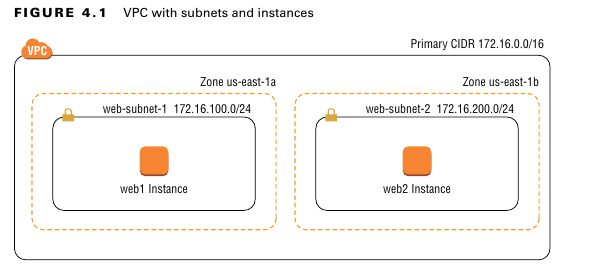

---

### **`IPv6 CIDR Blocks`**

لو كنت خصصت `IPv6 CIDR` للـ `VPC` بتاعك، بتقدر تدي `IPv6 CIDRs` للـ `subnets` اللي جوه الـ `VPC` ده. الـ `prefix length` بتاع أي `subnet` بيستخدم `IPv6` بيكون ثابت على **`/64`**. فلو الـ `IPv6 CIDR` بتاع الـ `VPC` بتاعك هو `2600:1f18:2551:8900/56`، أنت ممكن تدي `subnet` أي `CIDR` من أول `2600:1f18:2551:8900/64` لغاية `2600:1f18:2551:89FF/64`.

أنت لازم **دايماً** تدي `IPv4 CIDR block` لأي `subnet`، حتى لو كنت ناوي تستخدم `IPv6` بس.

**طب إزاي التوزيع بيتم؟**

`AWS` بتديلك `VPC CIDR` حجمه `/56`. ده `range` ضخم جدًا تقدر تقسمه لـ 256 `range` أصغر، كل واحد فيهم حجمه `/64`. نظريًا، أنت اللي بتختار وبتخصص (`assign`) واحد من الـ 256 `range` دول لكل `subnet`.

*   **مثال:** لو الـ `VPC CIDR` بتاعك هو `2600:1f18:2551:8900/56`، ده معناه إن المساحة المتاحة ليك للـ `subnets` بتبدأ من:
    *   `2600:1f18:2551:8900/64`
    *   `2600:1f18:2551:8901/64`
    *   ... وهكذا لغاية ...
    *   `2600:1f18:2551:89FF/64`

عمليًا، لما بتعمل `subnet` من الـ `AWS Console`، `AWS` بتبسط عليك الموضوع. بدل ما تكتب الـ `CIDR` الطويل ده كله، هي بتطلب منك تدخل الجزء الأخير بس (من `00` لـ `ff`)، وهي بتبني الـ `CIDR` الكامل أوتوماتيك بناءً على اختيارك. لكن لو بتستخدم `Infrastructure as Code` زي `Terraform`، أنت اللي بتكتب الـ `CIDR` كامل بنفسك.

```terraform

resource "aws_subnet" "my_ipv6_subnet" {
  vpc_id            = aws_vpc.main.id
  cidr_block        = "10.0.1.0/24"

  ipv6_cidr_block   = "2600:1f18:2551:8905::/64" 
}
```

> **ملحوظة هامة:**
> `AWS` بتفرض عليك إنك **لازم تدي `IPv4 CIDR block` لأي `subnet`**، حتى لو كانت كل خططك هي إنك تستخدم `IPv6` بس. الـ `IPv4` يعتبر متطلب أساسي في تصميم الـ `subnet` حاليًا.

### **دي حتة مهمة فشخ: بين `IPv4` و `IPv6` فيه اختلاف جذري في أسلوب تعامل `AWS` مع الاتنين**

لما بتتعامل مع `IPs` جوه `AWS`، لازم تبقى عارف إن `IPv4` و `IPv6` مش مجرد نسختين من نفس الحاجة. دول عالمين مختلفين تمامًا، و`AWS` بتتعامل مع كل واحد فيهم بفلسفة وتصميم مختلف جذريًا. الفرق ده مش مجرد تفصيلة فنية، ده بيأثر على كل حاجة في تصميم شبكتك من أول تخصيص الـ `IPs` لحد الأمان.

---

#### **1. `IPv4`: عالم مبني على الندرة والعزل والـ `NAT`**

`AWS` بنت الـ `VPC` في وقت كان العالم كله عارف إن `IPv4` بيخلص. عشان كده، كل تصميمها بيتعامل معاه على إنه **"دهب"**، حاجة غالية ولازم نحافظ عليها ونعزلها.

*   **تخصيص الـ `IP` (مش إيجار، ده تخصيص ثابت):**
    أنت مش بتتعامل مع `DHCP` بالمعنى التقليدي. لما بتعمل `EC2 instance`، "المخ" بتاع `AWS` (`AWS Control Plane`) بيبص على الـ `subnet` بتاعك، ويختار `private IP` فاضي، ويروح يلزقه في الـ `ENI` (كارت الشبكة) بتاع الـ `instance` بتاعتك. الـ `IP` ده بيبقى بتاع الـ `ENI` ده **لحد ما يتمسح**. مش بيتغير لو عملت `Stop` و `Start`. الثبات ده هو اللي بيخلي كل حاجة جوه الـ `VPC` مستقرة، لأن الـ `Private IP` ده هو الرقم القومي بتاع الـ `instance` جوه الشبكة.

*   تقدر تمسح Ec2 وتحافظ على ENI عليه ip وبكده انت حجزه

*   **فلسفة الواسطة (`NAT` هو الملك):**
    بما إن الـ `Private IPs` دي عناوين داخلية مينفعش تطلع على الإنترنت، `AWS` بنت منظومة كاملة من `NAT) عشان يحلوا المشكلة.
    *   **`Internet Gateway (IGW)`:** ده بيشتغل nat `1-to-1`. هو بيبقى معاه دفتر بيقول "الـ `Private IP` `10.0.1.50` ده لما يحب يطلع نت، هيطلع بالـ `Public IP` `54.1.2.3`".
    *   **`NAT Gateway`:** ده nat تاني بس بيشتغل `Many-to-1`. هو بياخد الـ `traffic` من مئات السيرفرات الـ `private`، وبيطلعهم كلهم بالـ `Public IP` بتاعه هو.
        فالعالم الداخلي (`Private`) والشارع (الـ `Public`) منفصلين تمامًا، والـ `NAT` هو الواسطة الإجبارية اللي بينهم.

*   **الأمان (مقفول في الأصل):**
     أي `instance` بتتولد جواه بتكون `private` ومعزولة عن الشارع بشكل افتراضي. أنت اللي لازم تاخد قرار صريح وخطوات واضحة (زي إنك تحطها في `public subnet` وتديها `public IP`) عشان تفتح لها باب على الشارع.

---

#### **2. `IPv6`: عالم مبني على الوفرة والاتصال المباشر والأمان الصريح**

`IPv6` جه بفلسفة مختلفة تمامًا: الـ `IPs` مبقتش نادرة، بالعكس، دي بقت زي **"الهوا"**. `AWS` هنا مش بتحاول تحافظ على الـ `IPs`، هي بتحاول تتبع الـ `standards` العالمية بتاعة `IPv6`.

*   **تخصيص الـ `IP` (هنا بقى فيه إيجار):**
    هنا الموضوع أقرب للـ `DHCP` العادي. `AWS` بتديلك `range` كبير جدًا (`/56`)، والـ `instances` بتاخد `IPs` منه بشكل ديناميكي. عشان كده فيه مفهوم **"الإيجار" (`Lease`)**. وده السبب إنك بتلاقي `option` في `DHCP Option Set` اسمه `IPv6 preferred lease time` عشان تتحكم في مدة الإيجار. الخاصية دي مش موجودة في `IPv4` لأن طريقة الشغل مختلفة.

*   **فلسفة الاتصال المباشر (انسى الـ `NAT`!):**
    **وده أكبر فرق على الإطلاق.** كل `IPv6 address` `AWS` بتديهولك هو **عنوان عالمي فريد ينفع توصله من أي حتة في العالم (`globally routable`)**.
    *   **مفيش `NAT`:** الـ `NAT` اتعمل أصلًا عشان نقص `IPv4`. في `IPv6`، إحنا مش محتاجينه. كل `instance` ليها عنوانها العالمي المباشر.
    *   **دور الـ `Internet Gateway` بيتغير:** بالنسبة للـ `IPv6`، الـ `IGW` مش بيعمل nat. هو مجرد "بوابة" بتسمح للـ `traffic` إنه يعدي وخلاص.
    *   **`Egress-Only Internet Gateway`:** ده هو بديل الـ `NAT Gateway`. لو عندك `instance` عايزها تطلع نت (عشان تعمل `updates`) بس مش عايز النت يكلمها، بتخليها تطلع من البوابة دي. دي "بوابة خروج بس"، بتسمح للـ `traffic` يطلع، لكن بتمنع أي حد من بره يبدأ اتصال.

*   **الأمان (أنت اللي لازم تقفل الباب):**
    بما إن كل `instance` بقى ليها عنوان `public`، الأمان هنا بيعتمد **100%** عليك أنت. **الـ `Security Groups` والـ `Network ACLs`** بيبقوا أهم من الأول بكتير، لأنهم هما "firewall" الوحيدين اللي واقفين على باب الـ `instance` بتاعتك.
    العزل هنا مبقاش افتراضي زي `IPv4`. هنا كل الأبواب مفتوحة على الشارع، وأنت اللي لازم تروح تقفل كل باب مش عايزه بنفسك عن طريق قواعد الـ `firewall`.


> [!IMPORTANT]
>
> **الـ Egress-Only Internet Gateway مجاني تمامًا (Free of charge).**
>
> **الـ NAT Gateway ليه تكلفة.**
>
> **تفاصيل التكلفة (ليه الفرق ده موجود؟)**
>
> **1. Egress-Only Internet Gateway (Egress-Only IGW)**
>
> - **التكلفة:** **صفر.** AWS مش بتحاسبك على إنشاء الـ Egress-Only IGW نفسه، ولا على حجم الداتا اللي بتعدي من خلاله. أنت بتتحاسب بس على Data Transfer Out العادي بتاع AWS (تكلفة نقل الداتا من AWS للإنترنت)، ودي تكلفة هتدفعها في كل الأحوال.
> - **ليه مجاني؟** لأنه بيعمل وظيفة بسيطة جدًا ومباشرة. هو مجرد gateway بيعمل stateful filtering، يعني بيسمح للـ traffic إنه يطلع، وبيسمح للردود بتاعة نفس الاتصال ده إنها ترجع. هو مش بيعمل NAT أو أي عمليات معقدة بتستهلك resources.
>
> **2. NAT Gateway**
>
> NAT Gateway ليه نوعين من التكلفة، وده اللي بيخليه غالي نسبيًا:
>
> 1. **تكلفة الساعة (Hourly Charge):**
>    أنت بتدفع فلوس على **كل ساعة** الـ NAT Gateway بتاعك شغال فيها، حتى لو معداش عليه أي traffic. (التكلفة حوالي 0.045$ في الساعة في معظم الـ regions).
>    - **يعني في الشهر:** 0.045
>
> ```
> 0.045 × 24 hours × 30 days ≈ $32.4
> ```
>
>  في الشهر لكل NAT Gateway، ده من غير أي traffic.
>
> 1. **تكلفة معالجة الداتا (Data Processing Charge):**
>    بتدفع فلوس على **كل جيجابايت** من الداتا بتعدي من خلال الـ NAT Gateway (سواء طالعة أو راجعة). (التكلفة حوالي 0.045$ لكل جيجابايت).
>
> **ليه مكلف؟**
> لأن NAT Gateway هو resource مُدار بالكامل، highly available، و scalable. AWS بتبنيلك من ورا الكواليس infrastructure قوية عشان تعمله، والـ infrastructure دي بتستهلك resources. هو بيعمل NAT (Port Address Translation)، وبيحتفظ بـ state لكل connection، ودي عمليات بتستهلك CPU و memory.
>
> ------

> [!IMPORTANT]
>
> **1. Internet Gateway (IGW)**
>
> - الـ Internet Gateway نفسه **مجاني تمامًا**.
> - AWS مش بتحاسبك على وجوده في الـ VPC بتاعك، ولا على حجم الداتا اللي بتعدي من خلاله.
> - **التكلفة الوحيدة المرتبطة بيه** هي تكلفة **Data Transfer Out** (الداتا اللي بتطلع من AWS للإنترنت)، ودي تكلفة هتدفعها في كل الأحوال سواء استخدمت IGW أو أي خدمة تانية.
>
> ------
>
> 
>
> **2. Public IPv4 Addresses**
>
> هنا بقى بتيجي التكلفة. AWS بتعتبر الـ Public IPv4 addresses مورد نادر ومحدود، وعشان كده غيرت سياسة التسعير بتاعته من أول فبراير 2024.
>
> - **القاعدة الجديدة:** أنت بتتحاسب على **كل Public IPv4 address موجود في حسابك**، سواء كان متركب على resource شغال أو لأ.
> - **التكلفة:** حوالي **$0.005 لكل IP في الساعة** (يعني حوالي **$3.6 في الشهر** لكل Public IP).
> - **ده بيشمل إيه؟**
>   - **Elastic IP addresses**: سواء متركبة أو لأ.
>   - **Auto-assigned Public IPs**: اللي الـ EC2 instances بتاخدها أوتوماتيك.
> - **الاستثناء:** AWS بتدي لكل حساب Free Tier بيشمل **750 ساعة** من استخدام Public IPv4 شهريًا (يعني كأنك مشغل IP واحد طول الشهر ببلاش). أي IP زيادة عن كده بتتحاسب عليه.
>
> ------
>
> 
>
> **3. IPv6 Addresses**
>
> هنا الموضوع مختلف تمامًا.
>
> - **القاعدة:** **تخصيص واستخدام IPv6 addresses مجاني تمامًا.**
> - AWS مش بتحاسبك على تفعيل IPv6 في الـ VPC، ولا على الـ CIDR /56 اللي بتاخده، ولا على أي IPv6 address الـ instance بتاعتك بتاخده.
> - **ليه؟** لأن IPv6 متوفر بكثرة، وAWS (والعالم كله) بتشجع الناس إنها تستخدمه.

> [!IMPORTANT]
>
> **3. Data Transfer (هنا بتيجي التكلفة)**
>
> دي هي الحتة اللي فيها التفاصيل. AWS بتحاسبك على الداتا اللي بتطلع من الـ infrastructure بتاعتها للإنترنت العام (Data Transfer Out to the Internet).
>
> - **التسعير بيعتمد على بروتوكول الـ IP المستخدم:**
>   - **تكلفة Data Transfer Out باستخدام IPv4:** دي التكلفة العادية اللي كلنا عارفينها (حوالي $0.09 لكل جيجابايت لأول 10 تيرابايت في الشهر).
>   - **تكلفة Data Transfer Out باستخدام IPv6:** هنا AWS عاملة تسعير **أرخص بكتير**. التكلفة بتكون حوالي **$0.05** لكل جيجابايت.
>
> **إذًا، التكلفة الوحيدة اللي ممكن تدفعها ليها علاقة بـ IPv6 هي تكلفة الداتا اللي بتطلع من سيرفراتك للإنترنت، والتكلفة دي بتكون أرخص بنسبة 40% تقريبًا من لو كنت بتستخدم IPv4.**

> [!IMPORTANT]
>
> IPV6 مع الانترنت والتحكم فيه مش مجرد option يبقى عبط وعبط كبير قوي انك متستخدموش


---

## **`Elastic Network Interfaces (ENIs)`**


 عشان نفهم أي شبكة في `AWS` صح، لازم نبدأ من حجر الأساس بتاعها، وهو الـ **`elastic network interface` (`ENI`)**. الـ `ENI` ده مش مجرد `virtual network interface`، هو `resource` كامل ومستقل ليه خصائص قوية جدًا. أي `EC2 instance` بتعملها لازم يكون ليها `ENI` عشان تقدر تبعت أو تستقبل أي `network traffic`، سواء كان ده اتصال بالإنترنت، أو اتصال بخدمات `AWS` تانية، أو حتى اتصالك أنت بيها عشان تديرها عن طريق `SSH` أو `RDP`. من غير `ENI`، الـ `EC2 instance` بتاعتك بتبقى مجرد صندوق مقفول ومعزول عن العالم.

---

### **`Primary ENI` - الـ `Network Interface`**

لما بتعمل `launch` لأي `EC2 instance` جديدة، `AWS` بشكل أوتوماتيكي بتعمل معاها `ENI` وبتركبه فيها. الـ `ENI` الأولاني والأساسي ده بنسميه 
**`primary network interface` (`primary ENI`)**، وليه معاملة خاصة جدًا وقواعد صارمة مينفعش تتغير:

1.  **لا يمكن فصله:** متقدرش تفك الـ `primary ENI` من الـ `instance` بتاعته طول ما هي عايشة. هو جزء لا يتجزأ من identity الخاصة بـ الـ `instance` .
2.  **مرتبط بـ `subnet` واحد فقط:** الـ `primary ENI` بيتعمل جوه `subnet` واحد ومحدد، ومتقدرش تنقله لـ `subnet` تاني أبدًا.

وهنا بتيجي أهم نقطة عملية: لما `AWS` بتسألك "هتحط الـ `instance` دي في أنهي `subnet`؟"، أنت في الحقيقة مش بتختار `subnet` للـ `instance` نفسها، أنت بتختار الـ `subnet` اللي هيتعمل جواه الـ **`primary ENI`** بتاعها.

> [!WARNING]
>
> في عالم AWS، فيه نقطة مهمة جدًا لازم نفهمها، وهي إن الـ primary ENI اللي AWS بتنشئه أوتوماتيك مع أي EC2 instance هو جزء لا يتجزأ من الـ instance دي، فأنت ملكش تحكم فيه إطلاقًا. مقدرش أقوله حافظ على الـ private IP بتاعه، ومقدرش أقوله متتمسحش لما الـ instance تتمسح، ومقدرش حتى أديله IP ثابت بإيدي وقت الإنشاء؛ هو يعتبر identity مؤقتة مرتبطة بعمر السيرفر نفسه. وهنا بتظهر مشكلة كبيرة في إدارة الـ infrastructure الحقيقية، فتخيل إنك حبيت تعلي إمكانيات الـ EC2 بتاعتك وتغير نوعها لنوع أعلى. في الحالة دي، بما إنك هتستبدل الـ instance، الـ primary ENI بتاعها هيضيع وهتاخد private IP جديد تمامًا، وساعتها هتضطر تغير الإعدادات دي بإيدك في كل الـ resources التانية اللي كانت بتستخدم الـ EC2 دي، زي الـ DNS records أو الـ Security Group rules أو الـ application configurations. هنا بقى بيجي الدور العبقري للـ **Secondary ENI**. الـ Secondary ENI هو resource مستقل تمامًا أنت اللي بتنشئه وبتتحكم فيه؛ أنت بتقدر تديله private IP ثابت من اختيارك، والأهم من كده، بتقدر تقوله "لو مسحت الـ EC2 اللي أنت متركب عليها، متتمسحش معاها". بالطريقة دي، الـ Secondary ENI بيتحول من مجرد كارت شبكة إضافي، لـ persistent network identity**. لما تحب تعلي إمكانيات الـ EC2، الـ workflow بيبقى سلس جدًا: بتعمل terminate للـ instance القديمة، فالـ primary ENI بتاعها بيتمسح، لكن الـ Secondary ENI بتاعك بيفضل موجود. بعد كده، بتعمل launch للـ instance الجديدة بالإمكانيات الأعلى، وبتروح مركب عليها نفس الـ Secondary ENI القديم. النتيجة إنك كده مخسرتش أي حاجة؛ الـ Private IP الثابت اللي كل الـ services التانية بتكلمك عليه فضل زي ما هو. بطبيعة الحال، أنت هتكون عامل نفس المنطق مع الداتا بتاعتك عن طريق EBS volume بتفكه وتركبه في الـ instance الجديدة، فبالتالي أنت بتكون غيرت الـ Compute فقط، وسبت كل حاة تانية زي ما هي: **الـ Storage والـ Networking **. ودي هي القوة الحقيقية للـ Cloud: القدرة على فصل طبقات الـ infrastructure عن بعضها، وتغيير أي طبقة من غير ما تأثر على الطبقات التانية. الـ Secondary ENI هو الأداة اللي بتديلك القوة دي في طبقة الشبكات.

دا مثل حاجة شبه 

```terraform
resource "aws_network_interface" "persistent_app_eni" {
  subnet_id       = aws_subnet.private.id
  #private_ips     = ["10.0.1.100"] 
  security_groups = [aws_security_group.internal_access.id]

  tags = {
    Name = "My-Application-ENI"
  }
}
```

فيه نقط مهمة وقوية جدًا لازم تبقى واضحة وإحنا بنتعامل مع الـ ENIs. أول حاجة، لما بنعمل ENI مستقل، إحنا لينا مطلق الحرية في التحكم في الـ IP بتاعه؛ ممكن نديله private IP ثابت بإيدينا، وممكن نسيبه ياخد IP ديناميكي من الـ subnet عادي جدًا.

تاني حاجة، لما بنركب الـ ENI ده كـ Secondary ENI على EC2 instance، لازم مننساش إن الـ Security Group اللي بنحدده في الـ aws_instance resource بيروح للـ Primary ENI بس. أما الـ Secondary ENI فبيكون ليه الـ Security Group الخاص بيه اللي بنحدده وإحنا بنعمل الـ ENI نفسه. دي نقطة مهمة جدًا لأنها بتخلي الـ instance كأنها محمية باتنين firewalls مختلفين، كل واحد بقواعده الخاصة.

وبما إن كل ENI ليه خصائصه، فده معناه إني أقدر أعمل design معقد، زي إني أحط الـ Primary ENI في public subnet وأديله public IP (طبعًا لو فيه Internet Gateway)، وفي نفس الوقت أركب Secondary ENI تاني على نفس الـ instance وأحطه في private subnet، وساعتها الـ ENI التاني ده مستحيل ياخد public IP. بالطريقة دي، بيبقى عندي instance واحدة ليها "رجل" على الإنترنت، و"رجل" تانية في الشبكة الداخلية المعزولة تمامًا سؤال ليه اعمل كده مش عارف السناريوهات ملهاش حدود حرفيا ممكن 


```
resource "aws_vpc" "main" {
  cidr_block = "10.0.0.0/16"
  tags = {
    Name = "ENI-Demo-VPC"
  }
}
data "aws_availability_zones" "AZs" {
  all_availability_zones = true
  state = "available"

}
resource "aws_subnet" "private" {
  vpc_id            = aws_vpc.main.id
  cidr_block        = "10.0.1.0/24"
  availability_zone = data.aws_availability_zones.AZs.names[0]
  tags = {
    Name = "Private-Subnet"
  }
}
data "aws_ami" "amazon_linux" {
  most_recent = true
  owners      = ["amazon"]
  filter {
    name   = "name"
    values = ["amzn2-ami-hvm-*-x86_64-gp2"]
  }
}

resource "aws_security_group" "internal_access" {
  name   = "internal-access-sg"
  vpc_id = aws_vpc.main.id

}

resource "aws_network_interface" "persistent_app_eni" {
  subnet_id       = aws_subnet.private.id
  #private_ips     = ["10.0.1.100"] 
  security_groups = [aws_security_group.internal_access.id]

  tags = {
    Name = "My-Application-ENI"
  }
}

resource "aws_instance" "app_server_v1" {
  ami           = data.aws_ami.amazon_linux.id
  instance_type = "t2.micro"
  subnet_id     = aws_subnet.private.id
  security_groups = [aws_security_group.internal_access.id]

  tags = {
    Name = "App-Server-V1 (t2.micro)"
  }
}


resource "aws_network_interface_attachment" "eni_attachment" {
  instance_id = aws_instance.app_server_v1.id
  network_interface_id = aws_network_interface.persistent_app_eni.id
  device_index         = 1 
  
}

```


  device_index         = 1  فى العادي بنبداء من zero كل بس ZERO محجوز للـPRIMARY وكل واحد تحطه فى EC2 لزم تزود واحد على device_index

انا هغير نوع Ec2 وشوف مين اللي هيتغير


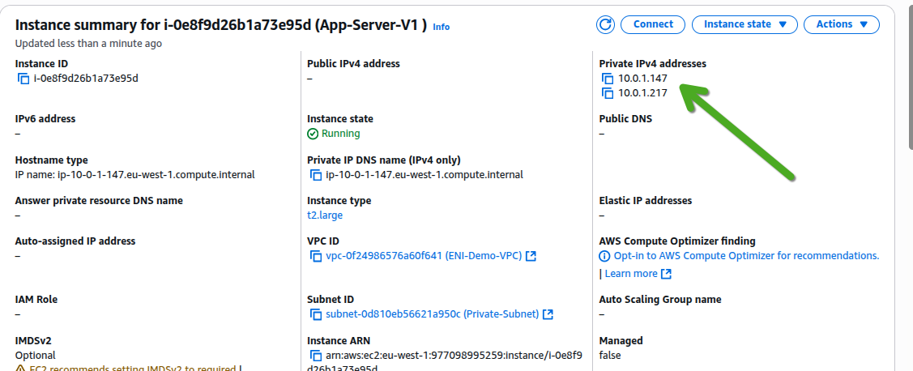

هنا تبان القوة الحقيقة لكلمة cloud انك عادي تقدر تنقل ip من ec2 لـec2 برحتك مش شرط زي هنا غيرت نوع تقدر تعمل attach لـec2 ثانية عادي جدا 

> [!NOTE]
>
>
> ملحوظة: ربط EC2 Instance بأكثر من Subnet في نفس الـ Availability Zone**
>
> ممكن تبان غريبة، لكن EC2 instance واحدة تقدر تكون موجودة في **اتنين subnets مختلفين في نفس الوقت**، بشرط أساسي ومهم: إن الاتنين subnets دول يكونوا في **نفس الـ Availability Zone (AZ)**.
>
> ده مش معناه إن الـ instance نفسها بتتمدد بين الشبكتين، لكن ده بيحصل عن طريق إننا بنركب عليها أكتر من Elastic Network Interface (ENI)، كل واحد فيهم بنحطه في subnet مختلف.
>
> **مثال عملي:**
> تخيل عندك تصميم شبكة بالمنظر ده جوه نفس الـ AZ (مثلاً eu-west-1a):
>
> 1. **Public Subnet (10.0.1.0/24):** ده اللي بيستقبل الـ traffic من الإنترنت.
> 2. **Private Subnet (10.0.2.0/24):** ده اللي فيه الـ database بتاعتك.
>
> أنت ممكن تعمل EC2 instance (زي web server) وتخليها "جسر" بين الشبكتين دول. بتعمل الآتي:
>
> - بتعمل launch للـ instance والـ **Primary ENI** بتاعها بينزل في الـ Public Subnet. الـ ENI ده بياخد Public IP وبيستقبل الـ requests من المستخدمين.
> - بعد كده، بتعمل Secondary ENI جديد وبتحطه في الـ **Private Subnet**، وبتركبه على نفس الـ EC2 instance.
>   بقى عندك EC2 instance واحدة ليها عنوانين IP مختلفين على شبكتين منفصلتين:
>
> - **IP عام** على ENI-1 في الـ Public Subnet.
> - **IP خاص** على ENI-2 في الـ Private Subnet.
>
> بالطريقة دي، الـ instance بتقدر تستقبل الـ traffic من الإنترنت، وفي نفس الوقت تكلم الـ database بتاعتها بشكل آمن ومباشر على الشبكة الداخلية، وكل ده من نفس السيرفر. ده تصميم قوي جدًا بنستخدمه في الـ Network Appliances زي الـ Firewalls أو الـ Proxies اللي بتحتاج تفصل بين أنواع مختلفة من الـ traffic.
>
> ```terraform
> 
> resource "aws_vpc" "main" {
>   cidr_block = "10.0.0.0/16"
>   tags = {
>     Name = "Multi-Subnet-EC2-VPC"
>   }
> }
> 
> locals {
>   availability_zone = "eu-west-1a"
> }
> 
> resource "aws_internet_gateway" "igw" {
>   vpc_id = aws_vpc.main.id
> }
> 
> resource "aws_subnet" "public" {
>   vpc_id                  = aws_vpc.main.id
>   cidr_block              = "10.0.1.0/24"
>   availability_zone       = local.availability_zone
>   map_public_ip_on_launch = true
> 
>   tags = {
>     Name = "Public-Subnet-Multi-ENI"
>   }
> }
> 
> resource "aws_subnet" "private" {
>   vpc_id            = aws_vpc.main.id
>   cidr_block        = "10.0.2.0/24"
>   availability_zone = local.availability_zone
> 
>   tags = {
>     Name = "Private-Subnet-Multi-ENI"
>   }
> }
> 
> resource "aws_route_table" "public_rt" {
>   vpc_id = aws_vpc.main.id
>   route {
>     cidr_block = "0.0.0.0/0"
>     gateway_id = aws_internet_gateway.igw.id
>   }
> }
> 
> resource "aws_route_table_association" "public_assoc" {
>   subnet_id      = aws_subnet.public.id
>   route_table_id = aws_route_table.public_rt.id
> }
> 
> resource "aws_security_group" "public_eni_sg" {
>   name   = "public-eni-sg"
>   vpc_id = aws_vpc.main.id
> 
>   ingress {
>     from_port   = 80
>     to_port     = 80
>     protocol    = "tcp"
>     cidr_blocks = ["0.0.0.0/0"]
>   }
> 
>   ingress {
>     from_port   = 22
>     to_port     = 22
>     protocol    = "tcp"
>     cidr_blocks = ["0.0.0.0/0"]
>   }
> 
>   egress {
>     from_port   = 0
>     to_port     = 0
>     protocol    = "-1"
>     cidr_blocks = ["0.0.0.0/0"]
>   }
> }
> 
> resource "aws_security_group" "private_eni_sg" {
>   name   = "private-eni-sg"
>   vpc_id = aws_vpc.main.id
> 
>   ingress {
>     from_port   = -1
>     to_port     = -1
>     protocol    = "-1"
>     cidr_blocks = [aws_vpc.main.cidr_block]
>   }
> 
>   egress {
>     from_port   = 0
>     to_port     = 0
>     protocol    = "-1"
>     cidr_blocks = ["0.0.0.0/0"]
>   }
> }
> 
> data "aws_ami" "amazon_linux" {
>   most_recent = true
>   owners      = ["amazon"]
>   filter {
>     name   = "name"
>     values = ["amzn2-ami-hvm-*-x86_64-gp2"]
>   }
> }
> 
> resource "tls_private_key" "ssh_key" {
>   algorithm = "ED25519"
> }
> 
> resource "local_file" "ssh_key" {
>   content         = tls_private_key.ssh_key.private_key_pem
>   filename        = "${path.root}/my_ssh_key_of_ec2.pem"
>   file_permission = "0400"
> }
> 
> resource "aws_key_pair" "my_key" {
>   key_name   = "multi-eni-key"
>   public_key =tls_private_key.ssh_key.public_key_openssh
> }
> 
> resource "aws_instance" "multi_homed_server" {
>   ami           = data.aws_ami.amazon_linux.id
>   instance_type = "t2.micro"
>   key_name      = aws_key_pair.my_key.key_name
>   subnet_id     = aws_subnet.public.id
>   vpc_security_group_ids = [aws_security_group.public_eni_sg.id]
> 
>   tags = {
>     Name = "Multi-Homed Web Server"
>   }
> }
> 
> resource "aws_network_interface" "private_eni" {
>   subnet_id       = aws_subnet.private.id
>   security_groups = [aws_security_group.private_eni_sg.id]
>   private_ips     = ["10.0.2.100"]
> 
>   tags = {
>     Name = "Private-Side-ENI"
>   }
> }
> 
> resource "aws_network_interface_attachment" "eni_attachment" {
>   instance_id          = aws_instance.multi_homed_server.id
>   network_interface_id = aws_network_interface.private_eni.id
>   device_index         = 1
> }
> 
> output "server_public_ip" {
>   value = aws_instance.multi_homed_server.public_ip
> }
> 
> output "server_private_ip_on_public_subnet" {
>   value = aws_instance.multi_homed_server.private_ip
> }
> 
> output "server_private_ip_on_private_subnet" {
>   value = aws_network_interface.private_eni.private_ip
> }
> 
> output "ssh_command" {
>   value = "ssh -i your-key.pem ec2-user@${aws_instance.multi_homed_server.public_ip}"
> }
> ```
>
> 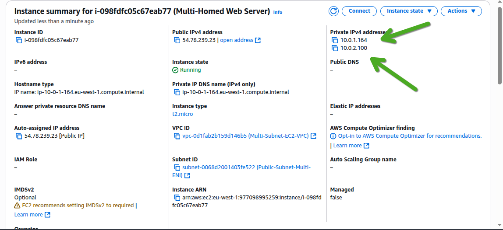
>
> لاحظ ip فى subnet وip فى subnet ثاني 
>
> 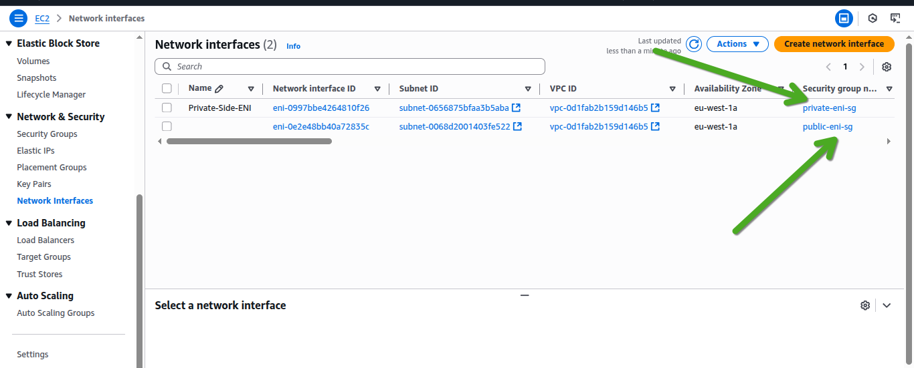
>
> 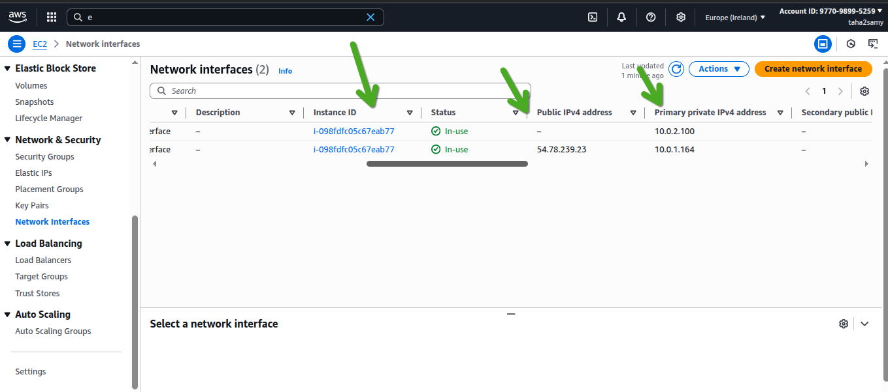


### **`IP Addresses` - هو digital identity للـ `ENI`**

الـ `ENI` هو الحامل أو الـ `carrier` لعناوين الـ `IP`. أي `IP` لازم يكون مرتبط بـ `ENI`.
*   **`Primary Private IP Address`:** كل `ENI` لازم يكون ليه
     `primary private IP address` واحد على الأقل. الـ `IP` ده بيتاخد من الـ `CIDR range` بتاع الـ `subnet` اللي الـ `ENI` موجود فيه. أهم ميزة فيه إنه ثابت ومستقر، ومتقدرش تغيره أو تمسحه من الـ `ENI` طالما الـ `ENI` موجود.
*   **`Secondary Private IP Addresses`:** لو احتجت، بتقدر تضيف عناوين `IP` تانية لنفس الـ `ENI`، ودي بنسميها `secondary private IP addresses`. ده بيفيدك جدًا لو عندك `application` على السيرفر محتاج يشتغل على أكتر من `IP` في نفس الوقت، زي مثلاً لو بتعمل `host` لمواقع `SSL` مختلفة. الشرط الوحيد إن كل الـ `secondary addresses` دي لازم تكون متاخدة من نفس الـ `range` بتاع نفس الـ `subnet`.

---

### **تعدد الـ `ENIs` - توصيل الـ `Instance` على أكتر من شبكة**

وهنا الموضوع بيبدأ يبقى متقدم وممتع. أنت مش محبوس في `ENI` واحد لكل `instance`.فالـ `AWS` بتسمحلك تركب أكتر من `ENI` على نفس الـ `EC2 instance`. السيناريو ده بيخلي الـ `instance` كأنها متوصلة على شبكتين مختلفتين في نفس الوقت، كل شبكة ليها `IP range` و `Security Group` مختلف.
*   **أشهر استخدام:** ممكن تعمل `primary ENI` في `public subnet` عشان يستقبل الـ `traffic` اللي جاي من المستخدمين على الإنترنت، وفي نفس الوقت تركب `secondary ENI` في `private subnet` تاني خالص عشان الـ `instance` تكلم الـ `database` من خلاله بشكل آمن ومنعزل تمامًا عن الإنترنت.
*   **الشرط الوحيد:** كل الـ `ENIs` اللي هتركبها على `instance` واحدة لازم يكونوا موجودين في نفس الـ `availability zone`.

---

### **مرونة الـ `ENI` - معنى كلمة "Elastic" الحقيقي**

أهم نقطة بتميز الـ `ENI` وبتديها اسمها هي إنها **`resource` مستقل بذاته**، مش مجرد تابع للـ `instance`. أنت ممكن تعمل `ENI` وتسيبه موجود في حسابك من غير ما يكون متركب في أي `instance`، وتقدر تتحكم في دورة حياته بشكل كامل عن طريق خاصية
 **`Delete On Termination`**. لو عطلت الخاصية دي على `secondary ENI`، الـ `ENI` هيفضل موجود بكل إعداداته حتى لو مسحت الـ `instance` اللي كان متركب فيها.

القوة الحقيقية والمرونة (`Elasticity`) بتظهر هنا: بما إن الـ `ENI` مستقل، بتقدر تفكه (`detach`) من `instance` وتركبه (`attach`) في `instance` تانية في ثواني.
*   **أقوى استخدام هو في الـ `Failover`:** لو عندك `instance` رئيسية حصل فيها مشكلة ووقعت، بتقدر في ثواني تفك الـ `ENI` بتاعها (اللي بيحمل الـ `IP` والـ `Security Group` وكل الإعدادات) وتركبه في `instance` تانية بديلة (`standby`). بالطريقة دي، أنت بتعيد توجيه كل الـ `traffic` اللي كان رايح للـ `instance` القديمة للجديدة من غير ما تحتاج تغير أي `IP address` أو `DNS record`، وده بيقلل الـ `downtime` جدًا وبيضمن استمرارية الخدمة.


### **`Enhanced Networking` - للـ `EC2`**

 الـ `ENI` العادي اللي اتكلمنا عنه هو الطريقة الأساسية للاتصال، لكن في التطبيقات اللي محتاجة   جدًا الـ `High-Performance Computing`، أو `video streaming`، أو `databases` ضخمة)، الـ `ENI` العادي ده بيكون عنق زجاجة (`bottleneck`). وهنا بيجي دور خاصية الـ **`Enhanced Networking`**. دي مش مجرد `ENI` جديد، دي طريقة مختلفة تمامًا الـ `EC2 instance` بتتكلم بيها مع شبكة `AWS`.

#### **المشكلة في الطريقة العادية (من غير `Enhanced Networking`)**

عشان تفهم ليه `Enhanced Networking` قوية، لازم تعرف الطريقة العادية شغالة إزاي. أي `EC2 instance` هي عبارة عن `virtual machine` شغالة على `physical server` كبير. اللي بيدير كل الـ `virtual machines` دي هو برنامج اسمه **`hypervisor`**.
في الوضع العادي، لما الـ `instance` بتاعتك بتبعت `network traffic`، هي مش بتكلم كارت الشبكة الفيزيائي مباشرة. لأ، هي بتكلم الـ `hypervisor`، والـ `hypervisor` هو اللي بياخد الـ `traffic` ده ويعالجه وبعدين يبعته لكارت الشبكة الفيزيائي. العملية دي بتخلق طبقة وسيطة بتسبب حاجتين:
1.  **`Latency` :** فيه وقت بيضيع في النص والـ `hypervisor` بيعالج الـ `traffic`.
2.  **`CPU Utilization`:** الـ `hypervisor` بيستهلك جزء من قوة الـ `CPU` بتاعة السيرفر الفيزيائي عشان يعمل الشغل ده، وده بيقلل من قوة الـ `CPU` المتاحة للـ `instance` بتاعتك.

#### **الحل: `Enhanced Networking` بتعمل إيه بالظبط؟**

الـ `Enhanced Networking` بتستخدم تكنولوجيا اسمها
 **`single-root input/output virtualization (SR-IOV)`**. التكنولوجيا دي بتعمل حاجة عبقرية: بتسمح لكارت الشبكة الفيزيائي إنه يقدم نفسه كأنه كروت شبكة افتراضية كتير منفصلة.
`AWS` بتستخدم الـ `SR-IOV` عشان تدي للـ `EC2 instance` بتاعتك **وصول مباشر (`direct access`)** لجزء مخصص ليها من كارت الشبكة الفيزيائي.


**النتيجة:** الـ `instance` بتاعتك بتبدأ تكلم كارت الشبكة مباشرة، وبتعمل **`bypass` للـ `hypervisor`** تمامًا في موضوع الـ `network traffic`. الـ `hypervisor` بيبطل يكون هو الوسيط.

#### **الفوائد المباشرة من الـ `Bypass` ده:**

1.  **أداء شبكي أعلى (`Higher network throughput`):** بما إن مفيش وسيط، بتقدر تبعت وتستقبل كمية داتا أكبر بكتير في الثانية الواحدة.
2.  **تأخير أقل (`Lower latency`):** زمن الاستجابة بيكون أقل بكتير لأن الـ `traffic` بيوصل مباشرة من الـ `instance` للكارت الفيزيائي.
3.  **استهلاك `CPU` أقل (`Lower CPU utilization`):** الـ `hypervisor` مبقاش بيستهلك `CPU` عشان يعالج الـ `traffic`، وده بيسيب قوة `CPU` أكبر للـ `application` بتاعك عشان يشتغل.

#### **إزاي تستفيد من الـ `Enhanced Networking`؟ **

`AWS` بتوفرلك طريقتين عشان تستخدم الخاصية دي، وده بيعتمد على نوع الـ `instance` اللي بتختاره:

1.  **`Elastic Network Adapter (ENA)`:**
    *   ده النوع الأحدث والأقوى والأكثر شيوعًا.
    *   بيقدر يوصل لسرعات `throughput` مهولة بتوصل لـ **100 `Gbps`**.
    *   معظم أنواع الـ `instances` الجديدة بتدعمه بشكل أساسي. ده هو الاختيار اللي المفروض تستخدمه دايمًا لو متاح.

```
resource "aws_instance" "ena_instance" {
  instance_type = "c5.large"
  ena_support = true
  sriov_net_support = "simple"
}
```

ممكن برضه تحط على secondry مش شرط primary

1.  **`Intel 82599 Virtual Function (VF) interface`:**
    *   ده النوع الأقدم.
    *   سرعته محدودة أكتر وبتوصل لـ **10 `Gbps`** بس.
    *   متاح بس على أنواع قليلة وقديمة من الـ `instances` اللي مش بتدعم الـ `ENA`. بتعتبره `AWS` كخيار `legacy`.

```hcl
resource "aws_instance" "vf_instance" {
  instance_type = "c3.large"  
  sriov_net_support = "simple"
  # بدون ena_support
}
```

#### **المتطلبات عشان تشتغل**

عشان الـ `Enhanced Networking` تشتغل صح، نظام التشغيل اللي جوه الـ `instance` بتاعتك لازم يكون فيه الـ `drivers` المناسبة اللي بتخليه يعرف يتكلم مع الـ `ENA` أو الـ `Intel VF`.
الخبر الكويس إن `AWS` مسهلة الموضوع ده جدًا. أي `AMI` حديثة من `Amazon Linux` أو `Ubuntu` من النوع `HVM`، بتكون الـ `drivers` دي متسطبة ومتفعلة فيها بشكل افتراضي. فكل اللي عليك هو إنك تختار `instance type` بيدعم الخاصية دي، وهي هتشتغل معاك على طول.

> [!TIP]
>
> 
>
> **ملحوظة هامة: إيه دور `Enhanced Networking` طالما كل `EC2 Instance` ليها `Bandwidth` محدد؟**
>
> كل `instance type` بيجي ومكتوب جنبه `Network Performance` بتاعته (مثلاً `Up to 5 Gbps` أو `10 Gbps`). ده الـ `bandwidth` الأقصى اللي الـ `instance` دي ممكن توصل له نظريًا.
>
> **طب إيه دور الـ `Enhanced Networking` هنا؟**
>
> الـ `Enhanced Networking` مش بتديلك `bandwidth` **أكتر** من اللي الـ `instance type` بتاعك بيسمح بيه، لكنها هي **الأداة اللي بتخليك تقدر توصل للـ `bandwidth` ده فعلًا وبشكل مستقر**
> الـ `Enhanced Networking` هي "الطريق السريع" اللي بيشيل العوائق اللي بيسببها الـ `hypervisor`. من غيرها، الـ `instance` بتاعتك ممكن متوصلش للـ `bandwidth` الأقصى بتاعها، وهتستهلك `CPU` أعلى وهي بتحاول، وهتعاني من `latency` أعلى. مع `Enhanced Networking`، أنت بتضمن إنك بتستفيد من كل مليم دفعته في الـ `Network Performance` بتاع الـ `instance` بتاعتك.


---

## **`Internet Gateway (IGW)`  في `IPv4`**

عشان نفهم إزاي الـ `EC2 instance` بتقدر تكلم الإنترنت، لازم نفهم المنظومة الكاملة اللي `AWS` بتبنيها، واللي بتتكون من أكتر من مجرد `gateway`. الموضوع عبارة عن خطوات متكاملة، كل خطوة ليها بطل مختلف وهدف مختلف.

#### **1. `Internet Gateway (IGW)` - بوابة الـ `VPC` على العالم**

بص ياباشا، الـ **`Internet Gateway (IGW)`** ده عبارة عن `resource` `AWS` هي اللي بتديره بالكامل، وظيفته حاجة واحدة: يفتح وصلة نت في اتجاهين (رايح جاي) بين السيرفرات اللي جوه الـ `VPC` بتاعك وبين الإنترنت.

لما بتركب `IGW` على الـ `VPC` بتاعك، أنت بتفتح الباب لحاجتين أساسيتين:
1.  **بيبقى عندك "هدف" للـ `traffic`:** الـ `IGW` بيظهر كاختيار في الـ `Route Tables` عشان توجه عليه أي `traffic` عايز تطلعه بره.
2.  **بيعمل `Network Address Translation (NAT)`:** هو اللي بيعمل عملية "nat" بتاعة الـ `IPs`، ودي أهم وظيفة ليه.

`AWS` بتريحك في الأول، الـ `Default VPC` اللي بينزل مع أي حساب جديد، بيكون متركبله `IGW` جاهز. لكن لو أنت اللي عملت `Custom VPC`، هو بينزل مقفول ومنعزل، وأنت لازم تعمل `IGW` وتركبه عليه بنفسك.

> [!TIP]
> `AWS` صممت العلاقة بين الـ `VPC` والـ `IGW` تكون `one-to-one` (واحد لواحد) عشان تبسط تصميم الشبكة. بما إن الـ `Internet Gateway` نفسه `highly available` (مش بيقع) و `horizontally scalable` (بيتوسع أوتوماتيك)، فمفيش أي فايدة فنية من إنك تركب أكتر من واحد. وجود `IGW` واحد بس بيخلي عندك "بوابة رئيسية" واحدة للإنترنت، وده بيسهل إدارة الـ `Route Tables` والأمان.

---

#### **2. `Route Table` - فتح الطريق للـ `Subnet` كله**

مجرد وجود الـ `IGW` مش كفاية. لازم نقول للـ `VPC Router` إزاي يستخدمه. هنا بيجي دور الـ `Route Table`. وظيفته وهدفه هو إنه يحدد إذا كان الـ `Subnet` ككتلة واحدة ليه طريق مفتوح للإنترنت ولا لأ.

**بيشتغل إزاي؟**
بنحط قاعدة (`route`) جوه الـ `Route Table` بتقول:
`Destination: 0.0.0.0/0  -->  Target: igw-xxxxxxxx`

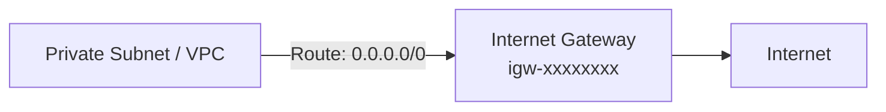

السطر ده معناه: "يا `VPC Router`، أي `traffic` رايح لأي حتة في الإنترنت، ودّيه للـ `Internet Gateway`".

لما بتربط الـ `Route Table` ده بـ `subnet` معين، أنت كده حكمت على الـ `subnet` ده بإنه بقى **`public subnet`**. يعني بقى عنده "مسار" يقدر يوصل منه للإنترنت ويستقبل منه.

**بصريح العبارة:** الـ `Route Table` هو اللي **بيوفر المسار**، مش هو اللي بيخلي الـ `instance` `public`.

---

#### **3. `Public IP` والـ `ENI` - إعطاء عنوان للـ `Instance` على الطريق**

دلوقتي الطريق بقى مفتوح للـ `subnet` كله، بس الـ `traffic` اللي جاي من بره محتاج يعرف هيروح لأنهي `instance` بالظبط. وهنا بيجي دور **الـ `Public IP`** اللي بيتم assign للـ **`ENI`** بتاع الـ `instance`.

**وظيفته:** يشتغل كـ "عنوان" للـ `ENI` بتاعك على الإنترنت. هو اللي بيخلي `ENI` معين قابل للوصول من العالم الخارجي.

**بيشتغل إزاي؟**
الـ `Public IP` ده مش `IP` حقيقي راكب على الـ `ENI` بتاعك، هو مجرد **`1-to-1 NAT`** بيحصل جوه الـ `Internet Gateway` لو دخلت على ec2 هتلاقيه مش شايفاه تمام هي شايفة بس private

*   أما في `NAT Gateway`، بيحصل ما يسمى `many-to-one nating`، ودي قصة تانية، بس خليك فاكر إن الـ `EC2` متعرفش أي حاجة تمامًا عن الـ `Public IP` بتاعها. الـ `traffic` بيوصلها بالـ `Private IP` بتاعها، وهي مش بتشوف الـ `IP` الفعلي بتاع المستخدم اللي طلبها.


لما بتدي `public IP` لـ `ENI`، أنت بتدي أمر للـ `Internet Gateway` يعمل `mapping` بين الـ `Public IP` ده والـ `Private IP` بتاع الـ `ENI`. أي `traffic` يجيلك على الـ `Public IP`، هو بيترجمه ويبعته للـ `Private IP`، والعكس.

**مين اللي بيعمل `assign` للحالة الـ `Public`؟**
أنت اللي بتعمل كده لما بتختار **`Enable Auto-assign public IP`**. باختيارك ده، أنت بتطلب من `AWS` إنها تعمل الـ `NAT mapping` ده للـ `ENI` بتاع الـ `instance` بتاعتك. **إذًا، تخصيص الـ `Public IP` للـ `ENI` هو الفعل اللي بيحول الـ `instance` من `private` لـ `public`**.

**الدليل القاطع:**
لو عملت `SSH` جوه الـ `instance` وشغلت أمر زي `ip address show`، **مستحيل هتلاقي الـ `Public IP` معروض**. نظام التشغيل نفسه مش شايفه ومش عارف عنه أي حاجة. هو مش بيشوف غير الـ `Private IP` اللي على الـ `ENI` بتاعه. اللي بيعرف الـ `Public IP` هو الـ `Internet Gateway` بس.

> [!IMPORTANT]
>
> 
>
> **ملحوظة مهمة: `map_public_ip_on_launch` هو مجرد إعداد افتراضي للـ `Subnet`**
>
> مش شرط وانت بتبني `public subnet` وتخلي `map_public_ip_on_launch = true` إن كل `EC2 instance` هتتعمل جواه **إجباري** يكون عندها `public IP`. السطر ده غلط نفهمه على إنه قاعدة صارمة، هو مجرد **"إعداد افتراضي" (`default setting`)** للـ `subnet` ده.
>
> > ```terraform
> > resource "aws_subnet" "public_subnet_a" {
> > # ...
> > map_public_ip_on_launch = true 
> > # ...
> > }
> > 
> > 
> > ```
> >
>
>
> معنى السطر ده هو: "يا `subnet`، أي `EC2 instance` تتعمل جواك **من غير ما تحددلها صراحة** تاخد `public IP` ولا لأ، اديها واحد بشكل تلقائي".
>
> **ولكن، أنت كـ `engineer` ليك الكلمة الأخيرة** وأنت بتعمل الـ `EC2 instance` نفسها. بتقدر تعمل `override` للإعداد الافتراضي ده بسهولة جدًا في الـ `resource` بتاع `aws_instance`.
>
> > ```terraform
> > resource "aws_instance" "my_secret_server" {
> > ami           = "ami-xxxxxxxx"
> > instance_type = "t2.micro"
> > 
> > subnet_id     = aws_subnet.public_subnet_a.id 
> > associate_public_ip_address = false 
> > }
> > ```
>
> بالرغم من إن الـ `instance` دي (`my_secret_server`) قاعدة جوه `public subnet` الـ `default` بتاعه إنه يدي `public IPs`، إلا إنها هتتولد وهي **`private` تمامًا** ومعندهاش أي `public IP` ومش هتعرف تطلع عن طريق internet gateway
>
> **من اخر**
> خاصية `map_public_ip_on_launch` في الـ `subnet` بتتحكم في "السلوك التلقائي"، لكن خاصية `associate_public_ip_address` في الـ `instance` هي اللي ليها **القرار النهائي**. ده بيديلك مرونة عالية جدًا في إنك تحط أنواع مختلفة من السيرفرات ( `public` و `private`) جوه نفس الـ `public subnet` لو الـ `design` بتاعك احتاج كده.
>
> ممكن تظن إن فكرة إنك تحط instance   تكون private جوه subnet تكون public ده سيناريو مستحيل يحصل أو مالوش لازمة، لكن لو اشتغلت على سيرفرات ألعاب قبل كده هتعرف إن الـ latency بيكون قاتل. في الحالات دي، بنستخدم خاصية في AWS اسمها **Placement Group** وبنديلها قيمة اسمها **cluster**. الخاصية دي بتجبر AWS إنها تحط كل الـ EC2 instances في نفس الـ rack عشان يبقوا قريبين جدًا من بعض والاتصال بينهم يبقى فائق السرعة. لكن القيد بتاعها إن كل الـ instances دي لازم تكون في نفس الـ subnet.
>
> وهنا بتظهر المشكلة: أنا عايز الـ database بتاعتي تكون private عشان الأمان، وباقي سيرفرات اللعبة تكون public عشان اللاعبين يوصلولها، وفي نفس الوقت عايزهم كلهم في نفس الـ subnet عشان الأداء.
>
> وهنا بقى بيبان الدور الحقيقي للقاعدة اللي بتقول "الـ Subnet بيبقى public بسبب الـ Route Table، لكن الـ Instance بتبقى public بسبب ال- Public IP". الحل هو إننا بنبني public subnet واحد بس، وبنحط جواه كل السيرفرات بتاعتنا في نفس الـ placement group. سيرفرات اللعبة بنديلها public IP (associate_public_ip_address = true) عشان تبقى متاحة للاعبين. أما سيرفر الـ Database، فبنحطه في نفس الـ subnet ونفس الـ placement group، لكن بنجبره إنه **ميخدش public IP** (associate_public_ip_address = false).
>
> بالطريقة دي، بنكون حققنا الهدفين اللي كانوا عكس بعض: كل السيرفرات قاعدة جنب بعض والـ latency بينهم شبه معدوم، وفي نفس الوقت سيرفر الـ Database بقى private ومستحيل حد يوصله من الإنترنت، بالرغم من إنه قاعد في subnet طريقه مفتوح للعالم الخارجي.


> [!CAUTION]
>
> فى خبر سار قوي>>>> مفيش internet Gateway فى ipv6 
> مش عارف ليه aws لسله شوية من كثر التسهيلات اللي عملها للمستخدمين عشان ينقلوا ipv6 ومفيش فايدة كل ماسك ipv4
>
> 


---

## **`Route Tables` **

عشان تتحكم في إزاي الـ `traffic` بيدخل (`ingresses`) وبيخرج (`egresses`) وبيتحرك جوه الـ `VPC` بتاعك، أنت محتاج تستخدم `routes` متخزنة في حاجة اسمها **`route tables`**. بدل ما تستخدم `routers` فيزيائية أو افتراضية أنت اللي بتعملها `configure`، الـ `architecture` بتاعة الـ `VPC` بتطبق الـ `IP routing` (توجيه الـ `IP`) كـ `software function` `AWS` بتسميها **`implied router`** وساعات بيسموه `implicit router`.

ده معناه إنه **مفيش `virtual router` حقيقي** تقدر تخش عليه وتعمل `configure` للـ `interface IP addresses` بتاعته أو تشغل عليه `dynamic routing protocols` زي الـ `BGP`. بدل كل ده، كل اللي عليك تعمله هو إنك تدير الـ `route table` اللي الـ `implied router` ده بيستخدمه عشان ياخد قراراته.

كل `route table` بيتكون من `route` واحد أو أكتر، ولازم يكون مربوط على الأقل بـ `subnet` واحد (`subnet association`). فكر في الـ `route table` على إنه متوصل بكذا `subnet` بنفس الطريقة اللي الراوتر التقليدي بيبقى متوصل بيها.

لما بتعمل `VPC`، `AWS` بشكل أوتوماتيكي بتعمل `default route table` (جدول توجيه افتراضي) وبتسميه **`main route table`** وبتربطه بكل `subnet` في الـ `VPC` ده. أنت ممكن تستخدم الـ `main route table` ده، أو تعمل `custom` `route table` (جدول مخصص) أنت اللي بتربطه بنفسك وبشكل يدوي بـ `subnet` واحد أو أكتر.

**الـ `subnet` مينفعش يكون موجود من غير ما يكون مربوط بـ `route table` (`route table association`)**. لو أنت معملتش ربط صريح (`explicitly associate`) لـ `subnet` معين بـ `custom route table` أنت عامله، `AWS` هتربطه بشكل ضمني (`implicitly associate`) بالـ `main route table`.


---

### **`Routes`**

الـ `Routes` هي اللي بتحدد إزاي نوجه الـ `traffic` اللي رايح أو جاي من الـ `resources` اللي جوه الـ `subnets` المرتبطة بالـ `route table`. الـ `IP routing` بيعتمد على الوجهة (`destination-based`)، وده معناه إن قرارات التوجيه بتتاخد بناءً على الـ `destination IP prefix` (عنوان الوجهة) بس، ومش بتبص خالص على الـ `source IP address` (عنوان المصدر).

لما بتيجي تعمل `route` جديد، لازم تحدد العنصرين دول:
*   **`Destination IP prefix`**: وجهة الـ `IP`.
*   **`Target resource`**: الـ `resource` الهدف.

الـ `Destination` لازم يكون `IPv4` أو `IPv6 prefix` مكتوب بصيغة `CIDR`. أما الـ `Target` فلازم يكون `AWS network resource` زي `Internet gateway` أو `ENI`. مينفعش يكون `IP prefix`.

كل `route table` بيكون جواه `local route`بتسمح للـ `instances` اللي في `subnets` مختلفة إنها تكلم بعض. جدول 4.2 بيوريك شكل الـ `route` ده في `VPC` الـ `CIDR` بتاعه `172.31.0.0/16`.

**جدول 4.2: الـ `local route`**
| `Destination`   | `Target` |
| :-------------- | :------- |
| `172.31.0.0/16` | `Local`  |

الـ `local route` ده هو الـ `route` الإجباري الوحيد اللي موجود في كل `route table`. وهو ده اللي بيسمح بالاتصال بين الـ `instances` في نفس الـ `VPC`. وبما إنه مفيش `routes` لأي `IP prefixes` تانية، فأي `traffic` رايح لأي عنوان بره الـ `VPC CIDR range` هيتم إسقاطه (`dropped`).

#### **الـ `Default Route` (قاعدة التوجيه الافتراضية)**

عشان تمكن الوصول للإنترنت للـ `instances` بتاعتك، لازم تعمل `default route` بيشاور على الـ `Internet gateway`. الـ `default route` هو اللي بيسمح للـ `traffic` بتاع الإنترنت إنه يدخل ويخرج من الـ `subnet`. بعد ما تضيف `default route`، هينتهي بيك الحال بالجدول اللي في شكل 4.3.

**جدول 4.3: `Route table` فيه `default route`**
| `Destination` (الوجهة) | `Target` (الهدف)        |
| :--------------------- | :---------------------- |
| `172.31.0.0/16`        | `Local`                 |
| `0.0.0.0/0`            | `igw-0e538022a0fddc318` |

الـ `prefix` اللي هو `0.0.0.0/0` بيشمل كل عناوين الـ `IP` الممكنة، بما فيهم العناوين اللي على الإنترنت. وعشان كده دايمًا بنلاقيه هو الـ `destination` في أي `default route`. أي `subnet` بيكون مربوط بـ `route table` جواه `route` بيشاور على `Internet gateway`، بنسميه **`public subnet`**. وده عكس الـ **`private subnet`**، اللي معندهوش `route` الهدف بتاعه هو `Internet gateway`.

لاحظ إن الـ `prefixes` `0.0.0.0/0` و `172.31.0.0/16` متداخلين (`overlap`). لما الـ `implied router` بيجي يقرر هيوجه الـ `traffic` فين، هو بيوجه بناءً على **التطابق الأدق (`closest match`)**. بمعنى آخر، ترتيب الـ `routes` في الجدول مش مهم.

افترض إن `instance` بعتت `packet` لعنوان على الإنترنت زي `198.51.100.50`. بما إن `198.51.100.50` مش بيطابق الـ `prefix` `172.31.0.0/16` لكنه بيطابق الـ `prefix` `0.0.0.0/0`، الـ `implied router` هيستخدم الـ `default route` وهيبعت الـ `packet` للـ `Internet gateway`.

الـ `documentation` بتاعة `AWS` بتتكلم عن وجود `implied router` واحد لكل `VPC`. مهم تفهم إن الـ `implied router` ده مش موجود فعلًا كـ `resource` منفصل. هو مجرد `abstraction` لوظيفة الـ `IP routing`. ومع ذلك، ممكن يكون مفيد ليك إنك تفكر في كل `route table` على إنه `virtual router` منفصل ومتوصل بـ `subnet` واحد أو أكتر. اتبع الخطوات اللي في `Exercise 4.4` عشان تعمل `Internet gateway` و `default route`.

> [!IMPORTANT]
>
>
> ملحوظة هامة: قاعدة الـ `Longest Prefix Match` - إزاي الـ `Router` بيفكر**
>
> الـ `VPC Router` بيحدد مسار الـ `traffic` بناءً على الـ `Route Table`، لكن إيه اللي بيحصل لو الـ `traffic` ده بيطابق أكتر من `route` في نفس الجدول؟
>
> **المشكلة:**
> تخيل `Route Table` بالمنظر ده:
>
> > ```
> > Destination        Target
> > ------------------------------------
> > 10.0.0.0/16        local
> > 0.0.0.0/0          igw-xxxxxxxx
> > ```
>
> لو `instance` بعتت `packet` لـ `IP` زي `10.0.1.50`، الـ `IP` ده بيقع جوه الـ `range` بتاع `10.0.0.0/16` وفي نفس الوقت بيقع جوه `0.0.0.0/0`. طب الـ `Router` هيختار أنهي طريق؟
>
> **الحل: قاعدة الـ `Longest Prefix Match` (التطابق مع الـ `Prefix` الأطول)**
>
> القاعدة دي هي أساس شغل كل الـ `routers` في العالم، وبتقول:
>
> **"لما يكون فيه أكتر من `route` بيطابق نفس الوجهة، الـ `Router` دايماً بيختار الـ `route` صاحب الـ `prefix` الأطول (يعني الرقم اللي بعد الـ `/` يكون أكبر)، لأنه بيكون هو المسار الأدق والأكثر تحديدًا."**
>
> **تطبيق القاعدة:**
>
> *   **لو الـ `Packet` رايح لـ `10.0.1.50`:**
>     *   بيطابق `10.0.0.0/16` (طول الـ `prefix` هو **16**).
>     *   بيطابق `0.0.0.0/0` (طول الـ `prefix` هو **0**).
>     *   **القرار:** بما إن 16 > 0، الـ `Router` هيختار المسار الأدق وهيوجه الـ `traffic` كـ `local`.
>
> *   **لو الـ `Packet` رايح لـ `8.8.8.8` (جوجل):**
>     *   بيطابق `0.0.0.0/0` بس.
>     *   **القرار:** الـ `Router` هيختار المسار ده وهيوجه الـ `traffic` للـ `Internet Gateway`.
>
> **مثال متقدم يوضح قوة القاعدة:**
>
> لو ضفنا `route` تالت للجدول بتاعنا عشان يكلم `VPC` تاني عن طريق `VPC Peering`:
>
> ```
> Destination                  Target
> ----------------------------------------------------
> 10.0.1.0/24                  pcx-yyyyyyyy  (VPC Peering)
> 10.0.0.0/16                  local
> 0.0.0.0/0                    igw-xxxxxxxx
> ```
>
> دلوقتي لو الـ `packet` رايح لنفس الـ `IP` `10.0.1.50`:
>
> *   الـ `prefixes` المتاحة هي: `/24`، `/16`، `/0`.
> *   **القرار:** الـ `Router` هيختار أطول واحد فيهم، وهو `/24`. إذن، الـ `traffic` المرة دي هيروح للـ `VPC Peering connection`، لأنه هو المسار الأكثر تحديدًا.
>
>
> الـ `VPC Router` مش بيختار أول `route` يقابله، هو بيدور على **أدق `route` يطابق**. القاعدة دي هي اللي بتديك القوة إنك تعمل `routing` معقد، وتعمل "استثناءات" (`overrides`) لقواعد عامة عن طريق إنك تحط قواعد تانية أكثر تحديدًا.

تعالوا ما ناخد الامثلة ونجربها قبل ما نخش على الجزء اللي بعده 

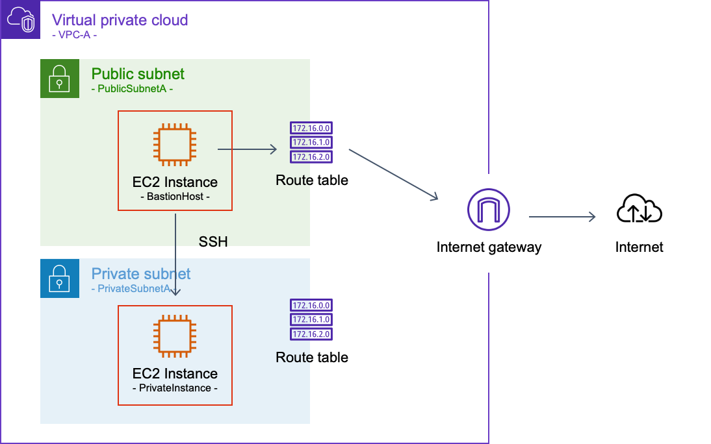

دلوقتي عايز اعمل vpc بكل بساطة 

```terraform
resource "aws_vpc" "vpc_a" {
  cidr_block           = "10.15.0.0/16"
  enable_dns_support   = true
  enable_dns_hostnames = true

  tags = {
    Name = "VPC-A"
  }
}
```

دلوقتي هنعمل subnet

```terraform
resource "aws_subnet" "public_subnet" {
  vpc_id                  = aws_vpc.vpc_a.id
  cidr_block              = "10.0.1.0/24"
  availability_zone       = "eu-west-1a" 
  map_public_ip_on_launch = true 
  tags = {
    Name = "Public-Subnet-A"
  }
}
resource "aws_subnet" "private_subnet_a" {
  vpc_id            = aws_vpc.vpc_a.id
  cidr_block        = "10.0.2.0/24"
  availability_zone = "eu-west-1a" 

  tags = {
    Name = "Private-Subnet-A"
  }
}

```

خلي بالك مش دي الطريقة اللي فى العادي بننده بيه على availability_zone 

مثلا اشهر شكل مثلا 

``` 
data "aws_availability_zones" "AZs" {
  all_availability_zones = true
  state = "available"

}
output "just" {
  value = data.aws_availability_zones.AZs.names[0]
}
```

هنا بدل ما انت تعوز تغير region كل شوية توجع دماغك بتغيير az ﻻ كده هيحصل بشكل تلاقائي وانضف

```terraform
resource "aws_subnet" "public_subnet" {
  vpc_id                  = aws_vpc.vpc_a.id
  cidr_block              = "10.15.1.0/24"
  availability_zone = data.aws_availability_zones.AZs.names[0]
  map_public_ip_on_launch = true 
  tags = {
    Name = "Public-Subnet-A"
  }
}
resource "aws_subnet" "private_subnet_a" {
  vpc_id            = aws_vpc.vpc_a.id
  cidr_block        = "10.15.2.0/24"
  availability_zone =data.aws_availability_zones.AZs.names[0]

  tags = {
    Name = "Private-Subnet-A"
  }
}

```

وفى برضه طريقة انضف بكتير لتعامل مع IP بدل شغل الافراح اللي احنا بنكتبه لو حبيت تغير ip او هتطضر تلف على كل subnet ودا فراغ ملوش لازمة 

بتستخدم cidrsubnet

```
cidrsubnet(base_cidr, newbits, netnum)

```

**`base_cidr`**

- هو الـ CIDR الأساسي اللي هتبدأ منه (مثلاً `aws_vpc.vpc_a.cidr_block` اللي هو `"10.15.0.0/16"`).

**`newbits`**

- عدد الـ bits الإضافية اللي هتزودها على الـ prefix علشان تقسّم الشبكة.
- مثال:
  - VPC `/16` يعني أول 16 bit ثابتة، والباقي متاح للتقسيم.
  - لو أضفت **8 bits** (`newbits = 8`) → هيبقى `/24` (لأن 16 + 8 = 24).
  - ده معناه إن كل subnet فيها 256 IP addresses (منهم usable حوالي 254).

**`netnum`**

- رقم الشبكة الفرعية اللي عايزها.
- بترقيم يبدأ من **0**، كل رقم بيولّد subnet مختلفة.
- مثال مع `"10.15.0.0/16"` و `newbits = 8`:
  - `netnum = 0` → `10.15.0.0/24`
  - `netnum = 1` → `10.15.1.0/24`
  - `netnum = 2` → `10.15.2.0/24`
  - وهكذا.

مثال

```
VPC 10.15.0.0/16 إلى /24 subnets
cidrsubnet("10.15.0.0/16", 8, 0) → 10.15.0.0/24
cidrsubnet("10.15.0.0/16", 8, 1) → 10.15.1.0/24
cidrsubnet("10.15.0.0/16", 8, 2) → 10.15.2.0/24
```


```terraform
resource "aws_subnet" "public_subnet_a" {
  vpc_id                  = aws_vpc.vpc_a.id
  cidr_block              = cidrsubnet(aws_vpc.vpc_a.cidr_block, 8, 0)
  availability_zone       = data.aws_availability_zones.AZs.names[0]
  map_public_ip_on_launch = true 
  tags = {
    Name = "Public-Subnet-A"
  }
}

resource "aws_subnet" "private_subnet_a" {
  vpc_id            = aws_vpc.vpc_a.id
  cidr_block        = cidrsubnet(aws_vpc.vpc_a.cidr_block, 8, 1)
  availability_zone = data.aws_availability_zones.AZs.names[0]
  tags = {
    Name = "Private-Subnet-A"
  }
}

```

هروح انشاء internet getway

```terraform
resource "aws_internet_gateway" "igw" {
  vpc_id = aws_vpc.vpc_a.id

  tags = {
    Name = "VPC-A-IGW"
  }
}
```


عشان نسمح للـ `EC2 instances` اللي في الـ `public subnet` إنها توصل للإنترنت، العملية بتتم على خطوتين: الأول بنبني "الخريطة" (`Route Table`)، وبعدين بنقول لأنهي `subnet` يستخدم الخريطة دي.

**`aws_route_table`**

بنعمل `Route Table` جديد باستخدام الـ `resource` ده، وبنحط جواه القاعدة اللي بتفتح الطريق للإنترنت.

```terraform
resource "aws_route_table" "public_rt" {
  vpc_id = aws_vpc.vpc_a.id


  route {

    destination_cidr_block = "0.0.0.0/0"
    

    gateway_id             = aws_internet_gateway.igw.id
  }

  tags = {
    Name = "Public-Route-Table"
  }
}
```

الكود ده بيعمل `Route Table` جديد وجاهز، لكن لحد دلوقتي هو مجرد "خريطة" موجودة في الدرج، ومفيش أي `subnet` بيبص عليها أو بيستخدمها.

> **ملحوظة هامة: الـ `Local Route` الضمني**
> أنت ملاحظ إننا مكتبناش أي `route` عشان نخلي الـ `subnets` تكلم بعضها جوه الـ `VPC`؟ ده لأن الـ `route` ده (`local route`) بيتعمل بشكل أوتوماتيكي وإجباري من `AWS` أول ما بتعمل أي `Route Table`، وهو اللي بيضمن إن الـ `traffic` جوه الـ `VPC` يفضل `local`.
>
> دي صورة بتوريك قبل ما انشاء internet gateway وقبل ما اعمل اي حاجة فقط 2 subnets و vpc 
>
> 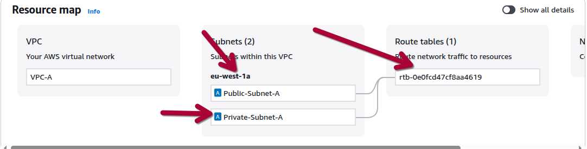

---

**الخطوة الثانية (الأهم): تطبيق routing table على الـ**

`Subnet` (`aws_route_table_association`)

وهنا بيجي الجزء اللي أنت ضفته، وهو ده اللي بيخلي كل حاجة تشتغل. بعد ما عملنا الـ `Route Table`، لازم `associate` بالـ `subnet` اللي إحنا عايزينه يبقى `public`.

```terraform
resource "aws_route_table_association" "public_assoc" {
  subnet_id      = aws_subnet.public_subnet.id
  route_table_id = aws_route_table.public_rt.id
}
```

الـ `resource` ده هو "الوصلة" أو "الرابط". هو اللي بيقول للـ `VPC Router`:
**"لو سمحت، أي `traffic` طالع من الـ `public_subnet` ده بالذات، خليه يمشي على القواعد اللي في الـ `public_rt` ده."**

من غير الـ `association` ده، الـ `public_subnet` هيفضل مرتبط بالـ `Main Route Table` الافتراضي بتاع الـ `VPC`، اللي هو بطبيعته معندوش طريق للإنترنت، وبالتالي الـ `subnet` هيفضل `private` ومش هيعرف يطلع نت. **إذًا، الـ `association` هو الفعل اللي بيحول الـ `subnet` من `private`  لـ `public` فعليًا.**

---

### **شكل الـ `Route Table` النهائي في `AWS Console`**

بعد ما `Terraform` بينفذ الكودين دول مع بعض، لو روحت فتحت الـ `public_rt` من الـ `AWS Console`، هتلاقي شكله بالظبط عامل كده:

| `Destination`     | `Target`       |
| :---------------- | :------------- |
| **`10.0.0.0/16`** | **`local`**    |
| `0.0.0.0/0`       | `igw-xxxxxxxx` |

*   **السطر الأول (`local route`):** ده اللي `AWS` ضافته لوحدها.
*   **السطر التاني (`default route`):** ده اللي أنت ضفته بنفسك في `aws_route_table`.

ولو رحت على تاب الـ `Subnet Associations` بتاع نفس الـ `Route Table`، هتلاقي الـ `public_subnet` بتاعك مربوط بيه.

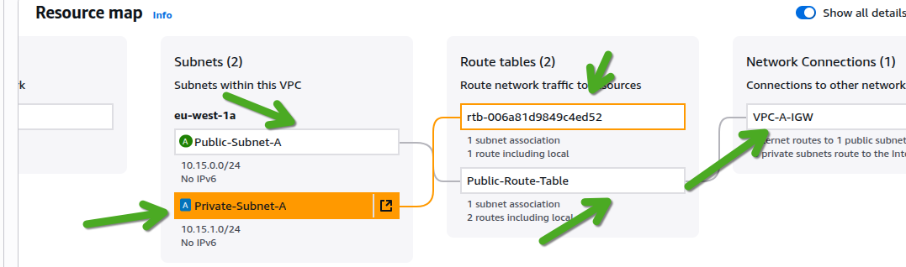

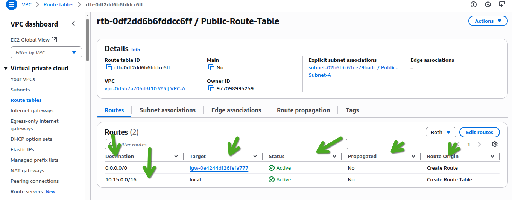

---

> [!TIP]
>
> ملحوظة: فهم  الـ`Routes`
>
> بجانب `Destination` و `Target` اللي أنت بتتحكم فيهم، الـ `Route Table` بيعرض أعمدة تانية مهمة بتديلك معلومات عن حالة ومصدر كل `route`. الأعمدة دي للقراءة فقط (`read-only`) وأنت مش بتعدلها مباشرة، لكنها بتساعدك تفهم شبكتك شغالة إزاي:
>
> *   **`Status` (الحالة):**
>     ده مؤشر صحة الـ `route`.
>     *   **`Active`:** بتدل على إن الـ `route` ده سليم والـ `target` بتاعه (زي الـ `IGW`) موجود وشغال حاليًا.
>     *   **`Blackhole`:** بتدل على إن الـ `route` ده بايظ. ده بيحصل لما الـ `target` اللي كان بيشاور عليه يتمسح. أي `traffic` بيطابق الـ `route` ده هيتم إسقاطه (`dropped`).
>
> *   **`Propagated`:**
>     ده بيوضح إذا كان الـ `route` ده `static` ولا `dynamic`.
>     *   **`No`:** بتدل على إن ده `static route` أنت اللي كتبته بنفسك يدويًا (سواء من الـ `Console` أو `Terraform`).
>     *   **`Yes`:** بتدل على إن ده `dynamic route` الـ `VPC` بتاعك اتعلمه أوتوماتيك من شبكة تانية (زي شبكة شركتك) عن طريق `VPN` أو `Direct Connect` باستخدام بروتوكول `BGP` لحظ ان local
>
> *   **`Route Origin` (أصل الـ `Route`):**
>     ده بيقولك بالظبط الـ `route` ده اتعمل إزاي.
>     *   **`Create Route`:** بتدل على إنك أنت اللي عملت الـ `route` ده.
>     *   **`Create Route Table`:** بتدل على إن ده الـ `local route` اللي `AWS` بتعمله أوتوماتيك مع أي `Route Table` جديد.
>     *   **`Enable VGW route propagation`:** بتدل على إن الـ `route` ده جاي من الـ `BGP` عن طريق الـ `Virtual Private Gateway`.
>
> فهم الأعمدة دي بيساعدك جدًا في الـ `troubleshooting` عشان تعرف بسرعة هل الـ `route` بتاعك شغال، وهل هو `static` ولا جاي من شبكة تانية.

> [!TIP]
>
> 
>
>
> ملحوظة: إزاي الـ `VPC` "بيتعلم" `Routes` أوتوماتيك؟ (فكرة الـ `Dynamic Routing`)**
>
> فكرة إن الـ `Route Table` "يتعلم" `route` جديد لوحده بتيجي من عالم الـ `Dynamic Routing Protocols`، وأشهرهم هو **`BGP (Border Gateway Protocol)`**. ده البروتوكول اللي الإنترنت كله قايم عليه، وهو اللي بيخلي الـ `routers` تكلم بعضها وتقول لبعض "أنا أعرف أوصل للشبكات دي".
>
> **إمتى وأزاي بتحصل في `AWS`؟**
>
> الحكاية دي بتحصل لما بتربط الـ `VPC` بتاعك بشبكة تانية كبيرة (زي شبكة شركتك `on-premises`) باستخدام **`AWS Direct Connect`** أو **`Site-to-Site VPN`** (النوع الـ `dynamic`).
>
> **السيناريو كالتالي:**
>
> 1.  **بتوصل الشبكتين:** بيكون عندك `router` في شركتك، و `Virtual Private Gateway (VGW)` أو `Transit Gateway (TGW)` في `AWS`.
> 2.  **بتشغل `BGP`:** الـ `engineers` بتوع الشبكات بيعملوا `configure` للـ `BGP` بين الراوتر بتاع الشركة والـ `Gateway` بتاع `AWS`.
> 3.  **الراوتر بتاع شركتك "بيعلن" عن شبكاته (`Advertising Routes`):** الراوتر بتاعك بيبدأ يبعت رسائل `BGP` للـ `Gateway` بتاع `AWS` ويقوله:
>       "أنا الراوتر بتاع شركة X، ودي الشبكات اللي تحت إدارتي وأعرف أوصلها: `192.168.1.0/24`, `192.168.2.0/24`, ...إلخ".
> 4.  **الـ `Gateway` بتاع `AWS` "بيتعلم" الـ `Routes`:** الـ `Gateway` بيستقبل الإعلانات دي و"بيصدقها"، وبيفهم إن عشان يوصل للشبكات دي، لازم يرمي الـ `traffic` للراوتر بتاع شركتك.
> 5.  **الـ `Gateway` "بينشر" اللي اتعلمه (`Route Propagation`):**
>       أنت بتروح على الـ `Route Table` بتاع الـ `subnet` اللي عايز تكلمه، وبتفعل خاصية اسمها **`Route Propagation`** وبتربطها بالـ `Gateway` ده.
>       بمجرد ما تعمل كده، الـ `Gateway` بيروح **يزرع أوتوماتيك** كل الـ `routes` اللي هو لسه متعلمها دي جوه الـ `Route Table` بتاعك.
>
> بتلاقي الـ `Route Table` بتاعك اتملا `routes` جديدة أنت مكتبتهاش بإيدك، وجنبها مكتوب **`Propagated: Yes`**. دي هي الـ `routes` اللي الـ `VPC` بتاعك "اتعلمها" من شبكة الشركة. العملية دي ديناميكية، يعني لو الـ `network engineer` في شركتك ضاف شبكة جديدة، هي هتظهر أوتوماتيك في الـ `Route Table` بتاعك من غير أي تدخل منك.
>
> لسه هنكلم AWS Direct Connect و هنلكم Transit Gateway (TGW)


هكمل وحط ec2 وحط security group وخلاص وبكده تبقى تمام 

```terraform
data "aws_ami" "amazon_linux_2" {
  most_recent = true
  owners      = ["amazon"]

  filter {
    name   = "name"
    values = ["amzn2-ami-hvm-*-x86_64-gp2"]
  }
}

resource "tls_private_key" "ssh_key" {
  algorithm = "ED25519"
}

resource "aws_key_pair" "ssh_key" {
  key_name   = "my_ssh_key_of_ec2"
  public_key = tls_private_key.ssh_key.public_key_openssh
}

resource "local_file" "ssh_key" {
  content         = tls_private_key.ssh_key.private_key_pem
  filename        = "${path.root}/my_ssh_key_of_ec2.pem"
  file_permission = "0400"
}


resource "aws_security_group" "sg_ssh" {
  vpc_id      = aws_vpc.vpc_a.id
  name        = "ssh_security_group"
  description = "Allow SSH access"

  ingress {
    from_port   = 22
    to_port     = 22
    protocol    = "tcp"
    cidr_blocks = ["0.0.0.0/0"]
  }

  egress {
    from_port   = 0
    to_port     = 0
    protocol    = "-1"
    cidr_blocks = ["0.0.0.0/0"]
  }
}

resource "aws_instance" "bastion_hosting" {
  ami                    = data.aws_ami.amazon_linux_2.id
  instance_type          = "t2.micro"
  key_name               = aws_key_pair.ssh_key.key_name
  subnet_id              = aws_subnet.public_subnet_a.id
  vpc_security_group_ids = [aws_security_group.sg_ssh.id]

  tags = {
    Name = "bastion hosting"
  }
}


resource "aws_instance" "private_instance" {
  ami                    = data.aws_ami.amazon_linux_2.id
  instance_type          = "t2.micro"
  key_name               = aws_key_pair.ssh_key.key_name
  subnet_id              = aws_subnet.private_subnet_a.id
  vpc_security_group_ids = [aws_security_group.sg_ssh.id]

  tags = {
    Name = "private instance"
  }
}

```

طيب، دلوقتي عشان نعمل access للـ EC2 instance اللي هي private، الطريقة اللي ممكن تيجي في دماغ أي حد هي إنه يعمل SSH على خطوتين: مرة من جهازه للـ bastion_host ، وبعد ما يخش جواه، يروح عامل SSH مرة تانية منه للـ private_instance .

الطريقة دي بتشتغل، لكنها مش عملية خالص (clunky) وبتحتاج تنقل الـ private key بتاعك وتحطه على الـ bastion_host، ودي تعتبر bad security practice.

**الحل الأنضف والأكثر سلاسة هو إننا نستخدم SSH Tunnel.**


الصورة دي بتوضح فكرة الـ SSH Tunnel بشكل ممتاز، وعشان نفهمها صح، خلينا نطبقها على الـ use case بتاعنا في AWS. تخيل إن الـ **Blue Server** هو جهازك ، والـ **Red Server** هو الـ Bastion Host اللي موجود في الـ Public Subnet، والـ **Green Server** هو الـ Private Instance اللي عايزين نوصلها في الـ Private Subnet.

العملية كلها بتبدأ لما بتشغل أمر SSH من جهازك المحلي عشان تفتح tunnel آمن ومشفر مع الـ Bastion Host على port 22. لكن الأمر ده مش مجرد SSH عادي، إحنا بنضيف جواه خاصية Local Port Forwarding، ودي بتعمل حاجتين: بتفتح port  على جهازك أنت (في الصورة port 8080)، وبتربط الـ port ده بـ target بـ port 80 بـGreen server جوه شبكة AWS بحيث لما طلب يطلع على port 80 من جهازك اللي هو blue يتحرك على ssh tunnel  وبعده ssh service على red server وتوجه للـGreen Server كأن port 8080  هو بزبط port 80 على red server

بعد ما الـ tunnel ده يتفتح، أي application على جهازك، زي kubectl أو متصفح الويب، لما يبعت traffic للعنوان localhost:8080، نظام التشغيل بتاعك مش بيطلعه على الإنترنت، لكن بيرميه مباشرة جوه الـ SSH Tunnel المشفر. الـ tunnel ده بينقل الـ traffic بأمان لغاية ما يوصل للـ Bastion Host.

أول ما الـ traffic بيوصل للـ Bastion Host، الـ SSH service اللي عليه بتفهم إن الـ traffic ده جزء من الـ tunnel، وإنها لازم توجهه للـ target اللي إحنا حددناه وإحنا بنفتح الـ tunnel. في مثال الصورة، الـ target هو الـ Green Server على port 80. فالـ Bastion Host بياخد الـ traffic ده ويوصله للـ Private Instance باستخدام الـ private IP بتاعها.

باختصار، الـ SSH Tunnel بيعمل كوبري آمن من جهازك، بيعدي من خلال الـ Bastion Host، وبيوصل مباشرة لأي سيرفر في الـ Private Subnet، كأنك بتكلمه من جوه شبكة AWS بالظبط.

فى مثلانا بقى 


```
ssh -i ./my_ssh_key_of_ec2.pem -N -L 2222:10.15.1.124:22 ec2-user@54.247.235.182
```

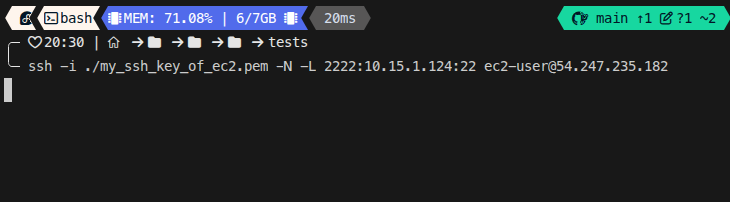

هنا انا خليت يفتح على جهازي port 2222 بحيث اي حاجة تطلع منه تطلع عن طريق tunnel للـbastion_hosting ومنه بيفتح port 22 هلى bastion_hosting 

دلوقتي Port 2222 على جهاز بقى port 22 على bastion_hosting اي حاجة رايح او جيه هتتنقل مباشرة طالما جي من ip اللي محدده وهتروح مباشر للـip 10.15.1.124

دلوقتي عشان اعمل access بـssh على جهازي من private 

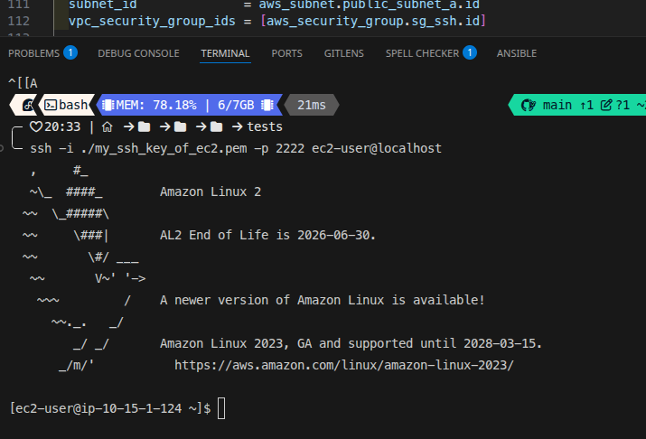

ليه localhost خلاص port 22 في جهاز bastion_hosting بقى هو port 2222 فى جهازي طب هيعرف ازاي انه الجهاز ده انا محددد فوق فى ssh tunnel 

> [!NOTE]
>
>  **Bastion Host دا مصطلح تقنى مش جي من دماغي**، أو زي ما بيتسمى ساعات **Jump Box** أو **Jump Server**، هو ببساطة EC2 instance عادي بنحطه في شبكة ليها وصول مباشر للإنترنت (يعني في Public Subnet).
>
> الهدف الأساسي منه إنه يكون هو النقطة الوحيدة اللي من خلالها بنقدر نعمل SSH أو RDP على الـ instances التانية اللي موجودة في شبكة داخلية معزولة (يعني في Private Subnet). الـ instances دي مش المفروض حد يوصلها من الإنترنت مباشرة عشان الأمان.
>
> فبدل ما نفتح بورتات (ports) على كل الـ instances بتاعتنا ونعرضها للخطر، بنفتح البورت ده على الـ Bastion Host بس. ومنه بنقدر jump على أي instance تاني جوه الشبكة الخاصة. ده بيخلي التحكم في الأمان والمراقبة أسهل بكتير لأننا بنركز على تأمين نقطة دخول واحدة بس.


### **AWS Systems Manager Session Manager**

ده يعتبر الحل الأحدث والأفضل اللي AWS بتنصح بيه بشدة.

**الفكرة:** أنت **مش محتاج تفتح port 22 (SSH) أصلًا** في أي Security Group. أنت مش محتاج SSH keys، ومش محتاج Bastion Host.

**بيشتغل إزاي؟**

1. **بتسطب SSM Agent:** الـ agent ده بيكون متسطب بشكل افتراضي على معظم الـ AMIs الحديثة بتاعة Amazon Linux و Ubuntu و Windows.

2. **بتعمل IAM Role:** بتعمل IAM role بتدي للـ EC2 instance بتاعتك صلاحية إنها تكلم خدمة Systems Manager (SSM).

3. **بتوصل عن طريق SSM:** دلوقتي، بدل ما تعمل SSH، أنت بتستخدم AWS CLI (أو الـ AWS Console) عشان تطلب من SSM يفتحلك session على الـ instance دي.

   - **الأمر في الـ CLI:**

     codeBash

     ```
     aws ssm start-session --target <instance-id>
     ```


**إيه اللي بيحصل ورا الكواليس؟**

- الـ SSM Agent اللي على الـ instance بيعمل اتصال **outbound** (من جوه لبره) على port 443 (HTTPS) وبيفضل فاتح قناة اتصال آمنة مع خدمة SSM بتاعة AWS.
- اللي هي Systems Manager 
- لما أنت بتشغل أمر start-session، AWS بتستخدم channel دي عشان تدخلك على الـ shell بتاع الـ instance.

**ليه الحل ده هو الأفضل؟**

- **الأمان المطلق:** أنت **مش فاتح أي inbound ports** على الـ instances بتاعتك. مفيش port 22 مفتوح للعالم، فمفيش أي فرصة لهجمات الـ brute-force على الـ SSH.
- **إدارة مركزية (Centralized Management):** كل حاجة بتتم من خلال IAM. بتقدر تحدد مين بالظبط يقدر يخش على أنهي instance.
- **تدقيق كامل (Auditing):** كل session وكل أمر بيتكتب جواها ممكن يتسجل ويتخزن في CloudWatch Logs أو S3. بيبقى عندك سجل كامل بكل حاجة حصلت.
- **سهولة الاستخدام:** مش محتاج تدير SSH keys أو Bastion Hosts.


الـ SSM Agent اللي شغال جوه الـ EC2 instance بتاعتك هو مجرد software عادي. هو مش بيعرف  إنه تبع حسابك على AWS. عشان يشتغل صح، هو محتاج يكلم خدمة ssm ويعرفها بنفسه ويقولها "أنا الـ agent اللي على الـ instance الفلانية، وعايز أعمل كذا وكذا".

- أول حاجة بنعملها هي الـ **IAM Role** نفسه. الـ Role ده  اللي هنديها للـ instance. أهم جزء في الـ Role هو الـ **assume_role_policy** (وساعات بنسميها Trust Policy).


الـ Trust Policy دي بتجاوب على سؤال واحد بس: **"مين اللي مسموح له يلبس يستخدام role دي ؟"** 

```terraform
resource "aws_iam_role" "ec2_ssm_role" {
  name = "ec2-ssm-role"

  assume_role_policy = jsonencode({
    Version = "2012-10-17",
    Statement = [
      {
        Action = "sts:AssumeRole",
        Effect = "Allow",
        Principal = {

          Service = "ec2.amazonaws.com"
        }
      }
    ]
  })
}

```

**الخطوة الثانية:(aws_iam_role_policy_attachment)**

دلوقتي بعد ما عملنا "ROLE"، لازم نلزق عليها "POLICES" اللي بتقول  دي مسموح له يعمل إيه. هنا بيجي دور الـ **Permissions Policy**.

AWS مريحانا وعاملة policy جاهزة اسمها **AmazonSSMManagedInstanceCore**. الـ policy دي هي اللي فيها كل التصاريح اللي الـ SSM Agent محتاجها عشان يشتغل. هي بتسمحله يعمل حاجات محددة جدًا زي:

- ssm:UpdateInstanceInformation: عشان الـ agent يبلغ خدمة SSM إنه online وحالته إيه.
- ssmmessages:CreateControlChannel: عشان يفتح قناة الاتصال الآمنة اللي الـ session هتمشي فيها.
- ec2messages:AcknowledgeMessage: عشان يتواصل مع خدمات EC2 الداخلية.
- وغيرها من الصلاحيات اللازمة عشان يسجل نفسه ويتلقى الأوامر.

إحنا بنربط الـ policy الجاهزة دي بالـ Role بتاعنا باستخدام resource اسمه aws_iam_role_policy_attachment:


```terraform
resource "aws_iam_role_policy_attachment" "ssm_policy_attachment" {
  role       = aws_iam_role.ec2_ssm_role.name
  policy_arn = "arn:aws:iam::aws:policy/AmazonSSMManagedInstanceCore"
}
```


**الخطوة الثالثة: (aws_iam_instance_profile)**

EC2 مش بتتعامل مع الـ Roles مباشرة، هي بتتعامل مع حاجة اسمها **Instance Profile**.

```TERRAFORM
resource "aws_iam_instance_profile" "ec2_ssm_profile" {
  name = "ec2-ssm-instance-profile"
  role = aws_iam_role.ec2_ssm_role.name
}
```

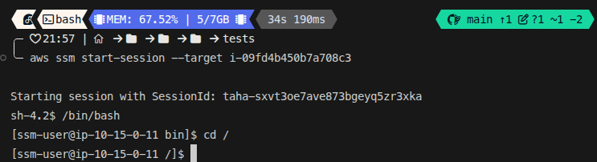

او من هنا 
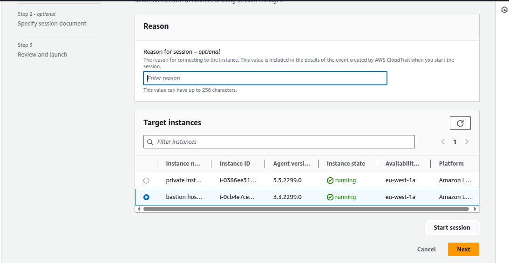

او من هنا

وممكن كما من عند ec2 dashboard


> [!IMPORTANT]
>
> **ليه الـ SSM بيحتاج NAT Gateway في الـ Private Subnet بالذات؟**
>
> **الحالة الأولى: EC2 instance في Public Subnet**
>
> - **الاتصال:** الـ instance دي بيكون عندها Public IP، والـ Route Table بتاعها بيشاور على Internet Gateway.
> - **الـ SSM Agent:** بيقدر يكلم سيرفرات SSM على الإنترنت **مباشرة** عن طريق الـ Internet Gateway.
> - **النتيجة:** **مش محتاج NAT Gateway هنا خالص**. الـ SSM بيشتغل على طول (طبعًا لو الـ IAM Role موجود).
>
> 
>
> **الحالة الثانية (وهي الأهم): EC2 instance في Private Subnet**
>
> - **الاتصال:** الـ instance دي معندهاش Public IP، والـ Route Table بتاعها مش بيشاور على Internet Gateway. هي **محبوسة** جوه الـ VPC.
> - **مشكلة الـ SSM Agent:** الـ Agent اللي جواها محتاج يوصل للإنترنت عشان يكلم سيرفرات SSM ويسجل نفسه. لكنه مش هيعرف لأنه محبوس.
>
> **وهنا بيجي دور الـ NAT Gateway كحل إجباري:**
>
> الـ NAT Gateway هو "الواسطة" اللي بتنقذ الموقف. هو بيعمل الآتي:
>
> 1. **بيوفر "طريق خروج":** بنحط route في الـ Private Route Table بيقول "أي traffic عايز يطلع نت، وديه للـ NAT Gateway".
> 2. **بيوفر "هوية عامة":** الـ NAT Gateway نفسه عنده Public IP (الـ Elastic IP بتاعه).
>
> **إيه اللي بيحصل لما الـ SSM Agent بيشتغل؟**
>
> 1. 
> 2. الـ SSM Agent اللي على الـ private instance بيبعت request عشان يكلم سيرفرات SSM على الإنترنت.
> 3. الـ request ده بيروح للـ NAT Gateway (بسبب الـ route اللي حطيناه).
> 4. الـ NAT Gateway بياخد الـ request ده، وبيعمل NAT (بيغير IP المصدر للـ Public IP بتاعه هو)، وبيطلعه على الإنترنت عن طريق **الـ Internet Gateway** (لأن الـ NAT Gateway نفسه قاعد في public subnet).


### **`Security Groups` - الفايروول بتاع كل كارت شبكة**

بص ياباشا، الـ **`Security Group`** ده هو الـ `firewall` الافتراضي اللي بيشتغل كطبقة أمان أساسية على الـ `EC2 instances` بتاعتك، وبيتحكم في كل ال- `traffic` اللي داخل واللي خارج. وبشكل أدق، الـ `Security Group` مش بيتركب على الـ `instance` نفسها، هو بيتركب على كروت الشبكة بتاعتها، اللي هي الـ **`Elastic Network Interfaces (ENIs)`**.

القاعدة الأساسية اللي شغال بيها هي "المنع هو الأصل". يعني هو بيمنع كل حاجة بشكل افتراضي، وأنت اللي لازم تروح بنفسك وتضيف "قواعد" (`rules`) عشان تسمح بالـ `traffic` اللي أنت عايزه يعدي. لما بتعمل `Security Group` جديد، بينزل من غير أي قواعد دخول، فبيضمن إن محدش يعرف يكلم السيرفر بتاعك.

كل `ENI` لازم يكون مربوط على الأقل بـ `Security Group` واحد. وبما إن معظم السيرفرات بيبقى ليها `ENI` واحد بس، فالناس بتقول "الـ `Security Group` بتاع السيرفر". لكن لما بتركب كذا `ENI` على نفس السيرفر، لازم تاخد بالك إن كل `ENI` فيهم ممكن يكون ليه `Security Group` مختلف تمامًا بقواعد مختلفة، وده بيديلك تحكم دقيق جدًا في الـ `traffic`.

النظام ده مرن فشخ. الـ `ENI` الواحد ممكن تركب عليه أكتر من `Security Group` (لغاية 5)، وفي نفس الوقت، الـ `Security Group` الواحد ممكن تركبه على عدد لا نهائي من الـ `ENIs`. ده بيخليك تقدر تعمل `Security Group` واحد مثلاً لكل الـ `web servers` بتاعتك وتطبقه عليهم كلهم عشان توحد قواعد الأمان.

### **Inbound Rules - تحديد مين مسموح له يكلم السيرفر بتاعك**

الـ **Inbound Rules** هي  بتاعة الـ Security Group، وهي اللي بتتحكم في مين مسموح له **يبدأ اتصال** بالسيرفر بتاعك. بما إن الـ Security Group بيمنع كل حاجة بشكل افتراضي، فأنت لازم تعمل rule لكل نوع traffic عايز تسمح بيه. أي قاعدة دخول بتتكون من 3 عناصر أساسية: **Source** (مين اللي مسموح له يكلمك؟)، **Protocol** (نوع الاتصال إيه؟ زي TCP أو UDP)، و **Port Range** (على أنهي port مسموح له يكلمك؟).

كمثال عملي، تخيل عندك web server عايز الناس تشوف الموقع بتاعه، وفي نفس الوقت أنت محتاج تخش عليه SSH عشان تديره. هنا هتحتاج تعمل قاعدتين مختلفتين. القاعدة الأولى هتفتح **port 443** (بتاع HTTPS) وتخلي الـ Source بتاعها هو **0.0.0.0/0**، وده معناه "اسمح لأي IP في العالم إنه يفتح الموقع بتاعي". أما القاعدة التانية، فعشان الأمان، هتفتح **port 22** (بتاع SSH) وتخلي الـ Source بتاعها هو الـ IP بتاعك أنت بس (مثلاً **198.51.100.10/32**)، وده معناه "اسمح للـ IP بتاعي أنا بس إني أعمل SSH".

| `Source`           | `Protocol` | `Port Range` | الوصف                                      |
| :----------------- | :--------- | :----------- | :----------------------------------------- |
| `0.0.0.0/0`        | `TCP`      | `443`        | اسمح لأي حد في العالم يفتح الموقع بتاعي.   |
| `198.51.100.10/32` | `TCP`      | `22`         | اسمح للـ `IP` بتاعي أنا بس إني أعمل `SSH`. |

**ملحوظة مهمة جدًا:** ترتيب القواعد دي مش مهم خالص. AWS بتبص على كل القواعد اللي أنت حاططها، ولو لقت أي قاعدة واحدة بس بتطابق الـ traffic اللي جاي، بتسمح له يعدي على طول.


### **مثال `Terraform`**

ده كود `Terraform` اللي بيبني `Security Group` بنفس القواعد اللي في الجدول اللي فوق بالظبط:

```terraform
resource "aws_security_group" "web_server_sg" {
  name        = "web-server-sg"
  description = "Allow HTTPS and SSH access"
  vpc_id      = aws_vpc.main.id 


  ingress {
    description = "Allow HTTPS traffic from anywhere"
    from_port   = 443
    to_port     = 443
    protocol    = "tcp"
    cidr_blocks = ["0.0.0.0/0"]
  }


  ingress {
    description = "Allow SSH traffic from my IP only"
    from_port   = 22
    to_port     = 22
    protocol    = "tcp"

    cidr_blocks = ["198.51.100.10/32"] 
  }


  tags = {
    Name = "WebServer-SG"
  }
}
```


---

### **`Outbound Rules` - تحديد السيرفر بتاعك مسموح له يكلم مين**

الـ **`Outbound Rules`** هي "قايمة السماح بالخروج" بتاعة الـ `Security Group`. هي اللي بتتحكم في الـ `traffic` اللي **طالع من** السيرفر بتاعك ومسموح له يروح فين. زي الـ `Inbound Rules` بالظبط، أي قاعدة خروج بتتكون من 3 عناصر أساسية:
1.  **`Destination` (الوجهة):** السيرفر بتاعك مسموح له يكلم أنهي `IPs`؟
2.  **`Protocol` (البروتوكول):**
3.  **`Port Range` (مدى البورتات):**

في معظم الحالات، قواعد الخروج بتكون أقل تقييدًا بكتير من قواعد الدخول. وعشان تسهل عليك، `AWS` بشكل أوتوماتيكي بتحطلك قاعدة خروج افتراضية أول ما بتعمل أي `Security Group` جديد.

القاعدة الافتراضية دي بتكون بالمنظر ده:

| `Destination` | `Protocol` | `Port Range` | الوصف                                               |
| :------------ | :--------- | :----------- | :-------------------------------------------------- |
| `0.0.0.0/0`   | `All`      | `All`        | اسمح للسيرفر ده يكلم أي حد في أي حتة على أي `port`. |

**الهدف الأساسي من القاعدة دي** هو إنها تسمح للـ `instance` بتاعتك إنها توصل للإنترنت عشان تعمل `download` للـ `updates` (زي `apt update`)، أو تكلم خدمات `AWS` التانية، أو تتصل بأي `API` خارجي. أنت ممكن تمسح القاعدة دي، لكن لو عملت كده، الـ `Security Group` هيمنع الـ `instance` بتاعتك إنها تكلم الإنترنت أو أي حاجة تانية بره، وهتبقى محبوسة تمامًا (إلا لو عملت قواعد خروج تانية أكثر تحديدًا).

---
### 

#### **1. `Terraform` بالـ `Outbound Rule` الافتراضية:**
`Terraform` ذكي كفاية إنه بيعمل نفس سلوك `AWS`. لو معملتش أي بلوك `egress`، هو هيعمل `Allow All` أوتوماتيك. لكن الـ `best practice` هو إنك تكتبها بشكل صريح عشان الكود بتاعك يبقى واضح.

```terraform
resource "aws_security_group" "default_outbound_sg" {
  name   = "default-outbound-sg"
  vpc_id = aws_vpc.main.id


  ingress {
    from_port   = 22
    to_port     = 22
    protocol    = "tcp"
    cidr_blocks = ["YOUR_IP/32"]
  }


  egress {
    from_port   = 0       
    to_port     = 0       
    protocol    = "-1"    
    cidr_blocks = ["0.0.0.0/0"] # لأي حتة في العالم
  }
}
```


---


---

### **`Sources` و `Destinations` (المصادر والوجهات)**

الـ `source` (في الـ `inbound rule`) أو الـ `destination` (في الـ `outbound rule`) ممكن يكون أي `CIDR block`. لكن الأقوى من كده، إن الـ `source` ممكن يكون الـ **`resource ID` بتاع `security group` تاني**.

لو حددت `security group` كـ `source`، القاعدة دي هتسمح بالـ `traffic` اللي جاي من **أي `instance` متركب عليها الـ `security group` ده**. ده بيخلي عملية السماح للـ `instances` إنها تكلم بعضها سهلة جدًا، بمجرد إنك تديهم كلهم نفس الـ `security group`.

**المشكلة بالطريقة التقليدية:**
تخيل إنك عندك `Web Server` عايز يكلم `Database Server`. الطريقة البدائية هي إنك تروح على الـ `Security Group` بتاع الـ `Database` وتضيف `Inbound Rule` بتقول:
"اسمح بالاتصال على `port 3306` من **الـ `Private IP`** بتاع الـ `Web Server`".

**عيوب الطريقة دي:**

1.  **مش ديناميكية:** لو مسحت الـ `Web Server` ده وعملت واحد جديد، هياخد `Private IP` جديد، وساعتها لازم تروح تعدل الـ `Security Group Rule` دي بإيدك وتحط الـ `IP` الجديد.
2.  **صعبة في حالة الـ `Auto Scaling`:** لو عندك `Auto Scaling Group` بيعمل `launch` لعشرات الـ `Web Servers`، هيبقى مستحيل تضيف `IP` كل `server` جديد للـ `Rule` دي.

---

**الحل : استخدام `Security Group ID`**

`AWS` عملت حل عبقري للمشكلة دي. بدل ما تقول "اسمح للـ `IP` الفلاني"، أنت بتقول **"اسمح لأي `instance` معاها Security Group"**.

**إزاي بتشتغل؟**

1.  **بتعمل `Security Group` للـ `Web Servers`:** هنسميه `web-sg`. أي `web server` جديد بتعمله، بتركب عليه الـ `SG` ده.
2.  **بتعمل `Security Group` للـ `Database Servers`:** هنسميه `db-sg`.
3.  **بتعمل "علاقة ثقة" بينهم:**
    بتروح على الـ `Security Group` بتاع الـ `Database` (`db-sg`)، وبتضيف `Inbound Rule` بتقول الآتي:
    *   `Protocol`: `TCP`
    *   `Port Range`: `3306`
    *   `Source`: **الـ `ID` بتاع `web-sg`** (مثلاً `sg-12345678`).

**معنى القاعدة دي إيه بالظبط؟**
القاعدة دي بتقول لـ `AWS`:

> "يا `AWS`، راقبي أي `traffic` جاي على `port 3306`. لو الـ `packet` ده جاي من **`ENI` متركب عليه `web-sg`**، اسمحيله يعدي. لو جاي من أي حتة تانية، امنعيه."

`AWS` هنا مش بتبص على الـ `IP` خالص، هي بتبص على `Security Group ID` اللي الـ `ENI` لابسها.

---

### **تطبيقها في `Terraform` (في المثال بتاع الـ `Egress Rule`)**

في المثال اللي فات، إحنا كنا بنعمل `Outbound Rule` للـ `Application Server`.

```terraform
  egress {
    description     = "Allow traffic to the RDS database"
    from_port       = 3306
    to_port         = 3306
    protocol        = "tcp"
    security_groups = [aws_security_group.database_sg.id]
  }
```


*   `security_groups = [aws_security_group.database_sg.id]`:
    ده معناه إن الـ `Application Server` ده مسموح له يطلع `traffic` على `port 3306` **فقط وفقط** لو الـ `Destination IP` بتاع الـ `traffic` ده هو `Private IP` بتاع `ENI` متركب عليه `database_sg`.
    أنت كده عملت `firewall rule` ذكية وديناميكية جدًا.

*   **`Inbound` على الـ `DB`:** مش بيستقبل غير من اللي لابسين `web-sg`.
*   **`Outbound` من الـ `App`:** مش بيطلع غير للي لابسين `db-sg`.

أنت كده بنيت "نفق" آمن ومقنن بين الـ `application tier` والـ `database tier` بتاعتك من غير ما تكتب `IP` واحد بإيدك. لو عملت `scale` للـ `web servers` لـ 100 سيرفر، كلهم هيعرفوا يكلموا الـ `database` أوتوماتيك. ولو غيرت الـ `database server`، الـ `web servers` هتفضل عارفة تكلمه طالما متركب عليه نفس الـ `db-sg`.

**نقطة متقدمة:**
الـ `source security group` اللي بتستخدمه ممكن يكون موجود في `AWS account` تاني خالص. في الحالة دي، هتحتاج تحدد الـ `AWS account owner ID` عشان تعرف تستخدم `security group` من حساب مختلف.

---

### **`Stateful Firewall`**

الـ `Security Group` بيشتغل كـ **`stateful firewall`**. كلمة `Stateful` دي هي أهم خاصية فيه، ومعناها إنه "بيحتفظ بحالة الاتصال" أو "بيفتكر" الـ `connections`.

**يعني إيه؟**
معناه إنه لما `security group` بيسمح لـ `traffic` إنه يعدي في اتجاه، هو **بشكل ذكي بيسمح للرد بتاع نفس الـ `traffic` ده إنه يرجع في الاتجاه العكسي**، من غير ما تحتاج تعمل `rule` مخصوصة للرد.

*   **مثال:** لما بتسمح لـ `instance` إنها تعمل اتصال خروج (`outbound`) عشان تعمل `download` لـ `updates` من على الإنترنت، الـ `security group` بيسمح أوتوماتيك للردود بتاعة الـ `download` دي إنها ترجع وتخش للـ `instance` بتاعتك.

الـ `Security groups` بتستخدم حاجة اسمها **`connection tracking`** عشان تقرر تسمح للردود دي تعدي ولا لأ. بالنسبة للـ `TCP` و `UDP` `traffic`، الـ `connection tracking` بيبص على معلومات الـ `flow` (تدفق البيانات) لكل `packet` بيعدي بناءً على قاعدة أنت حاططها. عن طريق متابعة الـ `flows` دي، الـ `security group` بيقدر يميز بين الـ `reply traffic` (الردود) اللي تبع نفس الـ `flow` وبين أي `unsolicited traffic` (اتصال جديد محدش طلبه).

معلومات الـ `flow` دي بتشمل:
*   **`Protocol`**
*   **`Source` و `destination IP address`**
*   **`Source` و `destination port number`**

---

### **`Default Security Group` **

كل `VPC` بيكون جواه `default security group` **مينفعش يتمسح**. أنت مش مجبر تستخدمه، لكن لو استخدمته، تقدر تعدل القواعد بتاعته عشان تناسب احتياجاتك. الحل البديل والأفضل هو إنك تختار تعمل `custom group` (مجموعة مخصصة) بتاعتك وتستخدمها بدلًا منه.


